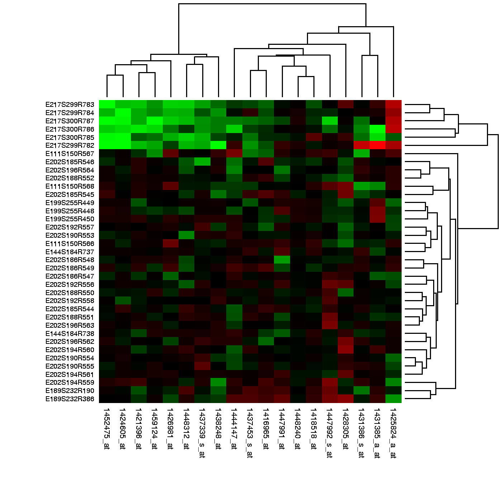

```{block2 echo=FALSE}
# Distance and Dimension Reduction
```

# 距离和维度降低

```{block2 echo=FALSE}
## Introduction
```

## 简介

```{block2 echo=FALSE}
The concept of distance is quite intuitive. For example, when we cluster animals into subgroups, we are implicitly defining a distance that permits us to say what animals are "close" to each other.
```

&emsp;&emsp;距离的概念是相当直观和简单的。例如，当我们将不同的动物划分成不同的类别时，我们通过一定的标准定义了一个距离从而使得我们可以说哪些动物互相之间是比较接近的。


Many of the analyses we perform with high-dimensional data relate directly or indirectly to distance. Many clustering and machine learning techniques rely on being able to define distance, using features or predictors. For example, to create _heatmaps_, which are widely used in genomics and other high-throughput fields, a distance is computed explicitly. 



In these plots the measurements, which are stored in a matrix, are
represented with colors after the columns and rows have been
clustered. (A side note: red and green, a common color theme for heatmaps,
are two of the most difficult colors for many color-blind people to discern.)
Here we will learn the necessary mathematics and computing
skills to understand and create heatmaps. We start by reviewing the
mathematical definition of distance.

## Euclidean Distance

As a review, let's define the distance between two points, $A$ and $B$, on a Cartesian plane.

```{r,echo=FALSE,fig.cap=""}
library(rafalib)
mypar()
plot(c(0,1,1),c(0,0,1),pch=16,cex=2,xaxt="n",yaxt="n",xlab="",ylab="",bty="n",xlim=c(-0.25,1.25),ylim=c(-0.25,1.25))
lines(c(0,1,1,0),c(0,0,1,0))
text(0,.2,expression(paste('(A'[x]*',A'[y]*')')),cex=1.5)
text(1,1.2,expression(paste('(B'[x]*',B'[y]*')')),cex=1.5)
text(-0.1,0,"A",cex=2)
text(1.1,1,"B",cex=2)
```

The euclidean distance between $A$ and $B$ is simply:

$$\sqrt{ (A_x-B_x)^2 + (A_y-B_y)^2}$$


## Distance in High Dimensions

We introduce a dataset with gene expression measurements for 22,215 genes from 189 samples. The R objects can be downloaded like this:

```{r,eval=FALSE}
library(devtools)
install_github("genomicsclass/tissuesGeneExpression")
```

The data represent RNA expression levels for eight tissues, each with several individuals.

```{r}
library(tissuesGeneExpression)
data(tissuesGeneExpression)
dim(e) ##e contains the expression data
table(tissue) ##tissue[i] tells us what tissue is represented by e[,i]
```

We are interested in describing distance between samples in the context of this dataset. We might also be interested in finding genes that _behave similarly_ across samples.

To define distance, we need to know what the points are since mathematical distance is computed between points. With high dimensional data, points are no longer on the Cartesian plane. Instead they are in higher dimensions. For example, sample $i$ is defined by a point in 22,215 dimensional space: $(Y_{1,i},\dots,Y_{22215,i})^\top$. Feature $g$ is defined by a point in 189 dimensions $(Y_{g,1},\dots,Y_{g,189})^\top$

Once we define points, the Euclidean distance is defined in a very similar way as it is defined for two dimensions. For instance, the distance between two samples $i$ and $j$ is:

$$
\mbox{dist}(i,j) = \sqrt{ \sum_{g=1}^{22215} (Y_{g,i}-Y_{g,j })^2 }
$$

and the distance between two features $h$ and $g$ is:

$$
\mbox{dist}(h,g) = \sqrt{ \sum_{i=1}^{189} (Y_{h,i}-Y_{g,i})^2 }
$$

Note: In practice, distances between features are typically applied after standardizing the data for each feature. This is equivalent to computing one minus the correlation. This is done because the differences in overall levels between features are often not due to biological effects but technical ones. More details on this topic can be found in [this presentation](http://master.bioconductor.org/help/course-materials/2002/Summer02Course/Distance/distance.pdf).

#### Distance with matrix algebra

The distance between samples $i$ and $j$ can be written as

$$ \mbox{dist}(i,j) = (\mathbf{Y}_i - \mathbf{Y}_j)^\top(\mathbf{Y}_i - \mathbf{Y}_j)$$

with $\mathbf{Y}_i$ and $\mathbf{Y}_j$ columns $i$ and $j$. This result can be very convenient in practice as computations can be made much faster using matrix multiplication.

#### Examples

We can now use the formulas above to compute distance. Let's compute distance between samples 1 and 2, both kidneys, and then to sample 87, a colon.

```{r}
x <- e[,1]
y <- e[,2]
z <- e[,87]
sqrt(sum((x-y)^2))
sqrt(sum((x-z)^2))
```

As expected, the kidneys are closer to each other. A faster way to compute this is using matrix algebra:

```{r}
sqrt( crossprod(x-y) )
sqrt( crossprod(x-z) )
```

Now to compute all the distances at once, we have the function `dist`. Because it computes the distance between each row, and here we are interested in the distance between samples, we transpose the matrix

```{r}
d <- dist(t(e))
class(d)
```

Note that this produces an object of class `dist` and, to access the entries using row and column indices, we need to coerce it into a matrix:

```{r}
as.matrix(d)[1,2]
as.matrix(d)[1,87]
```

It is important to remember that if we run `dist` on `e`, it will compute all pairwise distances between genes. This will try to create a $22215 \times 22215$ matrix that may crash your R sessions.


## Distance exercises

__Exercises__

If you have not done so already, install the data package `tissueGeneExpression`: 

```r
library(devtools)
install_github("genomicsclass/tissuesGeneExpression")
```

The data represents RNA expression levels for eight tissues, each with several _biological replictes_. We call samples that we consider to be from the same population, such as liver tissue from different individuals, _biological replicates_: 


```r
library(tissuesGeneExpression)
data(tissuesGeneExpression)
head(e)
head(tissue)
```

1. How many biological replicates for hippocampus?


2. What is the distance between samples 3 and 45?


3. What is the distance between gene `210486_at` and `200805_at`


4. If I run the command (don't run it!):

    
    ```r
    d = as.matrix( dist(e) )
    ```

    how many cells (number of rows times number of columns) will this matrix have?


5. Compute the distance between all pair of samples:

    
    ```r
    d = dist( t(e) )
    ```

    Read the help file for `dist`.

    How many distances are stored in `d`? Hint: What is the length of d?


6. Why is the answer to exercise 5 not `ncol(e)^2`?
    - A) R made a mistake there.
    - B) Distances of 0 are left out.
    - C) Because we take advantage of symmetry: only lower triangular matrix is stored thus only `ncol(e)*(ncol(e)-1)/2` values.
    - D)  Because it is equal`nrow(e)^2`


## Dimension Reduction Motivation

Visualizing data is one of the most, if not the most, important step in the analysis of high-throughput data. The right visualization method may reveal problems with the experimental data that can render the results from a standard analysis, although typically appropriate, completely useless. 

We have shown methods for visualizing global properties of the columns or rows, but plots that reveal relationships between columns or between rows are more complicated due to the high dimensionality of data. For example, to compare each of the 189 samples to each other, we would have to create, for example, 17,766 MA-plots. Creating one single scatterplot of the data is impossible since points are very high dimensional. 

We will describe powerful techniques for exploratory data analysis based on _dimension reduction_. The general idea is to reduce the dataset to have fewer dimensions, yet approximately preserve important properties, such as the distance between samples. If we are able to reduce down to, say, two dimensions, we can then easily make plots. The technique behind it all, the singular value decomposition (SVD), is also useful in other contexts. Before introducing the rather complicated mathematics behind the SVD, we will motivate the ideas behind it with a simple example.

#### Example: Reducing two dimensions to one

We consider an example with twin heights. Here we simulate 100 two dimensional points that represent the number of standard deviations each individual is from the mean height. Each point is a pair of twins:

```{r simulate_twin_heights, fig.cap="Simulated twin pair heights.",echo=FALSE,message=FALSE}
library(rafalib)
library(MASS)

set.seed(1)
n <- 100
y=t(mvrnorm(n,c(0,0), matrix(c(1,0.95,0.95,1),2,2)))

mypar()
plot(y[1,], y[2,], xlab="Twin 1 (standardized height)", 
     ylab="Twin 2 (standardized height)", xlim=c(-3,3), ylim=c(-3,3))
points(y[1,1:2], y[2,1:2], col=2, pch=16)
```

To help with the illustration, think of this as high-throughput gene expression data with the twin pairs representing the $N$ samples and the two heights representing gene expression from two genes. 

We are interested in the distance between any two samples. We can compute this using `dist`. For example, here is the distance between the two orange points in the figure above:

```{r}
d=dist(t(y))
as.matrix(d)[1,2]
```

What if making two dimensional plots was too complex and we were only able to make 1 dimensional plots. Can we, for example, reduce the data to a one dimensional matrix that preserves distances between points?

If we look back at the plot, and visualize a line between any pair of points, the length of this line is the distance between the two points. These lines tend to go along the direction of the diagonal. We have seen before that we can "rotate" the plot so that the diagonal is in the x-axis by making a MA-plot instead:


```{r rotation, fig.cap="Twin height scatterplot (left) and MA-plot (right).",fig.width=10.5,fig.height=5.25}
z1 = (y[1,]+y[2,])/2 #the sum 
z2 = (y[1,]-y[2,])   #the difference

z = rbind( z1, z2) #matrix now same dimensions as y

thelim <- c(-3,3)
mypar(1,2)

plot(y[1,],y[2,],xlab="Twin 1 (standardized height)",
     ylab="Twin 2 (standardized height)",
     xlim=thelim,ylim=thelim)
points(y[1,1:2],y[2,1:2],col=2,pch=16)

plot(z[1,],z[2,],xlim=thelim,ylim=thelim,xlab="Average height",ylab="Difference in height")
points(z[1,1:2],z[2,1:2],col=2,pch=16)
```


Later, we will start using linear algebra to represent transformation of the data such as this. Here we can see that to get `z` we multiplied `y` by the matrix:

$$
A = \,
\begin{pmatrix}
1/2&1/2\\
1&-1\\
\end{pmatrix}
\implies
z = A y
$$

Remember that we can transform back by simply multiplying by $A^{-1}$ as follows:

$$
A^{-1} = \,
\begin{pmatrix}
1&1/2\\
1&-1/2\\
\end{pmatrix}
\implies
y = A^{-1} z
$$

#### Rotations 

In the plot above, the distance between the two orange points remains roughly the same, relative to the distance between other points. This is true for all pairs of points. A simple re-scaling of the transformation we performed above will actually make the distances exactly the same. What we will do is multiply by a scalar so that the standard deviations of each point is preserved. If you think of the columns of `y` as independent random variables with standard deviation $\sigma$, then note that the standard deviations of $M$ and $A$ are:

$$
\mbox{sd}[ Z_1 ] = \mbox{sd}[ (Y_1 + Y_2) / 2 ] = \frac{1}{\sqrt{2}} \sigma \mbox{ and } \mbox{sd}[ Z_2] = \mbox{sd}[ Y_1 - Y_2  ] = {\sqrt{2}} \sigma 
$$

This implies that if we change the transformation above to:

$$
A = \frac{1}{\sqrt{2}}
\begin{pmatrix}
1&1\\
1&-1\\
\end{pmatrix}
$$

then the SD of the columns of $Y$ are the same as the variance of the columns $Z$. Also, notice that $A^{-1}A=I$. We call matrices with these properties _orthogonal_ and it guarantees the SD-preserving properties described above. The distances are now exactly preserved:

```{r rotation_preserves_dist, fig.cap="Distance computed from original data and after rotation is the same."}
A <- 1/sqrt(2)*matrix(c(1,1,1,-1),2,2)
z <- A%*%y
d <- dist(t(y))
d2 <- dist(t(z))
mypar(1,1)
plot(as.numeric(d),as.numeric(d2)) #as.numeric turns distances into long vector
abline(0,1,col=2)
```

We call this particular transformation a _rotation_ of `y`. 

```{r rotation2, fig.cap="Twin height scatterplot (left) and after rotation (right).",fig.width=10.5,fig.height=5.25}
mypar(1,2)

thelim <- c(-3,3)
plot(y[1,],y[2,],xlab="Twin 1 (standardized height)",
     ylab="Twin 2 (standardized height)",
     xlim=thelim,ylim=thelim)
points(y[1,1:2],y[2,1:2],col=2,pch=16)

plot(z[1,],z[2,],xlim=thelim,ylim=thelim,xlab="Average height",ylab="Difference in height")
points(z[1,1:2],z[2,1:2],col=2,pch=16)
```

The reason we applied this transformation in the first place was because we noticed that to compute the distances between points, we followed a direction along the diagonal in the original plot, which after the rotation falls on the horizontal, or the first dimension of `z`. So this rotation actually achieves what we originally wanted: we can preserve the distances between points with just one dimension. Let's remove the second dimension of `z` and recompute distances:


```{r approx_dist, fig.cap="Distance computed with just one dimension after rotation versus actual distance."}
d3 = dist(z[1,]) ##distance computed using just first dimension
mypar(1,1)
plot(as.numeric(d),as.numeric(d3)) 
abline(0,1)
```

The distance computed with just the one dimension provides a very good approximation to the actual distance and a very useful dimension reduction: from 2 dimensions to 1. This first dimension of the transformed data is actually the first _principal component_. This idea motivates the use of principal component analysis (PCA) and the singular value decomposition (SVD) to achieve dimension reduction more generally. 

#### Important note on a difference to other explanations

If you search the web for descriptions of PCA, you will notice a difference in notation to how we describe it here. This mainly stems from the fact that it is more common to have rows represent units. Hence, in the example shown here, $Y$ would be transposed to be an $N \times 2$ matrix. In statistics this is also the most common way to represent the data: individuals in the rows. However, for practical reasons, in genomics it is more common to represent units in the columns. For example, genes are rows and samples are columns. For this reason, in this book we explain PCA and all the math that goes with it in a slightly different way than it is usually done. As a result, many of the explanations you find for PCA start out with the sample covariance matrix usually denoted with
$\mathbf{X}^\top\mathbf{X}$ and having cells representing covariance between two units. Yet for this to be the case, we need the rows of $\mathbf{X}$ to represents units. So in our notation above, you would have to compute, after scaling, $\mathbf{Y}\mathbf{Y}^\top$ instead.

Basically, if you want our explanations to match others you have to transpose the matrices we show here.

## Singular Value Decomposition

In the previous section, we motivated dimension reduction and showed a transformation that permitted us to approximate the distance between two dimensional points with just one dimension. The singular value decomposition (SVD) is a generalization of the algorithm we used in the motivational section. As in the example, the SVD provides a transformation of the original data. This transformation has some very useful properties. 

The main result SVD provides is that we can write an $m \times n$, matrix $\mathbf{Y}$ as

$$\mathbf{U}^\top\mathbf{Y} = \mathbf{DV}^\top$$

With:

* $\mathbf{U}$ is an $m \times p$ orthogonal matrix
* $\mathbf{V}$ is an $p \times p$ orthogonal matrix
* $\mathbf{D}$ is an $n \times p$ diagonal matrix 

with $p=\mbox{min}(m,n)$. $\mathbf{U}^\top$ provides a rotation of our data $\mathbf{Y}$ that turns out to be very useful because the variability (sum of squares to be precise) of the columns of $\mathbf{U}^\top \mathbf{Y}=\mathbf{VD}$ are decreasing.
Because $\mathbf{U}$ is orthogonal, we can write the SVD like this: 

$$\mathbf{Y} = \mathbf{UDV}^\top$$

In fact, this formula is much more commonly used. We can also write the transformation like this:

$$\mathbf{YV} = \mathbf{UD}$$

This transformation of $Y$ also results in a matrix with column of decreasing sum of squares.


Applying the SVD to the motivating example we have:

```{r simulate twin heights,message=FALSE}
library(rafalib)
library(MASS)
n <- 100
y <- t(mvrnorm(n,c(0,0), matrix(c(1,0.95,0.95,1),2,2)))
s <- svd(y)
```

We can immediately see that applying the SVD results in a transformation very similar to the one we used in the motivating example:
```{r}
round(sqrt(2) * s$u , 3)
```

The plot we showed after the rotation was showing what we call the _principal components_: the second plotted against the first. To obtain the principal components from the SVD, we simply need the columns of the rotation $\mathbf{U}^\top\mathbf{Y}$ :

```{r PCAplot, fig.cap="Second PC plotted against first PC for the twins height data."}
PC1 = s$d[1]*s$v[,1]
PC2 = s$d[2]*s$v[,2]
plot(PC1,PC2,xlim=c(-3,3),ylim=c(-3,3))
```


#### How is this useful?

It is not immediately obvious how incredibly useful the SVD can be, so let's consider some examples. In this example, we will greatly reduce the dimension of $V$ and still be able to reconstruct $Y$.

Let's compute the SVD on the gene expression table we have been working with. We will take a subset of 100 genes so that computations are faster.
```{r}
library(tissuesGeneExpression)
data(tissuesGeneExpression)
set.seed(1)
ind <- sample(nrow(e),500) 
Y <- t(apply(e[ind,],1,scale)) #standardize data for illustration
```

The `svd` command returns the three matrices (only the diagonal entries are returned for $D$)
```{r}
s <- svd(Y)
U <- s$u
V <- s$v
D <- diag(s$d) ##turn it into a matrix
```

First note that we can in fact reconstruct y:

```{r}
Yhat <- U %*% D %*% t(V)
resid <- Y - Yhat
max(abs(resid))
```

If we look at the sum of squares of $\mathbf{UD}$, we see that the last few are quite close to 0 (perhaps we have some replicated columns).  

```{r D_entries, fig.cap="Entries of the diagonal of D for gene expression data."}
plot(s$d)
```

This implies that the last columns of `V` have a very small effect on the reconstruction of `Y`. To see this, consider the extreme example in which the last entry of $V$ is 0. In this case the last column of $V$ is not needed at all. Because of the way the SVD is created, the columns of $V$ have less and less influence on the reconstruction of $Y$. You commonly see this described as "explaining less variance". This implies that for a large matrix, by the time you get to the last columns, it is possible that there is not much left to "explain" As an example, we will look at what happens if we remove the four last columns:

```{r}
k <- ncol(U)-4
Yhat <- U[,1:k] %*% D[1:k,1:k] %*% t(V[,1:k])
resid <- Y - Yhat 
max(abs(resid))
```

The largest residual is practically 0, meaning that we `Yhat` is practically the same as `Y`, yet we need 4 fewer dimensions to transmit the information.

By looking at $d$, we can see that, in this particular dataset, we can obtain a good approximation keeping only 94 columns. The following plots are useful for seeing how much of the variability is explained by each column:

```{r percent_var_explained, fig.cap="Percent variance explained by each principal component of gene expression data."}
plot(s$d^2/sum(s$d^2)*100,ylab="Percent variability explained")
```

We can also make a cumulative plot:

```{r cum_variance_explained, fig.cap="Cumulative variance explained by principal components of gene expression data."}
plot(cumsum(s$d^2)/sum(s$d^2)*100,ylab="Percent variability explained",ylim=c(0,100),type="l")
```

Although we start with 189 dimensions, we can approximate $Y$ with just 95:

```{r reconstruction_with_less_dimensions, fig.cap="Residuals from comparing a reconstructed gene expression table using 95 PCs to the original data with 189 dimensions."}
k <- 95 ##out a possible 189
Yhat <- U[,1:k] %*% D[1:k,1:k] %*% t(V[,1:k])
resid <- Y - Yhat
boxplot(resid,ylim=quantile(Y,c(0.01,0.99)),range=0)
```

Therefore, by using only half as many dimensions, we retain most of the variability in our data:

```{r}
var(as.vector(resid))/var(as.vector(Y))
```

We say that we explain 96% of the variability.

Note that we can compute this proportion from $D$:
```{r}
1-sum(s$d[1:k]^2)/sum(s$d^2)
```
The entries of $D$ therefore tell us how much each PC contributes in term of variability explained.

#### Highly correlated data

To help understand how the SVD works, we construct a dataset with two highly correlated columns. 

For example:

```{r}
m <- 100
n <- 2
x <- rnorm(m)
e <- rnorm(n*m,0,0.01)
Y <- cbind(x,x)+e
cor(Y)
```
In this case, the second column adds very little "information" since all the entries of `Y[,1]-Y[,2]` are close to 0. Reporting `rowMeans(Y)` is even more efficient since `Y[,1]-rowMeans(Y)` and `Y[,2]-rowMeans(Y)` are even closer to 0. `rowMeans(Y)`  turns out to be the information represented in the first column on $U$. The SVD helps us notice that we explain almost all the variability with just this first column:

```{r}
d <- svd(Y)$d
d[1]^2/sum(d^2)
```

In cases with many correlated columns, we can achieve great dimension reduction:

```{r}
m <- 100
n <- 25
x <- rnorm(m)
e <- rnorm(n*m,0,0.01)
Y <- replicate(n,x)+e
d <- svd(Y)$d
d[1]^2/sum(d^2)
```


## Projections

Now that we have described the concept of dimension reduction and some of the applications of SVD and principal component analysis, we focus on more details related to the mathematics behind these. We start with _projections_. A projection is a linear algebra concept that helps us understand many of the mathematical operations we perform on high-dimensional data. For more details, you can review projects in a linear algebra book. Here we provide a quick review and then provide some data analysis related examples. 

As a review, remember that projections minimize the distance between points and subspace.


We illustrate projections using a figure, in which the arrow on top is pointing to a point in space. In this particular cartoon, the space is two dimensional, but we should be thinking abstractly. The space is represented by the Cartesian plan and the line on which the little person stands is a subspace of points. The projection to this subspace is the place that is closest to the original point. Geometry tells us that we can find this closest point by dropping a perpendicular line (dotted line) from the point to the space. The little person is standing on the projection.  The amount this person had to walk from the origin to the new projected point is referred to as _the coordinate_. 

For the explanation of projections, we will use the standard matrix algebra notation for points: $\vec{y} \in \mathbb{R}^N$ is a point in $N$-dimensional space and $L \subset \mathbb{R}^N$ is smaller subspace. 


#### Simple example with N=2

```{r,include=FALSE}
library(rafalib)
```

If we let $Y = \begin{pmatrix} 2 \\ 3\end{pmatrix}$. We can plot it like this:

```{r point, fig.cap="Geometric representation of Y."}
mypar (1,1)
plot(c(0,4),c(0,4),xlab="Dimension 1",ylab="Dimension 2",type="n")
arrows(0,0,2,3,lwd=3)
text(2,3," Y",pos=4,cex=3)
```

We can immediately define a coordinate system by projecting this vector to the space defined by:
$\begin{pmatrix} 1\\ 0\end{pmatrix}$ (the x-axis) and $\begin{pmatrix} 0\\ 1\end{pmatrix}$ (the y-axis). The projections of $Y$ to the subspace defined by these points are 2 and 3 respectively:

$$
\begin{align*}
Y &= \begin{pmatrix} 2 \\ 3\end{pmatrix} \\
&=2  \begin{pmatrix} 1\\ 0\end{pmatrix} + 3 \begin{pmatrix} 0\\ 1\end{pmatrix} 
\end{align*}$$

We say that $2$ and $3$ are the _coordinates_ and that 
$\begin{pmatrix} 1\\ 0\end{pmatrix} \mbox{and} \begin{pmatrix} 0\\1 \end{pmatrix}$ are the bases.

Now let's define a new subspace. The red line in the plot below is subset $L$ defined by points satisfying $c \vec{v}$ with $\vec{v}=\begin{pmatrix} 2& 1\end{pmatrix}^\top$. The projection of $\vec{y}$ onto $L$ is the closest point on $L$ to $\vec{y}$. So we need to find the $c$ that minimizes the distance between $\vec{y}$ and $c\vec{v}=(2c,c)$. In linear algebra, we learn that the difference between these points is orthogonal to the space so:

$$
(\vec{y}-\hat{c}\vec{v}) \cdot \vec{v} = 0
$$

this implies that: 

$$
\vec{y}\cdot\vec{v} - \hat{c}\vec{v}\cdot\vec{v} =  0
$$

and:

$$\hat{c} = \frac{\vec{y}\cdot\vec{v}}
{\vec{v}\cdot\vec{v}}$$

Here the dot $\cdot$ represents the dot product: $\,\, \vec{x} \cdot \vec{y} = x_1 y_1+\dots x_n y_n$.

The following R code confirms this equation works:

```{r projection, fig.cap="Projection of Y onto new subspace."}
mypar(1,1)
plot(c(0,4),c(0,4),xlab="Dimension 1",ylab="Dimension 2",type="n")
arrows(0,0,2,3,lwd=3)
abline(0,0.5,col="red",lwd=3) #if x=2c and y=c then slope is 0.5 (y=0.5x)
text(2,3," Y",pos=4,cex=3)
y=c(2,3)
x=c(2,1)
cc = crossprod(x,y)/crossprod(x)
segments(x[1]*cc,x[2]*cc,y[1],y[2],lty=2)
text(x[1]*cc,x[2]*cc,expression(hat(Y)),pos=4,cex=3)
```

Note that if $\vec{v}$ was such that $\vec{v}\cdot \vec{v}=1$,  then $\hat{c}$ is simply $\vec{y} \cdot \vec{v}$ and the space $L$ does not change. This simplification is one reason we like orthogonal matrices. 

#### Example: The sample mean is a projection

Let $\vec{y} \in \mathbb{R}^N$ 
and $L \subset \mathbb{R}^N$ is the space spanned by: 

$$\vec{v}=\begin{pmatrix} 1\\ \vdots \\  1\end{pmatrix};
L = \{ c \vec{v}; c \in \mathbb{R}\}$$

In this space, all components of the vectors are the same number, so we can think of this space as representing the constants: in the projection each dimension will be the same value. So what $c$ minimizes the distance between $c\vec{v}$ and $\vec{y}$ ? 

When talking about problems like this, we sometimes use two dimensional figures such as the one above. We simply abstract and think of $\vec{y}$ as a point in $N-dimensions$ and $L$ as a subspace defined by a smaller number of values, in this case just one: $c$. 

Getting back to our question, we know that the projection is: 

$$\hat{c} = \frac{\vec{y}\cdot\vec{v}}
{\vec{v}\cdot\vec{v}}$$

which in this case is the average:

$$
\hat{c} = \frac{\vec{y}\cdot\vec{v}}
{\vec{v}\cdot\vec{v}} = \frac{\sum_{i=1}^N Y_i}{\sum_{i=1}^N 1} = \bar{Y}
$$


Here, it also would have been just as easy to use calculus:

$$\frac{\partial}{\partial c}\sum_{i=1}^N (Y_i - c)^2 = 0 \implies 
 - 2 \sum_{i=1}^N (Y_i - \hat{c}) = 0 \implies$$

$$ N c = \sum_{i=1}^N Y_i \implies \hat{c}=\bar{Y}$$


#### Example: Regression is also a projection
 
Let us give a slightly more complicated example. Simple linear regression can also be explained with projections.  Our data $\mathbf{Y}$ (we are no longer going to use the $\vec{y}$ notation) is again an *N*-dimensional vector and our model predicts $Y_i$ with a line $\beta_0 + \beta_1 X_i$. We want to find the $\beta_0$ and $\beta_1$ that minimize the distance between $Y$ and the space defined by:

$$ L = \{ \beta_0 \vec{v}_0 + \beta_1 \vec{v}_1 ; \vec{\beta}=(\beta_0,\beta_1) \in \mathbb{R}^2 \}$$

with: 

$$
\vec{v}_0=
\begin{pmatrix}
1\\
1\\
\vdots \\
1\\
\end{pmatrix} 
\mbox{ and }
\vec{v}_1=
\begin{pmatrix}
X_{1}\\
X_{2}\\
\vdots \\
X_{N}\\
\end{pmatrix} 
$$


Our $N\times 2$ matrix $\mathbf{X}$ is $[ \vec{v}_0 \,\, \vec{v}_1]$ and any point in $L$ can be written as $X\vec{\beta}$. 

The equation for the multidimensional version of orthogonal projection is:

$$X^\top (\vec{y}-X\vec{\beta}) = 0$$

which we have seen before and gives us:

$$X^\top X \hat{\beta}=  X^\top \vec{y} $$

$$\hat{\beta}= (X^\top X)^{-1}X^\top \vec{y}$$

And the projection to $L$ is therefore:

$$X (X^\top X)^{-1}X^\top \vec{y}$$


## Rotations

One of the most useful applications of projections relates to coordinate rotations. In data analysis, simple rotations can result in easier to visualize and interpret data. We will describe the mathematics behind rotations and give some data analysis examples.
 
In our previous section, we used the following example: 

$$
Y = \begin{pmatrix} 2 \\ 
3 
\end{pmatrix} 
= 
2  
\begin{pmatrix} 1\\
0 
\end{pmatrix} + 
3 
\begin{pmatrix} 0\\ 
1 
\end{pmatrix} 
$$

and noted that $2$ and $3$ are the _coordinates_.


```{r,fig.cap="Plot of (2,3) as coordinates along Dimension 1 (1,0) and Dimension 2 (0,1)."}
library(rafalib)
mypar()
plot(c(-2,4),c(-2,4),xlab="Dimension 1",ylab="Dimension 2",
     type="n",xaxt="n",yaxt="n",bty="n")
text(rep(0,6),c(c(-2,-1),c(1:4)),as.character(c(c(-2,-1),c(1:4))),pos=2)
text(c(c(-2,-1),c(1:4)),rep(0,6),as.character(c(c(-2,-1),c(1:4))),pos=1)
abline(v=0,h=0)
arrows(0,0,2,3,lwd=3)
segments(2,0,2,3,lty=2)
segments(0,3,2,3,lty=2)
text(2,3," Y",pos=4,cex=3)
```

However, mathematically we can represent the point $(2,3)$ with other linear combinations:

$$
\begin{align*}
Y &= \begin{pmatrix} 2 \\ 3\end{pmatrix} \\
&= 2.5 \begin{pmatrix} 1\\ 1\end{pmatrix} + -1 \begin{pmatrix} \phantom{-}0.5\\ -0.5\end{pmatrix} 
\end{align*}$$

The new coordinates are:

$$Z = \begin{pmatrix} 2.5 \\ -1 \end{pmatrix}$$

Graphically, we can see that the coordinates are the projections to the spaces defined by the new basis:

```{r,fig.cap="Plot of (2,3) as a vector in a rotatated space, relative to the original dimensions."}
library(rafalib)
mypar()
plot(c(-2,4),c(-2,4),xlab="Dimension 1",ylab="Dimension 2",
     type="n",xaxt="n",yaxt="n",bty="n")
text(rep(0,6),c(c(-2,-1),c(1:4)),as.character(c(c(-2,-1),c(1:4))),pos=2)
text(c(c(-2,-1),c(1:4)),rep(0,6),as.character(c(c(-2,-1),c(1:4))),pos=1)
abline(v=0,h=0)
abline(0,1,col="red")
abline(0,-1,col="red")
arrows(0,0,2,3,lwd=3)
y=c(2,3)
x1=c(1,1)##new basis
x2=c(0.5,-0.5)##new basis
c1 = crossprod(x1,y)/crossprod(x1)
c2 = crossprod(x2,y)/crossprod(x2)
segments(x1[1]*c1,x1[2]*c1,y[1],y[2],lty=2)
segments(x2[1]*c2,x2[2]*c2,y[1],y[2],lty=2)
text(2,3," Y",pos=4,cex=3)
```

We can go back and forth between these two representations of $(2,3)$ using matrix multiplication.

$$
Y =   AZ\\
$$

$$
 A^{-1} Y =  Z\\
$$

$$
A= \begin{pmatrix} 1& \phantom{-}0.5\\ 1 & -0.5\end{pmatrix} \implies
A^{-1}= \begin{pmatrix} 0.5& 0.5 \\ 1 &-1\end{pmatrix}
$$

$Z$ and $Y$ carry the same information, but in a different _coordinate system_.

#### Example: Twin heights

Here are 100 two dimensional points $Y$

```{r twin-heights,fig.cap="Twin 2 heights versus twin 1 heights.",echo=FALSE,message=FALSE}
library(MASS)
n = 100
mypar()
set.seed(1)
y=t(mvrnorm(n,c(0,0),matrix(c(1,0.95,0.95,1),2,2)))
plot(y[1,],y[2,],xlab="Twin 1 (standardized height)",ylab="Twin 2 (standardized height)",xlim=c(-3,3),ylim=c(-3,3))
```

Here are the rotations: $Z = A^{-1} Y$

```{r twin-heights-rotated,fig.cap="Rotation of twin 2 heights versus twin 1 heights.",echo=FALSE,message=FALSE}
A = matrix(c(0.5,1,0.5,-1),2,2)
z = A%*%y
mypar()
plot(z[1,],z[2,],xlab="Average",ylab="Difference",xlim=c(-3,3),ylim=c(-3,3))
```

What we have done here is rotate the data so that the first coordinate of $Z$ is the average height, while the second is the difference between twin heights. 

We have used the singular value decomposition to find principal components. It is sometimes useful to think of the SVD as a rotation, for example $\mathbf{U}^\top \mathbf{Y}$, that gives us a new coordinate system $\mathbf{DV}^\top$ in which the dimensions are ordered by how much variance they explain.


## Multi-Dimensional Scaling Plots

We will motivate multi-dimensional scaling (MDS) plots with a gene expression example. To simplify the illustration we will only consider three tissues:

```{r,message=FALSE}
library(rafalib)
library(tissuesGeneExpression)
data(tissuesGeneExpression)
colind <- tissue%in%c("kidney","colon","liver")
mat <- e[,colind]
group <- factor(tissue[colind])
dim(mat)
```

As an exploratory step, we wish to know if gene expression profiles stored in the columns of `mat` show more similarity between tissues than across tissues. Unfortunately, as mentioned above, we can't plot multi-dimensional points. In general, we prefer two-dimensional plots, but making plots for every pair of genes or every pair of samples is not practical. MDS plots become a powerful tool in this situation.

#### The math behind MDS

Now that we know about SVD and matrix algebra, understanding MDS is relatively straightforward. For illustrative purposes let's consider the SVD decomposition:

$$\mathbf{Y} = \mathbf{UDV}^\top$$

and assume that the sum of squares of the first two columns $\mathbf{U^\top Y=DV^\top}$ is much larger than the sum of squares of all other columns. This can be written as: 
$d_1+ d_2 \gg d_3 + \dots + d_n$ with $d_i$ the i-th entry of the $\mathbf{D}$ matrix. When this happens, we then have:

$$\mathbf{Y}\approx [\mathbf{U}_1 \mathbf{U}_2] 
  \begin{pmatrix}
    d_{1}&0\\
    0&d_{2}\\
  \end{pmatrix}
  [\mathbf{V}_1 \mathbf{V}_2]^\top  
$$

This implies that column $i$ is approximately:

$$
\mathbf{Y}_i \approx
[\mathbf{U}_1 \mathbf{U}_2] 
  \begin{pmatrix}
    d_{1}&0\\
    0&d_{2}\\
  \end{pmatrix}
  \begin{pmatrix}
    v_{i,1}\\
    v_{i,2}\\
     \end{pmatrix}
    =
    [\mathbf{U}_1 \mathbf{U}_2] 
  \begin{pmatrix}
    d_{1} v_{i,1}\\
    d_{2} v_{i,2}
 \end{pmatrix}
$$

If we define the following two dimensional vector...

 $$\mathbf{Z}_i=\begin{pmatrix}
    d_{1} v_{i,1}\\
    d_{2} v_{i,2}
 \end{pmatrix}
 $$

... then

$$
\begin{align*}
(\mathbf{Y}_i - \mathbf{Y}_j)^\top(\mathbf{Y}_i - \mathbf{Y}_j) &\approx \left\{ [\mathbf{U}_1 \mathbf{U}_2] (\mathbf{Z}_i-\mathbf{Z}_j) \right\}^\top \left\{[\mathbf{U}_1 \mathbf{U}_2]  (\mathbf{Z}_i-\mathbf{Z}_j)\right\}\\
&= (\mathbf{Z}_i-\mathbf{Z}_j)^\top [\mathbf{U}_1 \mathbf{U}_2]^\top [\mathbf{U}_1 \mathbf{U}_2] (\mathbf{Z}_i-\mathbf{Z}_j) \\
&=(\mathbf{Z}_i-\mathbf{Z}_j)^\top(\mathbf{Z}_i-\mathbf{Z}_j)\\
&=(Z_{i,1}-Z_{j,1})^2 + (Z_{i,2}-Z_{j,2})^2
\end{align*}
$$

This derivation tells us that the distance between samples $i$ and $j$ is approximated by the distance between two dimensional points.

$$ (\mathbf{Y}_i - \mathbf{Y}_j)^\top(\mathbf{Y}_i - \mathbf{Y}_j) \approx
 (Z_{i,1}-Z_{j,1})^2 + (Z_{i,2}-Z_{j,2})^2
$$

Because $Z$ is a two dimensional vector, we can visualize the distances between each sample by plotting $\mathbf{Z}_1$ versus $\mathbf{Z}_2$ and visually inspect the distance between points. Here is this plot for our example dataset:

```{r MDS, fig.cap="Multi-dimensional scaling (MDS) plot for tissue gene expression data."}
s <- svd(mat-rowMeans(mat))
PC1 <- s$d[1]*s$v[,1]
PC2 <- s$d[2]*s$v[,2]
mypar(1,1)
plot(PC1,PC2,pch=21,bg=as.numeric(group))
legend("bottomright",levels(group),col=seq(along=levels(group)),pch=15,cex=1.5)
```

Note that the points separate by tissue type as expected. Now the accuracy of the approximation above depends on the proportion of variance explained by the first two principal components. As we showed above, we can quickly see this by plotting the variance explained plot:

```{r variance_explained, fig.cap="Variance explained for each principal component."}
plot(s$d^2/sum(s$d^2))
```

Although the first two PCs explain over 50% of the variability, there is plenty of information that this plot does not show. However, it is an incredibly useful plot for obtaining, via visualization, a general idea of the distance between points. Also, notice that we can plot other dimensions as well to search for patterns. Here are the 3rd and 4th PCs:

```{r PC_3_and_4, fig.cap="Third and fourth principal components."}
PC3 <- s$d[3]*s$v[,3]
PC4 <- s$d[4]*s$v[,4]
mypar(1,1)
plot(PC3,PC4,pch=21,bg=as.numeric(group))
legend("bottomright",levels(group),col=seq(along=levels(group)),pch=15,cex=1.5)
```

Note that the 4th PC shows a strong separation within the kidney samples. Later we will learn about batch effects, which might explain this finding. 


#### `cmdscale`

Although we used the `svd` functions above, there is a special function that is specifically made for MDS plots. It takes a distance object as an argument and then uses principal component analysis to provide the best approximation to this distance that can be obtained with $k$ dimensions. This function is more efficient because one does not have to perform the full SVD, which can be time consuming. By default it returns two dimensions, but we can change that through the parameter `k` which defaults to 2.

```{r mds2, fig.cap="MDS computed with cmdscale function."} 
d <- dist(t(mat))
mds <- cmdscale(d)
mypar()
plot(mds[,1],mds[,2],bg=as.numeric(group),pch=21,
     xlab="First dimension",ylab="Second dimension")
legend("bottomleft",levels(group),col=seq(along=levels(group)),pch=15)
```

These two approaches are equivalent up to an arbitrary sign change.

```{r mds_same_as_svd, fig.cap="Comparison of MDS first two PCs to SVD first two PCs.",fig.width=10.5,fig.height=5.25}
mypar(1,2)
for(i in 1:2){
  plot(mds[,i],s$d[i]*s$v[,i],main=paste("PC",i))
  b = ifelse( cor(mds[,i],s$v[,i]) > 0, 1, -1)
  abline(0,b) ##b is 1 or -1 depending on the arbitrary sign "flip"
}
```


#### Why the arbitrary sign?
The SVD is not unique because we can multiply any column of $\mathbf{V}$ by -1 as long as we multiply the sample column of $\mathbf{U}$ by -1. We can see this immediately by noting that:

$$
\mathbf{-1UD(-1)V}^\top = \mathbf{UDV}^\top
$$


#### Why we substract the mean

In all calculations above we subtract the row means before we compute the singular value decomposition. If what we are trying to do is approximate the distance between columns, the distance between  $\mathbf{Y}_i$ and $\mathbf{Y}_j$ is the same as the distance between $\mathbf{Y}_i- \mathbf{\mu}$ and $\mathbf{Y}_j - \mathbf{\mu}$ since the $\mu$ cancels out when computing said distance:

$$
\left\{ ( \mathbf{Y}_i- \mathbf{\mu} ) - ( \mathbf{Y}_j - \mathbf{\mu} ) \right\}^\top \left\{ (\mathbf{Y}_i- \mathbf{\mu}) - (\mathbf{Y}_j - \mathbf{\mu} ) \right\} = \left\{  \mathbf{Y}_i-  \mathbf{Y}_j  \right\}^\top \left\{ \mathbf{Y}_i - \mathbf{Y}_j  \right\}
$$

Because removing the row averages reduces the total variation, it can only make the SVD approximation better.


## MDS exercises

__Exercises__

1. Using the `z` we computed in exercise 4 of the previous exercises:

    
    ```r
    library(tissuesGeneExpression)
    data(tissuesGeneExpression)
    y = e - rowMeans(e)
    s = svd(y)
    z = s$d * t(s$v)
    ```
    
    we can make an mds plot:

    
    ```r
    library(rafalib)
    ftissue = factor(tissue)
    mypar2(1,1)
    plot(z[1,],z[2,],col=as.numeric(ftissue))
    legend("topleft",levels(ftissue),col=seq_along(ftissue),pch=1)
    ```

    Now run the function `cmdscale` on the original data:

    
    ```r
    d = dist(t(e))
    mds = cmdscale(d)
    ```

    What is the absolute value of the correlation between the first dimension of `z` and the first dimension in mds?


2. What is the absolute value of the  correlation between the second dimension of `z` and the second dimension in mds?


3. Load the following dataset:

    
    ```r
    library(GSE5859Subset)
    data(GSE5859Subset)
    ```

    Compute the svd and compute `z`.

    
    ```r
    s = svd(geneExpression-rowMeans(geneExpression))
    z = s$d * t(s$v)
    ```

    Which dimension of `z` most correlates with the outcome `sampleInfo$group` ?


4. What is this max correlation?


5. Which dimension of `z` has the second highest correlation with the outcome `sampleInfo$group`?


6. Note these measurements were made during two months:

    
    ```r
    sampleInfo$date
    ```

    We can extract the month this way:
    
    ```r
    month = format( sampleInfo$date, "%m")
    month = factor( month)
    ```

    Which dimension of `z` has the second highest correlation with the outcome `month`


7. What is this correlation?


8. (Advanced) The same dimension is correlated with both the group and the date. The following are also correlated:

    
    ```r
    table(sampleInfo$g,month)
    ```

    So is this first dimension related directly to group or is it related only through the month? Note that the correlation with month is higher. This is related to _batch effects_ which we will learn about later.


    In exercise 3 we saw that one of the dimensions was highly correlated to the `sampleInfo$group`. Now take the 5th column of $$\mathbf{U}$$ and stratify by the gene chromosome. Remove `chrUn` and make a boxplot of the values of $$\mathbf{U}_5$$ stratified by chromosome. 

    Which chromosome looks different from the rest? Copy and paste the name as it appears in `geneAnnotation`.


Given the answer to the last exercise, any guesses as to what `sampleInfo$group` represents?


## Principal Component Analysis 

We have already mentioned principal component analysis (PCA) above and noted its relation to the SVD. Here we provide further mathematical details. 

#### Example: Twin heights

We started the motivation for dimension reduction with a simulated example and showed a rotation that is very much related to PCA.


```{r simulate_twin_heights_again,echo=FALSE,message=FALSE,fig.cap="Twin heights scatter plot."}
library(rafalib)
library(MASS)

n <- 100

set.seed(1)

Y=t(mvrnorm(n,c(0,0), matrix(c(1,0.95,0.95,1),2,2)))

mypar()

thelim <- c(-3,3)
plot(Y[1,], Y[2,], xlab="Twin 1 (standardized height)", 
     ylab="Twin 2 (standardized height)", xlim=thelim, ylim=thelim)
points(Y[1,1:2], Y[2,1:2], col=2, pch=16)
```

Here we explain specifically what are the principal components (PCs).

Let $\mathbf{Y}$ be $2 \times N$ matrix representing our data. The analogy is that we measure expression from 2 genes and each column is a sample. Suppose we are given the task of finding a  $2 \times 1$ vector $\mathbf{u}_1$ such that $\mathbf{u}_1^\top \mathbf{v}_1 = 1$
and it maximizes $(\mathbf{u}_1^\top\mathbf{Y})^\top (\mathbf{u}_1^\top\mathbf{Y})$. This can be viewed as a projection of each sample or column of $\mathbf{Y}$ into the subspace spanned by $\mathbf{u}_1$. So we are looking for a transformation in which the coordinates show high variability.

Let's try $\mathbf{u}=(1,0)^\top$. This projection simply gives us the height of twin 1 shown in orange below. The sum of squares is shown in the title.

```{r projection_not_PC1, fig.align="Data projected onto space spanned by (1 0).", fig.width=6.5,fig.height=6.5}
mypar(1,1)
plot(t(Y), xlim=thelim, ylim=thelim,
     main=paste("Sum of squares :",round(crossprod(Y[1,]),1)))
abline(h=0)
apply(Y,2,function(y) segments(y[1],0,y[1],y[2],lty=2))
points(Y[1,],rep(0,ncol(Y)),col=2,pch=16,cex=0.75)
```

Can we find a direction with higher variability? How about:

$\mathbf{u} =\begin{pmatrix}1\\-1\end{pmatrix}$ ? This does not satisfy $\mathbf{u}^\top\mathbf{u}= 1$ so let's instead try
$\mathbf{u} =\begin{pmatrix}1/\sqrt{2}\\-1/\sqrt{2}\end{pmatrix}$ 

```{r projection_not_PC1_either, fig.cap="Data projected onto space spanned by (1 0).", fig.width=6.5,fig.height=6.5}
u <- matrix(c(1,-1)/sqrt(2),ncol=1)
w=t(u)%*%Y
mypar(1,1)
plot(t(Y),
     main=paste("Sum of squares:",round(tcrossprod(w),1)),xlim=thelim,ylim=thelim)
abline(h=0,lty=2)
abline(v=0,lty=2)
abline(0,-1,col=2)
Z = u%*%w
for(i in seq(along=w))
  segments(Z[1,i],Z[2,i],Y[1,i],Y[2,i],lty=2)
points(t(Z), col=2, pch=16, cex=0.5)
```

This relates to the difference between twins, which we know is small. The sum of squares confirms this.

Finally, let's try:

$\mathbf{u} =\begin{pmatrix}1/\sqrt{2}\\1/\sqrt{2}\end{pmatrix}$ 

```{r PC1, fig.cap="Data projected onto space spanned by first PC.", fig.width=6.5,fig.height=6.5}
u <- matrix(c(1,1)/sqrt(2),ncol=1)
w=t(u)%*%Y
mypar()
plot(t(Y), main=paste("Sum of squares:",round(tcrossprod(w),1)),
     xlim=thelim, ylim=thelim)
abline(h=0,lty=2)
abline(v=0,lty=2)
abline(0,1,col=2)
points(u%*%w, col=2, pch=16, cex=1)
Z = u%*%w
for(i in seq(along=w))
  segments(Z[1,i], Z[2,i], Y[1,i], Y[2,i], lty=2)
points(t(Z),col=2,pch=16,cex=0.5)
```

This is a re-scaled average height, which has higher sum of squares. There is a mathematical procedure for determining which $\mathbf{v}$ maximizes the sum of squares and the SVD provides it for us.

#### The principal components

The orthogonal vector that maximizes the sum of squares:

$$(\mathbf{u}_1^\top\mathbf{Y})^\top(\mathbf{u}_1^\top\mathbf{Y})$$ 

$\mathbf{u}_1^\top\mathbf{Y}$ is referred to as the first PC. The _weights_ $\mathbf{u}$ used to obtain this PC are referred to as the _loadings_. Using  the language of rotations, it is also referred to as the _direction_ of the first PC, which are the new coordinates.

To obtain the second PC, we repeat the exercise above, but for the residuals:

$$\mathbf{r} = \mathbf{Y} - \mathbf{u}_1^\top \mathbf{Yv}_1 $$

The second PC is the vector with the following properties: 

$$ \mathbf{v}_2^\top \mathbf{v}_2=1$$

$$ \mathbf{v}_2^\top \mathbf{v}_1=0$$ 

and maximizes  $(\mathbf{rv}_2)^\top \mathbf{rv}_2$.

When $Y$ is $N \times m$ we repeat to find 3rd, 4th, ..., m-th PCs.

#### `prcomp`

We have shown how to obtain PCs using the SVD. However, R has a function specifically designed to find the principal components. In this case, the data is centered by default. The following function: 

```{r}
pc <- prcomp( t(Y) )
```

produces the same results as the SVD up to arbitrary sign flips:

```{r pca_svd, fig.cap="Plot showing SVD and prcomp give same results.",fig.width=10.5,fig.height=5.25}
s <- svd( Y - rowMeans(Y) )
mypar(1,2)
for(i in 1:nrow(Y) ){
  plot(pc$x[,i], s$d[i]*s$v[,i])
}
```

The loadings can be found this way:
```{r}
pc$rotation
```
which are equivalent (up to a sign flip) to:
```{r}
s$u
```
The equivalent of the variance explained is included in the: 
```{r}
pc$sdev
```
component.


We take the transpose of `Y` because `prcomp` assumes the previously discussed ordering: units/samples in row and features in columns.


