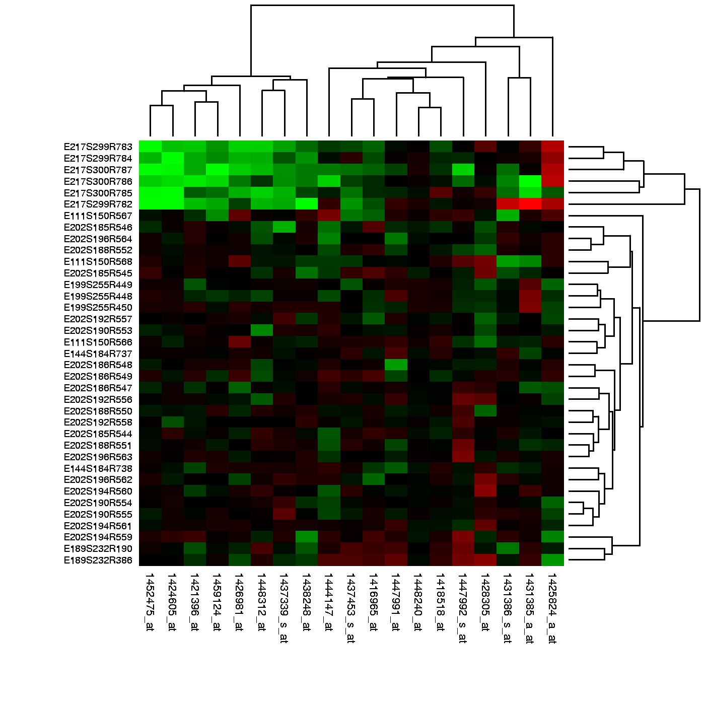

--- 
title: "生物信息R数据分析"
author: "作者：Rafael A. Irizarry; Mike I. Love 翻译：张三 李四 麻子"
date: "`r Sys.Date()`"
documentclass: ctexbook
bibliography: [book.bib, packages.bib]
biblio-style: apalike
link-citations: yes
colorlinks: yes
lot: yes
lof: yes
geometry: [b5paper, tmargin=2.5cm, bmargin=2.5cm, lmargin=3.5cm, rmargin=2.5cm]
site: bookdown::bookdown_site
description: "生物信息R数据分析"
github-repo: xie186/HarvardDataScienceForLifeScience_cn 
cover-image: images/cover.jpg
---

```{r setup, include=FALSE}
options(
  htmltools.dir.version = FALSE, formatR.indent = 2, width = 55, digits = 4
)

# 填上你需要用到的包，如 c('ggplot2', 'dplyr')
lapply(c(), function(pkg) {
  if (system.file(package = pkg) == '') install.packages(pkg)
})
```


# Cover picture {-}

```{r fig.align='center', echo=FALSE, include=identical(knitr:::pandoc_to(), 'html'), fig.link='https://www.flickr.com/photos/ronkroetz/14779273923/'}
## cover-image does not work for PDF output. It is for EPUB only. For LaTeX/PDF output, you have to insert your cover image by yourself. (BTW, I don't know how.)
knitr::include_graphics('images/cover.jpg', dpi = NA)
```

test

<!--chapter:end:index.Rmd-->


# Acknowledgments {-}

The authors would like to thank Alex Nones for proofreading the manuscript during its various stages. Also, thanks to Karl Broman for contributing the "Plots to Avoid" section and to Stephanie Hicks for designing some of the exercises. Finally, thanks to John Kimmel and three anonymous referees for excellent feedback and 
constructive criticism of the book.

This book was conceived during the teaching of several HarvardX courses, coordinated by Heather Sternshein. We are also grateful 
to our TAs, Idan Ginsburg and Stephanie Chan, and all the students whose questions and comments helped us improve the book. The courses were
partially funded by NIH grant R25GM114818.  We are very grateful to the National Institute of Health for its support.  

A special thanks goes to all those that edited the book via GitHub pull requests: vjcitn, yeredh, ste-fan, molx, kern3020, josemrecio, hcorrada, neerajt, massie, jmgore75, molecules, lzamparo, eronisko, obicke, knbknb, and devrajoh. 


Cover image credit: this photograph is La Mina Falls, El Yunque National Forest, Puerto Rico, taken by Ron Kroetz
https://www.flickr.com/photos/ronkroetz/14779273923
Attribution-NoDerivs 2.0 Generic (CC BY-ND 2.0)

{mainmatter}

```{block2 echo = FALSE}
##  Introduction  {-}
```
## 简介

```{block2 echo = FALSE}
The unprecedented advance in digital technology during the second half of the 20th century has produced a measurement revolution that is transforming science. In the life sciences, data analysis is now part of practically every research project. Genomics, in particular, is being driven by new measurement technologies that permit us to observe certain molecular entities for the first time. These observations are leading to discoveries analogous to identifying microorganisms and other breakthroughs permitted by the invention of the microscope. Choice examples of these technologies are microarrays and next generation sequencing.
```
&emsp;&emsp;在二十世纪的下半叶，数字技术的革新带来了测量技术的革新，从而也大大的改变了科研领域。在生命科学领域，数据分析已经是科研项目中的家常便饭了。尤其是基因组学，新的技术使得我们们能够观察到我们过去没有办法观察到的特定的。历史上显微镜的发明使得我们能够鉴定新的微生物，而近些年的新技术技术引领我们发现更多生命科学的奥秘，而这些发现不亚于之前显微镜发明带给我们的帮助。这些技术中的代表就是芯片技术和下一代测序技术。

```{block2 echo = FALSE}
Scientific fields that have traditionally relied upon simple data analysis techniques have been turned on their heads by these technologies. In the past, for example, researchers would measure the transcription levels of a single gene of interest. Today, it is possible to measure all 20,000+ human genes at once.  Advances such as these have brought about a shift from hypothesis to discovery-driven research. However, interpreting information extracted from these massive and complex datasets requires sophisticated statistical skills as one can easily be fooled by patterns arising by chance. This has greatly elevated the importance of statistics and data analysis in
the life sciences.
```

&emsp;&emsp;这些技术使得一些传统的依赖简单的数据分析的科研领域发生了翻天覆地的变化。例如，过去科学家如果对某一个基因感兴趣。，可能会测量其表达量。今天，利用新的技术我们可以一次性测量超过2万个人类基因的表达量。以前我们的研究是受假设驱动的，技术进步使得科研领域从

```{block2 echo = FALSE}
## Who Will Find This Book Useful?  {-}
```

```{block2 echo = FALSE}
This book was written with the many life science researchers who are becoming data analysts due to the increased reliance on data described above. If you are performing your own analysis you have probably computed p-values, applied Bonferroni corrections, performed principal component  analysis, made a heatmap, or used one or more of the techniques listed in the next section. If you don't quite understand what these techniques are actually doing or if you are not sure if you are using them appropriately, this book is for you. 
```

&emsp;&emsp;由于越来越多的研究开始依赖于上面我们提到的数据，许多生命科学领域的科研工作者开始转变成数据分析专家。这本书就是由这样的一批科研工作者写的。如果你自己分析自己的数据，那么你很可能会计算P值，应用Bonferroni矫正，进行主成分分析，产生一个热图等等。如果你发现你并不是十分理解这些技术，或者你不确定你应用这些技术时是否恰当，那么这本书就是为你写的。


```{block2 echo = FALSE}
Although the content of the book is mostly focused on advanced statistical concepts we start by covering the basics to make sure all readers have a strong grounding on the fundamental statistical concepts required for all data analysis. I find that many introductory statistics courses are taught in a way that makes it hard to relate the concepts to data analysis. Our approach ensures that you learn the connection between practice and theory. For this reason, the first two chapters, Inference and Exploratory Data Analysis, are appropriate for an introductory undergraduate statistics or data science course. After these two chapters the level of statistical sophistication ramps up relatively fast.
```

&emsp;&emsp;尽管这本书大部分是着重于高级的统计概念，但是我们是从最基本的知识开始的，从而确保所有的读者能够有一个扎实的数据分析的统计基础。我们发现许多基础统计课程的方式是读者很难讲概念性的东西和真正的数据分析联系起来。我们的方法会确保你能学习到实践和理论的结合。所以，前两章的内容（推断与探索性数据分析）适用于本科阶段的统计或者数据科学的入门课程。接着，统计的难度就会慢慢的增加。 

```{block2 echo = FALSE}
Although the typical reader of this book will have a masters or PhD, we try to keep the mathematical content at undergraduate introductory level. You do not need calculus to use this book. However, we do introduce and use linear algebra which is considered more advanced than calculus. By explaining linear algebra in context of data analysis we believe you will be able to learn the basics without knowing calculus. The harder part may be getting used to the symbols and notation. More on this below.
```

&emsp;&emsp;尽管本书的读者通常会有硕士或者博士学位，我们会尽量将数学的内容保持在本科入门水平。这本书中你不需要用到微积分。然而，我们会介绍和使用线性代数，而线性代数通常被认为比微积分难的一门学科。但是我们会在数据分析的背景下来理解线性代数，我们相信在这种情况下，你可以在不懂微积分的情况下理解基础的线性代数知识。比较难的部分可能是你需要适应符号和公式。--------

```{block2 echo = FALSE}
## What Does This Book Cover?  {-}
```

## 这本书包含什么内容？ {-}

```{block2 echo = FALSE}
This book will cover several of the statistical concepts and data analytic skills needed to succeed in data-driven life science research. We go from relatively basic concepts related to computing p-values to advanced topics related to analyzing high-throughput data.
```

&emsp&emsp这本书包含以数据为主的生命科学研究中的一些统计概念和数据分析的技巧。我们从简单的P值计算开始，一步步到分析高通量数据的高级内容。

```{block2 echo = FALSE}
We start with one of the most important topics in statistics and in the life sciences: statistical inference. Inference is the use of probability to learn population characteristics from data. A typical example is deciphering if two groups (for example, cases versus controls) are different on average. Specific topics covered include the t-test, confidence intervals, association tests, Monte Carlo methods, permutation tests and statistical power. We make use of approximations made possible by mathematical theory, such as the Central Limit Theorem, as well as techniques made possible by modern computing. We will learn how to compute p-values and confidence intervals and implement basic data analyses. Throughout the book we will describe visualization techniques in the statistical computer language *R* that are useful for exploring new datasets. For example, we will use these to learn when to apply robust statistical techniques.
```

&emsp&emsp我们首先会介绍统计和生命科学领域中的一个最重要的内容：统计推断。统计推断是利用概率来掌握数据的群体特征。一个经典的例子是判断两组数据的均值是否有差异。其他的内容包括t检验，置信区间，联想测验（association test），蒙特卡洛方法，置换检验和统计效力。我们会使用经典数学理论带给我们的中心极限定理和当代计算发展...............

```{block2 echo = FALSE}
We will then move on to an introduction to linear models and matrix algebra. We will explain why it is beneficial to use linear models to analyze differences across groups, and why matrices are useful to represent and implement linear models. We continue with a review of matrix algebra, including matrix notation and how to multiply matrices (both on paper and in R). We will then apply what we covered on matrix algebra to linear models. We will learn how to fit linear models in R, how to test the significance of differences, and how the standard errors for differences are estimated. Furthermore, we will review some practical issues with fitting linear models, including collinearity and confounding. Finally, we will learn how to fit complex models, including interaction terms, how to contrast multiple terms in R, and the powerful technique which the functions in R actually use to stably fit linear models: the QR decomposition.
```


```{block2 echo = FALSE}
In the third part of the book we cover topics related to
high-dimensional data. Specifically, we describe multiple testing,
error rate controlling procedures, exploratory data analysis for
high-throughput data, p-value corrections and the false discovery
rate. From here we move on to covering statistical modeling. In
particular, we will discuss parametric distributions, including
binomial and gamma distributions. Next, we will cover maximum
likelihood estimation. Finally, we will discuss hierarchical models
and empirical Bayes techniques and how they are applied in genomics.
```

We then cover the concepts of distance and dimension reduction. We
will introduce the mathematical definition of distance and use this to
motivate the singular value decomposition (SVD) for dimension
reduction and multi-dimensional scaling. Once we learn this, we will
be ready to cover hierarchical and k-means clustering. We will follow
this with a basic introduction to machine learning.

We end by learning about batch effects and how component and factor
analysis are used to deal with this challenge. In particular, we will
examine confounding, show examples of batch effects, make the
connection to factor analysis, and describe surrogate variable
analysis.
 
## How Is This Book Different?  {-}

## 这本书有什么不同？

 
While statistics textbooks focus on mathematics, this book focuses on using a computer to perform data analysis. This book follows the approach of [Stat Labs](https://www.stat.berkeley.edu/~statlabs/), by Deborah Nolan and Terry Speed.
Instead of explaining the mathematics and theory, and then showing examples, we start by stating a practical data-related challenge. This book also includes the computer code that provides a solution to the problem and helps illustrate the concepts behind the solution. By running the code yourself, and seeing data generation and analysis happen live, you will get a better intuition for the concepts, the mathematics, and the theory.

通常统计相关的课本重点放在数学公式上，这本书重点是利用计算机来进行数据分析。这本书所遵循的方法与Deborah Nolan和Terry Speed所著的[Stat Labs](https://www.stat.berkeley.edu/~statlabs/)是一样的。通常统计课本是先解释数学和理论知识，然后展示例子，我们是从一个具体的实践中会遇到的数据分析问题开始。这本书也包含解决这些问题的具体的R代码，这些代码可以帮助读者理解解决方法。

We focus on the practical challenges faced by data analysts in the
life sciences and introduce mathematics as a tool that can help us
achieve scientific goals. Furthermore, throughout the book we show the
R code that performs this analysis and connect the lines of code to
the statistical and mathematical concepts we explain. All sections of
this book are reproducible as they were made using *R markdown*
documents that include R code used to produce the figures, tables and
results shown in the book. In order to distinguish it, the code is
shown in the following font:

```{r,eval=FALSE} 
x <- 2 
y <- 3 
print(x+y) 
```

and the results in different colors, preceded by two hash
characters (*##*):

```{r,echo=FALSE} 
x <- 2 
y <- 3 
print(x+y) 
```

We will provide links that will give you access to the raw R markdown
code so you can easily follow along with the book by programming in R.

At the beginning of each chapter you will see the sentence:

>> The R markdown document for this section is available here.

The word "here" will be a hyperlink to the R markdown file. The best way to read this book is with a computer in front of you, scrolling through that file, and running the R code that produces the results included in the book section you are reading.

<!--chapter:end:00-author.Rmd-->

```{block2 echo = FALSE}
# Getting Started
```


```{block2 echo = FALSE}
In this book we will be using the [R programming language](https://cran.r-project.org/) for all our analysis. You will learn R and statistics simultaneously. However, we assume you have some basic programming skills and knowledge of R syntax. If you don't, your first homework, listed below, is to complete a tutorial. Here we give step-by-step instructions on how to get set up to follow along. 
```

&emsp;&emsp;本书中所有的数据分析我们都使用[R语言](https://cran.r-project.org/)。我们假设你有基础的编程能力和R语言语法的知识。如果你没有这些基础知识，你第一个要做的就是学习R的基础知识。这里我们会从安装R开始一步一步的教你如何使用R。

```{block2 echo = FALSE}
## Installing R
```

## 安装R

```{block2 echo = FALSE}
The first step is to install R. You can download and install R from the [Comprehensive R Archive Network](https://cran.r-project.org/) (CRAN). It is relatively straightforward, but if you need further help you can try the following resources: 
```

&emsp;&emsp;第一步是安装R。你可以从R的官网上下载R。安装的过程非常简单，但是如果你需要更多的帮助，你可以下载下面对应的资源。

```{block2 echo = FALSE}
* [Installing R on Windows](https://github.com/genomicsclass/windows#installing-r)
* [Installing R on Mac](http://youtu.be/Icawuhf0Yqo)
* [Installing R on Ubuntu](http://cran.r-project.org/bin/linux/ubuntu/README)
```

* [Windows系统R安装教程](https://github.com/genomicsclass/windows#installing-r)
* [Mac系统R安装教程](http://youtu.be/Icawuhf0Yqo)
* [Ubuntu系统R安装教程](http://cran.r-project.org/bin/linux/ubuntu/README)

```{block2 echo = FALSE}
## Installing RStudio
```{block2 echo = FALSE}

## 安装Rstudio

```{block2 echo = FALSE}
The next step is to install RStudio, a program for viewing and running R scripts. Technically you can run all the code shown here without installing RStudio, but we highly recommend this integrated development environment (IDE). Instructions are [here](http://www.rstudio.com/products/rstudio/download/) and for Windows we have special [instructions](https://github.com/genomicsclass/windows). 
```

&emsp;&emsp;下面的一步是安装Rstudio。Rstudio。在不安装Rstudio的情况下，你可以运行本书中所有的R代码，但是我们强烈推荐使用Rstudio这款集成开发环境软件。具体的下载链接见[这里](http://www.rstudio.com/products/rstudio/download/)(http://www.rstudio.com/products/rstudio/download/)。对于Windows系统，我们也有一个对应的[安装手册](https://github.com/genomicsclass/windows)：https://github.com/genomicsclass/windows.


```{block2 echo = FALSE}
## Learn R Basics
```

## R基础知识

```{block2 echo = FALSE}
The first homework assignment is to complete an R tutorial to familiarize yourself with the basics of programming and R syntax. To follow this book you should be familiar with the difference between lists (including data frames) and numeric vectors, for-loops, how to create functions, and how to use the `sapply` and `replicate` functions. 
```

&emsp;&emsp;你首先要做的是让你自己对R编程和R的语法熟悉起来，你可以通过完成一个R的基本教程来实现这个目的。为了能够理解本书，你需要理解列表（list），数值向量（numeric vectors），能够写函数，以及理解如何使用`sapply`和`replicate`这两个函数。

```{block2 echo = FALSE}
If you are already familiar with R, you can skip to the next section. Otherwise, you should go through the [swirl](http://swirlstats.com/) tutorial, which teaches you R programming and data science interactively, at your own pace and in the R console. Once you have R installed, you can install `swirl` and run it the following way: 
```

&emsp;&emsp;如果你已经对R非常熟悉，你可以跳过下一节。如果你不熟悉，我们建议你完成[swirl](http://swirlstats.com/)教程，这个教程会以交互的方式教你R编程和数字科学。在你安装R后，你可以安装`swirl`，然后以下面的方式运行它：

```{r, eval=FALSE}
install.packages("swirl")
library(swirl)
swirl()
```

```{block2 echo = FALSE}
Alternatively you can take the [try R](http://tryr.codeschool.com/) interactive class from Code School. 
```

&emsp;&emsp;你也可以尝试Code School的[try R](http://tryr.codeschool.com/)课程。

```{block2 echo = FALSE}
There are also many open and free resources and reference
guides for R. Two examples are:

* [Quick-R](http://www.statmethods.net/): a quick online reference for data input, basic statistics and plots
* R reference card (PDF)[https://cran.r-project.org/doc/contrib/Short-refcard.pdf] by Tom Short 
```

&emsp&emsp同时，你也可以找到许多学习R的开源的资源和手册。这里我们给出两个例子：

* [R快速入门（Quick-R）](http://www.statmethods.net/): a quick online reference for data input, basic statistics and plots
* R参考卡（R reference card） (PDF)[https://cran.r-project.org/doc/contrib/Short-refcard.pdf] by Tom Short 

```{block2 echo = FALSE}
Two key things you need to know about R is that you can get help for a function using `help` or `?`, like this:
```

&emsp&emsp关于R有两个关键的内容：一是你能够使用 `help``?`

```{r,eval=FALSE}
?install.packages
help("install.packages")
```

```{block2 echo = FALSE}
and the hash character represents comments, so text following these
characters is not interpreted:
```

&emsp&emsp另一个就是#号表示注释，#号后面的内容是不会执行的。注释对编程代码的可读性是非常重要的。良好的注释是优秀代码的主要组成部分。


```{r}
##This is just a comment
```

## Installing Packages

The first R command we will run is `install.packages`. If you took the
`swirl` tutorial you should have already done this. R only includes a basic set of
functions. It can do much more than this, but not everybody needs
everything so we instead make some functions available via
packages. Many of these functions are stored in CRAN. Note that these
packages are vetted: they are checked for common errors and they must have
a dedicated maintainer. You can easily install packages from within R if you know
the name of the packages. As an example, we are going to install the
package `rafalib` which we use in our first data
analysis examples: 

```{r,eval=FALSE}
install.packages("rafalib")
```

We can then load the package into our R sessions using the `library` function:

```{r}
library(rafalib)
```

From now on you will see that we sometimes load packages without
installing them. This is because once you install the package, it
remains in place and only needs to be loaded with `library`. If you
try to load a package and get an error, it probably means you need to
install it first.

## Importing Data into R

The first step when preparing to analyze data is to read in the data into R. There are several ways to do this and we will discuss three of them. But you only need to learn one to follow along. 

In the life sciences, small datasets such as the one used as an example in the next sections are typically stored as Excel files. Although there are R packages designed to read Excel (xls) format, you generally want to avoid this and save files as comma delimited (Comma-Separated Value/CSV) or tab delimited (Tab-Separated Value/TSV/TXT) files. These plain-text formats are often easier for sharing data with collaborators, as commercial software is not required for viewing or working with the data.
We will start with a simple example dataset containing [female mouse weights](https://raw.githubusercontent.com/genomicsclass/dagdata/master/inst/extdata/femaleMiceWeights.csv).

```{block2 echo = FALSE}
The first step is to find the file containing your data and know its *path*. 
```

第一步是找到对应的文件并且弄清楚这个文件的*路径*。


```{block2 echo = FALSE}
#### Paths and the Working Directory
```

#### 路径和工作目录

```{block2 echo = FALSE}
When you are working in R it is useful to know your _working directory_. This is the directory or folder in which R will save or look for files by default. You can see your working directory by typing:
```

当你在

  
```{r, eval=FALSE}
getwd()
```

You can also change your working directory using the function `setwd`. Or you can change it through RStudio by clicking on "Session". 

The functions that read and write files (there are several in R) assume you mean to look for files or write files in the working directory. Our recommended approach for beginners will have you reading and writing to the working directory. However, you can also type the [full path](http://www.computerhope.com/jargon/a/absopath.htm), which will work independently of the working directory.

#### Projects in RStudio

We find that the simplest way to organize yourself is to start a Project in RStudio (Click on "File" and "New Project"). When creating the project, you will select a folder to be associated with it. You can then download all your data into this folder. Your working directory will be this folder.

#### Option 1: Read file over the Internet
You can navigate to the `femaleMiceWeights.csv` file by visiting the
data directory of dagdata on
[GitHub](https://github.com/genomicsclass/dagdata/tree/master/inst/extdata). If you navigate to the file, you need to click on *Raw* on the
upper right hand corner of the page. 


Now you can copy and paste the URL and use this as the argument to `read.csv`.
Here we break the URL into a base directory and a filename and then combine
with `paste0` because the URL would otherwise be too long for the page.
We use `paste0` because we want to put the strings together as is, if you were
specifying a file on your machine you should use the smarter function, `file.path`,
which knows the difference between Windows and Mac file path connectors.
You can specify the URL using a single string to avoid this extra step.

```{r,message=FALSE}
dir <- "https://raw.githubusercontent.com/genomicsclass/dagdata/master/inst/extdata/"
url <- paste0(dir, "femaleMiceWeights.csv")
dat <- read.csv(url)
```

#### Option 2: Download file with your browser to your working directory

There are reasons for wanting to keep a local copy of the file. For example, you may want to run the analysis while not connected to the Internet or you may want to ensure reproducibility regardless of the file being available on the original site. To download the file, as in option 1, you can navigate to the `femaleMiceWeights.csv`. In this option we use your browser's "Save
As" function to ensure that the downloaded file is in a CSV
format. Some browsers add an extra suffix to your filename by
default. You do not want this. You want your file to be named
`femaleMiceWeights.csv`. Once you have this file in your working directory, then you can simply read it in like this:

```{r,eval=FALSE}
dat <- read.csv("femaleMiceWeights.csv")
```

If you did not receive any message, then you probably read in the file successfully.

#### Option 3: Download the file from within R

We store many of the datasets used here on [GitHub](https://github.com/genomicsclass/). You can save these files directly from the Internet to your computer using R. In this example, we are using the `download.file` function in the `downloader` package to download the file to a specific location and then read it in. We can assign it a random name and a random directory using the function `tempfile`, but you can also save it in directory with the name of your choosing.

```{r,message=FALSE}
library(downloader) ##use install.packages to install
dir <- "https://raw.githubusercontent.com/genomicsclass/dagdata/master/inst/extdata/"
filename <- "femaleMiceWeights.csv" 
url <- paste0(dir, filename)
if (!file.exists(filename)) download(url, destfile=filename)
```

We can then proceed as in option 2:
```{r}
dat <- read.csv(filename)
```

#### Option 4: Download the data package (Advanced)

Many of the datasets we include in this book are available in custom-built packages from GitHub. The reason we use GitHub, rather than CRAN, is that on GitHub we do not have to vet packages, which gives us much more flexibility. 

To install packages from GitHub you will need to install the `devtools` package:

```{r,eval=FALSE}
install.packages("devtools")
```

Note to Windows users: to use devtools you will have to also install `Rtools`. In general you will need to install packages as administrator. One way to do this is to start R as administrator. If you do not have permission to do this, then it is a bit [more complicated](http://www.magesblog.com/2012/04/installing-r-packages-without-admin.html). 

Now you are ready to install a package from GitHub. For this we use a different function:

```{r,message=FALSE,eval=FALSE}
library(devtools)
install_github("genomicsclass/dagdata")
```

The file we are working with is actually included in this package. Once you install the package, the file is on your computer. However, finding it requires advanced knowledge. Here are the lines of code:

```{r}
dir <- system.file(package="dagdata") #extracts the location of package
list.files(dir)
list.files(file.path(dir,"extdata")) #external data is in this directory
```

And now we are ready to read in the file:

```{r}
filename <- file.path(dir,"extdata/femaleMiceWeights.csv")
dat <- read.csv(filename)
```

### Getting Started Exercises

__Exercises__

Here we will test some of the basics of R data manipulation which you should know or should have learned by following the tutorials above. You will need to have the file `femaleMiceWeights.csv` in your working directory. As we showed above, one way to do this is by using the `downloader` package:

```
library(downloader) 
url <- "https://raw.githubusercontent.com/genomicsclass/dagdata/master/inst/extdata/femaleMiceWeights.csv"
filename <- "femaleMiceWeights.csv" 
download(url, destfile=filename)
```

1. Read in the `file femaleMiceWeights.csv` and report the body weight of the mouse in the exact name of the column containing the weights.

2. The `[` and `]` symbols can be used to extract specific rows and specific columns of the table. What is the entry in the 12th row and second column?

3. You should have learned how to use the `$` character to extract a column from a table and return it as a vector. Use `$` to extract the weight column and report the weight of the mouse in the 11th row.

4. The length function returns the number of elements in a vector. How many mice are included in our dataset?


5. To create a vector with the numbers 3 to 7, we can use seq(3,7) or, because they are consecutive, 3:7. View the data and determine what rows are associated with the high fat or hf diet. Then use the mean function to compute the average weight of these mice.

6. One of the functions we will be using often is sample. Read the help file for sample using ?sample. Now take a random sample of size 1 from the numbers 13 to 24 and report back the weight of the mouse represented by that row. Make sure to type set.seed(1) to ensure that everybody gets the same answer.


## Brief Introduction to `dplyr`

The learning curve for R syntax is slow. One of the more difficult aspects that requires some getting used to is subsetting data tables. The `dplyr` package brings these tasks closer to English and we are therefore going to introduce two simple functions: one is used to subset and the other to select columns.

Take a look at the dataset we read in:
```{r}
filename <- "femaleMiceWeights.csv"
dat <- read.csv(filename)
head(dat) #In R Studio use View(dat)
```

There are two types of diets, which are denoted in the first column. If we want just the weights, we only need the second column. So if we want the weights for mice on the `chow` diet, we subset and filter like this:

```{r,message=FALSE}
library(dplyr) 
chow <- filter(dat, Diet=="chow") #keep only the ones with chow diet
head(chow)
```

And now we can select only the column with the values:

```{r}
chowVals <- select(chow,Bodyweight)
head(chowVals)
```

A nice feature of the `dplyr` package is that you can perform consecutive tasks by using what is called a "pipe". In `dplyr` we use `%>%` to denote a pipe. This symbol tells the program to first do one thing and then do something else to the result of the first. Hence, we can perform several data manipulations in one line. For example:

```{r}
chowVals <- filter(dat, Diet=="chow") %>% select(Bodyweight)
```

In the second task, we no longer have to specify the object we are editing since it is whatever comes from the previous call. 

Also, note that if `dplyr` receives a `data.frame` it will return a `data.frame`. 
```{r}
class(dat)
class(chowVals)
```

For pedagogical reasons, we will often want the final result to be a simple `numeric` vector. To obtain such a vector with `dplyr`, we can apply the `unlist` function which turns `lists`, such as `data.frames`, into `numeric` vectors:

```{r}
chowVals <- filter(dat, Diet=="chow") %>% select(Bodyweight) %>% unlist
class( chowVals )
```


To do this in R without `dplyr` the code is the following:

```{r}
chowVals <- dat[ dat$Diet=="chow", colnames(dat)=="Bodyweight"]
```


### `dplyr` exercises

__Exercises__

For these exercises, we will use a new dataset related to mammalian sleep. This data is described [here](http://ggplot2.tidyverse.org/reference/msleep.html). Download the CSV file from this location:

We are going to read in this data, then test your knowledge of they key `dplyr` functions `select` and `filter`. We are also going to review two different classes: data frames and vectors.

1. Read in the `msleep_ggplot2.csv` file with the function `read.csv` and use the function `class` to determine what type of object is returned.

2. Now use the `filter` function to select only the primates. How many animals in the table are primates? Hint: the nrow function gives you the number of rows of a data frame or matrix.

3. What is the class of the object you obtain after subsetting the table to only include primates?

4. Now use the `select` function to extract the sleep (total) for the primates. What class is this object? Hint: use `%>%` to pipe the results of the `filter` function to `select`.

5. Now we want to calculate the average amount of sleep for primates (the average of the numbers computed above). One challenge is that the `mean` function requires a vector so, if we simply apply it to the output above, we get an error. Look at the help file for `unlist` and use it to compute the desired average.

6. For the last exercise, we could also use the dplyr `summarize` function. We have not introduced this function, but you can read the help file and repeat exercise 5, this time using just `filter` and `summarize` to get the answer.


## Mathematical Notation

This book focuses on teaching statistical concepts and data analysis programming skills. We avoid mathematical notation as much as possible, but we do use it.  We do not want readers to be intimidated by the notation though. Mathematics is actually the easier part of learning statistics. Unfortunately, many text books use mathematical notation in what we believe to be an over-complicated way. For this reason, we do try to keep the notation as simple as possible. However, we do not want to water down the material, and some mathematical notation facilitates a deeper understanding of the concepts. Here we describe a few specific symbols that we use often. If they appear intimidating to you, please take some time to read this section carefully as they are actually simpler than they seem. Because by now you should be somewhat familiar with R, we will make the connection between mathematical notation and R code.


#### Indexing

Those of us dealing with data almost always have a series of numbers. To describe the concepts in an abstract way, we use indexing. For example 5 numbers:

```{r}
x <- 1:5
```

can be generally represented like this $x_1, x_2, x_3, x_4, x_5$. We use dots to simplify this $x_1,\dots,x_5$ and indexing to simplify even more $x_i, i=1,\dots,5$. If we want to describe a procedure for a list of any size $n$, we write $x_i, i=1,\dots,n$. 

We sometimes have two indexes. For example, we may have several measurements (blood pressure, weight, height, age, cholesterol level) for 100 individuals. We can then use double indexes: $x_{i,j}, i=1,\dots,100, j=1,\dots,5$. 


#### Summation

A very common operation in data analysis is to sum several numbers. This comes up, for example, when we compute averages and standard deviations. If we have many numbers, there is a mathematical notation that makes it quite easy to express the following:

```{r}
n <- 1000
x <- 1:n
S <- sum(x)
```

and it is the $\sum$ notation (capital S in Greek):

$$
S = \sum_{i=1}^n x_i
$$

Note that we make use of indexing as well. We will see that what is included inside the summation can become quite complicated. However, the summation part should not confuse you as it is a simple operation.

#### Greek letters

We would prefer to avoid Greek letters, but they are ubiquitous in the statistical literature so we want you to become used to them. They are mainly used to distinguish the unknown from the observed. Suppose we want to find out the average height of a population and we take a sample of 1,000 people to estimate this. The unknown average we want to estimate is often denoted with $\mu$, the Greek letter for m (m is for mean). The standard deviation is often denoted with $\sigma$, the Greek letter for s. Measurement error or other unexplained random variability is typically denoted with $\varepsilon$, the Greek letter for e. Effect sizes, for example the effect of a diet on weight, are typically denoted with $\beta$. We may use other Greek letters but those are the most commonly used. 

You should get used to these four Greek letters as you will be seeing them often: $\mu$, $\sigma$, $\beta$ and $\varepsilon$. 

Note that indexing is sometimes used in conjunction with Greek letters to denote different groups. For example, if we have one set of numbers denoted with $x$ and another with $y$ we may use $\mu_x$ and $\mu_y$ to denote their averages.

#### Infinity

In the text we often talk about _asymptotic_ results. Typically, this refers to an approximation that gets better and better as the number of data points we consider gets larger and larger, with perfect approximations occurring when the number of data points is $\infty$. In practice, there is no such thing as $\infty$, but it is a convenient concept to understand. One way to think about asymptotic results is as results that become better and better as some number increases and we can pick a number so that a computer can't tell the difference between the approximation and the real number. Here is a very simple example that approximates 1/3 with decimals:

```{r}
onethird <- function(n) sum( 3/10^c(1:n))
1/3 - onethird(4)
1/3 - onethird(10)
1/3 - onethird(16)
```

In the example above, 16 is practically $\infty$.


#### Integrals

We only use these a couple of times so you can skip this section if you prefer. However, integrals are actually much simpler to understand than perhaps you realize. 

For certain statistical operations, we need to figure out areas under the curve. For example, for a function $f(x)$ ... 

```{r intergrals, fig.cap="Integral of a function.",echo=FALSE}
f <- dnorm
x <- seq(-4,4,length=100)
plot(x, f(x), type="l")
x0 <- x[x>2]
y0 <- f(x0)
x0 <- c(min(x0),x0,max(x0))
y0 <- c(0,y0,0)
polygon(x0,y0,col="grey")
```

...we need to know what proportion of the total area under the curve is grey. 

The grey area can be thought of as many small grey bars stacked next to each other. The area is then just the sum of the areas of these little bars. The problem is that we can't do this for every number between 2 and 4 because there are an infinite number. The integral is the mathematical solution to this problem. In this case, the total area is 1 so the answer to what proportion is grey is the following integral:

$$
\int_2^4 f(x) \, dx
$$

Because we constructed this example, we know that the grey area is 2.27% of the total. Note that this is very well approximated by an actual sum of little bars:

```{r}
width <- 0.01
x <- seq(2,4,width)
areaofbars <-  f(x)*width
sum( areaofbars )
```

The smaller we make `width`, the closer the sum gets to the integral, which is equal to the area.


<!--chapter:end:01-introduction.Rmd-->

# Inference

## Introduction 

```{r,results=FALSE,echo=FALSE}
set.seed(1) #so that we get same results
```

This chapter introduces the statistical concepts necessary to understand p-values and confidence intervals. These terms are ubiquitous in the life science literature. Let's use [this paper](http://diabetes.diabetesjournals.org/content/53/suppl_3/S215.full) as an example. 

Note that the abstract has this statement: 

> "Body weight was higher in mice fed the high-fat diet already after the first week, due to higher dietary intake in combination with lower metabolic efficiency." 

To support this claim they provide the following in the results section:

> "Already during the first week after introduction of high-fat diet, body weight increased significantly more in the high-fat diet-fed mice ($+$ 1.6 $\pm$ 0.1 g) than in the normal diet-fed mice ($+$ 0.2 $\pm$ 0.1 g; P < 0.001)."

What does P < 0.001 mean? What are the $\pm$ included?
We will learn what this means and learn to compute these values in
R. The first step is to understand random variables. To do
this, we will use data from a mouse database (provided by Karen
Svenson via Gary Churchill and Dan Gatti and partially funded by P50
GM070683). We will import the data into R and explain random variables
and null distributions using R programming. 

If you already downloaded the `femaleMiceWeights` file into your working directory, you can read it into R with just one line:

```{r echo=FALSE, results="hide"}
library(downloader) ##use install.packages to install
dir <- "https://raw.githubusercontent.com/genomicsclass/dagdata/master/inst/extdata/"
filename <- "femaleMiceWeights.csv"
url <- paste0(dir, filename)
if (!file.exists(filename)) download(url, destfile=filename)
```

```{r}
dat <- read.csv("femaleMiceWeights.csv")
```

Remember that a quick way to read the data, without downloading it is by using the url:

```{r,eval=FALSE}
dir <- "https://raw.githubusercontent.com/genomicsclass/dagdata/master/inst/extdata/"
filename <- "femaleMiceWeights.csv"
url <- paste0(dir, filename)
dat <- read.csv(url)
```

#### Our first look at data

We are interested in determining if following a given diet makes mice
heavier after several weeks. This data was produced by ordering 24
mice from The Jackson Lab and randomly assigning either chow or high
fat (hf) diet. After several weeks, the scientists weighed each mouse
and obtained this data (`head` just shows us the first 6 rows):

```{r}
head(dat) 
``` 

In RStudio, you can view the entire dataset with:

```{r,eval=FALSE}
View(dat)
```

So are the hf mice heavier? Mouse 24 at 20.73 grams is one of the
lightest mice, while Mouse 21 at 34.02 grams is one of the heaviest. Both are on
the hf diet. Just from looking at the data, we see there is
*variability*. Claims such as the one above usually refer to the
averages. So let's look at the average of each group: 

```{r,message=FALSE}
library(dplyr)
control <- filter(dat,Diet=="chow") %>% select(Bodyweight) %>% unlist
treatment <- filter(dat,Diet=="hf") %>% select(Bodyweight) %>% unlist
print( mean(treatment) )
print( mean(control) )
obsdiff <- mean(treatment) - mean(control)
print(obsdiff)
```

So the hf diet mice are about 10% heavier. Are we done? Why do we need p-values and confidence intervals? The reason is that these averages are random variables. They can take many values. 

If we repeat the experiment, we obtain 24 new mice from The Jackson Laboratory and, after randomly assigning them to each diet, we get a different mean. Every time we repeat this experiment, we get a different value. We call this type of quantity a *random variable*. 


## Random Variables

Let's explore random variables further. Imagine that we actually have the weight of all control female mice and can upload them to R. In Statistics, we refer to this as *the population*. These are all the control mice available from which we sampled 24. Note that in practice we do not have access to the population. We have a special dataset that we are using here to illustrate concepts. 

```{r, echo=FALSE}
library(downloader)
dir <- "https://raw.githubusercontent.com/genomicsclass/dagdata/master/inst/extdata/"
filename <- "femaleControlsPopulation.csv"
url <- paste0(dir, filename)
##check if file exists and if it does not, download it:
if (!file.exists(filename)) download(url,destfile=filename)
```

The first step is to download the data from [here](https://raw.githubusercontent.com/genomicsclass/dagdata/master/inst/extdata/femaleControlsPopulation.csv) into your working directory and then read it into R: 

```{r}
population <- read.csv("femaleControlsPopulation.csv")
##use unlist to turn it into a numeric vector
population <- unlist(population) 
```

Now let's sample 12 mice three times and see how the average changes.

```{r}
control <- sample(population,12)
mean(control)

control <- sample(population,12)
mean(control)

control <- sample(population,12)
mean(control)
```

Note how the average varies. We can continue to do this repeatedly and start learning something about the distribution of this random variable.

<a name="null_distribution"></a>

## The Null Hypothesis

Now let's go back to our average difference of `obsdiff`. As
scientists we need to be skeptics. How do we know that this `obsdiff`
is due to the diet? What happens if we give all 24 mice the same diet? Will
we see a difference this big? Statisticians refer to this scenario as
the *null hypothesis*. The name "null" is used to remind us that we
are acting as skeptics: we give credence to the possibility that there
is no difference.

Because we have access to the population, we can actually observe as
many values as we want of the difference of the averages when the diet
has no effect. We can do this by randomly sampling 24 control mice,
giving them the same diet, and then recording the difference in mean
between two randomly split groups of 12 and 12. Here is this process
written in R code:

```{r}
##12 control mice
control <- sample(population,12)
##another 12 control mice that we act as if they were not
treatment <- sample(population,12)
print(mean(treatment) - mean(control))
```

Now let's do it 10,000 times. We will use a "for-loop", an operation
that lets us automate this (a simpler approach that, we will learn later, is to use `replicate`).

```{r}
n <- 10000
null <- vector("numeric",n)
for (i in 1:n) {
  control <- sample(population,12)
  treatment <- sample(population,12)
  null[i] <- mean(treatment) - mean(control)
}
```

The values in `null` form what we call the *null distribution*. We will define this more formally below.

So what percent of the 10,000 are bigger than `obsdiff`?

```{r}
mean(null >= obsdiff)
```

Only a small percent of the 10,000 simulations. As skeptics what do
we conclude? When there is no diet effect, we see a difference as big
as the one we observed only 1.5% of the time. This is what is known as
a p-value, which we will define more formally later in the book. 

<a name="distributions"></a>

## Distributions

We have explained what we mean by *null* in the context of null hypothesis, but what exactly is a distribution?
The simplest way to think of a *distribution* is as a compact description of many numbers. For example, suppose you have measured the heights of all men in a population. Imagine you need to describe these numbers to someone that has no idea what these heights are, such as an alien that has never visited Earth. Suppose all these heights are contained in the following dataset:

```{r definingHeights, message=FALSE}
data(father.son,package="UsingR")
x <- father.son$fheight
```

One approach to summarizing these numbers is to simply list them all out for the alien to see. Here are 10 randomly selected heights of 1,078:

```{r}
round(sample(x,10),1)
```

#### Cumulative Distribution Function

Scanning through these numbers, we start to get a rough idea of what the entire list looks like, but it is certainly inefficient. We can quickly improve on this approach by defining and visualizing a _distribution_. To define a distribution we compute, for all possible values of $a$, the proportion of numbers in our list that are below $a$. We use the following notation:

$$ F(a) \equiv \mbox{Pr}(x \leq a) $$

This is called the cumulative distribution function (CDF). When the CDF is derived from data, as opposed to theoretically, we also call it the empirical CDF (ECDF). The ECDF for the height data looks like this:

```{r ecdf,fig.cap="Empirical cummulative distribution function for height.", echo=FALSE}
smallest <- floor( min(x) )
largest <- ceiling( max(x) )
values <- seq(smallest, largest,len=300)
heightecdf <- ecdf(x)
plot(values, heightecdf(values), type="l",
     xlab="a (Height in inches)",ylab="Pr(x <= a)")
```

#### Histograms

Although the empirical CDF concept is widely discussed in statistics textbooks, the plot is actually not very popular in practice. The reason is that histograms give us the same information and are easier to interpret. Histograms show us the
proportion of values in intervals: 

$$ \mbox{Pr}(a \leq x \leq b) = F(b) - F(a) $$

Plotting these heights as bars is what we call a _histogram_. It is a
more useful plot because we are usually more interested in intervals,
such and such percent are between 70 inches and 71 inches, etc.,
rather than the percent less than a particular height.
It is also easier to distinguish different types (families) of distributions
by looking at histograms. Here is a histogram of heights: 

```{r hist, eval=FALSE}
hist(x)
```

We can specify the bins and add better labels in the following way:
```{r histogram, fig.cap="Histogram for heights."}
bins <- seq(smallest, largest)
hist(x,breaks=bins,xlab="Height (in inches)",main="Adult men heights")
```

Showing this plot to the alien is much more informative than showing numbers. With this simple plot, we can approximate the number of individuals in any given interval. For example, there are about 70 individuals over six feet (72 inches) tall. 


## Probability Distribution

Summarizing lists of numbers is one powerful use of distribution. An
even more important use is describing the possible outcomes of a
random variable. Unlike a fixed list of numbers, we don't actually observe all possible outcomes of random variables, so instead of describing proportions, we describe
probabilities. For instance, if we pick a random height from our list,
then the probability of it falling between $a$ and $b$ is denoted with: 

$$ \mbox{Pr}(a \leq X \leq b) = F(b) - F(a) $$

Note that the $X$ is now capitalized to distinguish it as a random
variable and that the equation above defines the probability
distribution of the random variable. Knowing this distribution is
incredibly useful in science. For example, in the case above, if we
know the distribution of the difference in mean of mouse weights
when the null hypothesis is true, referred to as the _null distribution_, we can
compute the probability of observing a value as large as we did,
referred to as a _p-value_. In a previous section we ran what is
called a _Monte Carlo_ simulation (we will provide more details on
Monte Carlo simulation in a later section) and we obtained 10,000
outcomes of the random variable under the null hypothesis.  Let's
repeat the loop above, but this time let's add a point to the figure
every time we re-run the experiment. If you run this code, you can see
the null distribution forming as the observed values stack on top of
each other. 

```{r null_distribution_illustration,fig.cap="Illustration of the null distribution."}
n <- 100
library(rafalib)
nullplot(-5,5,1,30, xlab="Observed differences (grams)", ylab="Frequency")
totals <- vector("numeric",11)
for (i in 1:n) {
  control <- sample(population,12)
  treatment <- sample(population,12)
  nulldiff <- mean(treatment) - mean(control)
  j <- pmax(pmin(round(nulldiff)+6,11),1)
  totals[j] <- totals[j]+1
  text(j-6,totals[j],pch=15,round(nulldiff,1))
  ##if(i < 15) Sys.sleep(1) ##You can add this line to see values appear slowly
  }
```

The figure above amounts to a histogram. From a histogram of the
`null` vector we calculated earlier, we can see that values as large
as `obsdiff` are relatively rare: 

```{r null_and_obs, fig.cap="Null distribution with observed difference marked with vertical red line."}
hist(null, freq=TRUE)
abline(v=obsdiff, col="red", lwd=2)
```

An important point to keep in mind here is that while we defined $\mbox{Pr}(a)$ by counting cases, we will learn that, in some circumstances, mathematics gives us formulas for $\mbox{Pr}(a)$ that save us the trouble of computing them as we did here. One example of this powerful approach uses the normal distribution approximation.


## Normal Distribution

The probability distribution we see above approximates one that is very common in nature: the bell curve, also known as the normal distribution or Gaussian distribution. When the histogram of a list of numbers approximates the normal distribution, we can use a convenient mathematical formula to approximate the proportion of values or outcomes in any given interval:

$$
\mbox{Pr}(a < x < b) = \int_a^b \frac{1}{\sqrt{2\pi\sigma^2}} \exp{\left( \frac{-(x-\mu)^2}{2 \sigma^2} \right)} \, dx
$$

While the formula may look intimidating, don't worry, you will never
actually have to type it out, as it is stored in a more convenient
form (as `pnorm` in R which sets *a* to $-\infty$, and takes *b* as an argument). 

Here $\mu$ and $\sigma$ are referred to as the mean and the standard
deviation of the population (we explain these in more detail in
another section). If this *normal approximation* holds for our list, then the
population mean and variance of our list can be used in the formula
above. An example of this would be when we noted above that only 1.5%
of values on the null distribution were above `obsdiff`. We can
compute the proportion of values below a value `x` with
`pnorm(x,mu,sigma)` without knowing all the values. The normal
approximation works very well here: 

```{r}
1 - pnorm(obsdiff,mean(null),sd(null)) 
```

Later, we will learn that there is a mathematical explanation for this. A very useful characteristic of this approximation is that one only needs to know $\mu$ and $\sigma$ to describe the entire distribution. From this, we can compute the proportion of values in any interval. 


#### Summary

So computing a p-value for the difference in diet for the mice was
pretty easy, right? But why are we not done? To make the calculation,
we did the equivalent of buying all the mice available from The
Jackson Laboratory and performing our experiment repeatedly to define
the null distribution. Yet this is not something we can do in
practice. Statistical Inference is the mathematical theory that
permits you to approximate this with only the data from your sample,
i.e. the original 24 mice. We will focus on this in the following
sections.

#### Setting the random seed

Before we continue, we briefly explain the following important line of
code:

```{r}
set.seed(1) 
```

Throughout this book, we use random number generators. This implies that many of the results presented can actually change by chance, including the correct answer to problems. One way to ensure that results do not change is by setting R's random number generation seed. For more on the topic please read the help file:

```{r,eval=FALSE}
?set.seed
```


## Populations, Samples and Estimates 

Now that we have introduced the idea of a random variable, a null distribution, and a p-value, we are ready to describe the mathematical theory that permits us to compute p-values in practice. We will also learn about confidence intervals and power calculations. 

#### Population parameters

A first step in statistical inference is to understand what population
you are interested in. In the mouse weight example, we have two
populations: female mice on control diets and female mice on high fat
diets, with weight being the outcome of interest. We consider this
population to be fixed, and the randomness comes from the
sampling. One reason we have been using this dataset as an example is
because we happen to have the weights of all the mice of this
type. We download [this](https://raw.githubusercontent.com/genomicsclass/dagdata/master/inst/extdata/mice_pheno.csv) file to our working directory and read in to R:

```{r,message=FALSE,echo=FALSE}
library(downloader)
dir <- "https://raw.githubusercontent.com/genomicsclass/dagdata/master/inst/extdata/"
filename <- "mice_pheno.csv"
url <- paste0(dir, filename)
if (!file.exists(filename)) download(url,destfile=filename)
```

```{r}
dat <- read.csv("mice_pheno.csv")
```

We can then access the population values and determine, for example, how many we have. Here we compute the size of the control population:

```{r,message=FALSE}
library(dplyr)
controlPopulation <- filter(dat,Sex == "F" & Diet == "chow") %>% 
  select(Bodyweight) %>% unlist
length(controlPopulation)
```

We usually denote these values as $x_1,\dots,x_m$. In this case, $m$ is the number computed above. We can do the same for the high fat diet population:

```{r}
hfPopulation <- filter(dat,Sex == "F" & Diet == "hf") %>%  
  select(Bodyweight) %>% unlist
length(hfPopulation)
```

and denote with $y_1,\dots,y_n$.

We can then define summaries of interest for these populations, such as the mean and variance. 

The mean:

$$\mu_X = \frac{1}{m}\sum_{i=1}^m x_i \mbox{ and } \mu_Y = \frac{1}{n} \sum_{i=1}^n y_i$$

The variance:

$$\sigma_X^2 = \frac{1}{m}\sum_{i=1}^m (x_i-\mu_X)^2 \mbox{ and } \sigma_Y^2 = \frac{1}{n} \sum_{i=1}^n (y_i-\mu_Y)^2$$

with the standard deviation being the square root of the variance. We refer to such quantities that can be obtained from the population as _population parameters_. The question we started out asking can now be written mathematically: is $\mu_Y - \mu_X = 0$ ? 

Although in our illustration we have all the values and can check if this is true, in practice we do not. For example, in practice it would be prohibitively expensive to buy all the mice in a population. Here we learn how taking a _sample_ permits us to answer our questions. This is the essence of statistical inference.

#### Sample estimates

In the previous chapter, we obtained samples of 12 mice from each
population. We represent data from samples with capital letters to
indicate that they are random. This is common practice in statistics,
although it is not always followed. So the samples are $X_1,\dots,X_M$
and $Y_1,\dots,Y_N$ and, in this case, $N=M=12$. In contrast and as we
saw above, when we list out the values of the population, which are
set and not random, we use lower-case letters.

Since we want to know if $\mu_Y - \mu_X$ is 0, we consider the sample version: $\bar{Y}-\bar{X}$  with: 

$$
\bar{X}=\frac{1}{M} \sum_{i=1}^M X_i 
\mbox{ and }\bar{Y}=\frac{1}{N} \sum_{i=1}^N Y_i.
$$

Note that this difference of averages is also a random
variable. Previously, we learned about the behavior of random variables
with an exercise that involved repeatedly sampling from the original
distribution. Of course, this is not an exercise that we can execute
in practice. In this particular case it would involve buying 24 mice
over and over again. Here we described the mathematical theory that
mathematically relates $\bar{X}$ to $\mu_X$ and $\bar{Y}$ to $\mu_Y$,
that will in turn help us understand the relationship between
$\bar{Y}-\bar{X}$  and $\mu_Y - \mu_X$. Specifically, we will describe
how the Central Limit Theorem permits us to use an approximation to
answer this question, as well as motivate the widely used t-distribution.

### Population, Samples, and Estimates Exercises

__Exercises__

For these exercises, we will be using the following dataset:

```
library(downloader) 
url <- "https://raw.githubusercontent.com/genomicsclass/dagdata/master/inst/extdata/mice_pheno.csv"
filename <- basename(url)
download(url, destfile=filename)
dat <- read.csv(filename)
```

We will remove the lines that contain missing values:

```
dat <- na.omit( dat )
```

1. Use `dplyr` to create a vector `x` with the body weight of all males on the control (`chow`) diet. What is this population’s average?

2. Now use the `rafalib` package and use the `popsd` function to compute the population standard deviation.

3. Set the seed at 1. Take a random sample $X of size 25 from `x`. What is the sample average?

4. Use `dplyr` to create a vector `y` with the body weight of all males on the high fat (`hf`) diet. What is this population’s average?

5. Now use the `rafalib` package and use the `popsd` function to compute the population standard deviation.

6. Set the seed at 1. Take a random sample $Y of size 25 from `y`. What is the sample average?

7. What is the difference in absolute value between $\bar{y}−\bar{x}$ and $\bar{X}-\bar{Y}$?

8. Repeat the above for females. Make sure to set the seed to 1 before each `sample` call. What is the difference in absolute value between $\bar{y}−\bar{x}$ and $\bar{X}-\bar{Y}$?

9. For the females, our sample estimates were closer to the population difference than with males. What is a possible explanation for this?


*　A) The population variance of the females is smaller than that of the males; thus, the sample variable has less variability.
*　B) Statistical estimates are more precise for females.
* C) The sample size was larger for females.
* D) The sample size was smaller for females.


## Central Limit Theorem and t-distribution


Below we will discuss the Central Limit Theorem (CLT) and the t-distribution, both of which help us make important calculations related to probabilities. Both are frequently used in science to test statistical hypotheses. To use these, we have to make different assumptions from those for the CLT and the t-distribution. However, if the assumptions are true, then we are able to calculate the exact probabilities of events through the use of mathematical formula.

#### Central Limit Theorem 

The CLT is one of the most frequently used mathematical results in science. It tells us that when the sample size is large, the average $\bar{Y}$ of a random sample follows a normal distribution centered at the population average $\mu_Y$ and with standard deviation equal to the population standard deviation $\sigma_Y$, divided by the square root of the sample size $N$. We refer to the standard deviation of the distribution of a random variable as the random variable's _standard error_.

Please note that if we subtract a constant from a random variable, the
mean of the new random variable shifts by that
constant. Mathematically, if $X$ is a random variable with mean $\mu$
and $a$ is a constant, the mean of $X - a$ is $\mu-a$. A similarly
intuitive result holds for multiplication and the standard deviation (SD).
If $X$ is a random
variable with mean $\mu$ and SD $\sigma$, and $a$ is a constant, then
the mean and SD of $aX$ are $a \mu$ and $\mid a \mid \sigma$
respectively. To see how intuitive this is, imagine that we subtract
10 grams from each of the mice weights. The average weight should also
drop by that much. Similarly, if we change the units from grams to
milligrams by multiplying by 1000, then the spread of the numbers
becomes larger. 

This implies that if we take many samples of size $N$, then the quantity: 

$$
\frac{\bar{Y} - \mu}{\sigma_Y/\sqrt{N}}
$$

is approximated with a normal distribution centered at 0 and with standard deviation 1.

Now we are interested in the difference between two sample averages. Here again a mathematical result helps. If we have two random variables $X$ and $Y$ with means $\mu_X$ and $\mu_Y$ and variance $\sigma_X$ and $\sigma_Y$ respectively, then we have the following result: the mean of the sum $Y + X$ is the sum of the means $\mu_Y + \mu_X$. Using one of the facts we mentioned earlier, this implies that the mean of $Y - X = Y + aX$ with $a = -1$ , which implies that the mean of $Y - X$ is $\mu_Y - \mu_X$. This is intuitive. However, the next result is perhaps not as intuitive.  If $X$ and $Y$ are independent of each other, as they are in our mouse example, then the variance (SD squared) of $Y + X$ is the sum of the variances $\sigma_Y^2 + \sigma_X^2$. This implies that variance of the difference $Y - X$ is the variance of $Y + aX$ with $a = -1$ which is $\sigma^2_Y + a^2 \sigma_X^2 = \sigma^2_Y + \sigma_X^2$. So the variance of the difference is also the sum of the variances. If this seems like a counterintuitive result, remember that if $X$ and $Y$ are independent of each other, the sign does not really matter. It can be considered random: if $X$ is normal with certain variance, for example, so is $-X$.  Finally, another useful result is that the sum of normal variables is again normal.

All this math is very helpful for the purposes of our study because we have two sample averages and are interested in the difference. Because both are normal, the difference is normal as well, and the variance (the standard deviation squared) is the sum of the two variances.
Under the null hypothesis that there is no difference between the population averages, the difference between the sample averages $\bar{Y}-\bar{X}$, with $\bar{X}$ and $\bar{Y}$ the sample average for the two diets respectively, is approximated by a normal distribution centered at 0 (there is no difference) and with standard deviation $\sqrt{\sigma_X^2 +\sigma_Y^2}/\sqrt{N}$. 

This suggests that this ratio:

$$
\frac{\bar{Y}-\bar{X}}{\sqrt{\frac{\sigma_X^2}{M} + \frac{\sigma_Y^2}{N}}}
$$

is approximated by a normal distribution centered at 0 and standard deviation 1.  Using this approximation makes computing p-values simple because we know the proportion of the distribution under any value. For example, only 5% of these values are larger than 2 (in absolute value):

```{r}
pnorm(-2) + (1 - pnorm(2))
```

We don't need to buy more mice, 12 and 12 suffice.

However, we can't claim victory just yet because we don't know the population standard deviations: $\sigma_X$ and $\sigma_Y$. These are unknown population parameters, but we can get around this by using the sample standard deviations, call them $s_X$ and $s_Y$. These are defined as: 

$$ s_X^2 = \frac{1}{M-1} \sum_{i=1}^M (X_i - \bar{X})^2  \mbox{ and }  s_Y^2 = \frac{1}{N-1} \sum_{i=1}^N (Y_i - \bar{Y})^2 $$

Note that we are dividing by $M-1$ and $N-1$, instead of by $M$ and $N$. There is a theoretical reason for doing this which we do not explain here. But to get an intuition, think of the case when you just have 2 numbers. The average distance to the mean is basically 1/2 the difference between the two numbers. So you really just have information from one number. This is somewhat of a minor point. The main point is that $s_X$ and $s_Y$ serve as estimates of $\sigma_X$ and $\sigma_Y$

So we can redefine our ratio as

$$
\sqrt{N} \frac{\bar{Y}-\bar{X}}{\sqrt{s_X^2 +s_Y^2}}
$$

if $M=N$ or in general,

$$
\frac{\bar{Y}-\bar{X}}{\sqrt{\frac{s_X^2}{M} + \frac{s_Y^2}{N}}}
$$

The CLT tells us that when $M$ and $N$ are large, this random variable is normally distributed with mean 0 and SD 1. Thus we can compute p-values using the function `pnorm`.

#### The t-distribution

The CLT relies on large samples, what we refer to as _asymptotic results_. When the CLT does not apply, there is another option that does not rely on asymptotic results. When the original population from which a random variable, say $Y$, is sampled is normally distributed with mean 0, then we can calculate the distribution of: 

$$
\sqrt{N} \frac{\bar{Y}}{s_Y}
$$

This is the ratio of two random variables so it is not
necessarily normal. The fact that the denominator can be small by
chance increases the probability of observing large
values. [William Sealy Gosset](http://en.wikipedia.org/wiki/William_Sealy_Gosset),
an employee of the Guinness brewing company, deciphered the
distribution of this random variable and published a paper under the
pseudonym "Student". The distribution is therefore called Student's
t-distribution. Later we will learn more about how this result is
used. 

Here we will use the mice phenotype data as an example. We start by
creating two vectors, one for the control population and one for the
high-fat diet population:

```{r,message=FALSE}
library(dplyr)
dat <- read.csv("mice_pheno.csv") #We downloaded this file in a previous section
controlPopulation <- filter(dat,Sex == "F" & Diet == "chow") %>%  
  select(Bodyweight) %>% unlist
hfPopulation <- filter(dat,Sex == "F" & Diet == "hf") %>%  
  select(Bodyweight) %>% unlist
```

It is important to keep in mind that what we are assuming to be normal here is the distribution of $y_1,y_2,\dots,y_n$, not the random variable $\bar{Y}$. Although we can't do this in practice, in this illustrative example, we get to see this distribution for both controls and high fat diet mice:

```{r population_histograms, fig.cap="Histograms of all weights for both populations.",fig.width=10.5,fig.height=5.25}
library(rafalib)
mypar(1,2)
hist(hfPopulation)
hist(controlPopulation)
```

We can use *qq-plots* to confirm that the distributions are relatively
close to being normally distributed. We will explore these plots in
more depth in a later section, but the important thing to know is that
it compares data (on the y-axis) against a theoretical distribution
(on the x-axis). If the points fall on the identity line, then the
data is close to the theoretical distribution.

```{r population_qqplots, fig.cap="Quantile-quantile plots of all weights for both populations.",fig.width=10.5,fig.height=5.25}
mypar(1,2)
qqnorm(hfPopulation)
qqline(hfPopulation)
qqnorm(controlPopulation)
qqline(controlPopulation)
```

The larger the sample, the more forgiving the result is to the
weakness of this approximation. In the next section, we will see that
for this particular dataset the t-distribution works well even for
sample sizes as small as 3. 


```{r,results=FALSE,echo=FALSE}
set.seed(1) 
```

## Central Limit Theorem in Practice

Let's use our data to see how well the central limit theorem approximates sample averages from our data. We will leverage our entire population dataset to compare the results we obtain by actually sampling from the distribution to what the CLT predicts.

```{r,echo=FALSE}
library(downloader)
url <- "https://raw.githubusercontent.com/genomicsclass/dagdata/master/inst/extdata/mice_pheno.csv"
filename <- "mice_pheno.csv"
if (!file.exists(filename)) download(url,destfile=filename)
```

```{r}
dat <- read.csv("mice_pheno.csv") #file was previously downloaded
head(dat)
```

Start by selecting only female mice since males and females have
different weights. We will select three mice from each population.

```{r, message=FALSE}
library(dplyr)
controlPopulation <- filter(dat,Sex == "F" & Diet == "chow") %>%  
  select(Bodyweight) %>% unlist
hfPopulation <- filter(dat,Sex == "F" & Diet == "hf") %>%  
  select(Bodyweight) %>% unlist
```

We can compute the population parameters of interest using the mean function.

```{r}
mu_hf <- mean(hfPopulation)
mu_control <- mean(controlPopulation)
print(mu_hf - mu_control)
```

We can compute the population standard deviations of, say, a vector $x$ as well. However, we do not use the R function `sd` because this function actually does not compute the population standard deviation $\sigma_x$. Instead, `sd` assumes the main argument is a random sample, say $X$, and provides an estimate of $\sigma_x$, defined by $s_X$ above. As shown in the equations above the actual final answer differs because one divides by the sample size and the other by the sample size minus one. We can see that with R code:

```{r}
x <- controlPopulation
N <- length(x)
populationvar <- mean((x-mean(x))^2)
identical(var(x), populationvar)
identical(var(x)*(N-1)/N, populationvar)
```

So to be mathematically correct, we do not use `sd` or  `var`. Instead, we use the `popvar` and `popsd` function in `rafalib`:

```{r}
library(rafalib)
sd_hf <- popsd(hfPopulation)
sd_control <- popsd(controlPopulation)
```

Remember that in practice we do not get to compute these population parameters.
These are values we never see. In general, we want to estimate them from samples. 

```{r}
N <- 12
hf <- sample(hfPopulation, 12)
control <- sample(controlPopulation, 12)
```

As we described, the CLT tells us that for large $N$, each of these is approximately normal with average population mean and standard error population variance divided by $N$. We mentioned that a rule of thumb is that $N$ should be 30 or more. However, that is just a rule of thumb since the preciseness of the approximation depends on the population distribution. Here we can actually check the approximation and we do that for various values of $N$.

Now we use `sapply` and `replicate` instead of `for` loops, which
makes for cleaner code (we do not have to pre-allocate a vector, R
takes care of this for us):

```{r}
Ns <- c(3,12,25,50)
B <- 10000 #number of simulations
res <-  sapply(Ns,function(n) {
  replicate(B,mean(sample(hfPopulation,n))-mean(sample(controlPopulation,n)))
})
```

Now we can use qq-plots to see how well CLT approximations works for these. If in fact the normal distribution is a good approximation, the points should fall on a straight line when compared to normal quantiles. The more it deviates, the worse the approximation. In the title, we also show the average and SD of the observed distribution, which demonstrates how the SD decreases with $\sqrt{N}$ as predicted. 

```{r effect_size_qqplot,fig.cap="Quantile versus quantile plot of simulated differences versus theoretical normal distribution for four different sample sizes.",fig.width=7.5,fig.height=7.5}
mypar(2,2)
for (i in seq(along=Ns)) {
  titleavg <- signif(mean(res[,i]),3)
  titlesd <- signif(popsd(res[,i]),3)
  title <- paste0("N=",Ns[i]," Avg=",titleavg," SD=",titlesd)
  qqnorm(res[,i],main=title)
  qqline(res[,i],col=2)
}
```

Here we see a pretty good fit even for 3. Why is this? Because the
population itself is relatively close to normally distributed, the
averages are close to normal as well (the sum of normals is also a
normal). In practice, we actually calculate a ratio: we divide by the
estimated standard deviation. Here is where the sample size starts to
matter more. 

```{r t_test_qqplot,fig.cap="Quantile versus quantile plot of simulated ratios versus theoretical normal distribution for four different sample sizes.",fig.width=7.5,fig.height=7.5}
Ns <- c(3,12,25,50)
B <- 10000 #number of simulations
##function to compute a t-stat
computetstat <- function(n) {
  y <- sample(hfPopulation,n)
  x <- sample(controlPopulation,n)
  (mean(y)-mean(x))/sqrt(var(y)/n+var(x)/n)
}
res <-  sapply(Ns,function(n) {
  replicate(B,computetstat(n))
})
mypar(2,2)
for (i in seq(along=Ns)) {
  qqnorm(res[,i],main=Ns[i])
  qqline(res[,i],col=2)
}
```

So we see that for $N=3$, the CLT does not provide a usable
approximation. For $N=12$, there is a slight deviation at the higher
values, although the approximation appears useful. For 25 and 50, the
approximation is spot on.

This simulation only proves that $N=12$ is large enough in this case,
not in general. As mentioned above, we will not be able to perform
this simulation in most situations. We only use the simulation to
illustrate the concepts behind the CLT and its limitations. In future
sections, we will describe the approaches we actually use in practice. 


## t-tests in Practice

#### Introduction

We will now demonstrate how to obtain a p-value in practice. We begin by loading experimental data and walking you through the steps used to form a t-statistic and compute a p-value. We can perform this task with just a few lines of code (go to the end of this section to see them). However, to understand the concepts, we will construct a t-statistic from "scratch".


#### Read in and prepare data

We start by reading in the data. A first important step is to identify
which rows are associated with treatment and control, and to compute
the difference in mean. 

```{r,message=FALSE}
library(dplyr)
dat <- read.csv("femaleMiceWeights.csv") #previously downloaded

control <- filter(dat,Diet=="chow") %>% select(Bodyweight) %>% unlist
treatment <- filter(dat,Diet=="hf") %>% select(Bodyweight) %>% unlist

diff <- mean(treatment) - mean(control)
print(diff)
```

We are asked to report a p-value. What do we do? We learned that
`diff`, referred to as the _observed effect size_, is a random
variable. We also learned that under the null hypothesis, the mean of the distribution of `diff` is 0. What about the standard error? We also learned that the standard error of this random variable is the population standard deviation divided by the square root of the sample size:

$$ SE(\bar{X}) = \sigma / \sqrt{N}$$

We use the sample standard deviation as an estimate of the population
standard deviation. In R, we simply use the `sd` function and the SE is:

```{r}
sd(control)/sqrt(length(control))
```

This is the SE of the sample average, but we actually want the SE of `diff`. We saw how statistical theory tells us that the variance of the difference of two random variables is the sum of its variances, so we compute the variance and take the square root:

```{r}
se <- sqrt( 
  var(treatment)/length(treatment) + 
  var(control)/length(control) 
  )
```

Statistical theory tells us that if we divide a random variable by its
SE, we get a new random variable with an SE of 1.

```{r}
tstat <- diff/se 
```

This ratio is what we call the t-statistic. It's the ratio of two random variables and thus a random variable. Once we know the distribution of this random variable, we can then easily compute a p-value.

As explained in the previous section, the CLT tells us that for large sample sizes, both sample averages `mean(treatment)` and `mean(control)` are normal. Statistical theory tells us that the difference of two normally distributed random variables is again normal, so CLT tells us that `tstat` is approximately normal with mean 0 (the null hypothesis) and SD 1 (we divided by its SE). 

So now to calculate a p-value all we need to do is ask: how often does
a normally distributed random variable exceed `diff`? R has a built-in
function, `pnorm`, to answer this specific question. `pnorm(a)` returns
the probability that a random variable following the standard normal
distribution falls below `a`. To obtain the probability that it is
larger than `a`, we simply use `1-pnorm(a)`. We want to know the
probability of seeing something as extreme as `diff`: either smaller
(more negative) than `-abs(diff)` or larger than `abs(diff)`. We call
these two regions "tails" and calculate their size:

```{r}
righttail <- 1 - pnorm(abs(tstat)) 
lefttail <- pnorm(-abs(tstat))
pval <- lefttail + righttail
print(pval)
```

In this case, the p-value is smaller than 0.05 and using the conventional cutoff of 0.05, we would call the difference _statistically significant_.

Now there is a problem. CLT works for large samples, but is 12 large enough? A rule of thumb for CLT is that 30 is a large enough sample size (but this is just a rule of thumb). The p-value we computed is only a valid approximation if the assumptions hold, which do not seem to be the case here. However, there is another option other than using CLT.

<a name="smallsample"></a>

## The t-distribution in Practice

As described earlier, statistical theory offers another useful
result. If the distribution of the population is normal, then we can
work out the exact distribution of the t-statistic without the need
for the CLT. This is a big "if" given that, with small
samples, it is hard to check if the population is normal. But for
something like weight, we suspect that the population distribution is
likely well approximated by normal and that we can use this
approximation. Furthermore, we can look at a qq-plot for the
samples. This shows that the approximation is at least close: 

```{r data_qqplot, fig.cap="Quantile-quantile plots for sample against theoretical normal distribution.", fig.width=10.5,fig.height=5.25}
library(rafalib)
mypar(1,2)

qqnorm(treatment)
qqline(treatment,col=2)

qqnorm(control)
qqline(control,col=2)
```

If we use this approximation, then statistical theory tells us that
the distribution of the random variable `tstat` follows a
t-distribution. This is a much more complicated distribution than the
normal. The t-distribution has a location parameter like the normal
and another parameter called *degrees of freedom*. R has a nice
function that actually computes everything for us. 

```{r}
t.test(treatment, control)
```

To see just the p-value, we can use the `$` extractor:

```{r}
result <- t.test(treatment,control)
result$p.value
```


The p-value is slightly bigger now. This is to be expected because our
CLT approximation considered the denominator of `tstat` practically
fixed (with large samples it practically is), while the t-distribution
approximation takes into account that the denominator (the standard
error of the difference) is a random variable. The smaller the
sample size, the more the denominator varies. 

It may be confusing that one approximation gave us one p-value and another gave us another, because we expect there to be just one answer. However, this is not uncommon in data analysis. We used different assumptions, different approximations, and therefore we obtained different results.

Later, in the power calculation section, we will describe type I and
type II errors. As a preview, we will point out that the test based on
the CLT approximation is more likely to incorrectly reject the null
hypothesis (a false positive), while the t-distribution is more likely
to incorrectly accept the null hypothesis (false negative).

#### Running the t-test in practice

Now that we have gone over the concepts, we can show the relatively
simple code that one would use to actually compute a t-test: 


```{r,message=FALSE,echo=FALSE}
library(downloader)
url <- "https://raw.githubusercontent.com/genomicsclass/dagdata/master/inst/extdata/mice_pheno.csv"
filename <- "mice_pheno.csv"
if(!file.exists(filename)) download(url,destfile=filename)
```

```{r,message=FALSE}
library(dplyr)
dat <- read.csv("mice_pheno.csv")
control <- filter(dat,Diet=="chow") %>% select(Bodyweight) 
treatment <- filter(dat,Diet=="hf") %>% select(Bodyweight) 
t.test(treatment,control)
```

The arguments to `t.test` can be of type *data.frame* and thus we do not need to unlist them into numeric objects.


```{r,results=FALSE,echo=FALSE}
set.seed(1) ##so that we get same results
```

## Confidence Intervals

We have described how to compute p-values which are ubiquitous in the
life sciences. However, we do not recommend reporting p-values as the
only statistical summary of your results. The reason is simple:
statistical significance does not guarantee scientific
significance. With large enough sample sizes, one might detect a
statistically significance difference in weight of, say, 1
microgram. But is this an important finding? Would we say a diet
results in higher weight if the increase is less than a fraction of a
percent? The problem with reporting only p-values is that you will not
provide a very important piece of information: the effect size. Recall
that the effect size is the observed difference. Sometimes the effect
size is divided by the mean of the control group and so expressed as a
percent increase. 

A much more attractive alternative is to report confidence
intervals. A confidence interval includes information about your
estimated effect size and the uncertainty associated with this
estimate. Here we use the mice data to illustrate the concept behind
confidence intervals. 

#### Confidence Interval for Population Mean

Before we show how to construct a confidence interval for the
difference between the two groups, we will
show how to construct a confidence interval for the
population mean of control female mice.
Then we will return to the group difference after we've learned how to build
confidence intervals in the simple case.
We start by reading in the data and selecting the appropriate rows:

```{r,echo=FALSE}
library(downloader)
url <- "https://raw.githubusercontent.com/genomicsclass/dagdata/master/inst/extdata/mice_pheno.csv"
filename <- "mice_pheno.csv"
if (!file.exists(filename)) download(url,destfile=filename)
```

```{r}
dat <- read.csv("mice_pheno.csv")
chowPopulation <- dat[dat$Sex=="F" & dat$Diet=="chow",3]
```

The population average $\mu_X$ is our parameter of interest here:

```{r}
mu_chow <- mean(chowPopulation)
print(mu_chow)
```

We are interested in estimating this parameter. In practice, we do not get to see the entire population so, as we did for p-values, we demonstrate how we can use samples to do this. Let's start with a sample of size 30:

```{r}
N <- 30
chow <- sample(chowPopulation,N)
print(mean(chow))
```

We know this is a random variable, so the sample average will not be a perfect estimate. In fact, because in this illustrative example we know the value of the parameter, we can see that they are not exactly the same. A confidence interval is a statistical way of reporting our finding, the sample average, in a way that explicitly summarizes the variability of our random variable.

With a sample size of 30, we will use the CLT. The CLT tells us that $\bar{X}$ or `mean(chow)` follows a normal distribution with mean $\mu_X$ or `mean(chowPopulation)` and standard error approximately  $s_X/\sqrt{N}$ or:

```{r}
se <- sd(chow)/sqrt(N)
print(se)
```

<a name="interval"></a>

#### Defining the Interval

A 95% confidence interval (we can use percentages other than 95%) is a
random interval with a 95% probability of falling on the parameter we
are estimating. Keep in mind that saying 95% of random intervals will fall on the
true value (our definition above) is *not the same* as saying there is
a 95% chance that the true value falls in our interval. 
To construct it, we note that the CLT tells us that 
$\sqrt{N} (\bar{X}-\mu_X) / s_X$ follows a normal distribution with mean 0 and
SD 1. This implies that the probability of this event:

$$
-2 \leq \sqrt{N} (\bar{X}-\mu_X)/s_X \leq 2
$$  

which written in R code is:

```{r}
pnorm(2) - pnorm(-2)
```

...is about 95% (to get closer use `qnorm(1-0.05/2)` instead of
2). Now do some basic algebra to clear out everything and leave
$\mu_X$ alone in the middle and you get that the following event: 

$$
\bar{X}-2 s_X/\sqrt{N} \leq \mu_X \leq \bar{X}+2s_X/\sqrt{N}
$$  

has a probability of 95%. 

Be aware that it is the edges of the interval 
$\bar{X} \pm 2 s_X / \sqrt{N}$, not $\mu_X$, 
that are random. Again, the definition of
the confidence interval is that 95% of *random intervals* will contain
the true, fixed value $\mu_X$. For a specific interval that has been
calculated, the probability is either 0 or 1 that it contains the
fixed population mean $\mu_X$.

Let's demonstrate this logic through simulation. We can construct this
interval with R relatively easily: 

```{r}
Q <- qnorm(1- 0.05/2)
interval <- c(mean(chow)-Q*se, mean(chow)+Q*se )
interval
interval[1] < mu_chow & interval[2] > mu_chow
```

which happens to cover $\mu_X$ or `mean(chowPopulation)`. However, we can take another sample and we might not be as lucky. In fact, the theory tells us that we will cover $\mu_X$ 95% of the time. Because we have access to the population data, we can confirm this by taking several new samples:

```{r confidence_interval_n30,fig.cap="We show 250 random realizations of 95% confidence intervals. The color denotes if the interval fell on the parameter or not.",fig.height=8}
library(rafalib)
B <- 250
mypar()
plot(mean(chowPopulation)+c(-7,7),c(1,1),type="n",
     xlab="weight",ylab="interval",ylim=c(1,B))
abline(v=mean(chowPopulation))
for (i in 1:B) {
  chow <- sample(chowPopulation,N)
  se <- sd(chow)/sqrt(N)
  interval <- c(mean(chow)-Q*se, mean(chow)+Q*se)
  covered <- 
    mean(chowPopulation) <= interval[2] & mean(chowPopulation) >= interval[1]
  color <- ifelse(covered,1,2)
  lines(interval, c(i,i),col=color)
}
```

You can run this repeatedly to see what happens. You will see that in about 5% of the cases, we fail to cover $\mu_X$.

<a name="smallsample"></a>

#### Small Sample Size and the CLT

For $N=30$, the CLT works very well. However, if $N=5$, do these confidence intervals work as well? We used the CLT to create our intervals, and with $N=5$ it may not be as useful an approximation. We can confirm this with a simulation:


```{r confidence_interval_n5,fig.cap="We show 250 random realizations of 95% confidence intervals, but now for a smaller sample size. The confidence interval is based on the CLT approximation. The color denotes if the interval fell on the parameter or not.",fig.height=8}
mypar()
plot(mean(chowPopulation)+c(-7,7),c(1,1),type="n",
     xlab="weight",ylab="interval",ylim=c(1,B))
abline(v=mean(chowPopulation))
Q <- qnorm(1- 0.05/2)
N <- 5
for (i in 1:B) {
  chow <- sample(chowPopulation,N)
  se <- sd(chow)/sqrt(N)
  interval <- c(mean(chow)-Q*se, mean(chow)+Q*se)
  covered <- mean(chowPopulation) <= interval[2] & mean(chowPopulation) >= interval[1]
  color <- ifelse(covered,1,2)
  lines(interval, c(i,i),col=color)
}
```

Despite the intervals being larger (we are dividing by $\sqrt{5}$
instead of $\sqrt{30}$ ), we see many more intervals not covering
$\mu_X$. This is because the CLT is incorrectly telling us that the
distribution of the `mean(chow)` is approximately normal with standard deviation 1 when, in fact,
it has a larger standard deviation and a fatter tail (the parts of the distribution going to
$\pm \infty$). This mistake affects us in the calculation of `Q`, which assumes a normal distribution and uses `qnorm`. The t-distribution might be more appropriate. All we have to do is re-run the above, but change how we calculate `Q` to use `qt` instead of `qnorm`.

```{r confidence_interval_tdist_n5,fig.cap="We show 250 random realizations of 95% confidence intervals, but now for a smaller sample size. The confidence is now based on the t-distribution approximation. The color denotes if the interval fell on the parameter or not.",fig.height=8}
mypar()
plot(mean(chowPopulation) + c(-7,7), c(1,1), type="n",
     xlab="weight", ylab="interval", ylim=c(1,B))
abline(v=mean(chowPopulation))
##Q <- qnorm(1- 0.05/2) ##no longer normal so use:
Q <- qt(1- 0.05/2, df=4)
N <- 5
for (i in 1:B) {
  chow <- sample(chowPopulation, N)
  se <- sd(chow)/sqrt(N)
  interval <- c(mean(chow)-Q*se, mean(chow)+Q*se )
  covered <- mean(chowPopulation) <= interval[2] & mean(chowPopulation) >= interval[1]
  color <- ifelse(covered,1,2)
  lines(interval, c(i,i),col=color)
}
```

Now the intervals are made bigger. This is because the t-distribution has fatter tails and therefore:

```{r}
qt(1- 0.05/2, df=4)
```

is bigger than...

```{r}
qnorm(1- 0.05/2)
```

...which makes the intervals larger and hence cover $\mu_X$ more frequently; in fact, about 95% of the time.

#### Connection Between Confidence Intervals and p-values

We recommend that in practice confidence intervals be reported instead of p-values. If for some reason you are required to provide p-values, or required that your results are significant at the 0.05 of 0.01 levels, confidence intervals do provide this information. 

If we are talking about a t-test p-value, we are asking if 
differences as extreme as the one we observe, $\bar{Y} - \bar{X}$, are likely when the difference between the population averages is actually equal to
zero. So we can form a confidence interval with the observed 
difference. Instead of writing $\bar{Y} - \bar{X}$ repeatedly, let's
define this difference as a new variable 
$d \equiv \bar{Y} - \bar{X}$ . 

Suppose you use CLT and report $d \pm 2 s_d/\sqrt{N}$, with $s_d = \sqrt{s_X^2+s_Y^2}$, as a
95% confidence interval for the difference and this interval does not
include 0 (a false positive).
Because the interval does not include 0, this implies that either
$D - 2 s_d/\sqrt{N}  > 0$ or $d + 2 s_d/\sqrt{N} < 0$.
This suggests that either
$\sqrt{N}d/s_d > 2$ or $\sqrt{N}d/s_d < 2$.  This
then implies that the t-statistic is more extreme than 2, which in
turn suggests that the p-value must be smaller than 0.05
(approximately, for a more exact calculation use `qnorm(.05/2)` instead of 2).
The same calculation can be made if we use the t-distribution instead of
CLT (with `qt(.05/2, df=2*N-2)`).
In summary, if a 95% or 99% confidence interval does not include
0, then the p-value must be smaller than 0.05 or 0.01 respectively. 

Note that the confidence interval for the difference $d$ is provided by the `t.test` function:

```{r,echo=FALSE}
library(downloader)
url <- "https://raw.githubusercontent.com/genomicsclass/dagdata/master/inst/extdata/femaleMiceWeights.csv"
filename <- "femaleMiceWeights.csv"
if (!file.exists(filename)) download(url,destfile=filename)
```

```{r,echo=FALSE}
dat <- read.csv("femaleMiceWeights.csv")
controlIndex <- which(dat$Diet=="chow")
treatmentIndex <- which(dat$Diet=="hf")
control <- dat[controlIndex,2]
treatment <- dat[treatmentIndex,2]
```

```{r}
t.test(treatment,control)$conf.int
```

In this case, the 95% confidence interval does include 0 and we observe that the p-value is larger than 0.05 as predicted. If we change this to a 90% confidence interval, then:

```{r}
t.test(treatment,control,conf.level=0.9)$conf.int
```

0 is no longer in the confidence interval (which is expected because
the p-value is smaller than 0.10). 

## Power Calculations 

#### Introduction

We have used the example of the effects of two different diets on the weight of mice. Since in this illustrative example we have access to the population, we know that in fact there is a substantial (about 10%) difference between the average weights of the two populations:

```{r,message=FALSE,echo=FALSE}
library(downloader)
url <- "https://raw.githubusercontent.com/genomicsclass/dagdata/master/inst/extdata/mice_pheno.csv"
filename <- "mice_pheno.csv"
if(!file.exists(filename)) download(url,destfile=filename)
```

```{r,message=FALSE}
library(dplyr)
dat <- read.csv("mice_pheno.csv") #Previously downloaded 

controlPopulation <- filter(dat,Sex == "F" & Diet == "chow") %>%  
  select(Bodyweight) %>% unlist

hfPopulation <- filter(dat,Sex == "F" & Diet == "hf") %>%  
  select(Bodyweight) %>% unlist

mu_hf <- mean(hfPopulation)
mu_control <- mean(controlPopulation)
print(mu_hf - mu_control)
print((mu_hf - mu_control)/mu_control * 100) #percent increase
```

We have also seen that, in some cases, when we take a sample and perform a t-test, we don't always get a p-value smaller than 0.05. For example, here is a case where we take a sample of 5 mice and don't achieve statistical significance at the 0.05 level:

```{r}
set.seed(1)
N <- 5
hf <- sample(hfPopulation,N)
control <- sample(controlPopulation,N)
t.test(hf,control)$p.value
```

Did we make a mistake? By not rejecting the null hypothesis, are we
saying the diet has no effect? The answer to this question is no. All
we can say is that we did not reject the null hypothesis. But this
does not necessarily imply that the null is true. The problem is that,
in this particular instance, we don't have enough _power_, a term we
are now going to define. If you are doing scientific research, it is
very likely that you will have to do a power calculation at some
point. In many cases, it is an ethical obligation as it can help you
avoid sacrificing mice unnecessarily or limiting the number of human
subjects exposed to potential risk in a study. Here we explain what
statistical power means. 

#### Types of Error

Whenever we perform a statistical test, we are aware that we may make a
mistake. This is why our p-values are not 0. Under the null, there is
always a positive, perhaps very small, but still positive chance that we
will reject the null when it is true. If the p-value is 0.05, it will
happen 1 out of 20 times. This *error* is called _type I error_ by
statisticians. 

A type I error is defined as rejecting the null when we should
not. This is also referred to as a false positive. So why do we then
use 0.05? Shouldn't we use 0.000001 to be really sure? The reason we
don't use infinitesimal cut-offs to avoid type I errors at all cost is
that there is another error we can commit: to not reject the null when we
should. This is called a _type II error_ or a false negative. The R
code analysis above shows an example of a false negative: we did not
reject the null hypothesis (at the 0.05 level) and, because we happen
to know and peeked at the true population means, we know there is in fact a
difference. Had we used a p-value cutoff of 0.25, we would not have
made this mistake. However, in general, are we comfortable with a type
I error rate of 1 in 4? Usually we are not.  


#### The 0.05 and 0.01 Cut-offs Are Arbitrary

Most journals and regulatory agencies frequently insist that results be significant at the 0.01 or 0.05 levels. Of course there is nothing special about these numbers other than the fact that some of the first papers on p-values used these values as examples. Part of the goal of this book is to give readers a good understanding of what p-values and confidence intervals are so that these choices can be judged in an informed way. Unfortunately, in science, these cut-offs are applied somewhat mindlessly, but that topic is part of a complicated debate.

#### Power Calculation

Power is the probability of rejecting the null when the null is
false. Of course "when the null is false" is a complicated statement
because it can be false in many ways.
$\Delta \equiv \mu_Y - \mu_X$
could be anything and the power actually depends on this parameter. It
also depends on the standard error of your estimates which in turn
depends on the sample size and the population standard deviations. In
practice, we don't know these so we usually report power for several
plausible values of $\Delta$, $\sigma_X$, $\sigma_Y$ and various
sample sizes.
Statistical theory gives us formulas to calculate
power. The `pwr` package performs these calculations for you. Here we
will illustrate the concepts behind power by coding up simulations in R. 

Suppose our sample size is: 

```{r}
N <- 12
```

and we will reject the null hypothesis at:

```{r}
alpha <- 0.05
```

What is our power with this particular data? We will compute this probability by re-running the exercise many times and calculating the proportion of times the null hypothesis is rejected. Specifically, we will run: 

```{r}
B <- 2000
```

simulations. The simulation is as follows: we take a sample of size $N$ from both control and treatment groups, we perform a t-test comparing these two, and report if the p-value is less than `alpha` or not. We write a function that does this:

```{r}
reject <- function(N, alpha=0.05){
   hf <- sample(hfPopulation,N) 
   control <- sample(controlPopulation,N)
   pval <- t.test(hf,control)$p.value
   pval < alpha
}
```

Here is an example of one simulation for a sample size of 12. The call to `reject` answers the question "Did we reject?" 
```{r}
reject(12)
```

Now we can use the `replicate` function to do this `B` times. 

```{r}
rejections <- replicate(B,reject(N))
```

Our power is just the proportion of times we correctly reject. So with  $N=12$ our power is only: 

```{r}
mean(rejections)
```

This explains why the t-test was not rejecting when we knew the null
was false. With a sample size of just 12, our power is about 23%. To
guard against false positives at the 0.05 level, we had set the
threshold at a high enough level that resulted in many type II
errors. 

Let's see how power improves with N. We will use the function `sapply`, which applies a function to each of the elements of a vector. We want to repeat the above for the following sample size:

```{r}
Ns <- seq(5, 50, 5)
```

So we use `apply` like this:
```{r}
power <- sapply(Ns,function(N){
  rejections <- replicate(B, reject(N))
  mean(rejections)
  })
```

For each of the three simulations, the above code returns the proportion of times we reject. Not surprisingly power increases with N:

```{r power_versus_sample_size, fig.cap="Power plotted against sample size."}
plot(Ns, power, type="b")
```

Similarly, if we change the level `alpha` at which we reject, power
changes. The smaller I want the chance of type I error to be, the less
power I will have. Another way of saying this is that we trade off
between the two types of error. We can see this by writing similar code, but
keeping $N$ fixed and considering several values of `alpha`:

```{r power_versus_alpha, fig.cap="Power plotted against cut-off."}
N <- 30
alphas <- c(0.1,0.05,0.01,0.001,0.0001)
power <- sapply(alphas,function(alpha){
  rejections <- replicate(B,reject(N,alpha=alpha))
  mean(rejections)
})
plot(alphas, power, xlab="alpha", type="b", log="x")
```

Note that the x-axis in this last plot is in the log scale.

There is no "right" power or "right" alpha level, but it is important that you understand what each means.

To see this clearly, you could create a plot with curves of power versus N. Show several curves in the same plot with color representing alpha level.

#### p-values Are Arbitrary under the Alternative Hypothesis

Another consequence of what we have learned about power is that
p-values are somewhat arbitrary when the 
null hypothesis is not true and therefore
the *alternative* hypothesis is true (the
difference between the population means is not zero).
When the alternative hypothesis is true, 
we can make a p-value as small as we want simply by increasing
the sample size (supposing that we have an infinite population to sample
from). We can show this property of p-values
by drawing larger and larger samples from our
population and calculating p-values. This works because, in our case,
we know that the alternative hypothesis is true, since we have
access to the populations and can calculate the difference in their means.

First write a function that returns a p-value for a given sample size $N$:

```{r}
calculatePvalue <- function(N) {
   hf <- sample(hfPopulation,N) 
   control <- sample(controlPopulation,N)
   t.test(hf,control)$p.value
}
```

We have a limit here of 200 for the high-fat diet population, but we can
see the effect well before we get to 200.
For each sample size, we will calculate a few p-values. We can do
this by repeating each value of $N$ a few times.

```{r}
Ns <- seq(10,200,by=10)
Ns_rep <- rep(Ns, each=10)
```

Again we use `sapply` to run our simulations:

```{r}
pvalues <- sapply(Ns_rep, calculatePvalue)
```

Now we can plot the 10 p-values we generated for each sample size:

```{r pvals_decrease, fig.cap="p-values from random samples at varying sample size. The actual value of the p-values decreases as we increase sample size whenever the alternative hypothesis is true."}
plot(Ns_rep, pvalues, log="y", xlab="sample size",
     ylab="p-values")
abline(h=c(.01, .05), col="red", lwd=2)
```

Note that the y-axis is log scale and that the p-values show a
decreasing trend all the way to $10^{-8}$
as the sample size gets larger. The standard cutoffs
of 0.01 and 0.05 are indicated with horizontal red lines.

It is important to remember that p-values are not more interesting as
they become very very small. Once we have convinced ourselves to
reject the null hypothesis at a threshold we find reasonable, having
an even smaller p-value just means that we sampled more mice than was
necessary.  Having a larger sample size does help to increase the
precision of our estimate of the difference $\Delta$, but the fact
that the p-value becomes very very small is just a natural consequence
of the mathematics of the test.  The p-values get smaller and smaller
with increasing sample size because the numerator of the t-statistic
has $\sqrt{N}$ (for equal sized groups, and a similar effect occurs
when $M \neq N$). Therefore, if $\Delta$ is non-zero, the t-statistic
will increase with $N$.

Therefore, a better statistic to report is the effect size with
a confidence interval or some statistic which gives the reader a
sense of the change in a meaningful scale. We can
report the effect size as a percent by dividing the difference
and the confidence interval by the control population mean:

```{r}
N <- 12
hf <- sample(hfPopulation, N)
control <- sample(controlPopulation, N)
diff <- mean(hf) - mean(control)
diff / mean(control) * 100
t.test(hf, control)$conf.int / mean(control) * 100
```

In addition, we can report a statistic called
[Cohen's d](https://en.wikipedia.org/wiki/Effect_size#Cohen.27s_d),
which is the difference between the groups divided by the pooled standard
deviation of the two groups. 

```{r}
sd_pool <- sqrt(((N-1)*var(hf) + (N-1)*var(control))/(2*N - 2))
diff / sd_pool
```

This tells us how many standard deviations of the data the mean of the
high-fat diet group is from the control group. Under the
alternative hypothesis, unlike the t-statistic which is guaranteed to
increase, the effect size and Cohen's d will become more precise.


```{r,include=FALSE}
set.seed(1)
```


## Monte Carlo Simulation

Computers can be used to generate pseudo-random numbers. For practical purposes these pseudo-random numbers can be used to imitate random variables from the real world. This permits us to examine properties of random variables using a computer instead of theoretical or analytical derivations. One very useful aspect of this concept is that we can create *simulated* data to test out ideas or competing methods, without actually having to perform laboratory experiments.

Simulations can also be used to check theoretical or analytical results. Also, many of the theoretical results we use in statistics are based on asymptotics: they hold when the sample size goes to infinity. In practice, we never have an infinite number of samples so we may want to know how well the theory works with our actual sample size. Sometimes we can answer this question analytically, but not always. Simulations are extremely useful in these cases.

As an example, let's use a Monte Carlo simulation to compare the CLT to the t-distribution approximation for different sample sizes.

```{r,message=FALSE,echo=FALSE}
library(rafalib)
library(downloader)
url <- "https://raw.githubusercontent.com/genomicsclass/dagdata/master/inst/extdata/mice_pheno.csv"
filename <- "mice_pheno.csv"
if (!file.exists(filename)) download(url,destfile=filename)
```

```{r,message=FALSE}
library(dplyr)
dat <- read.csv("mice_pheno.csv")
controlPopulation <- filter(dat,Sex == "F" & Diet == "chow") %>%  
  select(Bodyweight) %>% unlist
```

We will build a function that automatically generates a t-statistic under the null hypothesis for a sample size of `n`.

```{r}
ttestgenerator <- function(n) {
  #note that here we have a false "high fat" group where we actually
  #sample from the chow or control population. 
  #This is because we are modeling the null.
  cases <- sample(controlPopulation,n)
  controls <- sample(controlPopulation,n)
  tstat <- (mean(cases)-mean(controls)) / 
      sqrt( var(cases)/n + var(controls)/n ) 
  return(tstat)
  }
ttests <- replicate(1000, ttestgenerator(10))
```

With 1,000 Monte Carlo simulated occurrences of this random variable, we can now get a glimpse of its distribution:

```{r ttest_hist, fig.cap="Histogram of 1000 Monte Carlo simulated t-statistics."}
hist(ttests)
```

So is the distribution of this t-statistic well approximated by the
normal distribution? In the next chapter, we will formally introduce
quantile-quantile plots, which provide a useful visual inspection of
how well one distribution approximates another. As we will explain
later, if points fall on the identity line, it means the approximation
is a good one. 

```{r ttest_qqplot, fig.cap="Quantile-quantile plot comparing 1000 Monte Carlo simulated t-statistics to theoretical normal distribution."}
qqnorm(ttests)
abline(0,1)
```

This looks like a very good approximation. For this particular population, a sample size of 10 was large enough to use the CLT approximation. How about 3? 

```{r, ttest_df3_qqplot,fig.cap="Quantile-quantile plot comparing 1000 Monte Carlo simulated t-statistics with three degrees of freedom to theoretical normal distribution."}
ttests <- replicate(1000, ttestgenerator(3))
qqnorm(ttests)
abline(0,1)
```

Now we see that the large quantiles, referred to by statisticians as
the _tails_, are larger than expected (below the line on the left side
of the plot and above the line on the right side of the plot).  In the
previous module, we explained that when the sample size is not large
enough and the *population values* follow a normal distribution, then
the t-distribution is a better approximation. Our simulation results
seem to confirm this:

```{r, ttest_v_tdist_qqplot,fig.cap="Quantile-quantile plot comparing 1000 Monte Carlo simulated t-statistics with three degrees of freedom to theoretical t-distribution."}
ps <- (seq(0,999)+0.5)/1000
qqplot(qt(ps,df=2*3-2),ttests,xlim=c(-6,6),ylim=c(-6,6))
abline(0,1)
```

The t-distribution is a much better approximation in this case, but it is still not perfect. This is due to the fact that the original data is not that well approximated by the normal distribution.

```{r, dat_qqplot, fig.cap="Quantile-quantile of original data compared to theoretical quantile distribution."}
qqnorm(controlPopulation)
qqline(controlPopulation)
```

## Parametric Simulations for the Observations

The technique we used to motivate random variables and the null
distribution was a type of Monte Carlo simulation. We had access to
population data and generated samples at random. In practice, we do
not have access to the entire population. The reason for using the
approach here was for educational purposes. However, when we want to
use Monte Carlo simulations in practice, it is much more typical to
assume a parametric distribution and generate a population from
this, which is called a _parametric simulation_. This means that we take
parameters estimated from the real data (here the mean and the standard
deviation), and plug these into a model (here the normal
distribution).  This is actually the most common form of Monte Carlo
simulation. 

For the case of weights, we could use our knowledge that mice typically weigh 24 grams with a SD of about 3.5 grams, and that the distribution is approximately normal, to generate population data:


```{r}
controls<- rnorm(5000, mean=24, sd=3.5) 
```

After we generate the data, we can then repeat the exercise above. We no longer have to use the `sample` function since we can re-generate random normal numbers. The `ttestgenerator` function therefore can be written as follows: 

```{r}
ttestgenerator <- function(n, mean=24, sd=3.5) {
  cases <- rnorm(n,mean,sd)
  controls <- rnorm(n,mean,sd)
  tstat <- (mean(cases)-mean(controls)) / 
      sqrt( var(cases)/n + var(controls)/n ) 
  return(tstat)
  }
```


```{r,include=FALSE}
set.seed(1)
```

## Permutation Tests

Suppose we have a situation in which none of the standard mathematical statistical approximations apply. We have computed a summary statistic, such as the difference in mean, but do not have a useful approximation, such as that provided by the CLT. In practice, we do not have access to all values in the population so we can't perform a simulation as done above. Permutation tests can be useful in these scenarios. 

We are back to the scenario where we only have 10 measurements for each group.

```{r,message=FALSE}
dat=read.csv("femaleMiceWeights.csv")

library(dplyr)

control <- filter(dat,Diet=="chow") %>% select(Bodyweight) %>% unlist
treatment <- filter(dat,Diet=="hf") %>% select(Bodyweight) %>% unlist
obsdiff <- mean(treatment)-mean(control)
```

In previous sections, we showed parametric approaches that helped determine if the observed difference was significant. Permutation tests take advantage of the fact that if we randomly shuffle the cases and control labels, then the null is true. So we shuffle the cases and control labels and assume that the ensuing distribution approximates the null distribution. Here is how we generate a null distribution by shuffling the data 1,000 times:

```{r diff_hist, fig.cap="Histogram of difference between averages from permutations. Vertical line shows the observed difference."}
N <- 12
avgdiff <- replicate(1000, {
    all <- sample(c(control,treatment))
    newcontrols <- all[1:N]
    newtreatments <- all[(N+1):(2*N)]
  return(mean(newtreatments) - mean(newcontrols))
})
hist(avgdiff)
abline(v=obsdiff, col="red", lwd=2)
```

How many of the null means are bigger than the observed value? That
proportion would be the p-value for the null. We add a 1 to the
numerator and denominator to account for misestimation of the p-value
(for more details see
[Phipson and Smyth, Permutation P-values should never be zero](http://www.ncbi.nlm.nih.gov/pubmed/21044043)).

```{r}
#the proportion of permutations with larger difference
(sum(abs(avgdiff) > abs(obsdiff)) + 1) / (length(avgdiff) + 1)
```

Now let's repeat this experiment for a smaller dataset. We create a smaller dataset by sampling:

```{r}
N <- 5
control <- sample(control,N)
treatment <- sample(treatment,N)
obsdiff <- mean(treatment)- mean(control)
```
and repeat the exercise:


```{r diff_hist_N50, fig.cap="Histogram of difference between averages from permutations for smaller sample size. Vertical line shows the observed difference."}
avgdiff <- replicate(1000, {
    all <- sample(c(control,treatment))
    newcontrols <- all[1:N]
    newtreatments <- all[(N+1):(2*N)]
  return(mean(newtreatments) - mean(newcontrols))
})
hist(avgdiff)
abline(v=obsdiff, col="red", lwd=2)
```

Now the observed difference is not significant using this approach. Keep in mind that there is no theoretical guarantee that the null distribution estimated from permutations approximates the actual null distribution. For example, if there is a real difference between the populations, some of the permutations will be unbalanced and will contain some samples that explain this difference. This implies that the null distribution created with permutations will have larger tails than the actual null distribution. This is why permutations result in conservative p-values. For this reason, when we have few samples, we can't do permutations. 

Note also that permutation tests still have assumptions: samples are
assumed to be independent and "exchangeable". If there is hidden
structure in your data, then permutation tests can result in estimated
null distributions that underestimate the size of tails because the
permutations may destroy the existing structure in the original data. 


```{r,include=FALSE}
set.seed(1)
```

## Association Tests

The statistical tests we have covered up to now leave out a
substantial portion of life science projects. Specifically, we are
referring to data that is binary, categorical and ordinal. To give a
very specific example, consider genetic data where you have two groups
of genotypes (AA/Aa or aa) for cases and controls for a given
disease. The statistical question is if genotype and disease are
associated. As in the examples we have been studying previously, we have two
populations (AA/Aa and aa) and then numeric data for each, where disease
status can be coded as 0 or 1. So why can't we
perform a t-test? Note that the data is either 0 (control) or 1
(cases). It is pretty clear that this data is not normally distributed
so the t-distribution approximation is certainly out of the
question. We could use CLT if the sample size is large enough;
otherwise, we can use *association tests*. 

#### Lady Tasting Tea

One of the most famous examples of hypothesis testing was performed by
[R.A. Fisher](https://en.wikipedia.org/wiki/Ronald_Fisher).
An acquaintance of Fisher's claimed that she could tell if milk was added
before or after tea was poured. Fisher gave her four pairs of
cups of tea: one with milk poured first, the other after. The order
was randomized. Say she picked 3 out of 4 correctly, do we believe
she has a special ability? Hypothesis testing helps answer this
question by quantifying what happens by chance. This example is called
the "Lady Tasting Tea" experiment (and, as it turns out, Fisher's friend
was a scientist herself, [Muriel Bristol](https://en.wikipedia.org/wiki/Muriel_Bristol)).

The basic question we ask is: if the tester is actually guessing, what
are the chances that she gets 3 or more correct? Just as we have done
before, we can compute a probability under the null hypothesis that she
is guessing 4 of each. If we assume this null hypothesis, we can
think of this particular example as picking 4 balls out of an urn
with 4 green (correct answer) and 4 red (incorrect answer) balls.

Under the null hypothesis that she is simply guessing, each ball
has the same chance of being picked. We can then use combinatorics to
figure out each probability. The probability of picking 3 is
${4 \choose 3} {4 \choose 1} / {8 \choose 4} = 16/70$. The probability of
picking all 4 correct is
${4 \choose 4} {4 \choose 0}/{8 \choose 4}= 1/70$.
Thus, the chance of observing a 3 or something more extreme,
under the null hypothesis, is $\approx 0.24$. This is the p-value. The
procedure that produced this p-value is called _Fisher's exact test_ and
it uses the *hypergeometric distribution*. 

#### Two By Two Tables

The data from the experiment above can be summarized by a two by two table:

```{r}
tab <- matrix(c(3,1,1,3),2,2)
rownames(tab)<-c("Poured Before","Poured After")
colnames(tab)<-c("Guessed before","Guessed after")
tab
```

The function `fisher.test` performs the calculations above and can be obtained like this:

```{r}
fisher.test(tab,alternative="greater")
```

#### Chi-square Test

Genome-wide association studies (GWAS) have become ubiquitous in
biology. One of the main statistical summaries used in these studies
are Manhattan plots. The y-axis of a Manhattan plot typically
represents the negative of log (base 10) of the p-values obtained for
association tests applied at millions of single nucleotide
polymorphisms (SNP). The x-axis is typically organized by chromosome
(chromosome 1 to 22, X, Y, etc.).
These p-values are obtained in a similar way to
the test performed on the tea taster. However, in that example the
number of green and red balls is experimentally fixed and the number
of answers given for each category is also fixed. Another way to say
this is that the sum of the rows and the sum of the columns are
fixed. This defines constraints on the possible ways we can fill the two
by two table and also permits us to use the hypergeometric
distribution. In general, this is not the case. Nonetheless, there is
another approach, the Chi-squared test, which is described below. 

Imagine we have 250 individuals, where some of them have a given disease
and the rest do not. We observe that 20% of the individuals that are
homozygous for the minor allele (aa) have the disease compared to 10%
of the rest. Would we see this again if we picked another 250
individuals? 

Let's create a dataset with these percentages:

```{r}
disease=factor(c(rep(0,180),rep(1,20),rep(0,40),rep(1,10)),
               labels=c("control","cases"))
genotype=factor(c(rep("AA/Aa",200),rep("aa",50)),
                levels=c("AA/Aa","aa"))
dat <- data.frame(disease, genotype)
dat <- dat[sample(nrow(dat)),] #shuffle them up
head(dat)
```

To create the appropriate two by two table, we will use the function
`table`. This function tabulates the frequency of each level in a
factor. For example: 

```{r}
table(genotype)
table(disease)
```

If you provide the function with two factors, it will tabulate all possible pairs and thus create the two by two table:

```{r}
tab <- table(genotype,disease)
tab
```

Note that you can feed `table` $n$ factors and it will tabulate all $n$-tables.

The typical statistics we use to summarize these results is the odds ratio (OR). We compute the odds of having the disease if you are an "aa": 10/40, the odds of having the disease if you are an "AA/Aa": 20/180, and take the ratio: $(10/40) / (20/180)$ 

```{r}
(tab[2,2]/tab[2,1]) / (tab[1,2]/tab[1,1])
```

To compute a p-value, we don't use the OR directly. We instead assume
that there is no association between genotype and disease, and then
compute what we expect to see in each *cell* of the table (note: this use of
the word "cell" refers to elements in a matrix or table and has
nothing to do with biological cells). 
Under the null hypothesis,
the group with 200 individuals and the group with 50 individuals were
each randomly assigned the disease with the same probability. If this
is the case, then the probability of disease is: 

```{r}
p=mean(disease=="cases")
p
```

The expected table is therefore:

```{r}
expected <- rbind(c(1-p,p)*sum(genotype=="AA/Aa"),
                  c(1-p,p)*sum(genotype=="aa"))
dimnames(expected)<-dimnames(tab)
expected
```

The Chi-square test uses an asymptotic result (similar to the CLT)
related to the sums of independent binary outcomes. Using this
approximation, we can compute the probability of seeing a deviation
from the expected table as big as the one we saw. The p-value for this
table is:

```{r}
chisq.test(tab)$p.value
```

#### Large Samples, Small p-values

As mentioned earlier, reporting only p-values is not an appropriate
way to report the results of your experiment. Many genetic association
studies seem to overemphasize p-values. They have large sample sizes
and report impressively small p-values.  Yet when one looks closely at
the results, we realize odds ratios are quite modest: barely bigger
than 1. In this case the difference of having genotype AA/Aa or aa
might not change an individual's risk for a disease in an amount which is
*practically significant*, in that one might not change one's behavior
based on the small increase in risk.

There is not a one-to-one relationship between the odds ratio and the
p-value. To demonstrate, we recalculate the p-value keeping all the
proportions identical, but increasing the sample size by 10, which
reduces the p-value substantially (as we saw with the t-test under the
alternative hypothesis):

```{r}
tab<-tab*10
chisq.test(tab)$p.value
```

#### Confidence Intervals for the Odds Ratio

Computing confidence intervals for the OR is not mathematically
straightforward. Unlike other statistics, for which we can derive
useful approximations of their distributions, the OR is not only a
ratio, but a ratio of ratios. Therefore, there is no simple way of
using, for example, the CLT. 
  
One approach is to use the theory of *generalized linear models* which
provides estimates of the log odds ratio, rather than the OR itself,
that can be shown to be asymptotically normal. Here we provide R code
without presenting the theoretical details (for further details please
see a reference on generalized linear models such as
[Wikipedia](https://en.wikipedia.org/wiki/Generalized_linear_model) or
[McCullagh and Nelder, 1989](https://books.google.com/books?hl=en&lr=&id=h9kFH2_FfBkC)): 

```{r}
fit <- glm(disease~genotype,family="binomial",data=dat)
coeftab<- summary(fit)$coef
coeftab
```

The second row of the table shown above gives you the estimate and SE of the log odds ratio. Mathematical theory tells us that this estimate is approximately normally distributed. We can therefore form a confidence interval and then exponentiate to provide a confidence interval for the OR.

```{r}
ci <- coeftab[2,1] + c(-2,2)*coeftab[2,2]
exp(ci)
```

The confidence includes 1, which is consistent with the p-value being bigger than 0.05. Note that the p-value shown here is based on a different approximation to the one used by the Chi-square test, which is why they differ.


<!--chapter:end:02_inference.Rmd-->

```{r,include=FALSE}
set.seed(1)
```

```{block2 echo = FALSE}
# Exploratory Data Analysis
```

# 探索性数据分析

"The greatest value of a picture is when it forces us to notice what we never expected to see." -John W. Tukey

```{block2 echo = FALSE}
Biases, systematic errors and unexpected variability are common in data from the life sciences. Failure to discover these problems often leads to flawed analyses and false discoveries. As an example, consider that experiments sometimes fail and not all data processing pipelines, such as the `t.test` function in R, are designed to detect these. Yet, these pipelines still give you an answer. Furthermore, it may be hard or impossible to notice an error was made just from the reported results. 
```

&emsp&emsp在生命科学领域，偏差，系统误差和未知的变异是非常常见的。这些问题常常会导致有问题的数据分析以及错误的结论。数据处理的方法，例如`t.test`函数，不会去检查实验是否失败。当你将失败实验的结果作为输入信息提供给这些数据处理方法时，你依然会得到一个结果。这个结果可能会导致你得到错误的结论。同时，只从输出的结果是非常难甚至不可能发现错误的。

```{block2 echo = FALSE}
Graphing data is a powerful approach to detecting these problems. We refer to this as _exploratory data analysis_ (EDA). Many important methodological contributions to existing techniques in data analysis were initiated by discoveries made via EDA. In addition, EDA can lead to interesting biological discoveries which would otherwise be missed through simply subjecting the data to a battery of hypothesis tests. Through this book, we make use of exploratory plots to motivate the analyses we choose. Here we present a general introduction to EDA using height data.
```

图形化展示数据是检测这些问题的一个非常有效的方法。这里我们称之为_探索性数据分析_(Exploratory data analysis：EDA)。数据分析中许多重要的方法最初都是从EDA的结果中得到启发而产生的。此外，EDA可以帮助你得到许多重要的生物学观点和结论，而这些发现并不是你通过一连串的假设检验能够得到的。贯穿本书，我们会通过图形化展示来帮助我们进行数据分析。这里我们使用身高的数据来介绍EDA。

```{block2 echo = FALSE}
We have already introduced some EDA approaches for _univariate_ data, namely the histograms and qq-plot. Here we describe the qq-plot in more detail and some EDA and summary statistics for paired data. We also give a demonstration of commonly used figures that we recommend against. 
```


&emsp&emsp我们已经介绍了一些用于单变量的数据的EDA方法，即直方图和QQ图。这里我们进一步介绍QQ图和一些其他的EDA，以及用于成对数据的汇总统计。我们也会推荐一些常用的图片类型。

```{block2 echo = FALSE}
## Quantile Quantile Plots
```

```{block2 echo = FALSE}
To corroborate that a theoretical distribution, for example the normal distribution, is in fact a good approximation, we can use quantile-quantile plots (qq-plots). Quantiles are best understood by considering the special case of percentiles. The p-th percentile of a list of a distribution is defined as the number q that is bigger than p% of numbers (so the inverse of the cumulative distribution function we defined earlier). For example, the median 50-th percentile is the median. We can compute the percentiles for our list of heights:
```


```{r definingHeights1, message=FALSE}
### This comment line is added by xie186. definingHeights1 was "definingHeights"
library(rafalib)
data(father.son,package="UsingR") ##available from CRAN
x <- father.son$fheight
```

and for the normal distribution:

```{r qqplot_example1, fig.cap="First example of qqplot. Here we compute the theoretical quantiles ourselves."}
ps <- ( seq(0,99) + 0.5 )/100 
qs <- quantile(x, ps)
normalqs <- qnorm(ps, mean(x), popsd(x))
plot(normalqs,qs,xlab="Normal percentiles",ylab="Height percentiles")
abline(0,1) ##identity line
```

Note how close these values are. Also, note that we can see these
qq-plots with less code (this plot has more points than the one we
constructed manually, and so tail-behavior can be seen more clearly).

```{r qqplot_example2, fig.cap="Second example of qqplot. Here we use the function qqnorm which computes the theoretical normal quantiles automatically."}
qqnorm(x)
qqline(x) 
```

However, the `qqnorm` function plots against a standard normal distribution. This is why the line has slope `popsd(x)` and intercept `mean(x)`.

In the example above, the points match the line very well. In fact, we can run Monte Carlo simulations to see plots like this for data known to be normally distributed.


```{r qqnorm_example, fig.cap="Example of the qqnorm function. Here we apply it to numbers generated to follow a normal distribution."}
n <-1000
x <- rnorm(n)
qqnorm(x)
qqline(x)
```

We can also get a sense for how non-normally distributed data will
look in a qq-plot. Here we generate data from the t-distribution with
different degrees of freedom. Notice that the smaller the degrees of
freedom, the fatter the tails. We call these "fat tails" because if we
plotted an empirical density or histogram, the density at the extremes would be
higher than the theoretical curve. In the qq-plot, this can be seen in
that the curve is lower than the identity line on the left
side and higher on the right side. This means that there are more
extreme values than predicted by the theoretical density plotted on
the x-axis.

```{r qqnorm_of_t, fig.cap="We generate t-distributed data for four degrees of freedom and make qqplots against normal theoretical quantiles.",fig.width=7.5,fig.height=7.5}
dfs <- c(3,6,12,30)
mypar(2,2)
for(df in dfs){
  x <- rt(1000,df)
  qqnorm(x,xlab="t quantiles",main=paste0("d.f=",df),ylim=c(-6,6))
  qqline(x)
}
```

<a name="boxplots"></a>

## Boxplots

Data is not always normally distributed. Income is a widely cited
example. In these cases, the average and standard deviation are not
necessarily informative since one can't infer the distribution from
just these two numbers. The properties described above are specific to
the normal. For example, the normal distribution does not seem to be a
good approximation for the direct compensation for 199 United States
CEOs in the year 2000.

```{r execpay, fig.width=10.5, fig.height=5.25, fig.cap="Histogram and QQ-plot of executive pay."}
data(exec.pay,package="UsingR")
mypar(1,2)
hist(exec.pay) 
qqnorm(exec.pay)
qqline(exec.pay)
```

In addition to qq-plots, a practical summary of data is to compute 3
percentiles: 25th, 50th (the median) and the 75th. A boxplot shows
these 3 values along with a 
range of the points within median $\pm$ 1.5 (75th percentile -
25th percentile). Values outside this range are shown as points and
sometimes referred to as _outliers_. 

```{r fig.width=6, fig.height=6, fig.cap="Simple boxplot of executive pay."}
boxplot(exec.pay, ylab="10,000s of dollars", ylim=c(0,400))
```

Here we show just one boxplot.
However, one of the great benefits of boxplots is that we could easily
show many distributions in one plot, by lining them up, side by side. We will see several examples of this throughout the book.

<a name="scatterplots"></a>

## Scatterplots and Correlation

The methods described above relate to _univariate_ variables. In the
biomedical sciences, it is common to be interested in the relationship
between two or more variables. A classic example is the father/son
height data used by
[Francis Galton](https://en.wikipedia.org/wiki/Francis_Galton) to
understand heredity. If we were to summarize these data, we could use
the two averages and two standard deviations since both distributions are
well approximated by the normal distribution. This summary, however,
fails to describe an important characteristic of the data. 

```{r scatterplot, fig.cap="Heights of father and son pairs plotted against each other."}
data(father.son,package="UsingR")
x=father.son$fheight
y=father.son$sheight
plot(x,y, xlab="Father's height in inches", 
     ylab="Son's height in inches", 
     main=paste("correlation =",signif(cor(x,y),2)))
```

The scatter plot shows a general trend: the taller the father, the
taller the son. A summary of this trend is the correlation coefficient,
which in this case is 0.5. We will motivate this statistic by trying to
predict the son's height using the father's height.

## Stratification

Suppose we are asked to guess the height of randomly selected sons. The
average height, 68.7 inches, is the value with the highest proportion
(see histogram) and would be our prediction. But what if we are told
that the father is 72 inches tall, do we still guess 68.7? 

The father is taller than average. Specifically, he is 1.75
standard deviations taller than the average father. So should we
predict that the son is also 1.75 standard deviations taller? It turns
out that this would be an overestimate. To see this, we look at all the sons
with fathers who are about 72 inches. We do this by _stratifying_ the
father heights. 

```{r boxplot, fig.cap="Boxplot of son heights stratified by father heights.", fig.width=10.5, fig.height=5.25}
groups <- split(y,round(x)) 
boxplot(groups)
print(mean(y[ round(x) == 72]))
```
Stratification followed by boxplots lets us see the distribution of
each group. The average height of sons with fathers that are 72 inches
tall is 70.7 inches. We also see that the *medians* of the strata appear
to follow a straight line (remember the middle line in the boxplot
shows the median, not the mean). This line is similar to the *regression
line*, with a slope that is related to the correlation, as we will learn
below. 

## Bivariate Normal Distribution

Correlation is a widely used summary statistic in the life sciences. However, it is often misused or misinterpreted. To properly interpret correlation we actually have to understand the bivariate normal distribution.

A pair of random variables $(X,Y)$ is considered to be approximated by
bivariate normal when the proportion of values below, for example $a$
and $b$, is approximated by this expression: 

$$ 
\mbox{Pr}(X<a,Y<b) = 
$$

$$
\int_{-\infty}^{a} \int_{-\infty}^{b} \frac{1}{2\pi\sigma_x\sigma_y\sqrt{1-\rho^2}}
\exp{ \left(
\frac{1}{2(1-\rho^2)}
\left[\left(\frac{x-\mu_x}{\sigma_x}\right)^2 -  
2\rho\left(\frac{x-\mu_x}{\sigma_x}\right)\left(\frac{y-\mu_y}{\sigma_y}\right)+
\left(\frac{y-\mu_y}{\sigma_y}\right)^2
\right]
\right)
}
$$

This may seem like a rather complicated equation, but the concept behind it is rather intuitive. An alternative definition is the following: fix a value $x$
and look at all the pairs $(X,Y)$ for which $X=x$. Generally, in
statistics we call this exercise _conditioning_. We are conditioning
$Y$ on $X$. If a pair of random variables is approximated by a
bivariate normal distribution, then the distribution of $Y$ conditioned
on $X=x$ is approximated with a normal distribution, no matter what $x$ we choose. Let's
see if this holds with our height data. We show 4 different strata: 

```{r qqnorm_of_strata, fig.cap="qqplots of son heights for four strata defined by father heights.",fig.width=7.5,fig.height=7.5}
groups <- split(y,round(x)) 
mypar(2,2)
for(i in c(5,8,11,14)){
  qqnorm(groups[[i]],main=paste0("X=",names(groups)[i]," strata"),
         ylim=range(y),xlim=c(-2.5,2.5))
  qqline(groups[[i]])
}
```


Now we come back to defining correlation. Mathematical statistics tells us that when two variables follow a bivariate normal distribution, then for any given value of $x$, the average of the $Y$ in pairs for which $X=x$ is:

$$ 
\mu_Y +  \rho \frac{X-\mu_X}{\sigma_X}\sigma_Y
$$


Note that this is a line with slope $\rho \frac{\sigma_Y}{\sigma_X}$. This is referred to as the _regression line_. If the SDs are the same, then the slope of the regression line is the correlation $\rho$. Therefore, if we standardize $X$ and $Y$, the correlation is the slope of the regression line. 


Another way to see this is to form a prediction $\hat{Y}$: for every SD away from the mean in $x$, we predict $\rho$ SDs away for $Y$: 

$$
\frac{\hat{Y} - \mu_Y}{\sigma_Y} = \rho \frac{x-\mu_X}{\sigma_X}
$$

If there is perfect correlation, we predict the same number of SDs. If there is 0 correlation, then we don't use $x$ at all.  For values between 0 and 1, the prediction is somewhere in between. For negative values, we simply predict in the opposite direction.

To confirm that the above approximations hold in this case, let's compare the mean of each strata to the identity line and the regression line:

```{r scatterplot2, fig.cap="Average son height of each strata plotted against father heights defining the strata"}
x=( x-mean(x) )/sd(x)
y=( y-mean(y) )/sd(y)
means=tapply(y, round(x*4)/4, mean)
fatherheights=as.numeric(names(means))
mypar(1,1)
plot(fatherheights, means, ylab="average of strata of son heights", ylim=range(fatherheights))
abline(0, cor(x,y))
```

#### Variance explained

The standard deviation of the _conditional_ distribution described above is:

$$
 \sqrt{1-\rho^2} \sigma_Y
$$

This is where statements like $X$ explains $\rho^2 \times 100$ % of the variation in $Y$: the variance of $Y$ is $\sigma^2$ and, once we condition, it goes down to $(1-\rho^2) \sigma^2_Y$ . It is important to remember that the "variance explained" statement only makes sense when the data is approximated by a bivariate normal distribution.


```{r,include=FALSE}
set.seed(1)
library(rafalib)
```

## Plots to Avoid 

This section is based on a talk by [Karl W. Broman](http://kbroman.org/) titled "How to Display Data Badly," in which he described how the default plots offered by Microsoft Excel "obscure your data and annoy your readers" ([here](http://kbroman.org/pages/talks.html) is a link to a collection of Karl Broman's talks). His lecture was inspired by the 1984 paper by H. Wainer: How to display data badly. American Statistician 38(2): 137--147. Dr. Wainer was the first to elucidate the principles of the bad display of data. However, according to Karl Broman, "The now widespread use of Microsoft Excel has resulted in remarkable advances in the field." Here we show examples of "bad plots" and how to improve them in R.

#### General principles

The aim of good data graphics is to display data accurately and clearly. According to Karl Broman, some rules for displaying data *badly* are:

*  Display as little information as possible.
*  Obscure what you do show (with chart junk).
*  Use pseudo-3D and color gratuitously.
*  Make a pie chart (preferably in color and 3D).
*  Use a poorly chosen scale.
*  Ignore significant figures.


#### Pie charts

```{r,include=FALSE}
browsers <- c(Opera=1,Safari=9,Firefox=20,IE=26,Chrome=44)
```

Let's say we want to report the results from a poll asking about browser preference (taken in August 2013). The standard way of displaying these is with a pie chart:

```{r piechart, fig.cap="Pie chart of browser usage."}
pie(browsers,main="Browser Usage (August 2013)")
```

Nonetheless, as stated by the help file for the `pie` function:

> "Pie charts are a very bad way of displaying information. The eye is good at judging linear measures and bad at judging relative areas. A bar chart or dot chart is a preferable way of displaying this type of data."

To see this, look at the figure above and try to determine the
percentages just from looking at the plot. Unless the percentages are
close to 25%, 50% or 75%, this is not so easy.
Simply showing the numbers is not only clear, but also saves on
printing costs.

```{r}
browsers
```

If you do want to plot them, then a barplot is appropriate. Here we
add horizontal lines at every multiple of 10 and then redraw the bars:

```{r barplot, fig.cap="Barplot of browser usage."}
barplot(browsers, main="Browser Usage (August 2013)", ylim=c(0,55))
abline(h=1:5 * 10)
barplot(browsers, add=TRUE)
```

Notice that we can now pretty easily determine the percentages by
following a horizontal line to the x-axis. Do avoid a 3D version since
it obfuscates the plot, making it more difficult to find the
percentages by eye.


Even worse than pie charts are donut plots.


The reason is that by removing the center, we remove one of the visual cues for determining the different areas: the angles. There is no reason to ever use a donut plot to display data.

####  Barplots as data summaries

While barplots are useful for showing percentages, they are
incorrectly used to display data from two groups being
compared. Specifically, barplots are created with height equal to the
group means; an antenna is added at the top to represent standard
errors. This plot is simply showing two numbers per group and the
plot adds nothing: 


Much more informative is to summarize with a boxplot. If the number of
points is small enough, we might as well add them to the plot. When
the number of points is too large for us to see them, just showing a
boxplot is preferable. We can even set `range=0` in `boxplot` to avoid
drawing many outliers when the data is in the range of millions.

Let's recreate these barplots as boxplots. First let's download the data:

```{r}
library(downloader)
filename <- "fig1.RData"
url <- "https://github.com/kbroman/Talk_Graphs/raw/master/R/fig1.RData"
if (!file.exists(filename)) download(url,filename)
load(filename)
```

Now we can simply show the points and make simple boxplots:

```{r, fig.cap="Treatment data and control data shown with a boxplot."}
library(rafalib)
mypar()
dat <- list(Treatment=x,Control=y)
boxplot(dat,xlab="Group",ylab="Response",cex=0)
stripchart(dat,vertical=TRUE,method="jitter",pch=16,add=TRUE,col=1)
```

Notice how much more we see here: the center, spread, range, and the points themselves. In the barplot, we only see the mean and the SE, and the SE has more to do with sample size than with the spread of the data.

This problem is magnified when our data has outliers or very large tails. In the plot below, there appears to be very large and consistent differences between the two groups:


However, a quick look at the data demonstrates that this difference is mostly driven by just two points. A version showing the data in the log-scale is much more informative. 

Start by downloading data:

```{r}
library(downloader)
url <- "https://github.com/kbroman/Talk_Graphs/raw/master/R/fig3.RData"
filename <- "fig3.RData"
if (!file.exists(filename)) download(url, filename)
load(filename)
```

Now we can show data and boxplots in original scale and log-scale.

```{r importance_of_log, fig.cap="Data and boxplots for original data (left) and in log scale (right).", fig.width=10.5, fig.height=5.25}
library(rafalib)
mypar(1,2)
dat <- list(Treatment=x,Control=y)

boxplot(dat,xlab="Group",ylab="Response",cex=0)
stripchart(dat,vertical=TRUE,method="jitter",pch=16,add=TRUE,col=1)

boxplot(dat,xlab="Group",ylab="Response",log="y",cex=0)
stripchart(dat,vertical=TRUE,method="jitter",pch=16,add=TRUE,col=1)
```

#### Show the scatter plot

The purpose of many statistical analyses is to determine relationships between two variables. Sample correlations are typically reported and sometimes plots are displayed to show this. However, showing just the regression line is one way to display your data badly since it hides the scatter. Surprisingly, plots such as the following are commonly seen.

Again start by loading data:

```{r}
url <- "https://github.com/kbroman/Talk_Graphs/raw/master/R/fig4.RData"
filename <- "fig4.RData"
if (!file.exists(filename)) download(url, filename)
load(filename)
```

```{r show-data, fig.cap="The plot on the left shows a regression line that was fitted to the data shown on the right. It is much more informative to show all the data.", fig.width=10.5, fig.height=5.25}
mypar(1,2)
plot(x,y,lwd=2,type="n")
fit <- lm(y~x)
abline(fit$coef,lwd=2)
b <- round(fit$coef,4)
text(78, 200, paste("y =", b[1], "+", b[2], "x"), adj=c(0,0.5))
rho <- round(cor(x,y),4) 
text(78, 187,expression(paste(rho," = 0.8567")),adj=c(0,0.5))

plot(x,y,lwd=2)
fit <- lm(y~x)
abline(fit$coef,lwd=2)
```

When there are large amounts of points, the scatter can be shown by binning
in two dimensions and coloring the bins by the number of points in the
bin. An example of this is the `hexbin` function in the
[hexbin package](https://cran.r-project.org/package=hexbin).

#### High correlation does not imply replication

When new technologies or laboratory techniques are introduced, we are often shown scatter plots and correlations from replicated samples. High correlations are used to demonstrate that the new technique is reproducible. Correlation, however, can be very misleading. Below is a scatter plot showing data from replicated samples run on a high throughput technology. This technology outputs 12,626 simultaneous measurements.

In the plot on the left, we see the original data which shows very high correlation. Yet the data follows a distribution with very fat tails. Furthermore, 95% of the data is below the green line. The plot on the right is in the log scale:

```{r correlation-not-replication, fig.cap="Gene expression data from two replicated samples. Left is in original scale and right is in log scale.", fig.width=10.5, fig.height=5.25, message=FALSE, echo=FALSE}
##Both these libraries are available from Bioconductor
library(Biobase) ##install with install_bioc
library(SpikeInSubset) 
data(mas95)
mypar(1,2)
r <- exprs(mas95)[,1] ##original measures were not logged
g <- exprs(mas95)[,2]
plot(r,g,lwd=2,cex=0.2,pch=16,
     xlab=expression(paste(E[1])),
     ylab=expression(paste(E[2])), 
     main=paste0("corr=",signif(cor(r,g),3)))
abline(0,1,col=2,lwd=2)
f <- function(a,x,y,p=0.95) mean(x<=a & y<=a)-p
a95 <- uniroot(f,lower=2000,upper=20000,x=r,y=g)$root
abline(a95,-1,lwd=2,col=1)
text(8500,0,"95% of data below this line",col=1,cex=1.2,adj=c(0,0))
r <- log2(r)
g <- log2(g)
plot(r,g,lwd=2,cex=0.2,pch=16,
     xlab=expression(paste(log[2], " ", E[1])),
     ylab=expression(paste(log[2], " ", E[2])),
     main=paste0("corr=",signif(cor(r,g),3)))
abline(0,1,col=2,lwd=2)
```

Note that we do not show the code here as it is rather complex but we explain how to make MA plots in a later chapter. 

Although the correlation is reduced in the log-scale, it is very close to 1 in both cases. Does this mean these data are reproduced? To examine how well the second vector reproduces the first, we need to study the differences. We therefore should plot that instead. In this plot, we plot the difference (in the log scale) versus the average:

```{r MAplot, fig.cap="MA plot of the same data shown above shows that data is not replicated very well despite a high correlation.",echo=FALSE}
mypar(1,1)
plot((r+g)/2,(r-g),lwd=2,cex=0.2,pch=16,
     xlab=expression(paste("Ave{ ",log[2], " ", E[1],", ",log[2], " ", E[2]," }")),
     ylab=expression(paste(log[2]," { ",E[1]," / ",E[2]," }")),
     main=paste0("SD=",signif(sqrt(mean((r-g)^2)),3)))
abline(h=0,col=2,lwd=2)
```

These are referred to as Bland-Altman plots, or _MA plots_ in the
genomics literature, and we will talk more about them later. "MA"
stands for "minus" and "average" because in this plot, the y-axis is
the difference between two samples on the log scale (the log ratio is
the difference of the logs), and the x-axis is
the average of the samples on the log scale.
In this plot, we see that the typical difference in the log (base 2)
scale between two replicated measures is about 1. This means that when
measurements should be the same, we will, on average, observe 2 fold
difference. We can now compare this variability to the differences we
want to detect and decide if this technology is precise enough for our
purposes. 

#### Barplots for paired data

A common task in data analysis is the comparison of two groups. When the dataset is small and data are paired, such as the outcomes before and after a treatment, two-color barplots are unfortunately often used to display the results.


There are better ways of showing these data to illustrate that there is an increase after treatment. One is to simply make a scatter plot, which shows that most points are above the identity line. Another alternative is to plot the differences against the before values.

```{r scatter-plot-for-two-vars,fig.cap="For two variables a scatter plot or a 'rotated' plot similar to an MA plot is much more informative." , fig.width=10.5,fig.height=5.25}
set.seed(12201970)
before <- runif(6, 5, 8)
after <- rnorm(6, before*1.05, 2)
li <- range(c(before, after))
ymx <- max(abs(after-before))

mypar(1,2)
plot(before, after, xlab="Before", ylab="After",
     ylim=li, xlim=li)
abline(0,1, lty=2, col=1)

plot(before, after-before, xlab="Before", ylim=c(-ymx, ymx),
     ylab="Change (After - Before)", lwd=2)
abline(h=0, lty=2, col=1)
```


Line plots are not a bad choice, although I find them harder to follow than the previous two. Boxplots show you the increase, but lose the paired information.

```{r lines-plot-box-plot, fig.cap="Another alternative is a line plot. If we don't care about pairings, then the boxplot is appropriate.",fig.width=10.5,fig.height=5.25}
z <- rep(c(0,1), rep(6,2))
mypar(1,2)
plot(z, c(before, after),
     xaxt="n", ylab="Response",
     xlab="", xlim=c(-0.5, 1.5))
axis(side=1, at=c(0,1), c("Before","After"))
segments(rep(0,6), before, rep(1,6), after, col=1)     

boxplot(before,after,names=c("Before","After"),ylab="Response")
```

####  Gratuitous 3D

The figure below shows three curves. Pseudo 3D is used, but it is not clear why. Maybe to separate the three curves? Notice how difficult it is to determine the values of the curves at any given point:


This plot can be made better by simply using color to distinguish the three lines:

```{r colors-for-different-lines, fig.cap="This plot demonstrates that using color is more than enough to distinguish the three lines."}
##First read data
url <- "https://github.com/kbroman/Talk_Graphs/raw/master/R/fig8dat.csv"
x <- read.csv(url)

##Now make alternative plot
plot(x[,1],x[,2],xlab="log Dose",ylab="Proportion survived",ylim=c(0,1),
     type="l",lwd=2,col=1)
lines(x[,1],x[,3],lwd=2,col=2)
lines(x[,1],x[,4],lwd=2,col=3)
legend(1,0.4,c("Drug A","Drug B","Drug C"),lwd=2, col=1:3)
```

#### Ignoring important factors

```{r,echo=FALSE}
##Simulate data
set.seed(12201970)

x <- 1:8
ilogit <- function(x) exp(x)/(1+exp(x))
y1 <- 0.9 - x/80 + rnorm(length(x), 0, 0.02)
y2 <- 0.9 - x/40 + rnorm(length(x), 0, 0.02)
y3 <- 0.85 - x/30 + rnorm(length(x), 0, 0.02)
y <- cbind(y1, y2, y3)

z1 <- 0.95 - x/40 + rnorm(length(x), 0, 0.02)
z2 <- ilogit(-0.4*(x-4.5) + rnorm(length(x), 0, 0.04))
z3 <- ilogit(-0.5*(x-4.5) + rnorm(length(x), 0, 0.04))
z1[6:8] <- z1[6:8] - 0.18*3
z <- cbind(z1, z2, z3)
ym <- apply(y, 1, mean)
zm <- apply(z, 1, mean)
```

In this example, we generate data with a simulation. We are studying a dose-response relationship between two groups: treatment and control. We have three groups of measurements for both control and treatment. Comparing treatment and control using the common barplot.


Instead, we should show each curve. We can use color to distinguish treatment and control, and dashed and solid lines to distinguish the original data from the mean of the three groups.

```{r show-important-factors, fig.cap="Because dose is an important factor, we show it in this plot."}
plot(x, y1, ylim=c(0,1), type="n", xlab="Dose", ylab="Response") 
for(i in 1:3) lines(x, y[,i], col=1, lwd=1, lty=2)
for(i in 1:3) lines(x, z[,i], col=2, lwd=1, lty=2)
lines(x, ym, col=1, lwd=2)
lines(x, zm, col=2, lwd=2)
legend("bottomleft", lwd=2, col=c(1, 2), c("Control", "Treated"))
```


#### Too many significant digits

By default, statistical software like R returns many significant digits. This does not mean we should report them. Cutting and pasting directly from R is a bad idea since you might end up showing a table, such as the one below, comparing the heights of basketball players:

```{r}
heights <- cbind(rnorm(8,73,3),rnorm(8,73,3),rnorm(8,80,3),
                 rnorm(8,78,3),rnorm(8,78,3))
colnames(heights)<-c("SG","PG","C","PF","SF")
rownames(heights)<- paste("team",1:8)
heights
```

We are reporting precision up to 0.00001 inches. Do you know of a tape measure with that much 
precision? This can be easily remedied:

```{r}
round(heights,1)
```

#### Displaying data well

In general, you should follow these principles:

* Be accurate and clear.
* Let the data speak.
* Show as much information as possible, taking care not to obscure the message.
* Science not sales: avoid unnecessary frills (especially gratuitous 3D).
* In tables, every digit should be meaningful. Don't drop ending 0's.

Some further reading:

* ER Tufte (1983) The visual display of quantitative information.
Graphics Press.
* ER Tufte (1990) Envisioning information. Graphics Press.
*  ER Tufte (1997) Visual explanations. Graphics Press.
* WS Cleveland (1993) Visualizing data. Hobart Press.
* WS Cleveland (1994) The elements of graphing data. CRC Press.
* A Gelman, C Pasarica, R Dodhia (2002) Let's practice what we preach:
Turning tables into graphs. The American Statistician 56:121-130.
* NB Robbins (2004) Creating more effective graphs. Wiley.
* [Nature Methods columns](http://bang.clearscience.info/?p=546) 


## Misunderstanding Correlation (Advanced)

The use of correlation to summarize reproducibility has become widespread in, for example, genomics. Despite its English language definition, mathematically, correlation is not necessarily informative with regards to reproducibility.  Here we briefly describe three major problems.

The most egregious related mistake is to compute correlations of data that are not approximated by bivariate normal data. As described above, averages, standard deviations and correlations are popular summary statistics for two-dimensional data because, for the bivariate normal distribution, these five parameters fully describe the distribution. However, there are many examples of data that are not well approximated by bivariate normal data. Raw gene expression data, for example, tends to have a distribution with a very fat right tail.

The standard way to quantify reproducibility between two sets of replicated measurements, say $x_1,\dots,x_n$ and $y_1,\dots,y_n$, is simply to compute the distance between them:

$$
\sqrt{
\sum_{i=1}^n d_i^2} \mbox{ with } d_i=x_i - y_i
$$

This metric decreases as reproducibility improves and it is 0 when the reproducibility is perfect. Another advantage of this metric is that if we divide the sum by N, we can interpret the resulting quantity as the standard deviation of the $d_1,\dots,d_N$ if we assume the $d$ average out to 0. If the $d$ can be considered residuals, then this quantity is equivalent to the root mean squared error (RMSE), a summary statistic that has been around for over a century. Furthermore, this quantity will have the same units as our measurements resulting in a more interpretable metric. 

Another limitation of the correlation is that it does not detect cases that are not reproducible due to average changes. The distance metric does detect these differences. We can rewrite:

$$\frac{1}{n} \sum_{i=1}^n (x_i - y_i)^2 = \frac{1}{n} \sum_{i=1}^n [(x_i - \mu_x) - (y_i - \mu_y) + (\mu_x - \mu_y)]^2$$

with $\mu_x$ and $\mu_y$ the average of each list. Then we have: 

$$\frac{1}{n} \sum_{i=1}^n (x_i - y_i)^2 = \frac{1}{n} \sum_{i=1}^n (x_i-\mu_x)^2 +  \frac{1}{n} \sum_{i=1}^n (y_i - \mu_y)^2 + (\mu_x-\mu_y)^2 + \frac{1}{n}\sum_{i=1}^n (x_i-\mu_x)(y_i - \mu_y)
$$

For simplicity, if we assume that the variance of both lists is 1, then this reduces to: 

$$\frac{1}{n} \sum_{i=1}^n (x_i - y_i)^2 = 2 + (\mu_x-\mu_y)^2 - 2\rho$$

with $\rho$ the correlation. So we see the direct relationship between distance and correlation. However, an important difference is that the distance contains the term $$(\mu_x-\mu_y)^2$$ and, therefore, it can detect cases that are not reproducible due to large average changes. 

Yet another reason correlation is not an optimal metric for reproducibility is the lack of units. To see this, we use a formula that relates the correlation of a variable with that variable, plus what is interpreted here as deviation: $x$ and $y=x+d$. The larger the variance of $d$, the less $x+d$ reproduces $x$. Here the distance metric would depend only on the variance of $d$ and would summarize reproducibility. However, correlation depends on the variance of $x$ as well. If $d$ is independent of $x$, then

$$
\mbox{cor}(x,y) = \frac{1}{\sqrt{1+\mbox{var}(d)/\mbox{var}(x)}}
$$

This suggests that correlations near 1 do not necessarily imply reproducibility. Specifically, irrespective of the variance of $d$, we can make the correlation arbitrarily close to 1 by increasing the variance of $x$.


## Robust Summaries

```{block2 echo=FALSE}
The normal approximation is often useful when analyzing life sciences data. However, due to the complexity of the measurement devices, it is also common to mistakenly observe data points generated by an undesired process. For example, a defect on a scanner can produce a handful of very high intensities or a PCR bias can lead to a fragment appearing much more often than others. We therefore may have situations that are approximated by, for example, 99 data points from a standard normal distribution and one large number.
```
&emsp;&emsp;当分析生命科学类数据的时候通常会利用正态逼近的方法。但是，由于测量设备的复杂性，通常会因为不理想的分析过程而产生错误的观察数据点。例如：一个扫描仪的缺陷会产生一些高亮的点或者一个PCR的偏好性会导致某些片段的扩增效率高于其他片段。因此，我们在一定情况下需要近似值，例如，有99个数据点符合正态分布，但是其中一个位点有较大的数值。
```{r boxplot_showing_outlier, fig.cap="Normally distributed data with one point that is very large due to a mistake."}
set.seed(1)
x=c(rnorm(100,0,1)) ##real distribution
x[23] <- 100 ##mistake made in 23th measurement
boxplot(x)
```
```{block2 echo=FALSE}
In statistics we refer to these type of points as _outliers_. A small number of outliers can throw off an entire analysis. For example, notice how the following one point results in the sample mean and sample variance being very far from the 0 and 1 respectively.
```
&emsp;&emsp;在统计学中， 我们把这类的值认为是离群值。在整个的分析过程中，我们可以将少数离群值丢弃掉。例如有一个离群值的点影响了样本的平均值或者样本方差距离0和1较远。
```{r}
cat("The average is",mean(x),"and the SD is",sd(x))
```

#### The median

```{block2 echo=FALSE}
The median, defined as the point having half the data larger and half the data smaller, is a summary statistic that is _robust_ to outliers. Note how much closer the median is to 0, the center of our actual distribution:
```
&emsp;&emsp;中位数是一个总结性的统计量，不受离群值的影响，因为中位数是一个样本数据中的一个点，对于这个点有一半的数据比他大，有一半的数据比他小。注意，越靠近中位数的点，越能够靠近真实样本分布的中心值。
```{r}
median(x)
```

#### The median absolute deviation
```{block2 echo=FALSE}
The median absolute deviation (MAD) is a robust summary for the standard deviation. It is defined by computing the differences between each point and the median, and then taking the median of their absolute values:
```
&emsp;&emsp;绝对中位差是对标准偏差的一个强健的总结。它的定义是通过计算每一个样本值与中位数之间的差异，然后取它们和中位数差的的绝对值。
$$
 1.4826 \mbox{median} \lvert X_i - \mbox{median}(X_i) \rvert
$$
```{block2 echo=FALSE}
The number $1.4826$ is a scaling factor such that the MAD is an unbiased 
estimate of the standard deviation. Notice how much closer we are to 1 with the MAD:
```
&emsp;&emsp;1.4826是一个换算系数，因此绝对中位差是一个对标准偏差的无偏差估计。注意，我们计算时绝对中位差距离1的距离是多远。
```{r}
mad(x)
```

#### Spearman correlation
```{block2 echo=FALSE}
Earlier we saw that the correlation is also sensitive to outliers. Here we construct an independent list of numbers, but for which a similar mistake was made for the same entry:
```
&emsp;&emsp;之前我们提到相关性同时也受离群值的影响。因此，我们构建了一个独立的数字列表，但是对于这个列表一个也会产生相同的问题。
```{r, scatter_plot_showing_outlier,fig.cap="Scatterplot showing bivariate normal data with one signal outlier resulting in large values in both dimensions."}
set.seed(1)
x=rnorm(100,0,1) ##real distribution
x[23] <- 100 ##mistake made in 23th measurement
y=rnorm(100,0,1) ##real distribution
y[23] <- 84 ##similar mistake made in 23th measurement
library(rafalib)
mypar()
plot(x,y,main=paste0("correlation=",round(cor(x,y),3)),
     pch=21,bg=1,xlim=c(-3,100),ylim=c(-3,100))
abline(0,1)
```
```{block2 echo=FALSE}
The Spearman correlation follows the general idea of median and MAD, that of using quantiles.  The idea is simple: we convert each dataset to ranks and then compute correlation:
```
&emsp;&emsp;斯皮尔曼相关系数遵循了中位数和绝对中位差的思想，用分位数来进行相应的相关性计算。这个想法很简单，就是通过将数据集进行排序，然后再进行相关性的计算。
```{r spearman_corr_illustration, fig.cap="Scatterplot of original data (left) and ranks (right). Spearman correlation reduces the influence of outliers by considering the ranks instead of original data.",fig.width=10.5,fig.height=5.25}
mypar(1,2)
plot(x,y,main=paste0("correlation=",round(cor(x,y),3)),pch=21,bg=1,xlim=c(-3,100),ylim=c(-3,100))
plot(rank(x),rank(y), main=paste0("correlation=",round(cor(x,y,method="spearman"),3)),
     pch=21,bg=1,xlim=c(-3,100),ylim=c(-3,100))
abline(0,1)
```

```{block2 echo=FALSE}
So if these statistics are robust to outliers, why would we ever use
the non-robust version? In general, if we know there are outliers,
then median and MAD are recommended over the mean and standard
deviation counterparts. However, there are examples in which robust
statistics are less powerful than the non-robust versions.
```
&emsp;&emsp;因此，如果这些统计方法能够很好的避免离群值的影响，我们为什么要用那些受离群值影响的版本呢？通常来说，如果我们知道数据集中有一些离群值，那么我们推荐使用中位数和绝对中位差来代替平均数和标准偏差来进行相关性计算。但是，也有一些例子表明，强健的统计方法较不强健的统计方法结果不是那么的有效。
```{block2 echo=FALSE}
We also note that there is a large statistical literature on
robust statistics that go far beyond the median and the MAD.
```
&emsp;&emsp;我们也注意到，关于强健的统计方法有大量的统计学文献进行表述，这些方法有些要远远的超过了中位数和绝对中位差统计方法。
#### Symmetry of log ratios
```{block2 echo=FALSE}
Ratios are not symmetric. To see this, we will start by simulating the
ratio of two positive random numbers, which will represent the
expression of genes in two samples:
```
&emsp;&emsp;比率是不对称的。为了验证这个，我们首先通过使用两个正相关的随机数据集的比率来进行模拟，这两个数据集代表了两个样本中基因的表达量。
```{r}
x <- 2^(rnorm(100))
y <- 2^(rnorm(100)) 
ratios <- x / y 
```

```{block2 echo=FALSE}
Reporting ratios or fold changes are common in the life
sciences. Suppose you are studying ratio data showing, say, gene
expression before and after treatment. You are given ratio data so
values larger than 1 imply gene expression was higher after the
treatment. If the treatment has no effect, we should see as many
values below 1 as above 1. A histogram seems to suggest that the
treatment does in fact have an effect: 
```
&emsp;&emsp;在生命科学领域中通常使用比率或者变化倍数来进行报告。假设你正在研究基因在处理前后表达量的比率。你将得到基因表达量的比率，如果比率的值大于1表明基因在处理后表达量是升高的。如果处理样本没有影响，那么我们将会得到一些比率小于1或者等于1数据。柱状图似乎可以表明处理是否对样本产生了实际的影响。
```{r why-log-ratios, fig.cap="Histogram of original (left) and log (right) ratios.", fig.width=10.5, fig.height=5.25}
mypar(1,2)
hist(ratios)

logratios <- log2(ratios)
hist(logratios)
```
```{block2 echo=FALSE}
The problem here is that ratios are not symmetrical around 1. For example, 1/32 is much closer to 1 than 32/1. Using the log takes care of this problem. The log of ratios are of course symmetric around 0 because:
```
&emsp;&emsp;在这里存在一个问题，就是比率不是在1左右相互对称的。例如，1/32比32/1更加的靠近1。使用对数可以解决这个问题。对数的比率一定是在0左右相互对称的。因为：
$$\log(x/y) = \log(x)-\log(y) = -(\log(y)-\log(x)) = \log(y/x)$$
```{block2 echo=FALSE}
As demonstrated by these simple plots:
```
&emsp;&emsp;正如这个简单的图
```{r why-log-ratios2, fig.cap="Histogram of original (left) and log (right) powers of 2 seen as ratios.", fig.width=10.5,fig.height=5.25,echo=FALSE}
##y is 1/32,1/16,1/8,...,1,2,...,32
x=2^seq(1,5)
y=c(rev(1/x),1,x)
Names=c(paste0("1/",rev(x)),1,x)
mypar(1,2)
plot(seq(along=y),y,xlab="",ylab="",type="n",xaxt="n")
text(seq(along=y),y,Names,cex=1.2)
abline(h=1)
plot(seq(along=y),y,xlab="",ylab="",type="n",log="y",xaxt="n")
text(seq(along=y),y,Names,cex=1.2)
abline(h=1)
```

```{block2 echo=FALSE}
In the life sciences, the log transformation is also commonly used
because (multiplicative) fold changes are the most widely used quantification of
interest. Note that a fold change of 100 can be a ratio of 100/1 or
1/100. However, 1/100 is much closer to 1 (no fold change) than 100:
ratios are not symmetric about 1. 
```
&emsp;&emsp;在生命科学领域，也经常使用将数据进行对数转换，因为在定量感兴趣的数据时（乘法）变化倍数是使用最多的方法。注意，变化倍数为100可能是100/1或1/100。但是，如果不使用变化倍数，1/100比100/1更加的靠近1，这就说明了数据不是在1左右相互对称的。
<!-- 
#### Footnotes <a name="foot"></a>

#### Robust Statistics
```{block2 echo=FALSE}
Robust Statistics, Peter. J. Huber and Elvezio M. Ronchetti, Wiley, 2009.
Introduction to Robust Estimation and Hypothesis Testing, Rand R. Wilcox, 2012.
Robust Statistics: The Approach Based on Influence Functions, Frank R. Hampel, Elvezio M. Ronchetti, Peter J. Rousseeuw, Werner A. Stahel
```
-->


## Wilcoxon Rank Sum Test
```{block2 echo=FALSE}
We learned how the sample mean and SD are susceptible to outliers. The
t-test is based on these measures and is susceptible as well. The
Wilcoxon rank test (equivalent to the Mann-Whitney test) provides an
alternative. In the code below, we perform a t-test on data for which
the null is true. However, we change one sum observation by mistake
in each sample and the values incorrectly entered are different. Here
we see that the t-test results in a small p-value, while the Wilcoxon
test does not: 
```
&emsp;&emsp;我们知道样本的平均值和标准偏差是如何受离群值影响的。基于平均值和标准偏差的T-test同样也受离群值的影响。威尔科克森秩检验（曼-惠特尼检验）提供了另外的一个方法。在下面的代码中，我们完成了对一个非空数据集的t-test。但是，当我们在每一个样本中错误的改变一个和的观察值，我们发现得到的每一个错误的值也是不同的。因此，我们发现t-test会产生一个小的p-value值，而威尔科克森检验却不会。
```{r}
set.seed(779) ##779 picked for illustration purposes
N=25
x<- rnorm(N,0,1)
y<- rnorm(N,0,1)
```
```{block2 echo=FALSE}
Create outliers:
```
&emsp;&emsp;创建离群值。
```{r}
x[1] <- 5
x[2] <- 7
cat("t-test pval:",t.test(x,y)$p.value)
cat("Wilcox test pval:",wilcox.test(x,y)$p.value)
```
```{block2 echo=FALSE}
The basic idea is to 1) combine all the data, 2) turn the values into ranks, 3) separate them back into their groups, and 4) compute the sum or average rank and perform a test.
```
&emsp;&emsp;数据处理的基本思想是：1)整合所有的数据。2）将数据转化成秩。3）再把数据分回到它们的组中。4）计算数据的和或者平均秩，然后再进行统计检验。
```{r rank-test-illustration, fig.cap="Data from two populations with two outliers. The left plot shows the original data and the right plot shows their ranks. The numbers are the w values ",fig.width=10.5,fig.height=5.25}
library(rafalib)
mypar(1,2)

stripchart(list(x,y),vertical=TRUE,ylim=c(-7,7),ylab="Observations",pch=21,bg=1)
abline(h=0)

xrank<-rank(c(x,y))[seq(along=x)]
yrank<-rank(c(x,y))[-seq(along=x)]

stripchart(list(xrank,yrank),vertical=TRUE,ylab="Ranks",pch=21,bg=1,cex=1.25)

ws <- sapply(x,function(z) rank(c(z,y))[1]-1)
text( rep(1.05,length(ws)), xrank, ws, cex=0.8)
W <-sum(ws) 
```
```{block2 echo=FALSE}
`W` is the sum of the ranks for the first group relative to the second
group. We can compute an exact p-value for $W$ based on
combinatorics. We can also use the CLT since
statistical theory tells us that this `W` is approximated by the
normal distribution. We can construct a z-score as follows: 
```
&emsp;&emsp;其中，w是相对于第二组数据的第一组数据秩的和。我们可以基于组合学对$W$计算出一个准确的p-value值。由于之前的统计学理论告诉我们W是趋于正态分布的，因此我门也可以利用CLT的方法来进行计算。我们可以按照如下的方法计算z-score：
```{r}
n1<-length(x);n2<-length(y)
Z <- (mean(ws)-n2/2)/ sqrt(n2*(n1+n2+1)/12/n1)
print(Z)
```
```{block2 echo=FALSE}
Here the `Z` is not large enough to give us a p-value less
than 0.05. These are part of the calculations performed by the R function
`wilcox.test`. 
```
&emsp;&emsp;因为这里的Z值不足够的大，因此我们不能计算得到一个小于0.05的p-value值。这里有一部分的数据是通过R语言里面的wilcox.test功能计算得到的.


<!--chapter:end:03_eda.Rmd-->

# Matrix Algebra

```{block2 echo=FALSE}
In this book we try to minimize mathematical notation as much as possible. Furthermore, we avoid using calculus to motivate statistical concepts. However, Matrix Algebra (also referred to as Linear Algebra) and its mathematical notation greatly facilitates the exposition of the advanced data analysis techniques covered in the remainder of this book. We therefore dedicate a chapter of this book to introducing Matrix Algebra. We do this in the context of data analysis and using one of the main applications: Linear Models.
```
&emsp;&emsp;本书中，我们尝试尽可能的使用较少的数学上的符号。因此，我们避免使用微积分来推导统计学概念。然而，在这本书的其余部分，矩阵代数（也被称为线性代数）的数学符号能够极大的促进对数据分析技术的阐述。因此，我们在本章节中来介绍矩阵代数。我们在数据分析过程中这样做，并且使用其主要的应用：线性代数。
```{block2 echo=FALSE}
We will describe three examples from the life sciences: one from physics, one related to genetics, and one from a mouse experiment. They are very different, yet we end up using the same statistical technique: fitting linear models. Linear models are typically taught and described in the language of matrix algebra. 
```
&emsp;&emsp;我们将使用三组来自于生命科学的数据，一个来自于物理学、一个与遗传学相关、一个来自于小鼠的实验。这三组数据之间差距较大，但是我们仍然使用相同的统计学方法拟合线性模型来结束分析。人们通常使用数据矩阵的语言来对线性模型进行讲解和表述。
```{r echo=FALSE}
library(rafalib)
```

## Motivating Examples

#### Falling objects
```{block2 echo=FALSE}
Imagine you are Galileo in the 16th century trying to describe the velocity of a falling object. An assistant climbs the Tower of Pisa and drops a ball, while several other assistants record the position at different times. Let's simulate some data using the equations we know today and adding some measurement error:
```
&emsp;&emsp;假设你是16世纪的伽利略，正在尝试着描述高空坠物的的速度。你的一个助手爬上比萨的高塔扔下一个球，然后其他的助手记录不同时间时球的位置。让我们利用我们今天所知道的方程式来模拟一些数据，并且增加一些测量误差。
```{r}
set.seed(1)
g <- 9.8 ##meters per second
n <- 25
tt <- seq(0,3.4,len=n) ##time in secs, note: we use tt because t is a base function
d <- 56.67  - 0.5*g*tt^2 + rnorm(n,sd=1) ##meters
```
```{block2 echo=FALSE}
The assistants hand the data to Galileo and this is what he sees:
```
&emsp;&emsp;助手们拿着数据找到伽利略告诉他这是他们看到的数据:
```{r gravity, fig.cap="Simulated data for distance travelled versus time of falling object measured with error."}
mypar()
plot(tt,d,ylab="Distance in meters",xlab="Time in seconds")
```
```{block2 echo=FALSE}
He does not know the exact equation, but by looking at the plot above he deduces that the position should follow a parabola. So he models the data with:
```
&emsp;&emsp;他不知道准确的方程式，但是他通过观察纸上的标绘，推断球的位置应该遵循一个抛物线。因此，他根据这些数据建立了一个模型:
$$ Y_i = \beta_0 + \beta_1 x_i + \beta_2 x_i^2 + \varepsilon_i, i=1,\dots,n $$
```{block2 echo=FALSE}
With $Y_i$ representing location, $x_i$ representing the time, and $\varepsilon_i$ accounting for measurement error. This is a linear model because it is a linear combination of known quantities (the $x$'s) referred to as predictors or covariates and unknown parameters (the $\beta$'s).
```
&emsp;&emsp;其中，$Y_i$代表球的位置，$x_i$代表观察的时间，$\varepsilon_i$表示测量的误差。这是一个线性的模型，因为这是已知数据的线性组合，被成为预测器或者叫做参数位置的协变量($\beta$'s)。
#### Father & son heights
```{block2 echo=FALSE}
Now imagine you are Francis Galton in the 19th century and you collect paired height data from fathers and sons. You suspect that height is inherited. Your data:
```
&emsp;&emsp;现在假设你是19世纪的弗朗西斯，你收集了一些父亲和儿子之间的身高数据。你猜想，身高是可遗传的，你的数据如下所示:
```{r,message=FALSE}
data(father.son,package="UsingR")
x=father.son$fheight
y=father.son$sheight
```
```{block2 echo=FALSE}
looks like this:
```
&emsp;&emsp;看起来像这样：
```{r galton_data, fig.cap="Galton's data. Son heights versus father heights."}
plot(x,y,xlab="Father's height",ylab="Son's height")
```
```{block2 echo=FALSE}
The sons' heights do seem to increase linearly with the fathers' heights. In this case, a model that describes the data is as follows:
```
&emsp;&emsp;儿子的身高似乎随着父亲的身高而线性的升高。在这种情况下，可以用一个模型来描述这些数据，如下所示:
$$ Y_i = \beta_0 + \beta_1 x_i + \varepsilon_i, i=1,\dots,N $$
```{block2 echo=FALSE}
This is also a linear model with $x_i$ and $Y_i$, the father and son heights respectively, for the $i$-th pair and $\varepsilon_i$ a term to account for the extra variability. Here we think of the fathers' heights as the predictor and being fixed (not random) so we use lower case. Measurement error alone can't explain all the variability seen in $\varepsilon_i$. This makes sense as there are other variables not in the model, for example, mothers' heights, genetic randomness, and environmental factors.
```
&emsp;&emsp;这也是一个关于父亲的身高$x_i$ 和儿子的身高$Y_i$的线性模型，对于数据对$i$-th和$\varepsilon_i$用来解释额外的变量。这里，我们想利用父亲的身高作为一个预测器并且被固定（不是随机的），因此我们使用小写字母。单独的测量误差不能解释在$\varepsilon_i$所有的变量。这就表明了这里还存在其他的误差，但是不在所推测的模型中，例如，母亲的身高、遗传的随机性和环境因素
#### Random samples from multiple populations
```{block2 echo=FALSE}
Here we read-in mouse body weight data from mice that were fed two different diets: high fat and control (chow). We have a random sample of 12 mice for each. We are interested in determining if the diet has an effect on weight. Here is the data:
```
&emsp;&emsp;在这里我们从两组不同喂养方式一个是喂养高脂肪数据另一个是喂养正常食物的小鼠中记录老鼠的体重。我们在每一组中随机选择12个小鼠。我们对两组喂养方式是否对小鼠的体重有一定的影响感兴趣。下面是具体的数据。
```{r, echo=FALSE}
library(downloader)
url <- "https://raw.githubusercontent.com/genomicsclass/dagdata/master/inst/extdata/femaleMiceWeights.csv"
filename <- "femaleMiceWeights.csv"
if (!file.exists(filename)) download(url,destfile=filename)
```

```{r mice_weights,fig.cap="Mouse weights under two diets."}
dat <- read.csv("femaleMiceWeights.csv")
mypar(1,1)
stripchart(Bodyweight~Diet,data=dat,vertical=TRUE,method="jitter",pch=1,main="Mice weights")
```
```{block2 echo=FALSE}
We want to estimate the difference in average weight between populations. We demonstrated how to do this using t-tests and confidence intervals, based on the difference in sample averages. We can obtain the same exact results using a linear model:
```
&emsp;&emsp;我们想要评估在群体之间体重的差异
$$ Y_i = \beta_0 + \beta_1 x_{i} + \varepsilon_i$$

with $\beta_0$ the chow diet average weight, $\beta_1$ the difference between averages, $x_i = 1$ when mouse $i$ gets the high fat (hf) diet, $x_i = 0$ when it gets the chow diet, and $\varepsilon_i$ explains the differences between mice of the same population. 
 

#### Linear models in general

We have seen three very different examples in which linear models can be used. A general model that encompasses all of the above examples is the following:

$$ Y_i = \beta_0 + \beta_1 x_{i,1} + \beta_2 x_{i,2} + \dots +  \beta_2 x_{i,p} + \varepsilon_i, i=1,\dots,n $$

 
$$ Y_i = \beta_0 + \sum_{j=1}^p \beta_j x_{i,j} + \varepsilon_i, i=1,\dots,n $$

Note that we have a general number of predictors $p$. Matrix algebra provides a compact language and mathematical framework to compute and make derivations with any linear model that fits into the above framework.

<a name="estimates"></a>

#### Estimating parameters

For the models above to be useful we have to estimate the unknown $\beta$ s. In the first example, we want to describe a physical process for which we can't have unknown parameters. In the second example, we better understand inheritance by estimating how much, on average, the father's height affects the son's height. In the final example, we want to determine if there is in fact a difference: if $\beta_1 \neq 0$. 

The standard approach in science is to find the values that minimize the distance of the fitted model to the data. The following is called the least squares (LS) equation and we will see it often in this chapter:

$$ \sum_{i=1}^n \left\{  Y_i - \left(\beta_0 + \sum_{j=1}^p \beta_j x_{i,j}\right)\right\}^2 $$

Once we find the minimum, we will call the values the least squares estimates (LSE) and denote them with $\hat{\beta}$. The quantity obtained when evaluating the least squares equation at the estimates is called the residual sum of squares (RSS). Since all these quantities depend on $Y$, *they are random variables*. The $\hat{\beta}$ s are random variables and we will eventually perform inference on them.

#### Falling object example revisited
Thanks to my high school physics teacher, I know that the equation for the trajectory of a falling object is: 

$$d = h_0 + v_0 t -  0.5 \times 9.8 t^2$$

with $h_0$ and $v_0$ the starting height and velocity respectively. The data we simulated above followed this equation and added measurement error to simulate `n` observations for dropping the ball $(v_0=0)$ from the tower of Pisa $(h_0=56.67)$. This is why we used this code to simulate data:

```{r simulate_drop_data}
g <- 9.8 ##meters per second
n <- 25
tt <- seq(0,3.4,len=n) ##time in secs, t is a base function
f <- 56.67  - 0.5*g*tt^2
y <-  f + rnorm(n,sd=1)
```

Here is what the data looks like with the solid line representing the true trajectory:

```{r simulate_drop_data_with_fit, fig.cap="Fitted model for simulated data for distance travelled versus time of falling object measured with error."}
plot(tt,y,ylab="Distance in meters",xlab="Time in seconds")
lines(tt,f,col=2)
```

But we were pretending to be Galileo and so we don't know the parameters in the model. The data does suggest it is a parabola, so we model it as such:

$$ Y_i = \beta_0 + \beta_1 x_i + \beta_2 x_i^2 + \varepsilon_i, i=1,\dots,n $$

How do we find the LSE?

#### The `lm` function

In R we can fit this model by simply using the `lm` function. We will describe this function in detail later, but here is a preview:

```{r}
tt2 <-tt^2
fit <- lm(y~tt+tt2)
summary(fit)$coef
```

It gives us the LSE, as well as standard errors and p-values. 

Part of what we do in this section is to explain the mathematics behind this function. 

#### The least squares estimate (LSE)

Let's write a function that computes the RSS for any vector $\beta$:
```{r}
rss <- function(Beta0,Beta1,Beta2){
  r <- y - (Beta0+Beta1*tt+Beta2*tt^2)
  return(sum(r^2))
}
```

So for any three dimensional vector we get an RSS. Here is a plot of the RSS as a function of $\beta_2$ when we keep the other two fixed:

```{r rss_versus_estimate, fig.cap="Residual sum of squares obtained for several values of the parameters."}
Beta2s<- seq(-10,0,len=100)
plot(Beta2s,sapply(Beta2s,rss,Beta0=55,Beta1=0),
     ylab="RSS",xlab="Beta2",type="l")
##Let's add another curve fixing another pair:
Beta2s<- seq(-10,0,len=100)
lines(Beta2s,sapply(Beta2s,rss,Beta0=65,Beta1=0),col=2)
```

Trial and error here is not going to work. Instead, we can use calculus: take the partial derivatives, set them to 0 and solve. Of course, if we have many parameters, these equations can get rather complex. Linear algebra provides a compact and general way of solving this problem. 


#### More on Galton (Advanced)

When studying the father-son data, Galton made a fascinating discovery using exploratory analysis.

 

He noted that if he tabulated the number of father-son height pairs and followed all the x,y values having the same totals in the table, they formed an ellipse. In the plot above, made by Galton, you see the ellipse formed by the pairs having 3 cases. This then led to modeling this data as correlated bivariate normal which we described earlier: 

$$ 
Pr(X<a,Y<b) =
$$


$$
\int_{-\infty}^{a} \int_{-\infty}^{b} \frac{1}{2\pi\sigma_x\sigma_y\sqrt{1-\rho^2}}
\exp{ \left\{
\frac{1}{2(1-\rho^2)}
\left[\left(\frac{x-\mu_x}{\sigma_x}\right)^2 -  
2\rho\left(\frac{x-\mu_x}{\sigma_x}\right)\left(\frac{y-\mu_y}{\sigma_y}\right)+
\left(\frac{y-\mu_y}{\sigma_y}\right)^2
\right]
\right\}
}
$$

We described how we can use math to show that if you keep $X$ fixed (condition to be $x$) the distribution of $Y$ is normally distributed with mean: $\mu_x +\sigma_y \rho \left(\frac{x-\mu_x}{\sigma_x}\right)$ and standard deviation $\sigma_y \sqrt{1-\rho^2}$. Note that $\rho$ is the correlation between $Y$ and $X$, which implies that if we fix $X=x$, $Y$ does in fact follow a linear model. The $\beta_0$ and $\beta_1$ parameters in our simple linear model can be expressed in terms of $\mu_x,\mu_y,\sigma_x,\sigma_y$, and $\rho$.


## Matrix Notation

Here we introduce the basics of matrix notation. Initially this may seem over-complicated, but once we discuss examples, you will appreciate the power of using this notation to both explain and derive solutions, as well as implement them as R code. 

#### The language of linear models

Linear algebra notation actually simplifies the mathematical descriptions and manipulations of linear models, as well as coding in R. We will discuss the basics of this notation and then show some examples in R.

The main point of this entire exercise is to show how we can write the models above using matrix notation, and then explain how this is useful for solving the least squares equation. We start by simply defining notation and matrix multiplication, but bear with us since we eventually get back to the practical application.

## Solving Systems of Equations

Linear algebra was created by mathematicians to solve systems of linear equations such as this:

$$
\begin{align*}
a + b + c &= 6\\
3a - 2b + c &= 2\\
2a + b  - c &= 1
\end{align*}
$$

It provides very useful machinery to solve these problems generally. We will learn how we can write and solve this system using matrix algebra notation:

$$ 
\,
\begin{pmatrix}
1&1&1\\
3&-2&1\\
2&1&-1
\end{pmatrix}
\begin{pmatrix}
a\\
b\\
c
\end{pmatrix} =
\begin{pmatrix}
6\\
2\\
1
\end{pmatrix}
\implies
\begin{pmatrix}
a\\
b\\
c
\end{pmatrix} =
\begin{pmatrix}
1&1&1\\
3&-2&1\\
2&1&-1
\end{pmatrix}^{-1}
\begin{pmatrix}
6\\
2\\
1
\end{pmatrix}
$$

This section explains the notation used above. It turns out that we can borrow this notation for linear models in statistics as well.

## Vectors, Matrices, and Scalars

In the falling object, father-son heights, and mouse weight examples, the random variables associated with the data were represented by $Y_1,\dots,Y_n$. We can think of this as a vector. In fact, in R we are already doing this:

```{r,message=FALSE}
data(father.son,package="UsingR")
y=father.son$fheight
head(y)
```
In math we can also use just one symbol. We usually use bold to distinguish it from the individual entries:

$$ \mathbf{Y} = \begin{pmatrix}
Y_1\\\
Y_2\\\
\vdots\\\
Y_N
\end{pmatrix}
$$


For reasons that will soon become clear, default representation of data vectors have dimension $N\times 1$ as opposed to $1 \times N$ .

Here we don't always use bold because normally one can tell what is a matrix from the context.

Similarly, we can use math notation to represent the covariates or predictors. In a case with two predictors we can represent them like this:

$$ 
\mathbf{X}_1 = \begin{pmatrix}
x_{1,1}\\
\vdots\\
x_{N,1}
\end{pmatrix} \mbox{ and }
\mathbf{X}_2 = \begin{pmatrix}
x_{1,2}\\
\vdots\\
x_{N,2}
\end{pmatrix}
$$

Note that for the falling object example $x_{1,1}= t_i$ and $x_{i,1}=t_i^2$ with $t_i$ the time of the i-th observation. Also, keep in mind that vectors can be thought of as $N\times 1$ matrices.

For reasons that will soon become apparent, it is convenient to represent these in matrices:

$$ 
\mathbf{X} = [ \mathbf{X}_1 \mathbf{X}_2 ] = \begin{pmatrix}
x_{1,1}&x_{1,2}\\
\vdots\\
x_{N,1}&x_{N,2}
\end{pmatrix}
$$

This matrix has dimension $N \times 2$. We can create this matrix in R this way:

```{r}
n <- 25
tt <- seq(0,3.4,len=n) ##time in secs, t is a base function
X <- cbind(X1=tt,X2=tt^2)
head(X)
dim(X)
```

We can also use this notation to denote an arbitrary number of covariates with the following $N\times p$ matrix:

$$
\mathbf{X} = \begin{pmatrix}
  x_{1,1}&\dots & x_{1,p} \\
  x_{2,1}&\dots & x_{2,p} \\
   & \vdots & \\
  x_{N,1}&\dots & x_{N,p} 
  \end{pmatrix}
$$

Just as an example, we show you how to make one in R now using `matrix` instead of `cbind`:

```{r}
N <- 100; p <- 5
X <- matrix(1:(N*p),N,p)
head(X)
dim(X)
```

By default, the matrices are filled column by column. The `byrow=TRUE` argument lets us change that to row by row:

```{r}
N <- 100; p <- 5
X <- matrix(1:(N*p),N,p,byrow=TRUE)
head(X)
```

Finally, we define a scalar. A scalar is just a number, which we call a scalar because we want to distinguish it from vectors and matrices. We usually use lower case and don't bold. In the next section, we will understand why we make this distinction.

## Matrix Operations

In a previous section, we motivated the use of matrix algebra with this system of equations:


$$
\begin{align*}
a + b + c &= 6\\
3a - 2b + c &= 2\\
2a + b  - c &= 1
\end{align*}
$$

We described how this system can be rewritten and solved using matrix algebra:

$$
\,
\begin{pmatrix}
1&1&1\\
3&-2&1\\
2&1&-1
\end{pmatrix}
\begin{pmatrix}
a\\
b\\
c
\end{pmatrix} =
\begin{pmatrix}
6\\
2\\
1
\end{pmatrix}
\implies
\begin{pmatrix}
a\\
b\\
c
\end{pmatrix}=
\begin{pmatrix}
1&1&1\\
3&-2&1\\
2&1&-1
\end{pmatrix}^{-1}
\begin{pmatrix}
6\\
2\\
1
\end{pmatrix}
$$

Having described matrix notation, we will explain the operation we perform with them. For example, above we have matrix multiplication and we also have a symbol representing the inverse of a matrix. The importance of these operations and others will become clear once we present specific examples related to data analysis.
 

#### Multiplying by a scalar

We start with one of the simplest operations: scalar multiplication. If $a$ is scalar and $\mathbf{X}$ is a matrix, then:


$$
\mathbf{X} = \begin{pmatrix}
  x_{1,1}&\dots & x_{1,p} \\
  x_{2,1}&\dots & x_{2,p} \\
   & \vdots & \\
  x_{N,1}&\dots & x_{N,p} 
  \end{pmatrix} \implies
a \mathbf{X} = 
\begin{pmatrix}
  a x_{1,1} & \dots & a x_{1,p}\\
  a x_{2,1}&\dots & a x_{2,p} \\
  & \vdots & \\
  a x_{N,1} & \dots & a  x_{N,p}
\end{pmatrix}
$$

R automatically follows this rule when we multiply a number by a matrix using `*`:

```{r}
X <- matrix(1:12,4,3)
print(X)
a <- 2
print(a*X)
```


#### The transpose

The transpose is an operation that simply changes columns to rows. We use a $\top$ to denote a transpose. The technical definition is as follows: if X is as we defined it above, here is the transpose which will be $p\times N$:


$$
\mathbf{X} = \begin{pmatrix}
  x_{1,1}&\dots & x_{1,p} \\
  x_{2,1}&\dots & x_{2,p} \\
   & \vdots & \\
  x_{N,1}&\dots & x_{N,p} 
  \end{pmatrix} \implies
\mathbf{X}^\top = \begin{pmatrix}
  x_{1,1}&\dots & x_{p,1} \\
  x_{1,2}&\dots & x_{p,2} \\
   & \vdots & \\
  x_{1,N}&\dots & x_{p,N} 
  \end{pmatrix}
$$

In R we simply use `t`:

```{r}
X <- matrix(1:12,4,3)
X
t(X)
```

#### Matrix multiplication

We start by describing the matrix multiplication shown in the original system of equations example:

$$
\begin{align*}
a + b + c &=6\\
3a - 2b + c &= 2\\
2a + b  - c &= 1
\end{align*}
$$

What we are doing is multiplying the rows of the first matrix by the columns of the second. Since the second matrix only has one column, we perform this multiplication by doing the following:

$$
\,
\begin{pmatrix}
1&1&1\\
3&-2&1\\
2&1&-1
\end{pmatrix}
\begin{pmatrix}
a\\
b\\
c
\end{pmatrix}=
\begin{pmatrix}
a + b + c \\
3a - 2b + c \\
2a + b  - c 
\end{pmatrix}
$$

Here is a simple example. We can check to see if `abc=c(3,2,1)` is a solution:

```{r}
X  <- matrix(c(1,3,2,1,-2,1,1,1,-1),3,3)
abc <- c(3,2,1) #use as an example
rbind( sum(X[1,]*abc), sum(X[2,]*abc), sum(X[3,]*abc))
```

We can use the `%*%` to perform the matrix multiplication and make this much more compact:

```{r}
X%*%abc
```


We can see that `c(3,2,1)` is not a solution as the answer here is not the required `c(6,2,1)`.

To get the solution, we will need to invert the matrix on the left, a concept we learn about below.

Here is the general definition of matrix multiplication of matrices $A$ and $X$:

$$
\mathbf{AX} = \begin{pmatrix}
  a_{1,1} & a_{1,2} & \dots & a_{1,N}\\
  a_{2,1} & a_{2,2} & \dots & a_{2,N}\\
  & & \vdots & \\
  a_{M,1} & a_{M,2} & \dots & a_{M,N}
\end{pmatrix}
\begin{pmatrix}
  x_{1,1}&\dots & x_{1,p} \\
  x_{2,1}&\dots & x_{2,p} \\
   & \vdots & \\
  x_{N,1}&\dots & x_{N,p} 
  \end{pmatrix}
$$
  
$$  = \begin{pmatrix}
  \sum_{i=1}^N a_{1,i} x_{i,1} & \dots & \sum_{i=1}^N a_{1,i} x_{i,p}\\
  & \vdots & \\
  \sum_{i=1}^N a_{M,i} x_{i,1} & \dots & \sum_{i=1}^N a_{M,i} x_{i,p}
\end{pmatrix}
$$

You can only take the product if the number of columns of the first matrix $A$ equals the number of rows of the second one $X$. Also, the final matrix has the same row numbers as the first $A$ and the same column numbers as the second $X$. 
After you study the example below, you may want to come back and re-read the sections above.

#### The identity matrix

The identity matrix is analogous to the number 1: if you multiply the identity matrix by another matrix, you get the same matrix. For this to happen, we need it to be like this:

$$
\mathbf{I} = \begin{pmatrix}
1&0&0&\dots&0&0\\
0&1&0&\dots&0&0\\
0&0&1&\dots&0&0\\
\vdots &\vdots & \vdots&\ddots&\vdots&\vdots\\
0&0&0&\dots&1&0\\
0&0&0&\dots&0&1
\end{pmatrix}
$$

By this definition, the identity always has to have the same number of rows as columns or be what we call a square matrix.

If you follow the matrix multiplication rule above, you notice this works out:

$$
\mathbf{XI} = 
\begin{pmatrix}
   x_{1,1} & \dots &  x_{1,p}\\
  & \vdots & \\
   x_{N,1} & \dots &   x_{N,p}
\end{pmatrix}
\begin{pmatrix}
1&0&0&\dots&0&0\\
0&1&0&\dots&0&0\\
0&0&1&\dots&0&0\\
 & & &\vdots& &\\
0&0&0&\dots&1&0\\
0&0&0&\dots&0&1
\end{pmatrix} = 
\begin{pmatrix}
   x_{1,1} & \dots &  x_{1,p}\\
  & \vdots & \\
   x_{N,1} & \dots & x_{N,p}
\end{pmatrix}
$$


In R you can form an identity matrix this way:
```{r}
n <- 5 #pick dimensions
diag(n)
```

#### The inverse

The inverse of matrix $X$, denoted with $X^{-1}$, has the property that, when multiplied, gives you the identity $X^{-1}X=I$. Of course, not all matrices have inverses. For example, a $2\times 2$ matrix with 1s in all its entries does not have an inverse. 

As we will see when we get to the section on applications to linear models, being able to compute the inverse of a matrix is quite useful. A very convenient aspect of R is that it includes a predefined function `solve` to do this. Here is how we would use it to solve the linear of equations:

```{r}
X <- matrix(c(1,3,2,1,-2,1,1,1,-1),3,3)
y <- matrix(c(6,2,1),3,1)
solve(X)%*%y #equivalent to solve(X,y)
```

Please note that `solve` is a function that should be used with caution as it is not generally numerically stable. We explain this in much more detail in the QR factorization section. 


## Examples 

Now we are ready to see how matrix algebra can be useful when analyzing data. We start with some simple examples and eventually arrive at the main one: how to write linear models with matrix algebra notation and solve the least squares problem.


#### The average

To compute the sample average and variance of our data, we use these formulas $\bar{Y}=\frac{1}{N} Y_i$ and $\mbox{var}(Y)=\frac{1}{N} \sum_{i=1}^N (Y_i - \bar{Y})^2$. We can represent these with matrix multiplication. First, define this $N \times 1$ matrix made just of 1s:

$$
A=\begin{pmatrix}
1\\
1\\
\vdots\\
1
\end{pmatrix}
$$

This implies that:

$$
\frac{1}{N}
\mathbf{A}^\top Y = \frac{1}{N}
\begin{pmatrix}1&1&\dots&1\end{pmatrix}
\begin{pmatrix}
Y_1\\
Y_2\\
\vdots\\
Y_N
\end{pmatrix}=
\frac{1}{N} \sum_{i=1}^N Y_i
= \bar{Y}
$$

Note that we are multiplying by the scalar $1/N$. In R, we multiply matrix using `%*%`:

```{r,message=FALSE}
data(father.son,package="UsingR")
y <- father.son$sheight
print(mean(y))

N <- length(y)
Y<- matrix(y,N,1)
A <- matrix(1,N,1)
barY=t(A)%*%Y / N

print(barY)
```

#### The variance

As we will see later, multiplying the transpose of a matrix with another is very common in statistics. In fact, it is so common that there is a function in R:

```{r}
barY=crossprod(A,Y) / N
print(barY)
```

For the variance, we note that if:

$$
\mathbf{r}\equiv \begin{pmatrix}
Y_1 - \bar{Y}\\
\vdots\\
Y_N - \bar{Y}
\end{pmatrix}, \,\,
\frac{1}{N} \mathbf{r}^\top\mathbf{r} = 
\frac{1}{N}\sum_{i=1}^N (Y_i - \bar{Y})^2
$$

In R, if you only send one matrix into `crossprod`, it computes: $r^\top r$ so we can simply type:

```{r}
r <- y - barY
crossprod(r)/N
```

Which is almost equivalent to:
```{r}
library(rafalib)
popvar(y) 
```

#### Linear models

Now we are ready to put all this to use. Let's start with Galton's example. If we define these matrices:
 
$$
\mathbf{Y} = \begin{pmatrix}
Y_1\\
Y_2\\
\vdots\\
Y_N
\end{pmatrix}
,
\mathbf{X} = \begin{pmatrix}
1&x_1\\
1&x_2\\
\vdots\\
1&x_N
\end{pmatrix}
,
\mathbf{\beta} = \begin{pmatrix}
\beta_0\\
\beta_1
\end{pmatrix} \mbox{ and }
\mathbf{\varepsilon} = \begin{pmatrix}
\varepsilon_1\\
\varepsilon_2\\
\vdots\\
\varepsilon_N
\end{pmatrix}
$$


Then we can write the model:

$$ 
Y_i = \beta_0 + \beta_1 x_i + \varepsilon_i, i=1,\dots,N 
$$

as: 


$$
\,
\begin{pmatrix}
Y_1\\
Y_2\\
\vdots\\
Y_N
\end{pmatrix} = 
\begin{pmatrix}
1&x_1\\
1&x_2\\
\vdots\\
1&x_N
\end{pmatrix}
\begin{pmatrix}
\beta_0\\
\beta_1
\end{pmatrix} +
\begin{pmatrix}
\varepsilon_1\\
\varepsilon_2\\
\vdots\\
\varepsilon_N
\end{pmatrix}
$$

or simply: 

$$
\mathbf{Y}=\mathbf{X}\boldsymbol{\beta}+\boldsymbol{\varepsilon}
$$

which is a much simpler way to write it. 


The least squares equation becomes simpler as well since it is the following cross-product:

$$
(\mathbf{Y}-\mathbf{X}\boldsymbol{\beta})^\top
(\mathbf{Y}-\mathbf{X}\boldsymbol{\beta})
$$

So now we are ready to determine which values of $\beta$ minimize the above, which we  can do  using calculus to find the minimum. 

#### Advanced: Finding the minimum using calculus

There are a series of rules that permit us to compute partial derivative equations in matrix notation. By equating the derivative to 0 and solving for the $\beta$, we will have our solution. The only one we need here tells us that the derivative of the above equation is:

$$
2 \mathbf{X}^\top (\mathbf{Y} - \mathbf{X} \boldsymbol{\hat{\beta}})=0
$$

$$
\mathbf{X}^\top \mathbf{X} \boldsymbol{\hat{\beta}} = \mathbf{X}^\top \mathbf{Y}   
$$


$$
\boldsymbol{\hat{\beta}} = (\mathbf{X}^\top \mathbf{X})^{-1} \mathbf{X}^\top \mathbf{Y}   
$$

and we have our solution. We usually put a hat on the $\beta$ that solves this, $\hat{\beta}$ , as it is an estimate of the "real" $\beta$ that generated the data.

Remember that the least squares are like a square (multiply something by itself) and that this formula is similar to the derivative of $f(x)^2$ being $2f(x)f\prime (x)$. 


#### Finding LSE in R

Let's see how it works in R:

```{r}
data(father.son,package="UsingR")
x=father.son$fheight
y=father.son$sheight
X <- cbind(1,x)
betahat <- solve( t(X) %*% X ) %*% t(X) %*% y
###or
betahat <- solve( crossprod(X) ) %*% crossprod( X, y )
```


Now we can see the results of this by computing the estimated $\hat{\beta}_0+\hat{\beta}_1 x$ for any value of $x$:

```{r galton_regression_line, fig.cap="Galton's data with fitted regression line."}
newx <- seq(min(x),max(x),len=100)
X <- cbind(1,newx)
fitted <- X%*%betahat
plot(x,y,xlab="Father's height",ylab="Son's height")
lines(newx,fitted,col=2)
```

This $\hat{\boldsymbol{\beta}}=(\mathbf{X}^\top \mathbf{X})^{-1} \mathbf{X}^\top \mathbf{Y}$ is one of the most widely used results in data analysis. One of the advantages of this approach is that we can use it in many different situations.  For example, in our falling object problem: 
 
```{r}
set.seed(1)
g <- 9.8 #meters per second
n <- 25
tt <- seq(0,3.4,len=n) #time in secs, t is a base function
d <- 56.67  - 0.5*g*tt^2 + rnorm(n,sd=1)
```

Notice that we are using almost the same exact code:


```{r gravity_with_fitted_parabola, fig.cap="Fitted parabola to simulated data for distance travelled versus time of falling object measured with error."}
X <- cbind(1,tt,tt^2)
y <- d
betahat <- solve(crossprod(X))%*%crossprod(X,y)
newtt <- seq(min(tt),max(tt),len=100)
X <- cbind(1,newtt,newtt^2)
fitted <- X%*%betahat
plot(tt,y,xlab="Time",ylab="Height")
lines(newtt,fitted,col=2)
```

And the resulting estimates are what we expect:

```{r}
betahat
```

The Tower of Pisa is about 56 meters high. Since we are just dropping the object there is no initial velocity, and half the constant of gravity is 9.8/2=4.9 meters per second squared.

#### The `lm` Function
R has a very convenient function that fits these models. We will learn more about this function later, but here is a preview:

```{r}
X <- cbind(tt,tt^2)
fit=lm(y~X)
summary(fit)
```

Note that we obtain the same values as above.

#### Summary

We have shown how to write linear models using linear algebra. We are going to do this for several examples, many of which are related to designed experiments. We also demonstrated how to obtain least squares estimates. Nevertheless, it is important to remember that because $y$ is a random variable, these estimates are random as well. In a later section, we will learn how to compute standard error for these estimates and use this to perform inference.


<!--chapter:end:04_matrixalg.Rmd-->

# Linear Models

Many of the models we use in data analysis can be presented using matrix algebra. We refer to these types of models as _linear models_. "Linear" here does not refer to lines, but rather to linear combinations. The representations we describe are convenient because we can write models more succinctly and we have the matrix algebra mathematical machinery to facilitate computation. In this chapter, we will describe in some detail how we use matrix algebra to represent and fit.

In this book, we focus on linear models that represent dichotomous groups: treatment versus control, for example. The effect of diet on mice weights is an example of this type of linear model. Here we describe slightly more complicated models, but continue to focus on dichotomous variables. 

As we learn about linear models, we need to remember that we are still working with random variables. This means that the estimates we obtain using linear models are also random variables. Although the mathematics is more complex, the concepts we learned in previous chapters apply here. We begin with some exercises to review the concept of random variables in the context of linear models.


## The Design Matrix

Here we will show how to use the two R functions, `formula`
and `model.matrix`, in order to produce *design matrices* (also known as *model matrices*) for a variety of linear models. For example, in the mouse diet examples we wrote the model as

$$ 
Y_i = \beta_0 + \beta_1 x_i + \varepsilon_i, i=1,\dots,N 
$$

with $Y_i$ the weights 
and $x_i$ equal to 1 only when mouse $i$ receives the high fat diet. We use the term _experimental unit_ to $N$ different entities from which we obtain a measurement. In this case, the mice are the experimental units. 

This is the type of variable we will focus on in this chapter. We call them _indicator variables_ since they simply indicate if the experimental unit had a certain characteristic or not. As we described earlier, we can use linear algebra to represent this model:

$$
\mathbf{Y} = \begin{pmatrix}
Y_1\\
Y_2\\
\vdots\\
Y_N
\end{pmatrix}
,
\mathbf{X} = \begin{pmatrix}
1&x_1\\
1&x_2\\
\vdots\\
1&x_N
\end{pmatrix}
,
\boldsymbol{\beta} = \begin{pmatrix}
\beta_0\\
\beta_1
\end{pmatrix} \mbox{ and }
\boldsymbol{\varepsilon} = \begin{pmatrix}
\varepsilon_1\\
\varepsilon_2\\
\vdots\\
\varepsilon_N
\end{pmatrix}
$$


as: 


$$
\,
\begin{pmatrix}
Y_1\\
Y_2\\
\vdots\\
Y_N
\end{pmatrix} = 
\begin{pmatrix}
1&x_1\\
1&x_2\\
\vdots\\
1&x_N
\end{pmatrix}
\begin{pmatrix}
\beta_0\\
\beta_1
\end{pmatrix} +
\begin{pmatrix}
\varepsilon_1\\
\varepsilon_2\\
\vdots\\
\varepsilon_N
\end{pmatrix}
$$

or simply: 

$$
\mathbf{Y}=\mathbf{X}\boldsymbol{\beta}+\boldsymbol{\varepsilon}
$$

The design matrix is the matrix $\mathbf{X}$.

Once we define a design matrix, we are ready to find the least squares estimates. We refer to this as _fitting the model_. For fitting linear models in R, we will directly provide a _formula_ to the `lm` function. In this script, we will use the `model.matrix` function, which is used internally by the `lm` function. This will help us to connect the R `formula` with the matrix $\mathbf{X}$. It will therefore help us interpret the results from `lm`.

#### Choice of design

The choice of design matrix is a critical step in linear modeling since it encodes which coefficients will be fit in the model, as well as the inter-relationship between the samples. 
A common misunderstanding is that the choice of design follows straightforward from a description of which samples were included in the experiment. This is not the case. The basic information about each sample (whether control or treatment group, experimental batch, etc.) does not imply a single 'correct' design matrix. The design matrix additionally encodes various assumptions about how the variables in $\mathbf{X}$ explain the observed values in $\mathbf{Y}$, on which the investigator must decide.

For the examples we cover here, we use linear models to make comparisons between different groups. Hence, the design matrices that we ultimately work with will have at least two columns: an _intercept_ column, which consists of a column of 1's, and a second column, which specifies which samples are in a second group. In this case, two coefficients are fit in the linear model: the intercept, which represents the population average of the first group, and a second coefficient, which represents the difference between the population averages of the second group and the first group. The latter is typically the coefficient we are interested in when we are performing statistical tests: we want to know if there is a difference between the two groups.

We encode this experimental design in R with two pieces. We start with a formula with the tilde symbol `~`. This means that we want to model the observations using the variables to the right of the tilde. Then we put the name of a variable, which tells us which samples are in which group.

Let's try an example. Suppose we have two groups, control and high fat diet, with two samples each. For illustrative purposes, we will code these with 1 and 2 respectively. We should first tell R that these values should not be interpreted numerically, but as different levels of a *factor*. We can then use the paradigm `~ group` to, say, model on the variable `group`.

```{r}
group <- factor( c(1,1,2,2) )
model.matrix(~ group)
```

(Don't worry about the `attr` lines printed beneath the matrix. We won't be using this information.)

What about the `formula` function? We don't have to include this. By starting an expression with `~`, it is equivalent to telling R that the expression is a formula:

```{r}
model.matrix(formula(~ group))
```

What happens if we don't tell R that `group` should be interpreted as a factor?

```{r}
group <- c(1,1,2,2)
model.matrix(~ group)
```

This is **not** the design matrix we wanted, and the reason is that we provided a numeric variable as opposed to an _indicator_ to the `formula` and `model.matrix` functions, without saying that these numbers actually referred to different groups. We want the second column to have only 0 and 1, indicating group membership.

A note about factors: the names of the levels are irrelevant to `model.matrix` and `lm`. All that matters is the order. For example:

```{r}
group <- factor(c("control","control","highfat","highfat"))
model.matrix(~ group)
```

produces the same design matrix as our first code chunk.

#### More groups

Using the same formula, we can accommodate modeling more groups. Suppose we have a third diet:

```{r}
group <- factor(c(1,1,2,2,3,3))
model.matrix(~ group)
```

Now we have a third column which specifies which samples belong to the third group.

An alternate formulation of design matrix is possible by specifying `+ 0` in the formula:

```{r}
group <- factor(c(1,1,2,2,3,3))
model.matrix(~ group + 0)
```

This group now fits a separate coefficient for each group. We will explore this design in more depth later on.

#### More variables

We have been using a simple case with just one variable (diet) as an example. In the life sciences, it is quite common to perform experiments with more than one variable. For example, we may be interested in the effect of diet and the difference in sexes. In this case, we have four possible groups:

```{r}
diet <- factor(c(1,1,1,1,2,2,2,2))
sex <- factor(c("f","f","m","m","f","f","m","m"))
table(diet,sex)
```

If we assume that the diet effect is the same for males and females (this is an assumption), then our linear model is:

$$
Y_{i}= \beta_0 + \beta_1 x_{i,1} + \beta_2 x_{i,2} + \varepsilon_i 
$$

To fit this model in R, we can simply add the additional variable with a `+` sign in order to build a design matrix which fits based on the information in additional variables:

```{r}
diet <- factor(c(1,1,1,1,2,2,2,2))
sex <- factor(c("f","f","m","m","f","f","m","m"))
model.matrix(~ diet + sex)
```

The design matrix includes an intercept, a term for `diet` and a term for `sex`. We would say that this linear model accounts for differences in both the group and condition variables. However, as mentioned above, the model assumes that the diet effect is the same for both males and females. We say these are an _additive_ effect. For each variable, we add an effect regardless of what the other is. Another model is possible here, which fits an additional term and which encodes the potential interaction of group and condition variables. We will cover interaction terms in depth in a later script.

The interaction model can be written in either of the following two formulas:

```{r,eval=FALSE}
model.matrix(~ diet + sex + diet:sex)
```

or 

```{r}
model.matrix(~ diet*sex)
```

#### Releveling

The level which is chosen for the *reference level* is the level which is contrasted against.  By default, this is simply the first level alphabetically. We can specify that we want group 2 to be the reference level by either using the `relevel` function:

```{r}
group <- factor(c(1,1,2,2))
group <- relevel(group, "2")
model.matrix(~ group)
```

or by providing the levels explicitly in the `factor` call:
```{r}
group <- factor(group, levels=c("1","2"))
model.matrix(~ group)
```

#### Where does model.matrix look for the data?

The `model.matrix` function will grab the variable from the R global environment, unless the data is explicitly provided as a data frame to the `data` argument:

```{r}
group <- 1:4
model.matrix(~ group, data=data.frame(group=5:8))
```

Note how the R global environment variable `group` is ignored.

#### Continuous variables

In this chapter, we focus on models based on indicator values. In certain designs, however, we will be interested in using numeric variables in the design formula, as opposed to converting them to factors first. For example, in the falling object example, time was a continuous variable in the model and time squared was also included:


```{r}
tt <- seq(0,3.4,len=4) 
model.matrix(~ tt + I(tt^2))
```

The `I` function above is necessary to specify a mathematical
transformation of a variable. For more details, see the manual page
for the `I` function by typing `?I`.

In the life sciences, we could be interested in testing various
dosages of a treatment, where we expect a specific relationship
between a measured quantity and the dosage, e.g. 0 mg, 10 mg, 20 mg. 

The assumptions imposed by including continuous data as variables are typically hard to defend and motivate than the indicator function variables. Whereas the indicator variables simply assume a different mean between two groups, continuous variables assume a very specific relationship between the outcome and predictor variables. 

In cases like the falling object, we have the theory of gravitation supporting the model. In the father-son height example, because the data is bivariate normal, it follows that there is a linear relationship if we condition. However, we find that continuous variables are included in linear models without justification to "adjust" for variables such as age. We highly discourage this practice unless the data support the model being used.


#### The mouse diet example

We will demonstrate how to analyze the high fat diet data using linear models instead of directly applying a t-test. We will demonstrate how ultimately these two approaches are equivalent. 

We start by reading in the data and creating a quick stripchart:

```{r,echo=FALSE}
url <- "https://raw.githubusercontent.com/genomicsclass/dagdata/master/inst/extdata/femaleMiceWeights.csv"
filename <- "femaleMiceWeights.csv"
library(downloader)
if (!file.exists(filename)) download(url, filename)
```

```{r,echo=FALSE}
set.seed(1) #same jitter in stripchart
```

```{r bodyweight_by_diet_stripchart, fig.cap="Mice bodyweights stratified by diet."}
dat <- read.csv("femaleMiceWeights.csv") ##previously downloaded
stripchart(dat$Bodyweight ~ dat$Diet, vertical=TRUE, method="jitter",
           main="Bodyweight over Diet")
```

We can see that the high fat diet group appears to have higher weights on average, although there is overlap between the two samples.

For demonstration purposes, we will build the design matrix $\mathbf{X}$ using the formula `~ Diet`. The group with the 1's in the second column is determined by the level of `Diet` which comes second; that is, the non-reference level. 

```{r}
levels(dat$Diet)
X <- model.matrix(~ Diet, data=dat)
head(X)
```

## The Mathematics Behind lm()

Before we use our shortcut for running linear models, `lm`, we want to review what will happen internally. Inside of `lm`, we will form the design matrix $\mathbf{X}$ and calculate the $\boldsymbol{\beta}$, which minimizes the sum of squares using the previously described formula. The formula for this solution is:

$$ \hat{\boldsymbol{\beta}} = (\mathbf{X}^\top \mathbf{X})^{-1} \mathbf{X}^\top \mathbf{Y} $$

We can calculate this in R using our matrix multiplication operator `%*%`, the inverse function `solve`, and the transpose function `t`.


```{r}
Y <- dat$Bodyweight
X <- model.matrix(~ Diet, data=dat)
solve(t(X) %*% X) %*% t(X) %*% Y
```

These coefficients are the average of the control group and the difference of the averages:


```{r}
s <- split(dat$Bodyweight, dat$Diet)
mean(s[["chow"]])
mean(s[["hf"]]) - mean(s[["chow"]])
```

Finally, we use our shortcut, `lm`, to run the linear model:

```{r}
fit <- lm(Bodyweight ~ Diet, data=dat)
summary(fit)
(coefs <- coef(fit))
```

#### Examining the coefficients

The following plot provides a visualization of the meaning of the coefficients with colored arrows (code not shown):

```{r parameter_estimate_illustration, fig.cap="Estimated linear model coefficients for bodyweight data illustrated with arrows.",echo=FALSE}
stripchart(dat$Bodyweight ~ dat$Diet, vertical=TRUE, method="jitter",
           main="Bodyweight over Diet", ylim=c(0,40), xlim=c(0,3))
a <- -0.25
lgth <- .1
library(RColorBrewer)
cols <- brewer.pal(3,"Dark2")
abline(h=0)
arrows(1+a,0,1+a,coefs[1],lwd=3,col=cols[1],length=lgth)
abline(h=coefs[1],col=cols[1])
arrows(2+a,coefs[1],2+a,coefs[1]+coefs[2],lwd=3,col=cols[2],length=lgth)
abline(h=coefs[1]+coefs[2],col=cols[2])
legend("right",names(coefs),fill=cols,cex=.75,bg="white")
```

To make a connection with material presented earlier, this simple linear model is actually giving us the same result (the t-statistic and p-value) for the difference as a specific kind of t-test. This is the t-test between two groups with the assumption that the population standard deviation is the same for both groups. This was encoded into our linear model when we assumed that the errors $\boldsymbol{\varepsilon}$ were all equally distributed.

Although in this case the linear model is equivalent to a t-test, we will soon explore more complicated designs, where the linear model is a useful extension. Below we demonstrate that one does in fact get the exact same results:

Our `lm` estimates were:

```{r}
summary(fit)$coefficients
```

And the t-statistic  is the same:

```{r}
ttest <- t.test(s[["hf"]], s[["chow"]], var.equal=TRUE)
summary(fit)$coefficients[2,3]
ttest$statistic
```


## Standard Errors

We have shown how to find the least squares estimates with matrix algebra. These estimates are random variables since they are linear combinations of the data. For these estimates to be useful, we also need to compute their standard errors. Linear algebra provides a powerful approach for this task. We provide several examples.


#### Falling object

It is useful to think about where randomness comes from. In our falling object example, randomness was introduced through measurement errors. Each time we rerun the experiment, a new set of measurement errors will be made. This implies that our data will change randomly, which in turn suggests that our estimates will change randomly. For instance, our estimate of the gravitational constant will change every time we perform the experiment. The constant is fixed, but our estimates are not. To see this we can run a Monte Carlo simulation. Specifically, we will generate the data repeatedly and each time compute the estimate for the quadratic term.

```{r}
set.seed(1)
B <- 10000
h0 <- 56.67
v0 <- 0
g <- 9.8 ##meters per second

n <- 25
tt <- seq(0,3.4,len=n) ##time in secs, t is a base function
X <-cbind(1,tt,tt^2)
##create X'X^-1 X'
A <- solve(crossprod(X)) %*% t(X)
betahat<-replicate(B,{
  y <- h0 + v0*tt  - 0.5*g*tt^2 + rnorm(n,sd=1)
  betahats <- A%*%y
  return(betahats[3])
})
head(betahat)
```

As expected, the estimate is different every time. This is because $\hat{\beta}$ is a random variable. It therefore has a distribution:

```{r regression_estimates_normally_distributed,message=FALSE,fig.cap="Distribution of estimated regression coefficients obtained from Monte Carlo simulated falling object data. The left is a histogram and on the right we have a qq-plot against normal theoretical quantiles.", fig.width=10.5, fig.height=5.25}

library(rafalib)
mypar(1,2)
hist(betahat)
qqnorm(betahat)
qqline(betahat)
```

Since $\hat{\beta}$ is a linear combination of the data which we made normal in our simulation, it is also normal as seen in the qq-plot above. Also, the mean of the distribution is the true parameter $-0.5g$, as confirmed by the Monte Carlo simulation performed above.

```{r}
round(mean(betahat),1)
```

But we will not observe this exact value when we estimate because the standard error of our estimate is approximately:

```{r}
sd(betahat) 
```

Here we will show how we can compute the standard error without a Monte Carlo simulation.  Since in practice we do not know exactly how the errors are generated, we can't use the Monte Carlo approach.

#### Father and son heights

In the father and son height examples, we have randomness because we have a random sample of father and son pairs. For the sake of illustration, let's assume that this is the entire population:

```{r,message=FALSE}
data(father.son,package="UsingR")
x <- father.son$fheight
y <- father.son$sheight
n <- length(y)
```

Now let's run a Monte Carlo simulation in which we take a sample size of 50 over and over again. 

```{r}
N <- 50
B <-1000
betahat <- replicate(B,{
  index <- sample(n,N)
  sampledat <- father.son[index,]
  x <- sampledat$fheight
  y <- sampledat$sheight
  lm(y~x)$coef
  })
betahat <- t(betahat) #have estimates in two columns
```

By making qq-plots, we see that our estimates are approximately normal random variables:

```{r regression_estimates_normally_distributed2,message=FALSE,fig.cap="Distribution of estimated regression coefficients obtained from Monte Carlo simulated father-son height data. The left is a histogram and on the right we have a qq-plot against normal theoretical quantiles.", fig.width=10.5, fig.height=5.25}
mypar(1,2)
qqnorm(betahat[,1])
qqline(betahat[,1])
qqnorm(betahat[,2])
qqline(betahat[,2])
```

We also see that the correlation of our estimates is negative:

```{r}
cor(betahat[,1],betahat[,2])
```

When we compute linear combinations of our estimates, we will need to know this information to correctly calculate the standard error of these linear combinations.

In the next section, we will describe the variance-covariance matrix. The covariance of two random variables is defined as follows:

```{r}
mean( (betahat[,1]-mean(betahat[,1] ))* (betahat[,2]-mean(betahat[,2])))
```

The covariance is the correlation multiplied by the standard deviations of each random variable:

$$\mbox{Corr}(X,Y) = \frac{\mbox{Cov}(X,Y)}{\sigma_X \sigma_Y}$$

Other than that, this quantity does not have a useful interpretation in practice. However, as we will see, it is a very useful quantity for mathematical derivations. In the next sections, we show useful matrix algebra calculations that can be used to estimate standard errors of linear model estimates. 

<a name="varcov"></a>

#### Variance-covariance matrix (Advanced)

As a first step we need to define the *variance-covariance matrix*, $\boldsymbol{\Sigma}$. For a vector of random variables, $\mathbf{Y}$, we define $\boldsymbol{\Sigma}$ as the matrix with the $i,j$ entry:

$$ \Sigma_{i,j} \equiv \mbox{Cov}(Y_i, Y_j) $$

The covariance is equal to the variance if $i = j$ and equal to 0 if the variables are independent. In the kinds of vectors considered up to now, for example, a vector $\mathbf{Y}$ of individual observations $Y_i$ sampled from a population, we have assumed independence of each observation and assumed the $Y_i$ all have the same variance $\sigma^2$, so the variance-covariance matrix has had only two kinds of elements:

$$ \mbox{Cov}(Y_i, Y_i) = \mbox{var}(Y_i) = \sigma^2$$

$$ \mbox{Cov}(Y_i, Y_j) = 0, \mbox{ for } i \neq j$$

which implies that $\boldsymbol{\Sigma} = \sigma^2 \mathbf{I}$ with $\mathbf{I}$, the identity matrix.

Later, we will see a case, specifically the estimate coefficients of a linear model, $\hat{\boldsymbol{\beta}}$, that has non-zero entries in the off diagonal elements of $\boldsymbol{\Sigma}$. Furthermore, the diagonal elements will not be equal to a single value $\sigma^2$.


#### Variance of a linear combination 

A useful result provided by linear algebra is that the variance covariance-matrix of a linear combination $\mathbf{AY}$ of $\mathbf{Y}$ can be computed as follows:

$$
\mbox{var}(\mathbf{AY}) = \mathbf{A}\mbox{var}(\mathbf{Y}) \mathbf{A}^\top 
$$

For example, if $Y_1$ and $Y_2$ are independent both with variance $\sigma^2$ then:

$$\mbox{var}\{Y_1+Y_2\} = 
\mbox{var}\left\{ \begin{pmatrix}1&1\end{pmatrix}\begin{pmatrix} Y_1\\Y_2\\ \end{pmatrix}\right\}$$

$$ =\begin{pmatrix}1&1\end{pmatrix} \sigma^2 \mathbf{I}\begin{pmatrix} 1\\1\\ \end{pmatrix}=2\sigma^2$$

as we expect. We use this result to obtain the standard errors of the LSE (least squares estimate).

#### LSE standard errors (Advanced)

Note that $\boldsymbol{\hat{\beta}}$ is a linear combination of $\mathbf{Y}$: $\mathbf{AY}$ with $\mathbf{A}=\mathbf{(X^\top X)^{-1}X}^\top$, so we can use the equation above to derive the variance of our estimates:

$$\mbox{var}(\boldsymbol{\hat{\beta}}) = \mbox{var}( \mathbf{(X^\top X)^{-1}X^\top Y} ) =  $$

$$\mathbf{(X^\top X)^{-1} X^\top} \mbox{var}(Y) (\mathbf{(X^\top X)^{-1} X^\top})^\top = $$

$$\mathbf{(X^\top X)^{-1} X^\top} \sigma^2 \mathbf{I} (\mathbf{(X^\top X)^{-1} X^\top})^\top = $$

$$\sigma^2 \mathbf{(X^\top X)^{-1} X^\top}\mathbf{X} \mathbf{(X^\top X)^{-1}} = $$

$$\sigma^2\mathbf{(X^\top X)^{-1}}$$

The diagonal of the square root of this matrix contains the standard error of our estimates. 

#### Estimating $\sigma^2$ 

To obtain an actual estimate in practice from the formulas above, we need to estimate $\sigma^2$. Previously we estimated the standard errors from the sample. However, the sample standard deviation of $Y$ is not $\sigma$ because $Y$ also includes variability introduced by the deterministic part of the model: $\mathbf{X}\boldsymbol{\beta}$. The approach we take is to use the residuals. 

We form the residuals like this: 

$$
\mathbf{r}\equiv\boldsymbol{\hat{\varepsilon}} = \mathbf{Y}-\mathbf{X}\boldsymbol{\hat{\beta}}$$

Both $\mathbf{r}$ and $\boldsymbol{\hat{\varepsilon}}$ notations are used to denote residuals.

Then we use these to estimate, in a similar way, to what we do in the univariate case:

$$ s^2 \equiv \hat{\sigma}^2 = \frac{1}{N-p}\mathbf{r}^\top\mathbf{r} = \frac{1}{N-p}\sum_{i=1}^N r_i^2$$

Here $N$ is the sample size and $p$ is the number of columns in $\mathbf{X}$ or number of parameters (including the intercept term $\beta_0$). The reason we divide by $N-p$ is because mathematical theory tells us that this will give us a better (unbiased) estimate.

Let's try this in R and see if we obtain the same values as we did with the Monte Carlo simulation above:

```{r}
n <- nrow(father.son)
N <- 50
index <- sample(n,N)
sampledat <- father.son[index,]
x <- sampledat$fheight
y <- sampledat$sheight
X <- model.matrix(~x)

N <- nrow(X)
p <- ncol(X)

XtXinv <- solve(crossprod(X))

resid <- y - X %*% XtXinv %*% crossprod(X,y)

s <- sqrt( sum(resid^2)/(N-p))
ses <- sqrt(diag(XtXinv))*s 
```

Let's compare to what `lm` provides:

```{r}
summary(lm(y~x))$coef[,2]
ses
```

They are identical because they are doing the same thing. Also, note that we approximate the Monte Carlo results:

```{r}
apply(betahat,2,sd)
```


#### Linear combination of estimates

Frequently, we want to compute the standard deviation of a linear combination of estimates such as $\hat{\beta}_2 - \hat{\beta}_1$. This is a linear combination of $\hat{\boldsymbol{\beta}}$:

$$\hat{\beta}_2 - \hat{\beta}_1 = 
\begin{pmatrix}0&-1&1&0&\dots&0\end{pmatrix} \begin{pmatrix}
\hat{\beta}_0\\
\hat{\beta}_1 \\ 
\hat{\beta}_2 \\ 
\vdots\\
\hat{\beta}_p
\end{pmatrix}$$

Using the above, we know how to compute the variance covariance matrix of $\hat{\boldsymbol{\beta}}$.


#### CLT and t-distribution

We have shown how we can obtain standard errors for our estimates. However, as we learned in the first chapter, to perform inference we need to know the distribution of these random variables. The reason we went through the effort to compute the standard errors is because the CLT applies in linear models. If $N$ is large enough, then the LSE will be normally distributed with mean $\boldsymbol{\beta}$ and standard errors as described. For small samples, if the $\varepsilon$ are normally distributed, then the $\hat{\beta}-\beta$ follow a t-distribution. We do not derive this result here, but the results are extremely useful since it is how we construct p-values and confidence intervals in the context of linear models.

#### Code versus math

The standard approach to writing linear models either assume the values in $\mathbf{X}$ are fixed or that we are conditioning on them. Thus  $\mathbf{X} \boldsymbol{\beta}$ has no variance as the $\mathbf{X}$ is considered fixed. This is why we write $\mbox{var}(Y_i) = \mbox{var}(\varepsilon_i)=\sigma^2$. This can cause confusion in practice because if you, for example, compute the following:

```{r}
x =  father.son$fheight
beta =  c(34,0.5)
var(beta[1]+beta[2]*x)
```

it is nowhere near 0. This is an example in which we have to be careful in distinguishing code from math. The function `var` is simply computing the variance of the list we feed it, while the mathematical definition of variance is considering only quantities that are random variables. In the R code above, `x` is not fixed at all: we are letting it vary, but when we write  $\mbox{var}(Y_i) = \sigma^2$ we are imposing, mathematically, `x` to be fixed. Similarly, if we use R to compute the variance of $Y$ in our object dropping example, we obtain something very different than $\sigma^2=1$ (the known variance):

```{r}
n <- length(tt)
y <- h0 + v0*tt  - 0.5*g*tt^2 + rnorm(n,sd=1)
var(y)
```

Again, this is because we are not fixing `tt`. 

## Interactions and Contrasts

As a running example to learn about more complex linear models, we will be using a dataset which compares the different frictional coefficients on the different legs of a spider. Specifically, we will be determining whether more friction comes from a pushing or pulling motion of the leg. The original paper from which the data was provided is:

Jonas O. Wolff  & Stanislav N. Gorb, [Radial arrangement of Janus-like setae permits friction control in spiders](http://dx.doi.org/10.1038/srep01101), Scientific Reports, 22 January 2013.

The abstract of the paper says, 

> The hunting spider Cupiennius salei (Arachnida, Ctenidae) possesses hairy attachment pads (claw tufts) at its distal legs, consisting of directional branched setae... Friction of claw tufts on smooth glass was measured to reveal the functional effect of seta arrangement within the pad.

[Figure 1](http://www.nature.com/articles/srep01101/figures/1) 
includes some pretty cool electron microscope images of the tufts. We are interested in the comparisons in 
[Figure 4](http://www.nature.com/articles/srep01101/figures/4), 
where the pulling and pushing motions are compared for different leg pairs (for a diagram of pushing and pulling see the top of 
[Figure 3](http://www.nature.com/articles/srep01101/figures/3)). 

We include the data in our dagdata package and can download it from [here](https://raw.githubusercontent.com/genomicsclass/dagdata/master/inst/extdata/spider_wolff_gorb_2013.csv).

```{r,echo=FALSE}
url <- "https://raw.githubusercontent.com/genomicsclass/dagdata/master/inst/extdata/spider_wolff_gorb_2013.csv"
filename <- "spider_wolff_gorb_2013.csv"
library(downloader)
if (!file.exists(filename)) download(url, filename)
```

```{r}
spider <- read.csv("spider_wolff_gorb_2013.csv", skip=1)
```


#### Initial visual inspection of the data

Each measurement comes from one of our legs while it is either pushing or pulling. So we have two variables:

```{r}
table(spider$leg,spider$type)
```


We can make a boxplot summarizing the measurements for each of the eight pairs. This is similar to Figure 4 of the original paper:

```{r spide_data, fig.cap="Comparison of friction coefficients of spiders' different leg pairs. The friction coefficient is calculated as the ratio of two forces (see paper Methods) so it is unitless."}
boxplot(spider$friction ~ spider$type * spider$leg, 
        col=c("grey90","grey40"), las=2, 
        main="Comparison of friction coefficients of different leg pairs")
```


What we can immediately see are two trends: 

* The pulling motion has higher friction than the pushing motion.
* The leg pairs to the back of the spider (L4 being the last) have higher pulling friction.

Another thing to notice is that the groups have different spread around their average, what we call *within-group variance*. This is somewhat of a problem for the kinds of linear models we will explore below, since we will be assuming that around the population average values, the errors $\varepsilon_i$ are distributed identically, meaning the same variance within each group. The consequence of ignoring the different variances for the different groups is that comparisons between those groups with small variances will be overly "conservative" (because the overall estimate of variance is larger than an estimate for just these groups), and comparisons between those groups with large variances will be overly confident. If the spread is related to the range of friction, such that groups with large friction values also have larger spread, a possibility is to transform the data with a function such as the `log` or `sqrt`. This looks like it could be useful here, since three of the four push groups (L1, L2, L3) have the smallest friction values and also the smallest spread.

Some alternative tests for comparing groups without transforming the values first include: t-tests without the equal variance assumption using a "Welch" or "Satterthwaite approximation", or the Wilcoxon rank sum test mentioned previously. However here, for simplicity of illustration, we will fit a model that assumes equal variance and shows the different kinds of linear model designs using this dataset, setting aside the issue of different within-group variances.

#### A linear model with one variable

To remind ourselves how the simple two-group linear model looks, we will subset the data to include only the L1 leg pair, and run `lm`:

```{r}
spider.sub <- spider[spider$leg == "L1",]
fit <- lm(friction ~ type, data=spider.sub)
summary(fit)
(coefs <- coef(fit))
```

These two estimated coefficients are the mean of the pull observations (the first estimated coefficient) and the difference between the means of the two groups (the second coefficient). We can show this with R code:

```{r}
s <- split(spider.sub$friction, spider.sub$type)
mean(s[["pull"]])
mean(s[["push"]]) - mean(s[["pull"]])
```

We can form the design matrix, which was used inside `lm`:

```{r}
X <- model.matrix(~ type, data=spider.sub)
colnames(X)
head(X)
tail(X)
```

Now we'll make a plot of the $\mathbf{X}$ matrix by putting a black block for the 1's and a white block for the 0's. This plot will be more interesting for the linear models later on in this script. Along the y-axis is the sample number (the row number of the `data`) and along the x-axis is the column of the design matrix $\mathbf{X}$. If you have installed the *rafalib* library, you can make this plot with the `imagemat` function:

```{r model_matrix_image, fig.cap="Model matrix for linear model with one variable."}
library(rafalib)
imagemat(X, main="Model matrix for linear model with one variable")
```

#### Examining the estimated coefficients

Now we show the coefficient estimates from the linear model in a diagram with arrows (code not shown).

```{r spider_main_coef, fig.cap="Diagram of the estimated coefficients in the linear model. The green arrow indicates the Intercept term, which goes from zero to the mean of the reference group (here the 'pull' samples). The orange arrow indicates the difference between the push group and the pull group, which is negative in this example. The circles show the individual samples, jittered horizontally to avoid overplotting.",echo=FALSE}
set.seed(1) #same jitter in stripchart
stripchart(split(spider.sub$friction, spider.sub$type), 
           vertical=TRUE, pch=1, method="jitter", las=2, xlim=c(0,3), ylim=c(0,2))
a <- -0.25
lgth <- .1
library(RColorBrewer)
cols <- brewer.pal(3,"Dark2")
abline(h=0)
arrows(1+a,0,1+a,coefs[1],lwd=3,col=cols[1],length=lgth)
abline(h=coefs[1],col=cols[1])
arrows(2+a,coefs[1],2+a,coefs[1]+coefs[2],lwd=3,col=cols[2],length=lgth)
abline(h=coefs[1]+coefs[2],col=cols[2])
legend("right",names(coefs),fill=cols,cex=.75,bg="white")
```

#### A linear model with two variables

Now we'll continue and examine the full dataset, including the observations from all leg pairs. In order to model both the leg pair differences (L1, L2, L3, L4) and the push vs. pull difference, we need to include both terms in the R formula. Let's see what kind of design matrix will be formed with two variables in the formula:

```{r model_matrix_image2, fig.cap="Image of the model matrix for a formula with type + leg"}
X <- model.matrix(~ type + leg, data=spider)
colnames(X)
head(X)
imagemat(X, main="Model matrix for linear model with two factors")
```

The first column is the intercept, and so it has 1's for all samples. The second column has 1's for the push samples, and we can see that there are four groups of them. Finally, the third, fourth and fifth columns have 1's for the L2, L3 and L4 samples. The L1 samples do not have a column, because *L1* is the reference level for `leg`. Similarly, there is no *pull* column, because *pull* is the reference level for the `type` variable.

To estimate coefficients for this model, we use `lm` with the formula `~ type + leg`. We'll save the linear model to `fitTL` standing for a *fit* with *Type* and *Leg*.


```{r}
fitTL <- lm(friction ~ type + leg, data=spider)
summary(fitTL)
(coefs <- coef(fitTL))
```

R uses the name `coefficient` to denote the component containing the least squares **estimates**. It is important to remember that the coefficients are parameters that we do not observe, but only estimate.

#### Mathematical representation

The model we are fitting above can be written as

$$
Y_i = \beta_0 + \beta_1 x_{i,1} + \beta_2 x_{i,2} + \beta_3 x_{i,3} + \beta_4 x_{i,4} + \varepsilon_i, i=1,\dots,N
$$

with the $x$ all indicator variables denoting push or pull and which leg. For example, a push on leg 3 will have $x_{i,1}$ and $x_{i,3}$ equal to 1 and the rest would be 0. Throughout this section we will refer to the $\beta$ s with the effects they represent. For example we call $\beta_0$ the intercept, $\beta_1$ the pull effect, $\beta_2$ the L2 effect, etc. We do not observe the coefficients, e.g.  $\beta_1$, directly, but estimate them with, e.g. $\hat{\beta}_4$.

We can now form the matrix $\mathbf{X}$ depicted above and obtain the least square estimates with:

$$ \hat{\boldsymbol{\beta}} = (\mathbf{X}^\top \mathbf{X})^{-1} \mathbf{X}^\top \mathbf{Y} $$

```{r}
Y <- spider$friction
X <- model.matrix(~ type + leg, data=spider)
beta.hat <- solve(t(X) %*% X) %*% t(X) %*% Y
t(beta.hat)
coefs
```

We can see that these values agree with the output of `lm`.

#### Examining the estimated coefficients

We can make the same plot as before, with arrows for each of the estimated coefficients in the model (code not shown). 

```{r spider_interactions, fig.cap="Diagram of the estimated coefficients in the linear model. As before, the teal-green arrow represents the Intercept, which fits the mean of the reference group (here, the pull samples for leg L1). The purple, pink, and yellow-green arrows represent differences between the three other leg groups and L1. The orange arrow represents the difference between the push and pull samples for all groups.",echo=FALSE}
spider$group <- factor(paste0(spider$leg, spider$type))
stripchart(split(spider$friction, spider$group), 
           vertical=TRUE, pch=1, method="jitter", las=2, xlim=c(0,11), ylim=c(0,2))
cols <- brewer.pal(5,"Dark2")
abline(h=0)
arrows(1+a,0,1+a,coefs[1],lwd=3,col=cols[1],length=lgth)
abline(h=coefs[1],col=cols[1])
arrows(3+a,coefs[1],3+a,coefs[1]+coefs[3],lwd=3,col=cols[3],length=lgth)
arrows(5+a,coefs[1],5+a,coefs[1]+coefs[4],lwd=3,col=cols[4],length=lgth)
arrows(7+a,coefs[1],7+a,coefs[1]+coefs[5],lwd=3,col=cols[5],length=lgth)
arrows(2+a,coefs[1],2+a,coefs[1]+coefs[2],lwd=3,col=cols[2],length=lgth)
segments(3+a,coefs[1]+coefs[3],4+a,coefs[1]+coefs[3],lwd=3,col=cols[3])
arrows(4+a,coefs[1]+coefs[3],4+a,coefs[1]+coefs[3]+coefs[2],lwd=3,col=cols[2],length=lgth)
segments(5+a,coefs[1]+coefs[4],6+a,coefs[1]+coefs[4],lwd=3,col=cols[4])
arrows(6+a,coefs[1]+coefs[4],6+a,coefs[1]+coefs[4]+coefs[2],lwd=3,col=cols[2],length=lgth)
segments(7+a,coefs[1]+coefs[5],8+a,coefs[1]+coefs[5],lwd=3,col=cols[5])
arrows(8+a,coefs[1]+coefs[5],8+a,coefs[1]+coefs[5]+coefs[2],lwd=3,col=cols[2],length=lgth)
legend("right",names(coefs),fill=cols,cex=.75,bg="white")
```

In this case, the fitted means for each group, derived from the fitted coefficients, do not line up with those we obtain from simply taking the average from each of the eight possible groups. The reason is that our model uses five coefficients, instead of eight. We are **assuming** that the effects are additive. However, as we demonstrate in more detail below, this particular dataset is better described with a model including interactions.
 
```{r}
s <- split(spider$friction, spider$group)
mean(s[["L1pull"]])
coefs[1]
mean(s[["L1push"]])
coefs[1] + coefs[2]
```

Here we can demonstrate that the push vs. pull estimated coefficient, `coefs[2]`, is a weighted average of the difference of the means for each group. Furthermore, the weighting is determined by the sample size of each group. The math works out simply here because the sample size is equal for the push and pull subgroups within each leg pair. If the sample sizes were not equal for push and pull within each leg pair, the weighting is more complicated but uniquely determined by a formula involving the sample size of each subgroup, the total sample size, and the number of coefficients. This can be worked out from $(\mathbf{X}^\top \mathbf{X})^{-1} \mathbf{X}^\top$.

```{r}
means <- sapply(s, mean)
##the sample size of push or pull groups for each leg pair
ns <- sapply(s, length)[c(1,3,5,7)]
(w <- ns/sum(ns))
sum(w * (means[c(2,4,6,8)] - means[c(1,3,5,7)]))
coefs[2]
```

#### Contrasting coefficients

Sometimes, the comparison we are interested in is represented directly by a single coefficient in the model, such as the push vs. pull difference, which was `coefs[2]` above. However, sometimes, we want to make a comparison which is not a single coefficient, but a combination of coefficients, which is called a _contrast_. To introduce the concept of _contrasts_, first consider the comparisons which we can read off from the linear model summary:

```{r}
coefs
```

Here we have the intercept estimate, the push vs. pull estimated effect across all leg pairs, and the estimates for the L2 vs. L1 effect, the L3 vs. L1 effect, and the L4 vs. L1 effect. What if we want to compare two groups and one of those groups is not L1? The solution to this question is to use *contrasts*. 

A *contrast* is a combination of estimated coefficient: $\mathbf{c^\top} \hat{\boldsymbol{\beta}}$, where $\mathbf{c}$ is a column vector with as many rows as the number of coefficients in the linear model. If $\mathbf{c}$ has a 0 for one or more of its rows, then the corresponding estimated coefficients in $\hat{\boldsymbol{\beta}}$ are not involved in the contrast.

If we want to compare leg pairs L3 and L2, this is equivalent to contrasting two coefficients from the linear model because, in this contrast, the comparison to the reference level *L1* cancels out:

$$ (\mbox{L3} - \mbox{L1}) - (\mbox{L2} - \mbox{L1}) = \mbox{L3} - \mbox{L2 }$$

An easy way to make these contrasts of two groups is to use the `contrast` function from the *contrast* package. We just need to specify which groups we want to compare. We have to pick one of *pull* or *push* types, although the answer will not differ, as we will see below.

```{r,message=FALSE,warning=FALSE}
library(contrast) #Available from CRAN
L3vsL2 <- contrast(fitTL,list(leg="L3",type="pull"),list(leg="L2",type="pull"))
L3vsL2
```

The first column `Contrast` gives the L3 vs. L2 estimate from the model we fit above.

We can show that the least squares estimates of a linear combination of coefficients is the same linear combination of the estimates. 
Therefore, the effect size estimate is just the difference between two estimated coefficients. The contrast vector used by `contrast` is stored as a variable called `X` within the resulting object (not to be confused with our original $\mathbf{X}$, the design matrix).

```{r}
coefs[4] - coefs[3]
(cT <- L3vsL2$X)
cT %*% coefs
```

What about the standard error and t-statistic? As before, the t-statistic is the estimate divided by the standard error. The standard error of the contrast estimate is formed by multiplying the contrast vector $\mathbf{c}$ on either side of the estimated covariance matrix, $\hat{\Sigma}$, our estimate for $\mathrm{var}(\hat{\boldsymbol{\beta}})$:

$$ \sqrt{\mathbf{c^\top} \hat{\boldsymbol{\Sigma}} \mathbf{c}} $$

where we saw the covariance of the coefficients earlier:

$$ 
\boldsymbol{\Sigma} = \sigma^2 (\mathbf{X}^\top \mathbf{X})^{-1}
$$

We estimate $\sigma^2$ with the sample estimate $\hat{\sigma}^2$ described above and obtain:

```{r}
Sigma.hat <- sum(fitTL$residuals^2)/(nrow(X) - ncol(X)) * solve(t(X) %*% X)
signif(Sigma.hat, 2)
sqrt(cT %*% Sigma.hat %*% t(cT))
L3vsL2$SE
```

We would have obtained the same result for a contrast of L3 and L2 had we picked `type="push"`. The reason it does not change the contrast is because it leads to addition of the `typepush` effect on both sides of the difference, which cancels out:

```{r}
L3vsL2.equiv <- contrast(fitTL,list(leg="L3",type="push"),list(leg="L2",type="push"))
L3vsL2.equiv$X
```

## Linear Model with Interactions

In the previous linear model, we assumed that the push vs. pull effect was the same for all of the leg pairs (the same orange arrow). You can easily see that this does not capture the trends in the data that well. That is, the tips of the arrows did not line up perfectly with the group averages. For the L1 leg pair, the push vs. pull estimated coefficient was too large, and for the L3 leg pair, the push vs. pull coefficient was somewhat too small.

_Interaction terms_ will help us overcome this problem by introducing additional coefficients to compensate for differences in the push vs. pull effect across the 4 groups. As we already have a push vs. pull term in the model, we only need to add three more terms to have the freedom to find leg-pair-specific push vs. pull differences. As we will see, interaction terms are added to the design matrix by multiplying the columns of the design matrix representing existing terms. 

We can rebuild our linear model with an interaction between `type` and `leg`, by including an extra term in the formula `type:leg`. The `:` symbol adds an interaction between the two variables surrounding it. An equivalent way to specify this model is `~ type*leg`, which will expand to the formula `~ type + leg + type:leg`, with main effects for `type`, `leg` and an interaction term `type:leg`.

```{r model_matrix_with_interaction_image, fig.cap="Image of model matrix with interactions."}
X <- model.matrix(~ type + leg + type:leg, data=spider)
colnames(X)
head(X)
imagemat(X, main="Model matrix for linear model with interactions")
```

Columns 6-8 (`typepush:legL2`, `typepush:legL3`, and `typepush:legL4`) are the product of the 2nd column (`typepush`) and columns 3-5 (the three `leg` columns). Looking at the last column, for example, the `typepush:legL4` column is adding an extra coefficient $\beta_{\textrm{push,L4}}$ to those samples which are both push samples and leg pair L4 samples. This accounts for a possible difference when the mean of samples in the L4-push group are not at the location which would be predicted by adding the estimated intercept, the estimated push coefficient `typepush`, and the estimated L4 coefficient `legL4`.

We can run the linear model using the same code as before:

```{r}
fitX <- lm(friction ~ type + leg + type:leg, data=spider)
summary(fitX)
coefs <- coef(fitX)
```

#### Examining the estimated coefficients

Here is where the plot with arrows really helps us interpret the coefficients. The estimated interaction coefficients (the yellow, brown and silver arrows) allow leg-pair-specific differences in the push vs. pull difference. The orange arrow now represents the estimated push vs. pull difference only for the reference leg pair, which is L1. If an estimated interaction coefficient is large, this means that the push vs. pull difference for that leg pair is very different than the push vs. pull difference in the reference leg pair.

Now, as we have eight terms in the model and eight parameters, you can check that the tips of the arrowheads are exactly equal to the group means (code not shown).

```{r spider_interactions2, fig.cap="Diagram of the estimated coefficients in the linear model. In the design with interaction terms, the orange arrow now indicates the push vs. pull difference only for the reference group (L1), while three new arrows (yellow, brown and grey) indicate the additional push vs. pull differences in the non-reference groups (L2, L3 and L4) with respect to the reference group.",echo=FALSE}
stripchart(split(spider$friction, spider$group), 
           vertical=TRUE, pch=1, method="jitter", las=2, xlim=c(0,11), ylim=c(0,2))
cols <- brewer.pal(8,"Dark2")
abline(h=0)
arrows(1+a,0,1+a,coefs[1],lwd=3,col=cols[1],length=lgth)
abline(h=coefs[1],col=cols[1])
arrows(2+a,coefs[1],2+a,coefs[1]+coefs[2],lwd=3,col=cols[2],length=lgth)
arrows(3+a,coefs[1],3+a,coefs[1]+coefs[3],lwd=3,col=cols[3],length=lgth)
arrows(5+a,coefs[1],5+a,coefs[1]+coefs[4],lwd=3,col=cols[4],length=lgth)
arrows(7+a,coefs[1],7+a,coefs[1]+coefs[5],lwd=3,col=cols[5],length=lgth)
#now the interactions:
segments(3+a,coefs[1]+coefs[3],4+a,coefs[1]+coefs[3],lwd=3,col=cols[3])
arrows(4+a,coefs[1]+coefs[3],4+a,coefs[1]+coefs[3]+coefs[2],lwd=3,col=cols[2],length=lgth)
arrows(4+a,coefs[1]+coefs[2]+coefs[3],4+a,coefs[1]+coefs[2]+coefs[3]+coefs[6],lwd=3,col=cols[6],length=lgth)

segments(5+a,coefs[1]+coefs[4],6+a,coefs[1]+coefs[4],lwd=3,col=cols[4])
arrows(6+a,coefs[1]+coefs[4],6+a,coefs[1]+coefs[4]+coefs[2],lwd=3,col=cols[2],length=lgth)
arrows(6+a,coefs[1]+coefs[4]+coefs[2],6+a,coefs[1]+coefs[4]+coefs[2]+coefs[7],lwd=3,col=cols[7],length=lgth)

segments(7+a,coefs[1]+coefs[5],8+a,coefs[1]+coefs[5],lwd=3,col=cols[5])
arrows(8+a,coefs[1]+coefs[5],8+a,coefs[1]+coefs[5]+coefs[2],lwd=3,col=cols[2],length=lgth)
arrows(8+a,coefs[1]+coefs[5]+coefs[2],8+a,coefs[1]+coefs[5]+coefs[2]+coefs[8],lwd=3,col=cols[8],length=lgth)
legend("right",names(coefs),fill=cols,cex=.75,bg="white")
```

#### Contrasts

Again we will show how to combine estimated coefficients from the model using contrasts. For some simple cases, we can use the contrast package. Suppose we want to know the push vs. pull effect for the L2 leg pair samples. We can see from the arrow plot that this is the orange arrow plus the yellow arrow. We can also specify this comparison with the `contrast` function:

```{r,message=FALSE,message=FALSE}
library(contrast) ##Available from CRAN
L2push.vs.pull <- contrast(fitX,
                   list(leg="L2", type = "push"), 
                   list(leg="L2", type = "pull"))
L2push.vs.pull
coefs[2] + coefs[6] ##we know this is also orange + yellow arrow
```


#### Differences of differences

The question of whether the push vs. pull difference is *different* in L2 compared to L1, is answered by a single term in the model: the `typepush:legL2` estimated coefficient corresponding to the yellow arrow in the plot. A p-value for whether this coefficient is actually equal to zero can be read off from the table printed with `summary(fitX)` above. Similarly, we can read off the p-values for the differences of differences for L3 vs. L1 and for L4 vs. L1.

Suppose we want to know if the push vs. pull difference is *different* in L3 compared to L2. By examining the arrows in the diagram above, we can see that the push vs. pull effect for a leg pair other than L1 is the `typepush` arrow plus the interaction term for that group.

If we work out the math for comparing across two non-reference leg pairs, this is:

$$
(\mbox{typepush} + \mbox{typepush:legL3}) - (\mbox{typepush} + \mbox{typepush:legL2})
$$

...which simplifies to:

$$
= \mbox{typepush:legL3} - \mbox{typepush:legL2}
$$

We can't make this contrast using the `contrast` function shown before, but we can make this comparison using the `glht` (for "general linear hypothesis test") function from the *multcomp* package. We need to form a 1-row matrix which has a -1 for the `typepush:legL2` coefficient and a +1 for the `typepush:legL3` coefficient. We provide this matrix to the `linfct` (linear function) argument, and obtain a summary table for this contrast of estimated interaction coefficients.

Note that there are other ways to perform contrasts using base R, and this is just our preferred way.

```{r,message=FALSE}
library(multcomp) ##Available from CRAN
C <- matrix(c(0,0,0,0,0,-1,1,0), 1)
L3vsL2interaction <- glht(fitX, linfct=C)
summary(L3vsL2interaction)
coefs[7] - coefs[6] ##we know this is also brown - yellow
```

## Analysis of Variance

Suppose that we want to know if the push vs. pull difference is different across leg pairs in general. We do not want to compare any two leg pairs in particular, but rather we want to know if the three interaction terms which represent differences in the push vs. pull difference across leg pairs are larger than we would expect them to be if the push vs. pull difference was in fact equal across all leg pairs.

Such a question can be answered by an _analysis of variance_, which is often abbreviated as ANOVA. ANOVA compares the reduction in the sum of squares of the residuals for models of different complexity. The model with eight coefficients is more complex than the model with five coefficients where we assumed the push vs. pull difference was equal across leg pairs. The least complex model would only use a single coefficient, an intercept. Under certain assumptions we can also perform inference that determines the probability of improvements as large as what we observed. Let's first print the result of an ANOVA in R and then examine the results in detail:

```{r}
anova(fitX)
```

The first line tells us that adding a variable `type` (push or pull) to the design is very useful (reduces the sum of squared residuals) compared to a model with only an intercept. We can see that it is useful, because this single coefficient reduces the sum of squares by 42.783. The original sum of squares of the model with just an intercept is:

```{r}
mu0 <- mean(spider$friction)
(initial.ss <- sum((spider$friction - mu0)^2))
```

Note that this initial sum of squares is just a scaled version of the sample variance:

```{r}
N <- nrow(spider)
(N - 1) * var(spider$friction)
```

Let's see exactly how we get this 42.783. We need to calculate the sum of squared residuals for the model with only the type information. We can do this by calculating the residuals, squaring these, summing these within groups and then summing across the groups.

```{r}
s <- split(spider$friction, spider$type)
after.type.ss <- sum( sapply(s, function(x) {
  residual <- x - mean(x) 
  sum(residual^2)
  }) )
```

The reduction in sum of squared residuals from introducing the `type` coefficient is therefore:

```{r}
(type.ss <- initial.ss - after.type.ss)
```

Through [simple arithmetic](http://en.wikipedia.org/wiki/Partition_of_sums_of_squares#Proof), this reduction can be shown to be equivalent to the sum of squared differences between the fitted values for the models with formula `~type` and `~1`:

```{r}
sum(sapply(s, length) * (sapply(s, mean) - mu0)^2)
```


Keep in mind that the order of terms in the formula, and therefore rows in the ANOVA table, is important: each row considers the reduction in the sum of squared residuals after adding coefficients *compared to the model in the previous row*.

The other columns in the ANOVA table show the "degrees of freedom" with each row. As the `type` variable introduced only one term in the model, the `Df` column has a 1. Because the `leg` variable introduced three terms in the model (`legL2`, `legL3` and `legL4`), the `Df` column has a 3.

Finally, there is a column which lists the *F value*. The F value is the *mean of squares* for the inclusion of the terms of interest (the sum of squares divided by the degrees of freedom) divided by the mean squared residuals (from the bottom row):

$$ r_i = Y_i - \hat{Y}_i $$

$$ \mbox{Mean Sq Residuals} = \frac{1}{N - p} \sum_{i=1}^N r_i^2 $$

where $p$ is the number of coefficients in the model (here eight, including the intercept term).

Under the null hypothesis (the true value of the additional coefficient(s) is 0), we have a theoretical result for what the distribution of the F value will be for each row. The assumptions needed for this approximation to hold are similar to those of the t-distribution approximation we described in earlier chapters. We either need a large sample size so that CLT applies or we need the population data to follow a normal approximation. 

As an example of how one interprets these p-values, let's take the last row `type:leg` which specifies the three interaction coefficients. Under the null hypothesis that the true value for these three additional terms is actually 0, e.g. $\beta_{\textrm{push,L2}} = 0, \beta_{\textrm{push,L3}} = 0, \beta_{\textrm{push,L4}} = 0$, then we can calculate the chance of seeing such a large F-value for this row of the ANOVA table. Remember that we are only concerned with large values here, because we have a ratio of sum of squares, the F-value can only be positive. The p-value in the last column for the `type:leg` row can be interpreted as: under the null hypothesis that there are no differences in the push vs. pull difference across leg pair, this is the probability of an estimated interaction coefficient explaining so much of the observed variance. If this p-value is small, we would consider rejecting the null hypothesis that the push vs. pull difference is the same across leg pairs.

The [F distribution](http://en.wikipedia.org/wiki/F-distribution) has two parameters: one for the degrees of freedom of the numerator (the terms of interest) and one for the denominator (the residuals). In the case of the interaction coefficients row, this is 3, the number of interaction coefficients divided by 274, the number of samples minus the total number of coefficients.

#### A different specification of the same model

Now we show an alternate specification of the same model, wherein we assume that each combination of type and leg has its own mean value (and so that the push vs. pull effect is not the same for each leg pair). This specification is in some ways simpler, as we will see, but it does not allow us to build the ANOVA table as above, because it does not split interaction coefficients out in the same way. 

We start by constructing a factor variable with a level for each unique combination of `type` and `leg`. We include a `0 +` in the formula because we do not want to include an intercept in the model matrix.

```{r matrix_model_image_group_variable, fig.cap="Image of model matrix for linear model with group variable. This model, also with eight terms, gives a unique fitted value for each combination of type and leg."}
##earlier, we defined the 'group' column:
spider$group <- factor(paste0(spider$leg, spider$type))
X <- model.matrix(~ 0 + group, data=spider)
colnames(X)
head(X)
imagemat(X, main="Model matrix for linear model with group variable")
```

We can run the linear model with the familiar call:

```{r}
fitG <- lm(friction ~ 0 + group, data=spider)
summary(fitG)
coefs <- coef(fitG)
```

#### Examining the estimated coefficients

Now we have eight arrows, one for each group. The arrow tips align directly with the mean of each group:

```{r estimated_group_variables, fig.cap="Diagram of the estimated coefficients in the linear model, with each term representing the mean of a combination of type and leg.",echo=FALSE}
stripchart(split(spider$friction, spider$group), 
           vertical=TRUE, pch=1, method="jitter", las=2, xlim=c(0,11), ylim=c(0,2))
cols <- brewer.pal(8,"Dark2")
abline(h=0)
for (i in 1:8) {
  arrows(i+a,0,i+a,coefs[i],lwd=3,col=cols[i],length=lgth)
}
legend("right",names(coefs),fill=cols,cex=.75,bg="white")
```

#### Simple contrasts using the contrast package

While we cannot perform an ANOVA with this formulation, we can easily contrast the estimated coefficients for individual groups using the `contrast` function:

```{r}
groupL2push.vs.pull <- contrast(fitG,
                                list(group = "L2push"), 
                                list(group = "L2pull"))
groupL2push.vs.pull
coefs[4] - coefs[3]
```

#### Differences of differences when there is no intercept

We can also make pair-wise comparisons of the estimated push vs. pull difference across leg pair. For example, if we want to compare the push vs. pull difference in leg pair L3 vs. leg pair L2:

$$ (\mbox{L3push} - \mbox{L3pull}) - (\mbox{L2push} - \mbox{L2pull}) $$

$$ = \mbox{L3 push} + \mbox{L2pull} - \mbox{L3pull} - \mbox{L2push} $$

```{r}
C <- matrix(c(0,0,1,-1,-1,1,0,0), 1)
groupL3vsL2interaction <- glht(fitG, linfct=C)
summary(groupL3vsL2interaction)
names(coefs)
(coefs[6] - coefs[5]) - (coefs[4] - coefs[3])
```


## Collinearity

If an experiment is designed incorrectly we may not be able to estimate the parameters of interest. Similarly, when analyzing data we may incorrectly decide to use a model that can't be fit. If we are using linear models then we can detect these problems mathematically by looking for collinearity in the design matrix.


#### System of equations example

The following system of equations:

$$
\begin{align*}
a+c &=1\\
b-c &=1\\
a+b &=2
\end{align*}
$$

has more than one solution since there are an infinite number of triplets that satisfy  $a=1-c, b=1+c$. Two examples are $a=1,b=1,c=0$ and $a=0,b=2,c=1$. 

#### Matrix algebra approach

The system of equations above can be written like this:

$$
\,
\begin{pmatrix}
1&0&1\\
0&1&-1\\
1&1&0\\
\end{pmatrix}
\begin{pmatrix}
a\\
b\\
c
\end{pmatrix}
=
\begin{pmatrix}
1\\
1\\
2
\end{pmatrix}
$$

Note that the third column is a linear combination of the first two:

$$
\,
\begin{pmatrix}
1\\
0\\
1
\end{pmatrix}
+
-1 \begin{pmatrix}
0\\
1\\
1
\end{pmatrix}
=
\begin{pmatrix}
1\\
-1\\
0
\end{pmatrix}
$$

We say that the third column is collinear with the first 2. This implies that the system of equations can be written like this:

$$
\,
\begin{pmatrix}
1&0&1\\
0&1&-1\\
1&1&0
\end{pmatrix}
\begin{pmatrix}
a\\
b\\
c
\end{pmatrix}
=
a
\begin{pmatrix}
1\\
0\\
1
\end{pmatrix}
+
b \begin{pmatrix}
0\\
1\\
1
\end{pmatrix}
+
c
\begin{pmatrix}
1-0\\
0-1\\
1-1
\end{pmatrix}
$$

$$
=(a+c)
\begin{pmatrix}
1\\
0\\
1\\
\end{pmatrix}
+
(b-c)
\begin{pmatrix}
0\\
1\\
1\\
\end{pmatrix}
$$

The third column does not add a constraint and what we really have are three equations and two unknowns: $a+c$ and $b-c$. Once we have values for those two quantities, there are an infinity number of triplets that can be used.


#### Collinearity and least squares

Consider a design matrix $\mathbf{X}$ with two collinear columns. Here we create an extreme example in which one column is the opposite of another:

$$
\mathbf{X} = \begin{pmatrix}
\mathbf{1}&\mathbf{X}_1&\mathbf{X}_2&\mathbf{X}_3\\
\end{pmatrix}
\mbox{ with, say, }
\mathbf{X}_3 = - \mathbf{X}_2
$$

This means that we can rewrite the residuals like this:

$$
\mathbf{Y}- \left\{ \mathbf{1}\beta_0 + \mathbf{X}_1\beta_1 + \mathbf{X}_2\beta_2 + \mathbf{X}_3\beta_3\right\}\\ 
= \mathbf{Y}- \left\{ \mathbf{1}\beta_0 + \mathbf{X}_1\beta_1 + \mathbf{X}_2\beta_2 - \mathbf{X}_2\beta_3\right\}\\
= \mathbf{Y}- \left\{\mathbf{1}\beta_0 + \mathbf{X}_1 \beta_1 + \mathbf{X}_2(\beta_2  - \beta_3)\right\}
$$

and if $\hat{\beta}_1$, $\hat{\beta}_2$, $\hat{\beta}_3$ is a least squares solution, then, for example, $\hat{\beta}_1$, $\hat{\beta}_2+1$, $\hat{\beta}_3+1$ is also a solution.


#### Confounding as an example

Now we will demonstrate how collinearity helps us determine problems with our design using one of the most common errors made in current experimental design: confounding. To illustrate, let's use an imagined experiment in which we are interested in the effect of four treatments A, B, C and D. We assign two mice to each treatment. After starting the experiment by giving A and B to female mice, we realize there might be a sex effect. 
We decide to give C and D to males with hopes of estimating this effect. But can we estimate the sex effect? The described design implies the following design matrix:


$$
\,
\begin{pmatrix}
Sex & A & B & C & D\\
0 & 1 & 0 & 0 & 0 \\
0 & 1 & 0 & 0 & 0 \\
0 & 0 & 1 & 0 & 0 \\
0 & 0 & 1 & 0 & 0 \\
1 & 0 & 0 & 1 & 0 \\
1 & 0 & 0 & 1 & 0 \\
1 & 0 & 0 & 0 & 1 \\
1 & 0 & 0 & 0 & 1\\
\end{pmatrix}
$$

Here we can see that sex and treatment are confounded. Specifically, the sex column can be written as a linear combination of the C and D matrices.

$$
\,
\begin{pmatrix}
Sex \\
0\\
0 \\
0 \\
0 \\
1\\
1\\
1 \\
1 \\
\end{pmatrix}
=
\begin{pmatrix}
C \\
0\\
0\\
0\\
0\\
1\\
1\\
0\\
0\\
\end{pmatrix}
+
\begin{pmatrix}
D \\
0\\
0\\
0\\
0\\
0\\
0\\
1\\
1\\
\end{pmatrix}
$$

This implies that a unique least squares estimate is not achievable.

## Rank

The _rank_ of a matrix columns is the number of columns that are independent of all the others. If the rank is smaller than the number of columns, then the LSE are not unique. In R, we can obtain the rank of matrix with the function `qr`, which we will describe in more detail in a following section.

```{r}
Sex <- c(0,0,0,0,1,1,1,1)
A <-   c(1,1,0,0,0,0,0,0)
B <-   c(0,0,1,1,0,0,0,0)
C <-   c(0,0,0,0,1,1,0,0)
D <-   c(0,0,0,0,0,0,1,1)
X <- model.matrix(~Sex+A+B+C+D-1)
cat("ncol=",ncol(X),"rank=", qr(X)$rank,"\n")
```

Here we will not be able to estimate the effect of sex.

## Removing Confounding

This particular experiment could have been designed better. Using the same number of male and female mice, we can easily design an experiment that allows us to compute the sex effect as well as all the treatment effects. Specifically, when we balance sex and treatments, the confounding is removed as demonstrated by the fact that the rank is now the same as the number of columns:
```{r}
Sex <- c(0,1,0,1,0,1,0,1)
A <-   c(1,1,0,0,0,0,0,0)
B <-   c(0,0,1,1,0,0,0,0)
C <-   c(0,0,0,0,1,1,0,0)
D <-   c(0,0,0,0,0,0,1,1)
X <- model.matrix(~Sex+A+B+C+D-1)
cat("ncol=",ncol(X),"rank=", qr(X)$rank,"\n")
```

## The QR Factorization (Advanced)

We have seen that in order to calculate the LSE, we need to invert a matrix. In previous sections we used the function `solve`. However, solve is not a stable solution. When coding LSE computation, we use the QR decomposition.


#### Inverting $\mathbf{X^\top X}$

Remember that to minimize the RSS: 

$$
(\mathbf{Y}-\mathbf{X}\boldsymbol{\beta})^\top
(\mathbf{Y}-\mathbf{X}\boldsymbol{\beta})
$$

We need to solve:

$$
\mathbf{X}^\top \mathbf{X} \boldsymbol{\hat{\beta}} = \mathbf{X}^\top \mathbf{Y}   
$$

The solution is: 

$$
\boldsymbol{\hat{\beta}} = (\mathbf{X}^\top \mathbf{X})^{-1} \mathbf{X}^\top \mathbf{Y}   
$$

Thus, we need to compute $(\mathbf{X}^\top \mathbf{X})^{-1}$.

#### `solve` is numerically unstable

To demonstrate what we mean by _numerically unstable_,  we construct an extreme case:

```{r}
n <- 50;M <- 500
x <- seq(1,M,len=n)
X <- cbind(1,x,x^2,x^3)
colnames(X) <- c("Intercept","x","x2","x3")
beta <- matrix(c(1,1,1,1),4,1)
set.seed(1)
y <- X%*%beta+rnorm(n,sd=1)
```

The standard R function for inverse gives an error:
```{r,eval=FALSE}
solve(crossprod(X)) %*% crossprod(X,y)
```

To see why this happens, look at $(\mathbf{X}^\top \mathbf{X})$

```{r}
options(digits=4)
log10(crossprod(X))
```

Note the difference of several orders of magnitude. On a digital computer, we have a limited range of numbers. This makes some numbers seem like 0, when we also have to consider very large numbers. This in turn leads to  divisions that are practically divisions by 0 errors.

#### The factorization 

The QR factorization is based on a mathematical result that tells us that we can decompose any full rank $N\times p$ matrix $\mathbf{X}$ as:

$$
\mathbf{X = QR}
$$

with:

* $\mathbf{Q}$ a $N \times p$ matrix with  $\mathbf{Q^\top Q=I}$
* $\mathbf{R}$ a $p \times p$ upper triangular matrix.

Upper triangular matrices are very convenient for solving system of equations.

#### Example of upper triangular matrix

In the example below, the matrix on the left is upper triangular: it only has 0s below the diagonal.
This facilitates solving the system of equations greatly:

$$
\,
\begin{pmatrix}
1&2&-1\\
0&1&2\\
0&0&1\\
\end{pmatrix}
\begin{pmatrix}
a\\
b\\
c\\
\end{pmatrix}
=
\begin{pmatrix}
6\\
4\\
1\\
\end{pmatrix}
$$

We immediately know that $c=1$, which implies that $b+2=4$. This in turn implies $b=2$ and thus $a+4-1=6$ so $a = 3$. Writing an algorithm to do this is straight-forward for any upper triangular matrix.

#### Finding LSE with QR 

If we rewrite the equations of the LSE using $\mathbf{QR}$ instead of $\mathbf{X}$ we have:

$$\mathbf{X}^\top \mathbf{X} \boldsymbol{\beta} = \mathbf{X}^\top \mathbf{Y}$$

$$(\mathbf{Q}\mathbf{R})^\top (\mathbf{Q}\mathbf{R}) \boldsymbol{\beta} = (\mathbf{Q}\mathbf{R})^\top \mathbf{Y}$$

$$\mathbf{R}^\top (\mathbf{Q}^\top \mathbf{Q}) \mathbf{R} \boldsymbol{\beta} = \mathbf{R}^\top \mathbf{Q}^\top \mathbf{Y}$$

$$\mathbf{R}^\top \mathbf{R} \boldsymbol{\beta} = \mathbf{R}^\top \mathbf{Q}^\top \mathbf{Y}$$

$$(\mathbf{R}^\top)^{-1} \mathbf{R}^\top \mathbf{R} \boldsymbol{\beta} = (\mathbf{R}^\top)^{-1} \mathbf{R}^\top \mathbf{Q}^\top \mathbf{Y}$$

$$\mathbf{R} \boldsymbol{\beta} = \mathbf{Q}^\top \mathbf{Y}$$

$\mathbf{R}$ being upper triangular makes solving this more stable. Also, because $\mathbf{Q}^\top\mathbf{Q}=\mathbf{I}$ , we know that the columns of $\mathbf{Q}$ are in the same scale which stabilizes the right side. 

Now we are ready to find LSE using the QR decomposition. To solve:

$$\mathbf{R} \boldsymbol{\beta} = \mathbf{Q}^\top \mathbf{Y}$$

We use `backsolve` which takes advantage of the upper triangular nature of $\mathbf{R}$.
```{r}
QR <- qr(X)
Q <- qr.Q( QR )
R <- qr.R( QR )
(betahat <- backsolve(R, crossprod(Q,y) ) )
```

In practice, we do not need to do any of this due to the built-in `solve.qr` function:

```{r}
QR <- qr(X)
(betahat <- solve.qr(QR, y))
```


#### Fitted values

This factorization also simplifies the calculation for fitted values:

$$\mathbf{X}\boldsymbol{\hat{\beta}} = 
(\mathbf{QR})\mathbf{R}^{-1}\mathbf{Q}^\top \mathbf{y}= \mathbf{Q}\mathbf{Q}^\top\mathbf{y} $$

In R, we simply do the following:
```{r,eval=FALSE}
```{r,fig.width=5,fig.height=5,fig.align="center"}
library(rafalib)
mypar(1,1)
plot(x,y)
fitted <- tcrossprod(Q)%*%y
lines(x,fitted,col=2)
```

#### Standard errors

To obtain the standard errors of the LSE, we note that:

$$(\mathbf{X^\top X})^{-1} = (\mathbf{R^\top Q^\top QR})^{-1} = (\mathbf{R^\top R})^{-1}$$

The function `chol2inv` is specifically designed to find this inverse. So all we do is the following:

```{r}
df <- length(y) - QR$rank
sigma2 <- sum((y-fitted)^2)/df
varbeta <- sigma2*chol2inv(qr.R(QR))
SE <- sqrt(diag(varbeta))
cbind(betahat,SE)
```

This gives us identical results to the `lm` function.

```{r}
summary(lm(y~0+X))$coef
```


## Going Further
Linear models can be extended in many directions. Here are some examples of extensions, which you might come across in analyzing data in the life sciences:

#### Robust linear models

In calculating the solution and its estimated error in the standard linear model, we minimize the squared errors. This involves a sum of squares from all the data points, which means that a few *outlier* data points can have a large influence on the solution. In addition, the errors are assumed to have constant variance (called *homoskedasticity*), which might not always hold true (when this is not true, it is called *heteroskedasticity*). Therefore, methods have been developed to generate more *robust* solutions, which behave well in the presence of outliers, or when the distributional assumptions are not met. A number of these are mentioned on the [robust statistics](http://cran.r-project.org/web/views/Robust.html) page on the CRAN website. For more background, there is also a [Wikipedia article](http://en.wikipedia.org/wiki/Robust_regression) with references.

#### Generalized linear models

In the standard linear model, we did not make any assumptions about the distribution of $\mathbf{Y}$, though in some cases we can gain better estimates if we know that $\mathbf{Y}$ is, for example, restricted to non-negative integers $0,1,2,\dots$, or restricted to the interval $[0,1]$. A framework for analyzing such cases is referred to as *generalized linear models*, commonly abbreviated as GLMs. The two key components of the GLM are the *link function* and a probability distribution. The link function $g$ connects our familiar matrix product $\mathbf{X} \boldsymbol{\beta}$ to the $\mathbf{Y}$ values through:

$$ \textrm{E}(\mathbf{Y}) = g^{-1}( \mathbf{X} \boldsymbol{\beta} ) $$

R includes the function `glm` which fits GLMs and uses a familiar form as `lm`. Additional arguments include `family`, which can be used to specify the distributional assumption for $\mathbf{Y}$. Some examples of the use of GLMs are shown at the [Quick R](http://www.statmethods.net/advstats/glm.html) website. There are a number of references for GLMs on the [Wikipedia page](http://en.wikipedia.org/wiki/Generalized_linear_model). 

#### Mixed effects linear models

In the standard linear model, we assumed that the matrix $\mathbf{X}$ was *fixed* and not random. For example, we measured the frictional coefficients for each leg pair, and in the push and pull direction. The fact that an observation had a $1$ for a given column in $\mathbf{X}$ was not random, but dictated by the experimental design. However, in the father and son heights example, we did not fix the values of the fathers' heights, but observed these (and likely these were measured with some error). A framework for studying the effect of the randomness for various columns in $X$ is referred to as *mixed effects* models, which implies that some effects are *fixed* and some effects are *random*. One of the most popular packages in R for fitting linear mixed effects models is [lme4](http://lme4.r-forge.r-project.org/) which has an accompanying paper on [Fitting Linear Mixed-Effects Models using lme4](http://arxiv.org/abs/1406.5823). There is also a [Wikipedia page](http://en.wikipedia.org/wiki/Mixed_model) with more references.

#### Bayesian linear models

The approach presented here assumed $\boldsymbol{\beta}$ was a fixed (non-random) parameter.  We presented methodology that estimates this parameter, along with standard errors that quantify uncertainty, in the estimation process. This is referred to as the _frequentist_ approach. An alternative approach is to assume that $\boldsymbol{\beta}$ is random and its distribution quantifies our prior beliefs about what $\boldsymbol{\beta}$ should be. Once we have observed data, then we update our prior beliefs by computing the conditional distribution, referred to as the _posterior_ distribution, of $\boldsymbol{\beta}$ given the data. This is referred to as the _Bayesian_ approach. For example, once we have computed the posterior distribution of $\boldsymbol{\beta}$ we can report the most likely outcome of an interval that occurs with high probability (credible interval). In addition, many models can be connected together in what is referred to as a *hierarchical model*. Note that we provide a brief introduction to Bayesian statistics and hierarchical models in a later chapter. A good reference for Bayesian hierarchical models is [Bayesian Data Analysis](http://www.stat.columbia.edu/~gelman/book/), and some software for computing Bayesian linear models can be found on the [Bayes](http://cran.r-project.org/web/views/Bayesian.html) page on CRAN. Some well known software for computing Bayesian models are [stan](http://mc-stan.org/) and [BUGS](http://www.mrc-bsu.cam.ac.uk/software/bugs/).

#### Penalized linear models

Note that if we include enough parameters in a model we can achieve a residual sum of squares of 0. Penalized linear models introduce a penalty term to the least square equation we minimize. These penalities are typically of the form, $\lambda \sum_{j=1}^p \|\beta_j\|^k$ and they penalize for large absolute values of $\beta$ as well as large numbers of parameters. The motivation for this extra term is to avoid over-fitting. To use these models, we need to pick $\lambda$ which determines how much we penalize. When $k=2$, this is referred to as *ridge* regression, Tikhonov regularization, or L2 regularization. When $k=1$, this is referred to as *LASSO* or L1 regularization. A good reference for these penalized linear models is the [Elements of Statistical Learning](http://statweb.stanford.edu/~tibs/ElemStatLearn/) textbook, which is available as a free pdf. Some R packages which implement penalized linear models are the [lm.ridge](https://stat.ethz.ch/R-manual/R-devel/library/MASS/html/lm.ridge.html) function in the MASS package, the [lars](http://cran.r-project.org/web/packages/lars/index.html) package, and the [glmnet](http://cran.r-project.org/web/packages/glmnet/index.html) package.


<!--chapter:end:05_linear.Rmd-->

# Inference for High Dimensional Data

## Introduction

High-throughput technologies have changed basic biology and the biomedical sciences from data poor disciplines to data intensive ones. A specific example comes from research fields interested in understanding gene expression. Gene expression is the process in which DNA, the blueprint for life, is copied into RNA, the templates for the synthesis of proteins, the building blocks for life. In the 1990s, the analysis of gene expression data amounted to spotting black dots on a piece of paper or extracting a few numbers from standard curves. With high-throughput technologies, such as microarrays, this suddenly changed to sifting through tens of thousands of numbers. More recently, RNA sequencing has further increased data complexity. Biologists went from using their eyes or simple summaries to categorize results, to having thousands (and now millions) of measurements per sample to analyze. In this chapter, we will focus on statistical inference in the context of high-throughput measurements. Specifically, we focus on the problem of detecting differences in groups using statistical tests and quantifying uncertainty in a meaningful way. We also introduce exploratory data analysis techniques that should be used in conjunction with inference when analyzing high-throughput data. In later chapters, we will study the statistics behind clustering, machine learning, factor analysis and multi-level modeling. 

Since there is a vast number of available public datasets, we use several gene expression examples. Nonetheless, the statistical techniques you will learn have also proven useful in other fields that make use of high-throughput technologies. Technologies such as microarrays, next generation sequencing, fMRI, and mass spectrometry all produce data to answer questions for which what we learn here will be indispensable. 

<a name="threetables"></a>

#### Data packages
Several of the  examples we are going to use in the following sections are best obtained through R packages. These are available from GitHub and can be installed using the `install_github` function from the `devtools` package. Microsoft Windows users might need to follow [these instructions](https://github.com/genomicsclass/windows) to properly install `devtools`. 

Once `devtools` is installed, you can then install the data packages like this:

```{r,eval=FALSE}
library(devtools)
install_github("genomicsclass/GSE5859Subset")
```


#### The three tables

Most of the data we use as examples in this book are created with high-throughput technologies. These technologies measure thousands of _features_. Examples of features are genes, single base locations of the genome, genomic regions, or image pixel intensities. Each specific measurement product is defined by a specific set of features. For example, a specific gene expression microarray product is defined by the set of genes that it measures. 

A specific study will typically use one product to make measurements on several experimental units, such as individuals. The most common experimental unit will be the individual, but they can also be defined by other entities, for example different parts of a tumor. We often call the experimental units _samples_ following experimental jargon. It is important that these are not confused with samples as referred to in previous chapters, for example "random sample". 

So a high-throughput experiment is usually defined by three tables: one with the high-throughput measurements and two tables with information about the columns and rows of this first table respectively.

Because a dataset is typically defined by a set of experimental units and a product defines a fixed set of features, the high-throughput measurements can be stored in an $n \times m$ matrix, with $n$ the number of units and $m$ the number of features. In R, the convention has been to store the transpose of these matrices. 

Here is an example from a gene expression dataset:

```{r}
library(GSE5859Subset)
data(GSE5859Subset) ##this loads the three tables
dim(geneExpression)
```

We have RNA expression measurements for 8793 genes from blood taken from 24 individuals (the experimental units). For most statistical analyses, we will also need information about the individuals. For example, in this case the data was originally collected to compare gene expression across ethnic groups. However, we have created a subset of this dataset for illustration and separated the data into two groups:


```{r}
dim(sampleInfo)
head(sampleInfo)
sampleInfo$group
```

One of the columns, filenames, permits us to connect the rows of this table to the columns of the measurement table.

```{r}
match(sampleInfo$filename,colnames(geneExpression))
```


Finally, we have a table describing the features:

```{r}
dim(geneAnnotation)
head(geneAnnotation)
```

The table includes an ID that permits us to connect the rows of this table with the rows of the measurement table:
```{r}
head(match(geneAnnotation$PROBEID,rownames(geneExpression)))
```
The table also includes biological information about the features, namely chromosome location and the gene "name" used by biologists.


## Inference in Practice

Suppose we were given high-throughput gene expression data that was measured for several individuals in two populations. We are asked to report which genes have different average expression levels in the two populations. If instead of thousands of genes, we were handed data from just one gene, we could simply apply the inference techniques that we have learned before. We could, for example, use a t-test or some other test. Here we review what changes when we consider high-throughput data.

#### p-values are random variables

An important concept to remember in order to understand the concepts presented in this chapter is that p-values are random variables. To see this,  consider the example in which we define a p-value from a t-test with a large enough sample size to use the CLT approximation. Then our p-value is defined as the probability that a normally distributed random variable is larger, in absolute value, than the observed t-test, call it $Z$. So for a two sided test the p-value is: 

$$
p = 2 \{ 1 - \Phi(\mid Z \mid)\}
$$

In R, we write:
```{r,eval=FALSE}
2*( 1-pnorm( abs(Z) ) )
```

Now because $Z$ is a random variable and $\Phi$ is a deterministic
function, $p$ is also a random variable. We will create a Monte Carlo
simulation showing how the values of $p$ change. We use `femaleControlsPopulation.csv` from earlier chapters.

```{r,echo=FALSE}
filename <- "https://raw.githubusercontent.com/genomicsclass/dagdata/master/inst/extdata/femaleControlsPopulation.csv"
```

We read in the data, and use `replicate` to repeatedly create p-values.

```{r pvalue_hist, fig.cap="P-value histogram for 10,000 tests in which null hypothesis is true."}
set.seed(1)
population = unlist( read.csv(filename) )
N <- 12
B <- 10000
pvals <- replicate(B,{
  control = sample(population,N)
  treatment = sample(population,N)
  t.test(treatment,control)$p.val 
  })
hist(pvals)
```

As implied by the histogram, in this case the distribution of the p-value is uniformly distributed. In fact, we can show theoretically that when the null hypothesis is true, this is always the case. For the case in which we use the CLT, we have that the null hypothesis $H_0$ implies that our test statistic $Z$  follows a normal distribution with mean 0 and SD 1 thus:

$$
p_a = \mbox{Pr}(Z < a \mid H_0) = \Phi(a)
$$

This implies that:

$$
\begin{align*}
\mbox{Pr}(p < p_a) &= \mbox{Pr}[ \Phi^{-1}(p) < \Phi^{-1}(p_a) ] \\
  & = \mbox{Pr}(Z < a) = p_a
\end{align*}
$$

which is the definition of a uniform distribution.

#### Thousands of tests

In this data we have two groups denoted with 0 and 1:
```{r}
library(GSE5859Subset)
data(GSE5859Subset)
g <- sampleInfo$group
g
```

If we were interested in a particular gene, let's arbitrarily pick the one on the 25th row, we would simply compute a t-test. To compute a p-value, we will use the t-distribution approximation and therefore we need the population data to be approximately normal. We check this assumption with a qq-plot:

```{r qqplots_for_one_gene, fig.cap="Normal qq-plots for one gene. Left plot shows first group and right plot shows second group.",fig.width=10.5,fig.height=5.25}
e <- geneExpression[25,]

library(rafalib)
mypar(1,2)

qqnorm(e[g==1])
qqline(e[g==1])

qqnorm(e[g==0])
qqline(e[g==0])
```

The qq-plots show that the data is well approximated by the normal approximation. The t-test does not find this gene to be statistically significant:

```{r}
t.test(e[g==1],e[g==0])$p.value
```

To answer the question for each gene, we simply repeat the above for each gene. Here we will define our own function and use `apply`:

```{r}
myttest <- function(x) t.test(x[g==1],x[g==0],var.equal=TRUE)$p.value
pvals <- apply(geneExpression,1,myttest)
```

We can now see which genes have p-values less than, say, 0.05. For example, right away we see that...

```{r}
sum(pvals<0.05)
```

... genes had p-values less than 0.05.

However, as we will describe in more detail below, we have to be careful in interpreting this result because we have performed over 8,000 tests. If we performed the same procedure on random data, for which the null hypothesis is true for all features, we obtain the following results:

```{r}
set.seed(1)
m <- nrow(geneExpression)
n <- ncol(geneExpression)
randomData <- matrix(rnorm(n*m),m,n)
nullpvals <- apply(randomData,1,myttest)
sum(nullpvals<0.05)
```

As we will explain later in the chapter, this is to be expected: 419 is roughly 0.05*8192 and we will describe the theory that tells us why this prediction works.

#### Faster t-test implementation

Before we continue, we should point out that the above implementation is very inefficient. There are several faster implementations that perform t-test for high-throughput data. We make use of a function that is not available from CRAN, but rather from the Bioconductor project. 

To download and install packages from Bioconductor, we can use the `install_bioc` function in `rafalib` to install the package:


```{r,eval=FALSE}
install_bioc("genefilter")
```

Now we can show that this function is much faster than our code above and produce practically the same answer:

```{r,message=FALSE}
library(genefilter)
results <- rowttests(geneExpression,factor(g))
max(abs(pvals-results$p))
```


## Procedures

In the previous section we learned how p-values are no longer a useful quantity to interpret when dealing with high-dimensional data. This is because we are testing many _features_ at the same time. We refer to this as the _multiple comparison_ or _multiple testing_ or _multiplicity_ problem. The definition of a p-value does not provide a useful quantification here. Again, because when we test many hypotheses simultaneously, a list based simply on a small p-value cut-off of, say 0.01, can result in many false positives with high probability. Here we define terms that are more appropriate in the context of high-throughput data.

The most widely used approach to the multiplicity problem is to define a _procedure_ and then estimate or _control_ an informative _error rate_ for this procedure. What we mean by _control_ here is that we adapt the procedure to guarantee an _error rate_ below a predefined value. The procedures are typically flexible through parameters or cutoffs that let us control specificity and sensitivity. An example of a procedure is: 

* Compute a p-value for each gene.
* Call significant all genes with p-values smaller than $\alpha$.

Note that changing the $\alpha$ permits us to adjust specificity and sensitivity. 

Next we define the _error rates_  that we will try to estimate and control.

## Error Rates

Throughout this section we will be using the type I error and type II error terminology. We will also refer to them as false positives and false negatives respectively. We also use the more general terms specificity, which relates to type I error, and sensitivity, which relates to type II errors.

In the context of high-throughput data we can make several type I errors and several type II errors in one experiment, as opposed to one or the other as seen in Chapter 1. In this table, we summarize the possibilities using the notation from the seminal paper by Benjamini-Hochberg:

|   | Called significant   | Not called significant   | Total  |  
|---|---|---|---|
|Null True   | $V$   | $m_0-V$  | $m_0$  |
|Alternative True   | $S$  | $m_1-S$    | $m_1$    |   
|True   | $R$  |  $m-R$ | $m$  |

To describe the entries in the table, let's use as an example a dataset representing measurements from 10,000 genes, which means that the total number of tests that we are conducting is: $m=10,000$. The number of genes for which the null hypothesis is true, which in most cases represent the "non-interesting" genes, is $m_0$, while the number of genes for which the null hypothesis is false is $m_1$. For this we can also say that the _alternative hypothesis_ is true. In general, we are interested in _detecting_ as many as possible of the cases for which the alternative hypothesis is true (true positives), without incorrectly detecting cases for which the null hypothesis is true (false positives). For most high-throughput experiments, we assume that $m_0$ is much greater than $m_1$. For example, we test 10,000 expecting 100 genes or less to be _interesting_. This would imply that $m_1 \leq 100$ and $m_0 \geq 19,900$. 

Throughout this chapter we refer to _features_ as the units being tested. In genomics, examples of features are genes, transcripts, binding sites, CpG sites, and SNPs. In the table, $R$ represents the total number of features that we call significant after applying our procedure, while $m-R$ is the total number of genes we don't call significant. The rest of the table contains important quantities that are unknown in practice.

* $V$ represents the number of type I errors or false positives. Specifically, $V$ is the number of features for which the null hypothesis is true, that we call significant.
* $S$ represents the number of true positives. Specifically, $S$ is the number of features for which the alternative is true, that we call significant. 

This implies that there are $m_1-S$ type II errors or _false negatives_ and $m_0-V$ true negatives. Keep in mind that if we only ran one test, a p-value is simply the probability that $V=1$ when $m=m_0=1$. Power is the probability of $S=1$ when $m=m_1=1$. In this very simple case, we wouldn't bother making the table above, but now we show how defining the terms in the table helps for the high-dimensional setting.

  
#### Data example

Let's compute these quantities with a data example. We will use a Monte Carlo simulation using our mice data to imitate a situation in which we perform tests for 10,000 different fad diets, none of them having an effect on weight. This implies that the null hypothesis is true for diets and thus $m=m_0=10,000$ and $m_1=0$. Let's run the tests with a sample size of $N=12$ and compute $R$. Our procedure will declare any diet achieving a p-value smaller than $\alpha=0.05$ as significant. 

```{r,echo=FALSE}
library(downloader)
url <- "https://raw.githubusercontent.com/genomicsclass/dagdata/master/inst/extdata/femaleControlsPopulation.csv"
filename <- "femaleControlsPopulation.csv"
if (!file.exists(filename)) download(url,destfile=filename)
```


```{r}
set.seed(1)
population = unlist( read.csv("femaleControlsPopulation.csv") )
alpha <- 0.05
N <- 12
m <- 10000
pvals <- replicate(m,{
  control = sample(population,N)
  treatment = sample(population,N)
  t.test(treatment,control)$p.value
})
```

Although in practice we do not know the fact that no diet works, in this simulation we do, and therefore we can actually compute $V$ and $S$. Because all null hypotheses are true, we know, in this specific simulation, that $V=R$. Of course, in practice we can compute $R$ but not $V$.

```{r}
sum(pvals < 0.05) ##This is R
```

These many false positives are not acceptable in most contexts.

Here is more complicated code showing results where 10% of the diets are effective with an average effect size of $\Delta= 3$ ounces. 
Studying this code carefully will help us understand the meaning of the table above.
First let's define _the truth_:

```{r}
alpha <- 0.05
N <- 12
m <- 10000
p0 <- 0.90 ##10% of diets work, 90% don't
m0 <- m*p0
m1 <- m-m0
nullHypothesis <- c( rep(TRUE,m0), rep(FALSE,m1))
delta <- 3
```

Now we are ready to simulate 10,000 tests, perform a t-test on each, and record if we rejected the null hypothesis or not:

```{r}
set.seed(1)
calls <- sapply(1:m, function(i){
  control <- sample(population,N)
  treatment <- sample(population,N)
  if(!nullHypothesis[i]) treatment <- treatment + delta
  ifelse( t.test(treatment,control)$p.value < alpha, 
          "Called Significant",
          "Not Called Significant")
})
```

Because in this simulation we know the truth (saved in `nullHypothesis`), we can compute the entries of the table:

```{r}
null_hypothesis <- factor( nullHypothesis, levels=c("TRUE","FALSE"))
table(null_hypothesis,calls)
```

The first column of the table above shows us $V$ and $S$. Note that $V$ and $S$ are random variables. If we run the simulation repeatedly, these values change. Here is a quick example:

```{r}
B <- 10 ##number of simulations
VandS <- replicate(B,{
  calls <- sapply(1:m, function(i){
    control <- sample(population,N)
    treatment <- sample(population,N)
    if(!nullHypothesis[i]) treatment <- treatment + delta
    t.test(treatment,control)$p.val < alpha
  })
  cat("V =",sum(nullHypothesis & calls), "S =",sum(!nullHypothesis & calls),"\n")
  c(sum(nullHypothesis & calls),sum(!nullHypothesis & calls))
  })
```

This motivates the definition of error rates. We can, for example, estimate probability that $V$ is larger than 0. This is interpreted as the probability of making at least one type I error among the 10,000 tests. In the simulation above, $V$ was much larger than 1 in every single simulation, so we suspect this probability is very practically 1. When $m=1$, this probability is equivalent to the p-value. When we have a multiple tests situation, we call it the Family Wise Error Rate (FWER) and it relates to a technique that is widely used: The Bonferroni Correction.

## The Bonferroni Correction 

Now that we have learned about the Family Wise Error Rate (FWER), we describe what we can actually do to control it.  In practice, we want to choose a _procedure_ that guarantees the FWER is smaller than a predetermined value such as 0.05. We can keep it general and instead of 0.05, use $\alpha$ in our derivations.

Since we are now describing what we do in practice, we no longer have the advantage of knowing _the truth_. Instead, we pose a procedure and try to estimate the FWER.  Let's consider the naive procedure: "reject all the hypotheses with p-value <0.01". For illustrative purposes we will assume all the tests are independent (in the case of testing diets this is a safe assumption; in the case of genes it is not so safe since some groups of genes act together). Let $p_1,\dots,p_{10000}$ be the the p-values we get from each test. These are independent random variables so: 

$$
\begin{align*}
\mbox{Pr}(\mbox{at least one rejection}) &= 1 -\mbox{Pr}(\mbox{no rejections}) \\
&= 1 - \prod_{i=1}^{1000} \mbox{Pr}(p_i>0.01) \\
&= 1-0.99^{1000} \approx 1
\end{align*}
$$

Or if you want to use simulations:

```{r}
B<-10000
minpval <- replicate(B, min(runif(10000,0,1))<0.01)
mean(minpval>=1)
```

So our FWER is 1! This is not what we were hoping for. If we wanted it to be lower than $\alpha=0.05$, we failed miserably. 

So what do we do to make the probability of a mistake lower than $\alpha$ ? Using the derivation above we can change the procedure by selecting a more stringent cutoff, previously 0.01, to lower our probability of at least one mistake to be 5%. Namely, by noting that: 

$$\mbox{Pr}(\mbox{at least one rejection}) =  1-(1-k)^{10000}$$

and solving for $k$, we get $1-(1-k)^{10000}=0.01 \implies k = 1-0.99^{1/10000} \approx 1e-6$

This now gives a specific example of a _procedure_. This one is actually called Sidak's procedure. Specifically, we define a set of instructions, such as "reject all the null hypothesis for which p-values < 1e-6". Then, knowing the p-values are random variables, we use statistical theory to compute how many mistakes, on average, we are expected to make if we follow this procedure. More precisely, we compute bounds on these rates; that is, we show that they are smaller than some predetermined value. There is a preference in the life sciences to err on the side of being conservative.

A problem with Sidak's procedure is that it assumes the tests are independent. It therefore only controls FWER when this assumption holds. The Bonferroni correction is more general in that it controls FWER even if the tests are not independent. 
As with Sidak's procedure we start by noting that: 

$$FWER = \mbox{Pr}(V>0) \leq \mbox{Pr}(V>0 \mid \mbox{all nulls are true})$$

or using the notation from the table above:

$$\mbox{Pr}(V>0) \leq \mbox{Pr}(V>0 \mid m_1=0)$$

The Bonferroni procedure sets $k=\alpha/m$ since we can show that:

$$
\begin{align*}
\mbox{Pr}(V>0 \,\mid \, m_1=0) &= \mbox{Pr}\left( \min_i \{p_i\} \leq \frac{\alpha}{m} \mid m_1=0 \right)\\
 &\leq \sum_{i=1}^m \mbox{Pr}\left(p_i \leq \frac{\alpha}{m} \right)\\
 &= m \frac{\alpha}{m}=\alpha
\end{align*}
$$

Controlling the FWER at 0.05 is a very conservative approach. Using the p-values computed in the previous section...

```{r}
set.seed(1)
pvals <- sapply(1:m, function(i){
  control <- sample(population,N)
  treatment <- sample(population,N)
  if(!nullHypothesis[i]) treatment <- treatment + delta
  t.test(treatment,control)$p.value
})
```

...we note that only:

```{r}
sum(pvals < 0.05/10000)
```

are called significant after applying the Bonferroni procedure, despite having 1,000 diets that work. 


## False Discovery Rate 

There are many situations for which requiring an FWER of 0.05 does not make sense as it is much too strict. For example, consider the very common exercise of running a preliminary small study to determine a handful of candidate genes. This is referred to as a _discovery_ driven project or experiment. We may be in search of an unknown causative gene and more than willing to perform follow-up studies with many more samples on just the candidates. If we develop a procedure that produces, for example, a list of 10 genes of which 1 or 2 pan out as important, the experiment is a resounding success. With a small sample size, the only way to achieve a FWER $\leq$ 0.05 is with an empty list of genes. We already saw in the previous section that despite 1,000 diets being effective, we ended up with a list with just 2. Change the sample size to 6 and you very likely get 0:

```{r}
set.seed(1)
pvals <- sapply(1:m, function(i){
  control <- sample(population,6)
  treatment <- sample(population,6)
  if(!nullHypothesis[i]) treatment <- treatment + delta
  t.test(treatment,control)$p.value
  })
sum(pvals < 0.05/10000)
```

By requiring a FWER $\leq$ 0.05, we are practically assuring 0 power (sensitivity). In many applications, this specificity requirement is over-kill. A widely used alternative to the FWER is the false discovery rate (FDR). The idea behind FDR is to focus on the random variable $Q \equiv V/R$ with $Q=0$ when $R=0$ and $V=0$. Note that $R=0$ (nothing called significant) implies $V=0$ (no false positives). So $Q$ is a random variable that can take values between 0 and 1 and we can define a rate by considering the average of $Q$. To better understand this concept here, we compute $Q$ for the procedure: call everything p-value < 0.05 significant.

#### Vectorizing code

Before running the simulation, we are going to _vectorize_ the code. This means that instead of using `sapply` to run `m` tests, we will create a matrix with all data in one call to sample. This code runs several times faster than the code above, which is necessary here due to the fact that we will be generating several simulations. Understanding this chunk of code and how it is equivalent to the code above using `sapply` will take a you long way in helping you code efficiently in R.

```{r, message=FALSE}
library(genefilter) ##rowttests is here
set.seed(1)
##Define groups to be used with rowttests
g <- factor( c(rep(0,N),rep(1,N)) )
B <- 1000 ##number of simulations
Qs <- replicate(B,{
  ##matrix with control data (rows are tests, columns are mice)
  controls <- matrix(sample(population, N*m, replace=TRUE),nrow=m)
  
  ##matrix with control data (rows are tests, columns are mice)
  treatments <-  matrix(sample(population, N*m, replace=TRUE),nrow=m)
  
  ##add effect to 10% of them
  treatments[which(!nullHypothesis),]<-treatments[which(!nullHypothesis),]+delta
  
  ##combine to form one matrix
  dat <- cbind(controls,treatments)
  
 calls <- rowttests(dat,g)$p.value < alpha
 R=sum(calls)
 Q=ifelse(R>0,sum(nullHypothesis & calls)/R,0)
 return(Q)
})
```

#### Controlling FDR

The code above is a Monte Carlo simulation that generates 10,000 experiments 1,000 times, each time saving the observed $Q$. Here is a histogram of these values:


```{r Q_distribution,message=FALSE, fig.cap="Q (false positives divided by number of features called significant) is a random variable. Here we generated a distribution with a Monte Carlo simulation."}
library(rafalib)
mypar(1,1)
hist(Qs) ##Q is a random variable, this is its distribution
```

The FDR is the average value of $Q$
```{r}
FDR=mean(Qs)
print(FDR)
```

The FDR is relatively high here. This is because for 90% of the tests, the null hypotheses is true. This implies that with a 0.05 p-value cut-off, out of the 100 tests we incorrectly call between 4 and 5 significant on average. This combined with the fact that we don't "catch" all the cases where the alternative is true, gives us a relatively high FDR. So how can we control this? What if we want lower FDR, say 5%?

To visually see why the FDR is high, we can make a histogram of the p-values. We use a higher value of `m` to have more data from the histogram. We draw a horizontal line representing the uniform distribution one gets for the `m0` cases for which the null is true. 


```{r pval_hist, fig.cap="Histogram of p-values. Monte Carlo simulation was used to generate data with m_1 genes having differences between groups."}
set.seed(1)
controls <- matrix(sample(population, N*m, replace=TRUE),nrow=m)
treatments <-  matrix(sample(population, N*m, replace=TRUE),nrow=m)
treatments[which(!nullHypothesis),]<-treatments[which(!nullHypothesis),]+delta
dat <- cbind(controls,treatments)
pvals <- rowttests(dat,g)$p.value 

h <- hist(pvals,breaks=seq(0,1,0.05))
polygon(c(0,0.05,0.05,0),c(0,0,h$counts[1],h$counts[1]),col="grey")
abline(h=m0/20)
```

The first bar (grey) on the left represents cases with p-values smaller than 0.05. From the horizontal line we can infer that about 1/2 are false positives. This is in agreement with an FDR of 0.50.  If we look at the bar for 0.01, we can see a lower FDR, as expected, but would call fewer features significant.

```{r pval_hist2, fig.cap="Histogram of p-values with breaks at every 0.01. Monte Carlo simulation was used to generate data with m_1 genes having differences between groups."}
h <- hist(pvals,breaks=seq(0,1,0.01))
polygon(c(0,0.01,0.01,0),c(0,0,h$counts[1],h$counts[1]),col="grey")
abline(h=m0/100)
```

As we consider a lower and lower p-value cut-off, the number of features detected decreases (loss of sensitivity), but our FDR also decreases (gain of specificity). So how do we decide on this cut-off? One approach is to set a desired FDR level $\alpha$, and then develop procedures that control the error rate: FDR  $\leq \alpha$.

#### Benjamini-Hochberg (Advanced)

We want to construct a procedure that guarantees the FDR to be below a certain level $\alpha$. For any given $\alpha$, the Benjamini-Hochberg (1995) procedure is very practical because it simply requires that we are able to compute p-values for each of the individual tests and this permits a procedure to be defined.

For this procedure, order the p-values in increasing order: $p_{(1)},\dots,p_{(m)}$. Then define $k$ to be the largest $i$ for which

$$p_{(i)} \leq \frac{i}{m}\alpha$$

The procedure is to reject tests with p-values smaller or equal to  $p_{(k)}$. Here is an example of how we would select the $k$ with code using the p-values computed above:

```{r pvalue_vs_rank_plot, fig.cap="Plotting p-values plotted against their rank illustrates the Benjamini-Hochberg procedure. The plot on the right is a close-up of the plot on the left.",fig.width=10.5,fig.height=5.25}
alpha <- 0.05
i = seq(along=pvals)

mypar(1,2)
plot(i,sort(pvals))
abline(0,i/m*alpha)
##close-up
plot(i[1:15],sort(pvals)[1:15],main="Close-up")
abline(0,i/m*alpha)
k <- max( which( sort(pvals) < i/m*alpha) )
cutoff <- sort(pvals)[k]
cat("k =",k,"p-value cutoff=",cutoff)
```

We can show mathematically that this procedure has FDR lower than 5%. Please see Benjamini-Hochberg (1995) for details. An important outcome is that we now have selected 11 tests instead of just 2. If we are willing to set an FDR of 50% (this means we expect at least 1/2 our genes to be hits), then this list grows to 1063. The FWER does not provide this flexibility since any list of substantial size will result in an FWER of 1.

Keep in mind that we don't have to run the complicated code above as we have functions to do this. For example, using the p-values `pvals` computed above,
we simply type the following:
```{r fdr-versus-pval, fig.cap="FDR estimates plotted against p-value."}
fdr <- p.adjust(pvals, method="fdr")
mypar(1,1)
plot(pvals,fdr,log="xy")
abline(h=alpha,v=cutoff) ##cutoff was computed above
```

We can run a Monte-Carlo simulation to confirm that the FDR is in fact lower than .05. We compute all p-values first, and then use these to decide which get called.

```{r Q_distribution2,message=FALSE, fig.cap="Histogram of Q (false positives divided by number of features called significant) when the alternative hypothesis is true for some features."}
alpha <- 0.05
B <- 1000 ##number of simulations. We should increase for more precision
res <- replicate(B,{
  controls <- matrix(sample(population, N*m, replace=TRUE),nrow=m)
  treatments <-  matrix(sample(population, N*m, replace=TRUE),nrow=m)
  treatments[which(!nullHypothesis),]<-treatments[which(!nullHypothesis),]+delta
  dat <- cbind(controls,treatments)
  pvals <- rowttests(dat,g)$p.value 
  ##then the FDR
  calls <- p.adjust(pvals,method="fdr") < alpha
  R=sum(calls)
  Q=ifelse(R>0,sum(nullHypothesis & calls)/R,0)
  return(c(R,Q))
})
Qs <- res[2,]
mypar(1,1)
hist(Qs) ##Q is a random variable, this is its distribution
FDR=mean(Qs)
print(FDR)
```

The FDR is lower than 0.05. This is to be expected because we need to be conservative to ensure the FDR $\leq$ 0.05 for any value of $m_0$, such as for the extreme case where every hypothesis tested is null: $m=m_0$. If you re-do the simulation above for this case, you will find that the FDR increases. 

We should also note that in ...
```{r}
Rs <- res[1,]
mean(Rs==0)*100
```
... percent of the simulations, we did not call any genes significant.

Finally, note that the `p.adjust` function has several options for error rate controlling procedures:
```{r}
p.adjust.methods
```
It is important to remember that these options offer not just different approaches to estimating error rates, but also that different error rates are estimated: namely FWER and FDR. This is an important distinction. More information is available from:

```{r,eval=FALSE}
?p.adjust
```

In summary, requiring that FDR $\leq$ 0.05 is a much more lenient requirement FWER $\leq$ 0.05. Although we will end up with more false positives, FDR gives us much more power. This makes it particularly appropriate for discovery phase experiments where we may accept FDR levels much higher than 0.05.

## Direct Approach to FDR and q-values (Advanced)

Here we review the results described by John D. Storey in J. R. Statist. Soc. B (2002). One major distinction between Storey's approach and Benjamini and Hochberg's is that we are no longer going to set a $\alpha$ level a priori. Because in many high-throughput experiments we are interested in obtaining some list for validation, we can instead decide beforehand that we will consider all tests with p-values smaller than 0.01. We then want to attach an estimate of an error rate. Using this approach, we are guaranteed to have $R>0$. Note that in the FDR definition above we assigned $Q=0$ in the case that $R=V=0$. We were therefore computing: 

$$
\mbox{FDR} = E\left( \frac{V}{R} \mid R>0\right) \mbox{Pr}(R>0)
$$

In the approach proposed by Storey, we condition on having a non-empty list, which implies $R>0$, and we instead compute the _positive FDR_ 

$$
\mbox{pFDR} = E\left( \frac{V}{R} \mid R>0\right) 
$$

A second distinction is that while Benjamini and Hochberg's procedure controls under the worst case scenario, in which all null hypotheses are true ( $m=m_0$ ), Storey proposes that we actually try to estimate $m_0$ from the data. Because in high-throughput experiments we have so much data, this is certainly possible. The general idea is to pick a relatively high value p-value cut-off, call it $\lambda$, and assume that tests obtaining p-values > $\lambda$ are mostly from cases in which the null hypothesis holds. We can then estimate $\pi_0 = m_0/m$ as: 

$$
\hat{\pi}_0 = \frac{\#\left\{p_i > \lambda \right\} }{ (1-\lambda) m }
$$

There are more sophisticated procedures than this, but they follow the same general idea. Here is an example setting $\lambda=0.1$. Using the p-values computed above we have:

```{r pi0_estimate, fig.cap="p-value histogram with pi0 estimate."}
hist(pvals,breaks=seq(0,1,0.05),freq=FALSE)
lambda = 0.1
pi0=sum(pvals> lambda) /((1-lambda)*m)
abline(h= pi0)
print(pi0) ##this is close to the trye pi0=0.9
```

With this estimate in place we can, for example, alter the Benjamini and Hochberg procedures to select the $k$ to be the largest value so that: 

$$\hat{\pi}_0 p_{(i)} \leq \frac{i}{m}\alpha$$

However, instead of doing this, we compute a _q-value_ for each test. If a feature resulted in a p-value of $p$, the q-value is the estimated pFDR for a list of all the features with a p-value at least as small as $p$.

In R, this can be computed with the `qvalue` function in the `qvalue` package:

```{r qval_vs_pval,fig.cap="q-values versus p-values.",warning=FALSE}
library(qvalue)
res <- qvalue(pvals)
qvals <- res$qvalues
plot(pvals,qvals)
```

we also obtain the estimate of $\hat{\pi}_0$:

```{r}
res$pi0
```
This function uses a more sophisticated approach at estimating $\pi_0$ than what is described above.

#### Note on estimating $\pi_0$
In our experience the estimation of $\pi_0$ can be unstable and adds a step of uncertainty to the data analysis pipeline. Although more conservative, the Benjamini-Hochberg procedure is computationally more stable. 


## Basic Exploratory Data Analysis 

An under-appreciated advantage of working with high-throughput data is that problems with the data are sometimes more easily exposed than with low-throughput data. The fact that we have thousands of measurements permits us to see problems that are not apparent when only a few measurements are available. A powerful way to detect these problems is with exploratory data analysis (EDA). Here we review some of the plots that allow us to detect quality problems.


#### Volcano plots

Here we will use the results obtained from applying t-test to data from a gene expression dataset:

```{r,message=FALSE}
library(genefilter)
library(GSE5859Subset)
data(GSE5859Subset)
g <- factor(sampleInfo$group)
results <- rowttests(geneExpression,g)
pvals <- results$p.value
```

And we also generate p-values from a dataset for which we know the null is true:

```{r}
m <- nrow(geneExpression)
n <- ncol(geneExpression)
randomData <- matrix(rnorm(n*m),m,n)
nullpvals <- rowttests(randomData,g)$p.value
```

As we described earlier, reporting only p-values is a mistake when we can also report effect sizes. With high-throughput data, we can visualize the results by making a _volcano plot_. The idea behind a volcano plot is to show these for all features. In the y-axis we plot -log (base 10) p-values and on the x-axis we plot the effect size. By using -log (base 10), the "highly significant" features appear at the top of the plot. Using log also permits us to better distinguish between small and very small p-values, for example 0.01 and $10^6$.  Here is the volcano plot for our results above:

```{r volcano_plot, fig.align="Volcano plot. Negative log (base 10) p-values plotted against effect size estimates."}
plot(results$dm,-log10(results$p.value),
     xlab="Effect size",ylab="- log (base 10) p-values")
```

Many features with very small p-values, but small effect sizes as we see here, are sometimes indicative of problematic data.

#### p-value Histograms

Another plot we can create to get an overall idea of the results is to make histograms of p-values. When we generate completely null data the histogram follows a uniform distribution. With our original dataset we see a higher frequency of smaller p-values. 

```{r pval-hist, fig.cap="P-value histogram. We show a simulated case in which all null hypotheses are true (left) and p-values from the gene expression described above.",fig.width=10.5,fig.height=5.25}
library(rafalib)
mypar(1,2)
hist(nullpvals,ylim=c(0,1400))
hist(pvals,ylim=c(0,1400))
```

When we expect most hypotheses to be null and don't see a uniform p-value distribution, it might be indicative of unexpected properties, such as correlated samples. 

If we permute the outcomes and calculate p-values then, if the samples are independent, we should see a uniform distribution. With these data we do not:

```{r pval-hist2, fig.cap="Histogram obtained after permuting labels."}
permg <- sample(g)
permresults <- rowttests(geneExpression,permg)
hist(permresults$p.value)
```

In a later chapter we will see that the columns in this dataset are not independent and thus the assumptions used to compute the p-values here are incorrect.

#### Data boxplots and histograms

With high-throughput data, we have thousands of measurements for each experimental unit. As mentioned earlier, this can help us detect quality issues. For example, if one sample has a completely different distribution than the rest, we might suspect there are problems. Although a complete change in distribution could be due to real biological differences, more often than not it is due to a technical problem. Here we load a large gene expression experiment available from Bioconductor. We "accidentally" use log instead of log2 on one of the samples.

```{r,message=FALSE}
library(Biobase)
library(GSE5859) 
data(GSE5859) 
ge <- exprs(e) ##ge for gene expression
ge[,49] <- ge[,49]/log2(exp(1)) ##imitate error
```

A quick look at a summary of the distribution using boxplots immediately highlights the mistake:

```{r boxplots, fig.cap="Boxplot for log-scale expression for all samples.",fig.width=10.5,fig.height=5.25}
library(rafalib)
mypar(1,1)
boxplot(ge,range=0,names=1:ncol(e),col=ifelse(1:ncol(ge)==49,1,2))
```

Note that the number of samples is a bit too large here, making it hard to see the boxes. One can instead simply show the boxplot summaries without the boxes:

```{r kaboxplot, fig.cap="The 0.05, 0.25, 0.5, 0.75, and 0.95 quantiles are plotted for each sample.",fig.width=10.5,fig.height=5.25}
qs <- t(apply(ge,2,quantile,prob=c(0.05,0.25,0.5,0.75,0.95)))
matplot(qs,type="l",lty=1)
```

We refer to this figure as a _kaboxplot_ because Karl Broman was the first we saw use it as an alternative to boxplots.

We can also plot all the histograms. Because we have so much data, we create histograms using small bins, then smooth the heights of the bars and then plot _smooth histograms_. We re-calibrate the height of these smooth curves so that if a bar is made with base of size "unit" and height given by the curve at $x_0$, the area approximates the number of points in region of size "unit" centered at $x_0$:

```{r shist, fig.cap="Smooth histograms for each sample."} 
mypar(1,1)
shist(ge,unit=0.5)
```

#### MA plot

Scatterplots and correlation are not the best tools to detect replication problems. A better measure of replication can be obtained from examining the differences between the values that should be the same. Therefore, a better plot is a rotation of the scatterplot containing the differences on the y-axis and the averages on the x-axis. This plot was originally named a Bland-Altman plot, but in genomics it is commonly referred to as an MA-plot. The name MA comes from plots of red log intensity minus (M) green intensities versus average (A) log intensities used with microarrays (MA) data.

```{r maplot, fig.cap="Scatter plot (left) and M versus A plot (right) for the same data.", fig.width=10.5,fig.height=5.25}
x <- ge[,1]
y <- ge[,2]
mypar(1,2)
plot(x,y)
plot((x+y)/2,x-y)
```

Note that once we rotate the plot, the fact that these data have differences of about:

```{r}
sd(y-x)
```

becomes immediate. The scatterplot shows very strong correlation, which is not necessarily informative here.

We will later introduce dendograms, heatmaps, and multi-dimensional scaling plots.


<!--chapter:end:06_advinference.Rmd-->

```{block2 echo = FALSE}
# Statistical Models
```

# 统计模型

> All models are wrong, but some are useful.
-George E. P. Box

```{block2 echo = FALSE}
When we see a p-value in the literature, it means a probability distribution of some sort was used to quantify the null hypothesis. Many times deciding which probability distribution to use is relatively straightforward. For example, in the tea tasting challenge we can use simple probability calculations to determine the null distribution. Most  p-values in the scientific literature are based on sample averages or least squares estimates from a linear model and make use of the CLT to approximate the null distribution of their statistic as normal.
```

&emsp;&emsp;当我们在文献里面看见P值时, 这意味着作者采用了某种概率分布来对零假设建模。 很多时候,使用哪种概率分布是相对比较简单的。例如,在茶品鉴中我们可以使用简单的概率计算来确定零假设。大多数的P值或者是样本均值或者是从线性模型的最小平方。??????

```{block2 echo = FALSE}
The CLT is backed by theoretical results that guarantee that the approximation is accurate. However, we cannot always use this approximation, such as when our sample size is too small. Previously, we described how the sample average can be approximated as t-distributed when the population data is approximately normal. However, there is no theoretical backing for this assumption. We are now *modeling*. In the case of height, we know from experience that this turns out to be a very good model. 
```

&emsp;&emsp;中心极限定理(CLT)的理论基础保证了近似(approximation)的准确性。但是我们并不能总是使用这种近似,比如当样本太小的时候。前面我们讲到了当总体符合正太分布时,样本均值可以近似成t分布。但是,这种假设并没有理论基础。现在我们开始建模。我们从经验中知道身高是一个很好的例子用来建模。

```{block2 echo = FALSE}
But this does not imply that every dataset we collect will follow a normal distribution. Some examples are: coin tosses, the number of people who win the lottery, and US incomes. The normal distribution is not the only parametric distribution that is available for modeling. Here we provide a very brief introduction to some of the most widely used parametric distributions and some of their uses in the life sciences. We focus on the models and concepts needed to understand the techniques currently used to perform statistical inference on high-throughput data. To do this we also need to introduce the basics of Bayesian statistics. For more in-depth description of probability models and parametric distributions please consult a Statistics textbook such as [this one](https://www.stat.berkeley.edu/~rice/Book3ed/index.html). 
```

&emsp;&emsp;但是这并不代表我们调查的每一个数据集都服从正态分布。比如一些不符合正态分布的例子有:掷硬币,中奖人数以及美国人的收入.正态分布并不是唯一的可以用来建模的参数分布。这里我们会简单的解少一些常见的参数分布以及它们在生命科学领域的应用。我们主要集中在模型。因此,我们也需要介绍贝叶斯统计的基本知识。如果你想获得对概率模型和参数分布更深入的描述,请参考教科书[数据(__*Mathematical Statistics and Data Analysis*__)](https://www.stat.berkeley.edu/~rice/Book3ed/index.html)。

```{block2 echo = FALSE}
## The Binomial Distribution
```

## 二项分布 (The Binomial Distribution)

```{block2 echo = FALSE}
The first distribution we will describe is the binomial distribution. It reports the probability of observing $S=k$ successes in $N$ trials as
```

&emsp;&emsp;第一个我们要介绍的分布是二项分布。二项分布给出的是在$N$次试验中观测到$S=k$成功的概率。

$$
\mbox{Pr}(S=k) = {N \choose k}p^k (1-p)^{N-k}
$$
```{block2 echo=FALSE}
with $p$ the probability of success. The best known example is coin tosses with $S$ the number of heads when tossing $N$ coins. In this example $p=0.5$.
```
&emsp;&emsp;其中$p$是成功事件的概率。最经典的例子是掷$N$次硬币。掷硬币的例子中,$N$是掷硬币的次数,而$p=0.5$,表示观测到正面的概率。

```{block2 echo=FALSE}
Note that $S/N$ is the average of independent random variables and thus the CLT tells us that $S$ is approximately normal when $N$ is large. This distribution has many applications in the life sciences. Recently, it has been used by the variant callers and genotypers applied to next generation sequencing. A special case of this distribution is approximated by the Poisson distribution which we describe next. 
```

&emsp;&emsp;[XXneedattention]需要指出的是$S/N$是独立随机变量的均值,因此中心极限定律告诉我们在$N$很大时$S$近似正太分布。最近,二项分布被用于下代测序技术中的变异鉴定和基因型分型中。该分布的一个特殊性是泊松分布可近似为二项分布,接下来我们来介绍泊松分布。

```{block2 echo=FALSE}
## The Poisson Distribution
```

## 泊松分布 (The Poisson Distribution)

```{block2 echo=FALSE}
Since it is the sum of binary outcomes, the number of people that win the lottery follows a binomial distribution (we assume each person buys one ticket). The number of trials $N$ is the number of people that buy tickets and is usually very large. However, the number of people that win the lottery oscillates between 0 and 3, which implies the normal approximation does not hold. So why does CLT not hold? One can explain this mathematically, but the intuition is that with the sum of successes so close to and also constrained to be larger than 0, it is impossible for the distribution to be normal. Here is a quick simulation:
```

&emsp;&emsp;彩票中奖人数服从二项分布(我们假设每个人只买一张彩票)。试验的次数$N$是买彩票的人数,通常这个数会比较大。但是,彩票中奖人数却是在0至3之间,因此正态分布近似并不成立。为什么中心极限定律并不成立呢? 

```{r lottery_winners_outcomes, fig.cap="Number of people that win the lottery obtained from Monte Carlo simulation."}
p=10^-7 ##1 in 10,000,0000 chances of winning
N=5*10^6 ##5,000,000 tickets bought
winners=rbinom(1000,N,p) ##1000 is the number of different lotto draws
tab=table(winners)
plot(tab)
prop.table(tab)
```

```{block2 echo=FALSE}
For cases like this, where $N$ is very large, but $p$ is small enough to make $N \times p$ (call it $\lambda$) a number between 0 and, for example, 10, then $S$ can be shown to follow a Poisson distribution, which has a simple parametric form:
```

&emsp;&emsp;在这种情况下,$N$非常大,而$p$又足够小从而使$N \times p$(这里称它为$\lambda$)成为一个从0到某个值(例如10)的数。 这个时候$S$可被看成是服从泊松分布.泊松分布可以用一个简单的公式来表示:

$$
\mbox{Pr}(S=k)=\frac{\lambda^k e^{-\lambda}}{k!}
$$

```{block2 echo=FALSE}
The Poisson distribution is commonly used in RNA-seq analyses. Because we are sampling thousands of molecules and most genes represent a very small proportion of the totality of molecules, the Poisson distribution seems appropriate. 
```

&emsp;&emsp;泊松分布在RNA-seq数据的分析中被广泛的使用。因为在RNA-seq数据中我们有成千上万个基因,而大多数的基因的表达量只占总表达量的一小部分。泊松分布比较适合这种情况。

```{block2 echo=FALSE}
So how does this help us? One way is that it provides insight about the statistical properties of summaries that are widely used in practice. For example, let's say we only have one sample from each of a case and control RNA-seq experiment and we want to report the genes with the largest fold-changes. One insight that the Poisson model provides is that under the null hypothesis of no true differences, the statistical variability of this quantity depends on the total abundance of the gene. We can show this mathematically, but here is a quick simulation to demonstrate the point:
```

&emsp;&emsp;为什么泊松分布能帮助我们呢？ 其中一个作用是泊松分布为我们提供了在实践中经常会用到的统计属性。例如，在在一对处理和对照组的RNA-seq数据中，我们想鉴定倍数变化最明显的基因。泊松分布模型中的一种情况是，在零假设为没有差异的时候，倍数变化的变异程度取决于基因的表达丰度。


```{r rna_seq_simulation, fig.cap="MA plot of simulated RNA-seq data. Replicated measurements follow a Poisson distribution."}
N=10000##number of genes
lambdas=2^seq(1,16,len=N) ##these are the true abundances of genes
y=rpois(N,lambdas)##note that the null hypothesis is true for all genes
x=rpois(N,lambdas) 
ind=which(y>0 & x>0)##make sure no 0s due to ratio and log

library(rafalib)
splot(log2(lambdas),log2(y/x),subset=ind)
```

```{block2 echo=FALSE}
For lower values of `lambda` there is much more variability and, if we were to report anything with a fold change of 2 or more, the number of false positives would be quite high for low abundance genes.
```

&emsp;&emsp;比较小的`lambda`有更大的变异。如果我们认为倍数变化大于或者等于2的基因是差异表达基因的话,那么对于低丰度的基因,假阳性的数目将会相当的高。


```{block2 echo=FALSE}
#### NGS experiments and the Poisson distribution
···

#### 下代测序实验和泊松分布

```{block2 echo=FALSE}
In this section we will use the data stored in this dataset:
```

&emsp;&emsp;在这一节，我们将使用下面的数据：

```{r,message=FALSE}
library(parathyroidSE) ##available from Bioconductor
data(parathyroidGenesSE)
se <- parathyroidGenesSE
```

```{block2 echo=FALSE}
The data is contained in a `SummarizedExperiment` object, which we do not describe here. The important thing to know is that it includes a matrix of data, where each row is a genomic feature and each column is a sample. We can extract this data using the `assay` function. For this dataset, the value of a single cell in the data matrix is the count of reads which align to a given gene for a given sample. Thus, a similar plot to the one we simulated above with technical replicates reveals that the behavior predicted by the model is present in experimental data:
```

&emsp;&emsp;这个数据保存在一个`SummarizedExperiment`对象中，这里我们不对其进项详述。你只需要知道`SummarizedExperiment`对象中包含一个矩阵数据，这个矩阵中每一列是一个基因，每一行是一个样本。我们可以使用函数`assay`来提取这个矩阵。在这个矩阵中，每一个单元格是对应的样本中比对到对应基因的短序列的个数（read count）。利用这个数据我们得到了一个和模拟数据相似的一个图，这表明泊松模型预测的结果和我们真实实验数据得到的结果一致。

>&emsp;&emsp;在R代码中，`ind=which(y>0 & x>0)`的作用是将x和y中均大于零的索引值（index）提出来。在使用`splot`时只对这些数据进行作图，因为这些`0`的行会在进行除法和对数运算时会导致报错。因为这里我们没有$\lambda$，我们使用`(log2(x)+log2(y))/2`作为对$\lambda$的估算。

```{r echo=FALSE}
tab <- assay(se) ##Just for xie186
```

```{r RNA-seq_MAplot, fig.cap="MA plot of replicated RNA-seq data."}
x <- assay(se)[,23]
y <- assay(se)[,24]
ind=which(y>0 & x>0)##make sure no 0s due to ratio and log 
splot((log2(x)+log2(y))/2,log(x/y),subset=ind)
```

```{block2 echo=FALSE}
If we compute the standard deviations across four individuals, it is quite a bit higher than what is predicted by a Poisson model. Assuming most genes are differentially expressed across individuals, then, if the Poisson model is appropriate, there should be a linear relationship in this plot:
```

&emsp;&emsp;如果我们选取其中四个样本中计算其方差。从图中我们可以看到这些方差与泊松分布中预测的值相比高很多（在泊松分布模型中变量的均值和方差相等，均为$\lambda$）。假设大多数的基因在不同的样本中是差异表达的，那么如果泊松分布模型是合适的话，我们应该在图中看到横坐标均值和纵坐标方差与图中的实线拟合。

```{r var_vs_mean, fig.cap="Variance versus mean plot. Summaries were obtained from the RNA-seq data.",message=FALSE}
library(rafalib)
library(matrixStats)

vars=rowVars(assay(se)[,c(2,8,16,21)]) ##we know these are four
means=rowMeans(assay(se)[,c(2,8,16,21)]) ##different individuals

splot(means,vars,log="xy",subset=which(means>0&vars>0)) ##plot a subset of data
abline(0,1,col=2,lwd=2)
```

```{block2 echo=FALSE}
The reason for this is that the variability plotted here includes biological variability, which the motivation for the Poisson does not include.  The negative binomial distribution, which combines the sampling variability of a Poisson and biological variability, is a more appropriate distribution to model this type of experiment. The negative binomial has two parameters and permits more flexibility for count data. For more on the use of the negative binomial to model RNA-seq data you can read [this paper](http://www.ncbi.nlm.nih.gov/pubmed/20979621). The Poisson is a special case of the negative binomial distribution.
```
&emsp;&emsp;横坐标均值和纵坐标方差与图中的实线并不拟合是因为图中的变异中包含了生物学变异，而泊松分布模型并不能包含这些生物学变异。负二项分布可以结合泊松分布变异和生物学变异，因此更适合这种生物学数据。负二项分布有两个参数从而可以更灵活的处理短序列计数的数据。如果你想了解跟多的关于使用负二项分布来对RNA-seq数据建模的内容，可以参考[这篇文献](http://www.ncbi.nlm.nih.gov/pubmed/20979621)。泊松分布是负二项分布的一个特例。

```{block2 echo=FALSE}
## Maximum Likelihood Estimation
```

## 最大似然估计

```{block2 echo=FALSE}
To illustrate the concept of maximum likelihood estimates (MLE), we use a relatively simple dataset containing palindrome locations in the HMCV genome. We read in the locations of the palindrome and then count the number of palindromes in each 4,000 basepair segments.
```

&emsp;&emsp;为了能解释最大似然估计的概念，这里我们使用一个相对比较简单的数据。该数据中包含了HMCV（人巨细胞病毒：human cytomegalovirus）基因组中的回文序列。我们读取这些回文序列的位置，然后计算每4k区段内的回文序列数目。


```{r, palindrome_count_histogram, fig.cap="Palindrome count histogram."}
datadir="http://www.biostat.jhsph.edu/bstcourse/bio751/data"
x=read.csv(file.path(datadir,"hcmv.csv"))[,2]

breaks=seq(0,4000*round(max(x)/4000),4000)
tmp=cut(x,breaks)
counts=table(tmp)

library(rafalib)
mypar(1,1)
hist(counts)
```

```{block2 echo=FALSE}
The counts do appear to follow a Poisson distribution. But what is the rate $\lambda$ ? The most common approach to estimating this rate is _maximum likelihood estimation_. To find the maximum likelihood estimate (MLE), we note that these data are independent and the probability of observing the values we observed is:
```

&emsp;&emsp;这些回文序列的个数看起来确实服从泊松分布。但是，在这个数据中的$\lambda$是多少呢？最常用的一种方法是最大似然估计。为了找到最大似然估计，我们假设这些数据是独立的，我们观测到这些个数的概率是：

  
$$
\Pr(X_1=k_1,\dots,X_n=k_n;\lambda) = \prod_{i=1}^n \lambda^{k_i} / k_i! \exp ( -\lambda)
$$
```{block2 echo=FALSE}
The MLE is the value of $\lambda$ that maximizes the likelihood:
```

&emsp;&emsp;最大似然估计就是找到能够使上面的公式最大的$\lambda$值。


$$
\mbox{L}(\lambda; X_1=k_1,\dots,X_n=k_1)=\exp\left\{\sum_{i=1}^n \log \Pr(X_i=k_i;\lambda)\right\}
$$
```{block2 echo=FALSE}
In practice, it is more convenient to maximize the log-likelihood which is the summation that is exponentiated in the expression above. Below we write code that computes the log-likelihood for any $\lambda$ and use the function `optimize` to find the value that maximizes this function (the MLE). We show a plot of the log-likelihood along with vertical line showing the MLE.
```

&emsp;&emsp;在实践中，计算

```{r mle, fig.cap="Likelihood versus lambda."}
l<-function(lambda) sum(dpois(counts,lambda,log=TRUE)) 

lambdas<-seq(3,7,len=100)
ls <- exp(sapply(lambdas,l))

plot(lambdas,ls,type="l")

mle=optimize(l,c(0,10),maximum=TRUE)
abline(v=mle$maximum)
```

```{block2 echo=FALSE}
If you work out the math and do a bit of calculus, you realize that this is a particularly simple example for which the MLE is the average.
```

&emsp;&emsp;通过数学运算和一点微分运算，你会意识到在这个例子中最大似然估计是其均值。


```{r}
print( c(mle$maximum, mean(counts) ) )
```

```{block2 echo=FALSE}
Note that a plot of observed counts versus counts predicted by the Poisson shows that the fit is quite good in this case:
```


&emsp;&emsp;需要指出的是，图中观测值和泊松分布模型的预测值一致性很高，说明泊松分布模型很适合在这个例子。


```{r obs_versus_theoretical_Poisson_count, fig.cap="Observed counts versus theoretical Poisson counts."}
theoretical<-qpois((seq(0,99)+0.5)/100,mean(counts))

qqplot(theoretical,counts)
abline(0,1)
```

```{block2 echo=FALSE}
We therefore can model the palindrome count data with a Poisson with $\lambda=5.16$. 
```

&emsp;&emsp;因此，我们可以使用泊松分布来对回文序列的个数建模，该模型中$\lambda=5.16$。

```{block2 echo=FALSE}
## Distributions for Positive Continuous Values
```

## 连续变量的分布

```{block2 echo=FALSE}
Different genes vary differently across biological replicates. Later, in the hierarchical models chapter, we will describe one of the [most influential statistical methods](http://www.ncbi.nlm.nih.gov/pubmed/16646809) in the analysis of genomics data. This method provides great improvements over naive approaches to detecting differentially expressed genes. This is achieved by modeling the distribution of the gene variances. Here we describe the parametric model used in this method.
```

在不同的生物学重复中，不同的基因差异有着不同的变化。稍后，在介绍贝叶斯层次模型的章节中，我们将介绍在基因组学数据中[最具影响力的统计模型](http://www.ncbi.nlm.nih.gov/pubmed/16646809)。在鉴定差异表达基因时，这种方法相对朴素的方法有着巨大的优势。这种优势是通过对方差进行建模实现的。这里我们将介绍这种方法中的参数模型。

```{block2 echo=FALSE}
We want to  model the distribution of the gene-specific standard errors. Are they normal? Keep in mind that we are modeling the population standard errors so CLT does not apply, even though we have thousands of genes. 
```

&emsp;&emsp;我们想对基因特异的标准差的分布进行建模。这种分布符合正太分布的？记住我们是在对总体的标准差进行建模，所以即使我们有成千上万个基因，中心极限定理在这里并不适用。

```{block2 echo=FALSE}
As an example, we use an experimental data that included both technical and biological replicates for gene expression measurements on mice. We can load the data and compute the gene specific sample standard error for both the technical replicates and the biological replicates.XZ
```

&emsp;&emsp;我们使用一个小鼠中包含有技术重复和生物学重复的基因表达数据作为例子。我们将读入数据并计算技术重复和生物学重复中基因特异的样本标准差。

```{r, message=FALSE}
library(Biobase) ##available from Bioconductor
library(maPooling) ##available from course github repo

data(maPooling)
pd=pData(maPooling)

##determine which samples are bio reps and which are tech reps
strain=factor(as.numeric(grepl("b",rownames(pd))))
pooled=which(rowSums(pd)==12 & strain==1)
techreps=exprs(maPooling[,pooled])
individuals=which(rowSums(pd)==1 & strain==1)

##remove replicates
individuals=individuals[-grep("tr",names(individuals))]
bioreps=exprs(maPooling)[,individuals]

###now compute the gene specific standard deviations
library(matrixStats)
techsds=rowSds(techreps)
biosds=rowSds(bioreps)
```

```{block2 echo=FALSE}
We can now explore the sample standard deviation:
```

&emsp;&emsp;现在我们现在可以来探索一下样本的标准差：

```{r bio_sd_versus_tech_sd, fig.cap="Histograms of biological variance and technical variance.",message=FALSE}
###now plot
library(rafalib)
mypar()
shist(biosds,unit=0.1,col=1,xlim=c(0,1.5))
shist(techsds,unit=0.1,col=2,add=TRUE)
legend("topright",c("Biological","Technical"), col=c(1,2),lty=c(1,1))
```

```{block2 echo=FALSE}
An important observation here is that the biological variability is substantially higher than the technical variability. This provides strong evidence that genes do in fact have gene-specific biological variability.
```

&emsp;&emsp;从图中我们可以看到，生物学重复的变异显著的比技术重复之间的变异高。这表明，基因特异的生物学差异确实是存在的。

```{block2 echo=FALSE}
If we want to model this variability, we first notice that the normal distribution is not appropriate here since the right tail is rather large. Also, because SDs are strictly positive, there is a limitation to how symmetric this distribution can be.
```


&emsp;&emsp;如果我们想对这种变异建模，正态分布首先是不合适的，因为图中分布右尾相当明显。同时，因为标准差总是正数，所以其分布是无法对称的。

```{block2 echo=FALSE}
A qqplot shows this very clearly:
```

&emsp;&emsp;QQ图可以很直观的表达这一点：

```{r, sd_qqplot, fig.cap="Normal qq-plot for sample standard deviations."}
qqnorm(biosds)
qqline(biosds)
```

```{block2 echo=FALSE}
There are parametric distributions that possess these properties (strictly positive and _heavy_ right tails). Two examples are the _gamma_ and _F_ distributions. The density of the gamma distribution is defined by: 
```

&emsp;&emsp;有一些参数分布可以对正数和重右尾的数据建模，例如_gamma_和_F_分布。其中_gamma_分布的密度函数是：


$$
f(x;\alpha,\beta)=\frac{\beta^\alpha x^{\alpha-1}\exp{-\beta x}}{\Gamma(\alpha)}
$$

```{block2 echo=FALSE}
It is defined by two parameters $\alpha$ and $\beta$ that can, indirectly, control location and scale. They also control the shape of the distribution. For more on this distribution please refer to [this book](https://www.stat.berkeley.edu/~rice/Book3ed/index.html).
```

&emsp;&emsp;公式中的$\alpha$和$\beta$可以间接的控制分布的位置和重尾（heavy tail）的程度，进而控制了分布的形状。如果你想了解更多关于这个分布的内容，请参考[这本书](https://www.stat.berkeley.edu/~rice/Book3ed/index.html).

```{block2 echo=FALSE}
Two special cases of the gamma distribution are the chi-squared and exponential distribution. We used the chi-squared earlier to analyze a 2x2 table data. For chi-square, we have $\alpha=\nu/2$ and $\beta=2$ with $\nu$ the degrees of freedom. For exponential, we have $\alpha=1$ and $\beta=\lambda$ the rate.
```

&emsp;&emsp;伽玛分布的两个特列是卡平方分布和指数分布分布。前面我们已经用到卡平方来分析一个2x2的列表数据。对于卡平方，$\alpha=\nu/2$，$\beta=2$，同时自由度为$\nu$。对于指数分布，$\alpha=1$，同时$\beta=\lambda$。

```{block2 echo=FALSE}
The F-distribution comes up in analysis of variance (ANOVA). It is also always positive and has large right tails. Two parameters control its shape:
```

&emsp;&emsp;F分布会在方差分析（ANOVA）中讲到。F分布，变量总是正值同时在右侧有重尾。该分布中，两个参数决定其形状：

$$
f(x,d_1,d_2)=\frac{1}{B\left( \frac{d_1}{2},\frac{d_2}{2}\right)}
  \left(\frac{d_1}{d_2}\right)^{\frac{d_1}{2}}  
  x^{\frac{d_1}{2}-1}\left(1+\frac{d1}{d2}x\right)^{-\frac{d_1+d_2}{2}}
$$  

```{block2 echo=FALSE}
with $B$ the _beta function_ and $d_1$ and $d_2$ are called the degrees of freedom for reasons having to do with how it arises in ANOVA. A third parameter is sometimes used with the F-distribution, which is a scale parameter.
```


```{block2 echo=FALSE}
#### Modeling the variance
```

#### 方差建模

```{block2 echo=FALSE}
In a later section we will learn about a hierarchical model approach to improve estimates of variance. In these cases it is mathematically convenient to model the distribution of the variance $\sigma^2$. The hierarchical model used [here](http://www.ncbi.nlm.nih.gov/pubmed/16646809) implies that the sample standard deviation of genes follows scaled F-statistics:
```

&emsp;&emsp;在稍后的章节中，我们会介绍通过层次模型会提高方差估计。

$$
s^2 \sim s_0^2 F_{d,d_0}
$$

with $d$ the degrees of freedom involved in computing $s^2$. For example, in a case comparing 3 versus 3, the degrees of freedom would be 4. This leaves two free parameters to adjust to the data. Here $d$ will control the location and $s_0$ will control the scale. Below are some examples of $F$ distribution plotted on top of the histogram from the sample variances:

```{r modeling_variance, fig.cap="Histograms of sample standard deviations and densities of estimated distributions.",fig.width=10.25,fig.height=10.25}
library(rafalib)
mypar(3,3)
sds=seq(0,2,len=100)
for(d in c(1,5,10)){
  for(s0 in c(0.1, 0.2, 0.3)){
    tmp=hist(biosds,main=paste("s_0 =",s0,"d =",d),
      xlab="sd",ylab="density",freq=FALSE,nc=100,xlim=c(0,1))
    dd=df(sds^2/s0^2,11,d)
    ##multiply by normalizing constant to assure same range on plot
    k=sum(tmp$density)/sum(dd) 
    lines(sds,dd*k,type="l",col=2,lwd=2)
    }
}
```

Now which $s_0$ and $d$ fit our data best? This is a rather advanced topic as the MLE does not perform well for this particular distribution (we refer to Smyth (2004)). The Bioconductor `limma` package provides a function to estimate these parameters:

```{r,message=FALSE}
library(limma)
estimates=fitFDist(biosds^2,11)

theoretical<- sqrt(qf((seq(0,999)+0.5)/1000, 11, estimates$df2)*estimates$scale)
observed <- biosds
```

The fitted models do appear to provide a reasonable approximation, as demonstrated by the qq-plot and histogram:

```{r variance_model_fit, fig.cap="qq-plot (left) and density (right) demonstrate that model fits data well.",fig.width=10.5, fig.height=5.25,message=FALSE}
mypar(1,2)
qqplot(theoretical,observed)
abline(0,1)
tmp=hist(biosds,main=paste("s_0 =", signif(estimates[[1]],2),
                  "d =", signif(estimates[[2]],2)),
  xlab="sd", ylab="density", freq=FALSE, nc=100, xlim=c(0,1), ylim=c(0,9))
dd=df(sds^2/estimates$scale,11,estimates$df2)
k=sum(tmp$density)/sum(dd) ##a normalizing constant to assure same area in plot
lines(sds, dd*k, type="l", col=2, lwd=2)
```

```{block2 echo=FALSE}
## Bayesian Statistics
```

## 贝叶斯统计

```{block2 echo=FALSE}
One distinguishing characteristic of high-throughput data is that although we want to report on specific features, we observe many related outcomes. For example, we measure the expression of thousands of genes, or the height of thousands of peaks representing protein binding, or the methylation levels across several CpGs. However, most of the statistical inference approaches we have shown here treat each feature independently and pretty much ignores data from other features. We will learn how using statistical models provides power by modeling features jointly. The most successful of these approaches are what we refer to as hierarchical models, which we explain below in the context of Bayesian statistics.
```

&emsp;&emsp;高通量数据的一个突出特点是尽管我们想要研究一些特殊的特征值，但是通常我们也观察多许多相关的其他内容。例如，通过RNA-seq我们能够衡量成千上万个基因的表达量，利用ChIP-seq我们可以计算成千上万个峰的高度（象征蛋白结合强度），利用BS-seq我们可以计算几个CpG位点的甲基化水平。然而，前面我们介绍的大多数的统计推断方法将每一个特征值看成是独立的，因此并没有考虑其他特征值。

```{block2 echo=FALSE}
#### Bayes theorem
```
#### 贝叶斯定理

```{block2 echo=FALSE}
We start by reviewing Bayes theorem. We do this using a hypothetical cystic fibrosis test as an example. Suppose a test for cystic fibrosis has an accuracy of 99%. We will use the following notation:
```

&emsp;&emsp;首先，我们来回顾一下贝叶斯定理。我们利用一个假设的囊性纤维化检测试验作为一个例子。假设，该测试试验的准确性是99%。我们将会有下面的公式：

$$
\mbox{Prob}(+ \mid D=1)=0.99, \mbox{Prob}(- \mid D=0)=0.99 
$$

```{block2 echo=FALSE}
with $+$ meaning a positive test and $D$ representing if you actually have the disease (1) or not (0).
```

&emsp;&emsp;$+$表示检测结果为阳性，$D$表示受试者实际患病（1）或者未患病（0）。

```{block2 echo=FALSE}
Suppose we select a random person and they test positive, what is the probability that they have the disease?  We write this as $\mbox{Prob}(D=1 \mid +)?$ The cystic fibrosis rate is 1 in 3,900 which implies that  $\mbox{Prob}(D=1)=0.00025$. To answer this question we will use Bayes Theorem, which in general tells us that:
```

&emsp;&emsp;假设我们随机选取一个人测试，该受试者测试结果为阳性，那么他患病的概率是多少？
  
$$
\mbox{Pr}(A \mid B)  =  \frac{\mbox{Pr}(B \mid A)\mbox{Pr}(A)}{\mbox{Pr}(B)} 
$$

```{block2 echo=FALSE}
This equation applied to our problem becomes:
```

&emsp;&emsp;这个公式应用到我们的问题中，我们得到:

$$
\begin{align*}
\mbox{Prob}(D=1 \mid +) & =  \frac{ P(+ \mid D=1) \cdot P(D=1)} {\mbox{Prob}(+)} \\
& =  \frac{\mbox{Prob}(+ \mid D=1)\cdot P(D=1)} {\mbox{Prob}(+ \mid D=1) \cdot P(D=1) + \mbox{Prob}(+ \mid D=0) \mbox{Prob}( D=0)} 
\end{align*}
$$
```{block2 echo=FALSE}
Plugging in the numbers we get:
```

&emsp;&emsp;代入具体的数据，我们得到下面的结果:

$$
\frac{0.99 \cdot 0.00025}{0.99 \cdot 0.00025 + 0.01 \cdot (.99975)}  =  0.02 
$$

```{block2 echo=FALSE}
This says that despite the test having 0.99 accuracy, the probability of having the disease given a positive test is only 0.02. This may appear counterintuitive to some. The reason this is the case is because we have to factor in the very rare probability that a person, chosen at random, has the disease. To illustrate this we run a Monte Carlo simulation.
```

&emsp;&emsp;这个结果表明，尽管检测准确性很高，能够达到0.99。但是在检测结果为阳性的情况下，受试者患病的概率却只有0.02。这看起来和我们的直觉是是相反的。得到这个结果的原因是在我们随机选取的这个受试者患病的概率极低。为了更直观的解释这个结果，我们使用蒙特·卡罗方法模拟一个数据。

```{block2 echo=FALSE}
#### Simulation
```

#### 模拟

```{block2 echo=FALSE}
The following simulation is meant to help you visualize Bayes Theorem. We start by randomly selecting 1500 people from a population in which the disease in question has a 5% prevalence.
```

&emsp;&emsp;下面的模拟是为了帮助你更直观的理解贝叶斯定理。首先，我们从一个患病率为5%的群体中随机选取1500个人。

```{r}
set.seed(3)
prev <- 1/20
##Later, we are arranging 1000 people in 80 rows and 20 columns
M <- 50 ; N <- 30
##do they have the disease?
d<-rbinom(N*M,1,p=prev)
```

```{block2 echo=FALSE}
Now each person gets the test which is correct 90% of the time.
```

&emsp;&emsp;接着我们队每一个人进行测试，测试的准确性是99%。

```{r}
accuracy <- 0.9
test <- rep(NA,N*M)
##do controls test positive?
test[d==1]  <- rbinom(sum(d==1), 1, p=accuracy)
##do cases test positive?
test[d==0]  <- rbinom(sum(d==0), 1, p=1-accuracy)
```

```{block2 echo=FALSE}
Because there are so many more controls than cases, even with a low false positive rate, we get more controls than cases in the group that tested positive (code not shown):
```
&emsp;&emsp; 因为对照的个数远远大于病例的个数，所以即使假阳性率比较低的情况下，我们在检测结果为阳性的这一组中依然看到对照的个数大于患病的个数（此处图对应的代码没有显示）。


```{r simulation, fig.cap="Simulation demonstrating Bayes theorem. Top plot shows every individual with red denoting cases. Each one takes a test and with 90% gives correct answer. Those called positive (either correctly or incorrectly) are put in the bottom left pane. Those called negative in the bottom right.", fig.width=10.5, fig.height=7.5,echo=FALSE}
cols <- c("grey","red")
people <- expand.grid(1:M,N:1)
allcols <- cols[d+1] ##Cases will be red

positivecols <- allcols
positivecols[test==0] <- NA ##remove non-positives

negativecols <- allcols
negativecols[test==1] <- NA ##remove non-positives

library(rafalib)
mypar()
layout(matrix(c(1,2,1,3),2,2),width=c(0.35,0.65))
###plot of all people
plot(people,col=allcols,pch=16,xaxt="n",yaxt="n",xlab="",ylab="",
     main=paste0("Population: ",round(mean(d)*100),"% are red"))

plot(people,col=positivecols,pch=16,xaxt="n",yaxt="n",xlab="",ylab="",
     main=paste("Tested Positive:",round(mean(d[test==1])*100),"% are red"))

plot(people,col=negativecols,pch=16,xaxt="n",yaxt="n",xlab="",ylab="",
     main=paste("Tested Negative:",round(mean(d[test==0])*100,1),"% are red"))
```

```{block2 echo=FALSE}
The proportions of red in the top plot shows $\mbox{Pr}(D=1)$. The bottom left shows $\mbox{Pr}(D=1 \mid +)$ and the bottom right shows $\mbox{Pr}(D=0 \mid +)$.
```

&emsp;&emsp;在上图中，上半部分红色比例代表$\mbox{Pr}(D=1)$。左下图代表$\mbox{Pr}(D=1 \mid +)$。左下图代表$\mbox{Pr}(D=0 \mid +)$。

```{block2 echo=FALSE}
#### Bayes in practice
```


<!--  -->

```{block2 echo=FALSE}
José Iglesias is a professional baseball player. In April 2013, when he was starting his career, he was performing rather well:
```

&emsp;&emsp;José Iglesias是一个职业的棒球运动员。2013年4月是他职业生涯的第一个月，他的表现非常棒:


| Month | At Bats | H | AVG |
|-------|---------|---|-----|
| April | 20      | 9 | .450   |

```{block2 echo=FALSE}
The batting average (`AVG`) statistic is one way of measuring success. Roughly speaking, it tells us the success rate when batting. An `AVG` of .450 means José has been successful 45% of the times he has batted (`At Bats`) which is rather high as we will see. Note, for example, that no one has finished a season with an `AVG` of .400 since Ted Williams did it in 1941! To illustrate the way hierarchical models are powerful, we will try to predict José's batting average at the end of the season, after he has gone to bat over 500 times. 
```

&emsp;&emsp;棒球的击球率（`AVG`：the batting average）是衡量一个棒球员表现的一个指标。通常来讲，`AVG`表示击球成功的概率。0.450的`AVG`是非常好的一个表现。例如，1941年传奇棒球球员Ted Williams的`AVG`为0.406，从那以后没有一个球员能够取得这么好的成绩。为了解释分层模型是非常有效的，我们将试着利用José的超过500次的急求数据来预测其整个赛季的`AVG`。

```{block2 echo=FALSE}
With the techniques we have learned up to now, referred to as _frequentist techniques_, the best we can do is provide a confidence interval. We can think of outcomes from hitting as a binomial with a success rate of $p$. So if the success rate is indeed .450, the standard error of just 20 at bats is:
```

&emsp;&emsp;截止现在，我们所学到的内容都属于频率学派统计学，我们能做到的是提供一个置信区间。我们讲击球事件看做一个成功率为$p$的二项分布。所以如果$p$是0.450，20次击球的标准差是：

$$
\sqrt{\frac{.450 (1-.450)}{20}}=.111
$$

```{block2 echo=FALSE}
This means that our confidence interval is .450-.222 to .450+.222 or .228 to .672.
```

&emsp;&emsp;这说明我们的执行区间是0.228（.450-.222）到0.672（.450+.222）。

```{block2 echo=FALSE}
This prediction has two problems. First, it is very large so not very useful. Also, it is centered at .450 which implies that our best guess is that this new player will break Ted Williams' record. If you follow baseball, this last statement will seem wrong and this is because you are implicitly using a hierarchical model that factors in information from years of following baseball. Here we show how we can quantify this intuition.
```

&emsp;&emsp;这个预测有两个问题。首先，置信区间太大，所以没有实际意义。另外，该预测的中心是0.450（即我们的最佳预测），表明我们的最佳预测是这名新球员的`AVG`可能会打破Ted Williams在1941年创下的记录。如果你关注棒球，你会认为这个预测是有很大问题的。这是因为你已经在使用层次模型了，你将你几年来关注棒球得到的信息以一种直觉的形式来判断这一问题了。接下来我们将介绍我们如果以数学的形式来量化这种直觉。


```{block2 echo=FALSE}
First, let's explore the distribution of batting averages for all players with more than 500 at bats during the previous three seasons:
```

&emsp;&emsp;首先，让我们先来看看在前三个赛季中击球数超过500次的球员的平均`AVG`：

```{r,include=FALSE, cache=TRUE}
tmpfile <- tempfile()
tmpdir <- tempdir()
download.file("http://seanlahman.com/files/database/lahman-csv_2014-02-14.zip",tmpfile)
##this shows us files
filenames <- unzip(tmpfile,list=TRUE)
players <- read.csv(unzip(tmpfile,files="Batting.csv",exdir=tmpdir),as.is=TRUE)
unlink(tmpdir)
file.remove(tmpfile)
```


```{r batting_averages, fig.cap="Batting average histograms for 2010, 2011, and 2012.", echo=FALSE,fig.width=10.5,fig.height=5.25,message=FALSE}
library(dplyr)
library(rafalib)
mypar(1,3)
for(y in 2010:2012){
  dat <- filter(players,yearID==y) %>% mutate(AVG=H/AB) %>% filter(AB>500)
  hist(dat$AVG*1000,xlab="AVG",freq=FALSE,main=y,xlim=c(200,360))
}
```

```{block2 echo=FALSE}
We note that the average player had an `AVG` of .275 and the standard deviation of the population of players was 0.027. So we can see already that .450 would be quite an anomaly since it is over six SDs away from the mean. So is José lucky or the best batter seen in the last 50 years? Perhaps it's a combination of both. But how lucky and how good is he? If we become convinced that he is lucky, we should trade him to a team that trusts the .450 observation and is maybe overestimating his potential.
```

&emsp;&emsp;我们会发现，棒球球员的`AVG`均值是0.275，标准差是0.027。所以我们已经可以看出0.450的`AVG`是非常异常的，这个值偏离均值超过6个标准差。所以José有0.450这个成绩是碰巧的还是说他确实是自1941年以来最好的球员呢？这可能两者的因素都有。但是碰巧的因素和他确实有这么好的概率有多少呢?这样的判断会对球员交易产生影响。如果，经过分析我们认为他只是碰巧取得了这个成绩，他并没有那么好，那么你作为球队老板可能就会选择将他交易到其他球队，也许其他球队会根据0.450这个数据尔高估他，认为他确实非常优秀。

```{block2 echo=FALSE}
#### The hierarchical model
```

#### 层次模型
```{block2 echo=FALSE}
The hierarchical model provides a mathematical description of how we came to see the observation of .450. First, we pick a player at random with an intrinsic ability summarized by, for example, $\theta$, then we see 20 random outcomes with success probability $\theta$.
```

&emsp;&emsp;层次模型提供了一种让方法让我们能够用数学的语言来描述这一例子。首先，我们随机选取了一个优秀的球员，这个选择是基于$\theta$。$\theta$是根据20次随机事件得出的一个成功概率。

$$
\begin{align*}
\theta &\sim N(\mu, \tau^2) \mbox{ describes randomness in picking a player}\\
Y \mid \theta &\sim N(\theta, \sigma^2) \mbox{ describes randomness in the performance of this particular player}
\end{align*}
$$

```{block2 echo=FALSE}
Note the two levels (this is why we call them hierarchical): 1) Player to player variability and 2) variability due to luck when batting. In a Bayesian framework, the first level is called a _prior distribution_ and the second the _sampling distribution_.
```
```
&emsp;&emsp;这里有两个层次的意思：1）球员和球员之间的差异；2）击球时运气因素引起的变异。在贝叶斯模型中，第一层次称之为_先验概率_，第二层次为_样本分布_。


```{block2 echo=FALSE}
Now, let's use this model for José's data. Suppose we want to predict his innate ability in the form of his _true_ batting average $\theta$. This would be the hierarchical model for our data:
```

&emsp;&emsp;现在，让我们用层次模型来对José的数据进行建模。假设我们的目的是预测他__真实__的击球率来评估他的天赋。下面展示的是这一数据的层次模型：

$$
\begin{align*}
\theta &\sim N(.275, .027^2) \\
Y \mid \theta &\sim N(\theta, .111^2) 
\end{align*}
$$

```{block2 echo=FALSE}
We now are ready to compute a posterior distribution to summarize our prediction of $\theta$. The continuous version of Bayes rule can be used here to derive the _posterior probability_, which is the distribution of the parameter $\theta$ given the observed data:
```

&emsp;&emsp;现在我们可以计算后验概率分布来预测$\theta$。贝叶斯法则的连续版本可以被用来推断_后验概率_，这也是从观测数据中的参数 $\theta$的缝补。


$$
\begin{align*}
f_{ \theta \mid Y} (\theta\mid Y) &=
\frac{f_{Y\mid \theta}(Y\mid \theta) f_{\theta}(\theta)
}{f_Y(Y)}\\
&= \frac{f_{Y\mid \theta}(Y\mid \theta) f_{\theta}(\theta)}
{\int_{\theta}f_{Y\mid \theta}(Y\mid \theta)f_{\theta}(\theta)}
\end{align*}
$$

```{block2 echo = FALSE}
We are particularly interested in the $\theta$ that maximizes the posterior probability $f_{\theta\mid Y}(\theta\mid Y)$. In our case, we can show that the posterior is normal and we can compute the mean $\mbox{E}(\theta\mid y)$ and variance $\mbox{var}(\theta\mid y)$. Specifically, we can show the average of this distribution is the following:
```

&emsp;&emsp;我们尤其对能够使后验概率$f_{\theta\mid Y}(\theta\mid Y)$取得最大值的$\theta$。在我们的数据中，我们可以看到后验概率的分布符合正态分布，我们也可以计算均值$\mbox{E}(\theta\mid y)$和方差$\mbox{var}(\theta\mid y)$。我们可以具体一下面的形式展示该分布的均值。


$$
\begin{align*}
\mbox{E}(\theta\mid y) &= B \mu + (1-B) Y\\
&= \mu + (1-B)(Y-\mu)\\
B &= \frac{\sigma^2}{\sigma^2+\tau^2}
\end{align*}
$$

It is a weighted average of the population average $\mu$ and the observed data $Y$. The weight depends on the SD of the population $\tau$ and the SD of our observed data $\sigma$. This weighted average is sometimes referred to as _shrinking_ because it _shrinks_ estimates towards a prior mean. In the case of José Iglesias, we have:

$$
\begin{align*}
\mbox{E}(\theta \mid Y=.450) &= B \times .275 + (1 - B) \times .450 \\
&= .275 + (1 - B)(.450 - .275) \\
B &=\frac{.111^2}{.111^2 + .027^2} = 0.944\\
\mbox{E}(\theta \mid Y=450) &\approx .285
\end{align*}
$$

The variance can be shown to be:

$$
\mbox{var}(\theta\mid y) = \frac{1}{1/\sigma^2+1/\tau^2}
= \frac{1}{1/.111^2 + 1/.027^2} = 0.00069
$$
and the standard deviation is therefore $0.026$. So we started with a frequentist 95% confidence interval that ignored data from other players and summarized just José's data: .450 $\pm$ 0.220. Then we used a Bayesian approach that incorporated data from other players and other years to obtain a posterior probability. This is actually referred to as an empirical Bayes approach because we used data to construct the prior. From the posterior we can report what is called a 95% credible interval by reporting a region, centered at the mean, with a 95% chance of occurring. In our case, this turns out to be: .285 $\pm$ 0.052.

The Bayesian credible interval suggests that if another team is impressed by the .450 observation, we should consider trading José as we are predicting he will be just slightly above average. Interestingly, the Red Sox traded José to the Detroit Tigers in July. Here are the José Iglesias batting averages for the next five months. 

|Month|At Bat| Hits| AVG |
|-----|------|-----|-----|
|April|20|9|.450|
|May|26|11|.423|
|June|86|34|.395|
|July|83|17|.205|
|August|85|25|.294|
|September|50|10|.200|
|Total w/o April|330|97|.293|

Although both intervals included the final batting average, the Bayesian credible interval provided a much more precise prediction. In particular, it predicted that he would not be as good the remainder of the season.

## Hierarchical Models

In this section, we use the mathematical theory which describes an approach that has become widely applied in the analysis of high-throughput data. The general idea is to build a _hierachichal model_ with two levels. One level describes variability across samples/units, and the other describes variability across features. This is similar to the baseball example in which the first level described variability across players and the second described the randomness for the success of one player. The first level of variation is accounted for by all the models and approaches we have described here, for example the model that leads to the t-test. The second level provides power by permitting us to "borrow" information from all features to inform the inference performed on each one. 

Here we describe one specific case that is currently the most widely
used approach to inference with gene expression data. It is the model
implemented by the `limma` Bioconductor package. This idea has been
adapted to develop methods for other data types such as RNAseq by, for example,
[edgeR](http://www.ncbi.nlm.nih.gov/pubmed/19910308) and
[DESeq2](http://www.ncbi.nlm.nih.gov/pubmed/25516281). This package
provides an alternative to the t-test that greatly improves power by
modeling the variance. While in the baseball example we modeled averages, here we model variances. Modelling variances requires more advanced math, but the concepts are practically the same. We motivate and demonstrate the approach with
an example. 

Here is a volcano showing effect sizes and p-value from applying a t-test to data from an experiment running six replicated samples with 16 genes artificially made to be different in two groups of three samples each. These 16 genes are the only genes for which the alternative hypothesis is true. In the plot they are shown in blue.

```{r volcano-plot,message=FALSE, fig.cap="Volcano plot for t-test comparing two groups. Spiked-in genes are denoted with blue. Among the rest of the genes, those with p-value < 0.01 are denoted with red."}
library(SpikeInSubset) ##Available from Bioconductor
data(rma95)
library(genefilter)
fac <- factor(rep(1:2,each=3))
tt <- rowttests(exprs(rma95),fac)
smallp <- with(tt, p.value < .01)
spike <- rownames(rma95) %in% colnames(pData(rma95))
cols <- ifelse(spike,"dodgerblue",ifelse(smallp,"red","black"))

with(tt, plot(-dm, -log10(p.value), cex=.8, pch=16,
     xlim=c(-1,1), ylim=c(0,4.5),
     xlab="difference in means",
     col=cols))
abline(h=2,v=c(-.2,.2), lty=2)
```

We cut-off the range of the y-axis at 4.5, but there is one blue point with a p-value smaller than $10^{-6}$. Two findings stand out from this plot. The first is that only one of the positives would be found to be significant with a standard 5% FDR cutoff:

```{r}
sum( p.adjust(tt$p.value,method = "BH")[spike] < 0.05)
```

This of course has to do with the low power associated with a sample size of three in each group. The second finding is that if we forget about inference and simply rank the genes based on the size of the t-statistic, we obtain many false positives in any rank list of size larger than 1. For example, six of the top 10 genes ranked by t-statistic are false positives. 

```{r}
table( top50=rank(tt$p.value)<= 10, spike) #t-stat and p-val rank is the same
```

In the plot we notice that these are mostly genes for which the effect size is relatively small, implying that the estimated standard error is small. We can confirm this with a plot:

```{r pval_versus_sd, fig.cap="p-values versus standard deviation estimates."}
tt$s <- apply(exprs(rma95), 1, function(row) 
  sqrt(.5 * (var(row[1:3]) + var(row[4:6]) ) ) )
with(tt, plot(s, -log10(p.value), cex=.8, pch=16,
              log="x",xlab="estimate of standard deviation",
              col=cols))

```

Here is where a hierarchical model can be useful. If we can make an assumption about the distribution of these variances across genes, then we can improve estimates by "adjusting" estimates that are "too small" according to this distribution. In a previous section we described how the F-distribution approximates the distribution of the observed variances.

$$
s^2 \sim s_0^2 F_{d,d_0}
$$

Because we have thousands of data points, we can actually check this assumption and also estimate the parameters $s_0$ and $d_0$. This particular approach is referred to as empirical Bayes because it can be described as using data (empirical) to build the prior distribution (Bayesian approach). 

Now we apply what we learned with the baseball example to the standard error estimates. As before we have an observed value for each gene $s_g$, a sampling distribution as a prior distribution. We can therefore compute a posterior distribution for the variance $\sigma^2_g$ and obtain the posterior mean. You can see the details of the derivation in [this paper](http://www.ncbi.nlm.nih.gov/pubmed/16646809).

$$
\mbox{E}[\sigma^2_g \mid s_g] = \frac{d_0 s_0^2 + d s^2_g}{d_0 + d}
$$

As in the baseball example, the posterior mean _shrinks_ the observed variance $s_g^2$ towards the global variance $s_0^2$ and the weights depend on the sample size through the degrees of freedom $d$ and, in this case, the shape of the prior distribution through $d_0$. 

In the plot above we can see how the variance estimates _shrink_ for 40 genes (code not shown):


```{r shrinkage, fig.cap="Illustration of how estimates shrink towards the prior expectation. Forty genes spanning the range of values were selected.",message=FALSE, echo=FALSE}
library(limma)
fit <- lmFit(rma95, model.matrix(~ fac))
ebfit <- ebayes(fit)

n <- 40
qs <- seq(from=0,to=.2,length=n)
idx <- sapply(seq_len(n),function(i) which(as.integer(cut(tt$s^2,qs)) == i)[1])
idx <- idx[!is.na(idx)]
par(mar=c(5,5,2,2))
plot(1,1,xlim=c(0,.21),ylim=c(0,1),type="n",
     xlab="variance estimates",ylab="",yaxt="n")
axis(2,at=c(.1,.9),c("before","after"),las=2)
segments((tt$s^2)[idx],rep(.1,n),
         ebfit$s2.post[idx],rep(.9,n))
```

An important aspect of this adjustment is that genes having a sample standard deviation close to 0 are no longer close to 0 (they shrink towards $s_0$). We can now create a version of the t-test that instead of the sample standard deviation uses this posterior mean or "shrunken" estimate of the variance. We refer to these as _moderated_ t-tests. Once we do this, the improvements can be seen clearly in the volcano plot:

```{r volcano-plot2, message=FALSE, fig.cap="Volcano plot for moderated t-test comparing two groups. Spiked-in genes are denoted with blue. Among the rest of the genes, those with p-value < 0.01 are denoted with red.",message=FALSE}
library(limma)
fit <- lmFit(rma95, model.matrix(~ fac))
ebfit <- ebayes(fit)
limmares <- data.frame(dm=coef(fit)[,"fac2"], p.value=ebfit$p.value[,"fac2"])
with(limmares, plot(dm, -log10(p.value),cex=.8, pch=16,
     col=cols,xlab="difference in means",
     xlim=c(-1,1), ylim=c(0,5)))
abline(h=2,v=c(-.2,.2), lty=2)
```


The number of false positives in the top 10 is now reduced to 2. 

```{r}
table( top50=rank(limmares$p.value)<= 10, spike) 
```


<!--chapter:end:07_modeling.Rmd-->


```{block2 echo=FALSE}
# Distance and Dimension Reduction
```

# 距离和维度降低 &emsp;&emsp;

```{block2 echo=FALSE}
## Introduction
```

## 简介 &emsp;&emsp;

```{block2 echo=FALSE}
The concept of distance is quite intuitive. For example, when we cluster animals into subgroups, we are implicitly defining a distance that permits us to say what animals are "close" to each other.
```

&emsp;&emsp;距离的概念是相当直观和简单的。例如，当我们将不同的动物划分成不同的类别时，我们通过一定的标准定义了一个距离从而使得我们可以说哪些动物互相之间是比较接近的。


```{block2 echo=FALSE}
Many of the analyses we perform with high-dimensional data relate directly or indirectly to distance. Many clustering and machine learning techniques rely on being able to define distance, using features or predictors. For example, to create _heatmaps_, which are widely used in genomics and other high-throughput fields, a distance is computed explicitly. 
```

&emsp;&emsp;在我们分析的高维度的数据中大多数的分析总是直接或者间接的与距离有关系。很多的聚类和机器学习依赖于利用特征值或者预测变量来定义距离。例如在基因组学和其他高通量领域中，`热图`被广泛用于数据的展示中。在这个过程中，很明显的我们需要计算距离。



```{block2 echo=FALSE}
In these plots the measurements, which are stored in a matrix, are
represented with colors after the columns and rows have been
clustered. (A side note: red and green, a common color theme for heatmaps,
are two of the most difficult colors for many color-blind people to discern.)
Here we will learn the necessary mathematics and computing
skills to understand and create heatmaps. We start by reviewing the
mathematical definition of distance.
```

&emsp;&emsp;在这些图中，所用的数据通常储存在一个矩阵中。首先，通过距离行和列被分别聚类；然后，这些数据在图中用不同的颜色来代表（边注：红和绿是在热图中被广泛使用的一种主体颜色，但是许多色盲的人无法辨别这两种颜色）。这里我们将通过学习基本的数学和计算技巧来理解和产生热图。下面我们将从距离的数学定义开始学习。

## Euclidean Distance

As a review, let's define the distance between two points, $A$ and $B$, on a Cartesian plane.

```{r,echo=FALSE,fig.cap=""}
library(rafalib)
mypar()
plot(c(0,1,1),c(0,0,1),pch=16,cex=2,xaxt="n",yaxt="n",xlab="",ylab="",bty="n",xlim=c(-0.25,1.25),ylim=c(-0.25,1.25))
lines(c(0,1,1,0),c(0,0,1,0))
text(0,.2,expression(paste('(A'[x]*',A'[y]*')')),cex=1.5)
text(1,1.2,expression(paste('(B'[x]*',B'[y]*')')),cex=1.5)
text(-0.1,0,"A",cex=2)
text(1.1,1,"B",cex=2)
```

  ```{block2 echo=FALSE}
  The euclidean distance between $A$ and $B$ is simply:
  ```
&emsp;&emsp;$A$和$B$之间的欧氏距离可以很直观的表示为：

$$\sqrt{ (A_x-B_x)^2 + (A_y-B_y)^2}$$

```{block2 echo=FALSE}
## Distance in High Dimensions
```

## 高维数据的距离 &emsp;&emsp;

```{block2 echo=FALSE}
We introduce a dataset with gene expression measurements for 22,215 genes from 189 samples. The R objects can be downloaded like this:
```

&emsp;&emsp;这里我们用的数据是22,215个基因在189个样本中的表达量。数据对应的R对象可以通过下面的R代码来下载：


```{r,eval=FALSE}
#library(devtools)
#install_github("genomicsclass/tissuesGeneExpression")
```

```{block2 echo=FALSE}
The data represent RNA expression levels for eight tissues, each with several individuals.
```

&emsp;&emsp;这个数据代表了八个组织的基因表达量，每个组织又有来自不同个体的生物学重复。


```{r}
library(tissuesGeneExpression)
data(tissuesGeneExpression)
dim(e) ##e contains the expression data
table(tissue) ##tissue[i] tells us what tissue is represented by e[,i]
```

```{block2 echo=FALSE}
We are interested in describing distance between samples in the context of this dataset. We might also be interested in finding genes that _behave similarly_ across samples.
```

&emsp;&emsp;在这数据中，我们对不同样本之间的距离比较感兴趣。我们可能也会对不同样本中有__相似表达模式__的基因比较感兴趣。

```{block2 echo=FALSE}
To define distance, we need to know what the points are since mathematical distance is computed between points. With high dimensional data, points are no longer on the Cartesian plane. Instead they are in higher dimensions. For example, sample $i$ is defined by a point in 22,215 dimensional space: $(Y_{1,i},\dots,Y_{22215,i})^\top$. Feature $g$ is defined by a point in 189 dimensions $(Y_{g,1},\dots,Y_{g,189})^\top$
```

&emsp;&emsp; 为了定义距离，我们需要知道这个数据中点的定义是什么，因为数学上定义的距离是通过计算点和点之间的距离得到的。然而在高维数据中，这些点并不是在直角平面中的点。他们是在更高维度中的点。例如，$i$样本是一个有着22,215维度的点，$(Y_{1,i},\dots,Y_{22215,i})^\top$。而基因$g$是一个有着189个维度的点$(Y_{g,1},\dots,Y_{g,189})^\top$。

```{block2 echo=FALSE}
Once we define points, the Euclidean distance is defined in a very similar way as it is defined for two dimensions. For instance, the distance between two samples $i$ and $j$ is:
```
&emsp;&emsp; 在我们定义了点之后，我们可以像计算二维平面中距离一样来计算欧式距离。例如，$i$和$j$样本之间的距离可以表示为：

$$
\mbox{dist}(i,j) = \sqrt{ \sum_{g=1}^{22215} (Y_{g,i}-Y_{g,j })^2 }
$$

```{block2 echo=FALSE}
and the distance between two features $h$ and $g$ is:
```

&emsp;&emsp;同时，两个基因$h$和$g$可以表示为：

$$
\mbox{dist}(h,g) = \sqrt{ \sum_{i=1}^{189} (Y_{h,i}-Y_{g,i})^2 }
$$

```{block2 echo=FALSE}
Note: In practice, distances between features are typically applied after standardizing the data for each feature. This is equivalent to computing one minus the correlation. This is done because the differences in overall levels between features are often not due to biological effects but technical ones. More details on this topic can be found in [this presentation](http://master.bioconductor.org/help/course-materials/2002/Summer02Course/Distance/distance.pdf).
```

&emsp;&emsp;我们需要指出的是，在实践中，通常在计算基因和基因之间的距离之前，通常需要对每个基因的数据进行标准化，例如Z分数(Z-score)转化。这是因为不同基因之间整体的差异往往不是有生物学的因素造成的，往往这些差异是有技术因素造成的。如果想了解更多的细节，可以参考[这个报告](http://master.bioconductor.org/help/course-materials/2002/Summer02Course/Distance/distance.pdf)。


#### Distance with matrix algebra

The distance between samples $i$ and $j$ can be written as

$$ \mbox{dist}(i,j) = (\mathbf{Y}_i - \mathbf{Y}_j)^\top(\mathbf{Y}_i - \mathbf{Y}_j)$$

with $\mathbf{Y}_i$ and $\mathbf{Y}_j$ columns $i$ and $j$. This result can be very convenient in practice as computations can be made much faster using matrix multiplication.

#### Examples

We can now use the formulas above to compute distance. Let's compute distance between samples 1 and 2, both kidneys, and then to sample 87, a colon.

```{r}
x <- e[,1]
y <- e[,2]
z <- e[,87]
sqrt(sum((x-y)^2))
sqrt(sum((x-z)^2))
```

As expected, the kidneys are closer to each other. A faster way to compute this is using matrix algebra:

```{r}
sqrt( crossprod(x-y) )
sqrt( crossprod(x-z) )
```

Now to compute all the distances at once, we have the function `dist`. Because it computes the distance between each row, and here we are interested in the distance between samples, we transpose the matrix

```{r}
d <- dist(t(e))
class(d)
```

Note that this produces an object of class `dist` and, to access the entries using row and column indices, we need to coerce it into a matrix:

```{r}
as.matrix(d)[1,2]
as.matrix(d)[1,87]
```

It is important to remember that if we run `dist` on `e`, it will compute all pairwise distances between genes. This will try to create a $22215 \times 22215$ matrix that may crash your R sessions.


## Distance exercises

__Exercises__

If you have not done so already, install the data package `tissueGeneExpression`: 

```r
library(devtools)
install_github("genomicsclass/tissuesGeneExpression")
```

The data represents RNA expression levels for eight tissues, each with several _biological replictes_. We call samples that we consider to be from the same population, such as liver tissue from different individuals, _biological replicates_: 


```r
library(tissuesGeneExpression)
data(tissuesGeneExpression)
head(e)
head(tissue)
```

1. How many biological replicates for hippocampus?


2. What is the distance between samples 3 and 45?


3. What is the distance between gene `210486_at` and `200805_at`


4. If I run the command (don't run it!):

    
    ```r
    d = as.matrix( dist(e) )
    ```

    how many cells (number of rows times number of columns) will this matrix have?


5. Compute the distance between all pair of samples:

    
    ```r
    d = dist( t(e) )
    ```

    Read the help file for `dist`.

    How many distances are stored in `d`? Hint: What is the length of d?


6. Why is the answer to exercise 5 not `ncol(e)^2`?
    - A) R made a mistake there.
    - B) Distances of 0 are left out.
    - C) Because we take advantage of symmetry: only lower triangular matrix is stored thus only `ncol(e)*(ncol(e)-1)/2` values.
    - D)  Because it is equal`nrow(e)^2`


## Dimension Reduction Motivation

Visualizing data is one of the most, if not the most, important step in the analysis of high-throughput data. The right visualization method may reveal problems with the experimental data that can render the results from a standard analysis, although typically appropriate, completely useless. 

We have shown methods for visualizing global properties of the columns or rows, but plots that reveal relationships between columns or between rows are more complicated due to the high dimensionality of data. For example, to compare each of the 189 samples to each other, we would have to create, for example, 17,766 MA-plots. Creating one single scatterplot of the data is impossible since points are very high dimensional. 

We will describe powerful techniques for exploratory data analysis based on _dimension reduction_. The general idea is to reduce the dataset to have fewer dimensions, yet approximately preserve important properties, such as the distance between samples. If we are able to reduce down to, say, two dimensions, we can then easily make plots. The technique behind it all, the singular value decomposition (SVD), is also useful in other contexts. Before introducing the rather complicated mathematics behind the SVD, we will motivate the ideas behind it with a simple example.

#### Example: Reducing two dimensions to one

We consider an example with twin heights. Here we simulate 100 two dimensional points that represent the number of standard deviations each individual is from the mean height. Each point is a pair of twins:

```{r simulate_twin_heights, fig.cap="Simulated twin pair heights.",echo=FALSE,message=FALSE}
library(rafalib)
library(MASS)

set.seed(1)
n <- 100
y=t(mvrnorm(n,c(0,0), matrix(c(1,0.95,0.95,1),2,2)))

mypar()
plot(y[1,], y[2,], xlab="Twin 1 (standardized height)", 
     ylab="Twin 2 (standardized height)", xlim=c(-3,3), ylim=c(-3,3))
points(y[1,1:2], y[2,1:2], col=2, pch=16)
```

To help with the illustration, think of this as high-throughput gene expression data with the twin pairs representing the $N$ samples and the two heights representing gene expression from two genes. 

We are interested in the distance between any two samples. We can compute this using `dist`. For example, here is the distance between the two orange points in the figure above:

```{r}
d=dist(t(y))
as.matrix(d)[1,2]
```

What if making two dimensional plots was too complex and we were only able to make 1 dimensional plots. Can we, for example, reduce the data to a one dimensional matrix that preserves distances between points?

If we look back at the plot, and visualize a line between any pair of points, the length of this line is the distance between the two points. These lines tend to go along the direction of the diagonal. We have seen before that we can "rotate" the plot so that the diagonal is in the x-axis by making a MA-plot instead:


```{r rotation, fig.cap="Twin height scatterplot (left) and MA-plot (right).",fig.width=10.5,fig.height=5.25}
z1 = (y[1,]+y[2,])/2 #the sum 
z2 = (y[1,]-y[2,])   #the difference

z = rbind( z1, z2) #matrix now same dimensions as y

thelim <- c(-3,3)
mypar(1,2)

plot(y[1,],y[2,],xlab="Twin 1 (standardized height)",
     ylab="Twin 2 (standardized height)",
     xlim=thelim,ylim=thelim)
points(y[1,1:2],y[2,1:2],col=2,pch=16)

plot(z[1,],z[2,],xlim=thelim,ylim=thelim,xlab="Average height",ylab="Difference in height")
points(z[1,1:2],z[2,1:2],col=2,pch=16)
```


Later, we will start using linear algebra to represent transformation of the data such as this. Here we can see that to get `z` we multiplied `y` by the matrix:

$$
A = \,
\begin{pmatrix}
1/2&1/2\\
1&-1\\
\end{pmatrix}
\implies
z = A y
$$

Remember that we can transform back by simply multiplying by $A^{-1}$ as follows:

$$
A^{-1} = \,
\begin{pmatrix}
1&1/2\\
1&-1/2\\
\end{pmatrix}
\implies
y = A^{-1} z
$$

#### Rotations 

In the plot above, the distance between the two orange points remains roughly the same, relative to the distance between other points. This is true for all pairs of points. A simple re-scaling of the transformation we performed above will actually make the distances exactly the same. What we will do is multiply by a scalar so that the standard deviations of each point is preserved. If you think of the columns of `y` as independent random variables with standard deviation $\sigma$, then note that the standard deviations of $M$ and $A$ are:

$$
\mbox{sd}[ Z_1 ] = \mbox{sd}[ (Y_1 + Y_2) / 2 ] = \frac{1}{\sqrt{2}} \sigma \mbox{ and } \mbox{sd}[ Z_2] = \mbox{sd}[ Y_1 - Y_2  ] = {\sqrt{2}} \sigma 
$$

This implies that if we change the transformation above to:

$$
A = \frac{1}{\sqrt{2}}
\begin{pmatrix}
1&1\\
1&-1\\
\end{pmatrix}
$$

then the SD of the columns of $Y$ are the same as the variance of the columns $Z$. Also, notice that $A^{-1}A=I$. We call matrices with these properties _orthogonal_ and it guarantees the SD-preserving properties described above. The distances are now exactly preserved:

```{r rotation_preserves_dist, fig.cap="Distance computed from original data and after rotation is the same."}
A <- 1/sqrt(2)*matrix(c(1,1,1,-1),2,2)
z <- A%*%y
d <- dist(t(y))
d2 <- dist(t(z))
mypar(1,1)
plot(as.numeric(d),as.numeric(d2)) #as.numeric turns distances into long vector
abline(0,1,col=2)
```

We call this particular transformation a _rotation_ of `y`. 

```{r rotation2, fig.cap="Twin height scatterplot (left) and after rotation (right).",fig.width=10.5,fig.height=5.25}
mypar(1,2)

thelim <- c(-3,3)
plot(y[1,],y[2,],xlab="Twin 1 (standardized height)",
     ylab="Twin 2 (standardized height)",
     xlim=thelim,ylim=thelim)
points(y[1,1:2],y[2,1:2],col=2,pch=16)

plot(z[1,],z[2,],xlim=thelim,ylim=thelim,xlab="Average height",ylab="Difference in height")
points(z[1,1:2],z[2,1:2],col=2,pch=16)
```

The reason we applied this transformation in the first place was because we noticed that to compute the distances between points, we followed a direction along the diagonal in the original plot, which after the rotation falls on the horizontal, or the first dimension of `z`. So this rotation actually achieves what we originally wanted: we can preserve the distances between points with just one dimension. Let's remove the second dimension of `z` and recompute distances:


```{r approx_dist, fig.cap="Distance computed with just one dimension after rotation versus actual distance."}
d3 = dist(z[1,]) ##distance computed using just first dimension
mypar(1,1)
plot(as.numeric(d),as.numeric(d3)) 
abline(0,1)
```

The distance computed with just the one dimension provides a very good approximation to the actual distance and a very useful dimension reduction: from 2 dimensions to 1. This first dimension of the transformed data is actually the first _principal component_. This idea motivates the use of principal component analysis (PCA) and the singular value decomposition (SVD) to achieve dimension reduction more generally. 

#### Important note on a difference to other explanations

If you search the web for descriptions of PCA, you will notice a difference in notation to how we describe it here. This mainly stems from the fact that it is more common to have rows represent units. Hence, in the example shown here, $Y$ would be transposed to be an $N \times 2$ matrix. In statistics this is also the most common way to represent the data: individuals in the rows. However, for practical reasons, in genomics it is more common to represent units in the columns. For example, genes are rows and samples are columns. For this reason, in this book we explain PCA and all the math that goes with it in a slightly different way than it is usually done. As a result, many of the explanations you find for PCA start out with the sample covariance matrix usually denoted with
$\mathbf{X}^\top\mathbf{X}$ and having cells representing covariance between two units. Yet for this to be the case, we need the rows of $\mathbf{X}$ to represents units. So in our notation above, you would have to compute, after scaling, $\mathbf{Y}\mathbf{Y}^\top$ instead.

Basically, if you want our explanations to match others you have to transpose the matrices we show here.

## Singular Value Decomposition

In the previous section, we motivated dimension reduction and showed a transformation that permitted us to approximate the distance between two dimensional points with just one dimension. The singular value decomposition (SVD) is a generalization of the algorithm we used in the motivational section. As in the example, the SVD provides a transformation of the original data. This transformation has some very useful properties. 

The main result SVD provides is that we can write an $m \times n$, matrix $\mathbf{Y}$ as

$$\mathbf{U}^\top\mathbf{Y} = \mathbf{DV}^\top$$

With:

* $\mathbf{U}$ is an $m \times p$ orthogonal matrix
* $\mathbf{V}$ is an $p \times p$ orthogonal matrix
* $\mathbf{D}$ is an $n \times p$ diagonal matrix 

with $p=\mbox{min}(m,n)$. $\mathbf{U}^\top$ provides a rotation of our data $\mathbf{Y}$ that turns out to be very useful because the variability (sum of squares to be precise) of the columns of $\mathbf{U}^\top \mathbf{Y}=\mathbf{VD}$ are decreasing.
Because $\mathbf{U}$ is orthogonal, we can write the SVD like this: 

$$\mathbf{Y} = \mathbf{UDV}^\top$$

In fact, this formula is much more commonly used. We can also write the transformation like this:

$$\mathbf{YV} = \mathbf{UD}$$

This transformation of $Y$ also results in a matrix with column of decreasing sum of squares.


Applying the SVD to the motivating example we have:

```{r simulate twin heights,message=FALSE}
library(rafalib)
library(MASS)
n <- 100
y <- t(mvrnorm(n,c(0,0), matrix(c(1,0.95,0.95,1),2,2)))
s <- svd(y)
```

We can immediately see that applying the SVD results in a transformation very similar to the one we used in the motivating example:
```{r}
round(sqrt(2) * s$u , 3)
```

The plot we showed after the rotation was showing what we call the _principal components_: the second plotted against the first. To obtain the principal components from the SVD, we simply need the columns of the rotation $\mathbf{U}^\top\mathbf{Y}$ :

```{r PCAplot, fig.cap="Second PC plotted against first PC for the twins height data."}
PC1 = s$d[1]*s$v[,1]
PC2 = s$d[2]*s$v[,2]
plot(PC1,PC2,xlim=c(-3,3),ylim=c(-3,3))
```


#### How is this useful?

It is not immediately obvious how incredibly useful the SVD can be, so let's consider some examples. In this example, we will greatly reduce the dimension of $V$ and still be able to reconstruct $Y$.

Let's compute the SVD on the gene expression table we have been working with. We will take a subset of 100 genes so that computations are faster.
```{r}
library(tissuesGeneExpression)
data(tissuesGeneExpression)
set.seed(1)
ind <- sample(nrow(e),500) 
Y <- t(apply(e[ind,],1,scale)) #standardize data for illustration
```

The `svd` command returns the three matrices (only the diagonal entries are returned for $D$)
```{r}
s <- svd(Y)
U <- s$u
V <- s$v
D <- diag(s$d) ##turn it into a matrix
```

First note that we can in fact reconstruct y:

```{r}
Yhat <- U %*% D %*% t(V)
resid <- Y - Yhat
max(abs(resid))
```

If we look at the sum of squares of $\mathbf{UD}$, we see that the last few are quite close to 0 (perhaps we have some replicated columns).  

```{r D_entries, fig.cap="Entries of the diagonal of D for gene expression data."}
plot(s$d)
```

This implies that the last columns of `V` have a very small effect on the reconstruction of `Y`. To see this, consider the extreme example in which the last entry of $V$ is 0. In this case the last column of $V$ is not needed at all. Because of the way the SVD is created, the columns of $V$ have less and less influence on the reconstruction of $Y$. You commonly see this described as "explaining less variance". This implies that for a large matrix, by the time you get to the last columns, it is possible that there is not much left to "explain" As an example, we will look at what happens if we remove the four last columns:

```{r}
k <- ncol(U)-4
Yhat <- U[,1:k] %*% D[1:k,1:k] %*% t(V[,1:k])
resid <- Y - Yhat 
max(abs(resid))
```

The largest residual is practically 0, meaning that we `Yhat` is practically the same as `Y`, yet we need 4 fewer dimensions to transmit the information.

By looking at $d$, we can see that, in this particular dataset, we can obtain a good approximation keeping only 94 columns. The following plots are useful for seeing how much of the variability is explained by each column:

```{r percent_var_explained, fig.cap="Percent variance explained by each principal component of gene expression data."}
plot(s$d^2/sum(s$d^2)*100,ylab="Percent variability explained")
```

We can also make a cumulative plot:

```{r cum_variance_explained, fig.cap="Cumulative variance explained by principal components of gene expression data."}
plot(cumsum(s$d^2)/sum(s$d^2)*100,ylab="Percent variability explained",ylim=c(0,100),type="l")
```

Although we start with 189 dimensions, we can approximate $Y$ with just 95:

```{r reconstruction_with_less_dimensions, fig.cap="Residuals from comparing a reconstructed gene expression table using 95 PCs to the original data with 189 dimensions."}
k <- 95 ##out a possible 189
Yhat <- U[,1:k] %*% D[1:k,1:k] %*% t(V[,1:k])
resid <- Y - Yhat
boxplot(resid,ylim=quantile(Y,c(0.01,0.99)),range=0)
```

Therefore, by using only half as many dimensions, we retain most of the variability in our data:

```{r}
var(as.vector(resid))/var(as.vector(Y))
```

We say that we explain 96% of the variability.

Note that we can compute this proportion from $D$:
```{r}
1-sum(s$d[1:k]^2)/sum(s$d^2)
```
The entries of $D$ therefore tell us how much each PC contributes in term of variability explained.

#### Highly correlated data

To help understand how the SVD works, we construct a dataset with two highly correlated columns. 

For example:

```{r}
m <- 100
n <- 2
x <- rnorm(m)
e <- rnorm(n*m,0,0.01)
Y <- cbind(x,x)+e
cor(Y)
```
In this case, the second column adds very little "information" since all the entries of `Y[,1]-Y[,2]` are close to 0. Reporting `rowMeans(Y)` is even more efficient since `Y[,1]-rowMeans(Y)` and `Y[,2]-rowMeans(Y)` are even closer to 0. `rowMeans(Y)`  turns out to be the information represented in the first column on $U$. The SVD helps us notice that we explain almost all the variability with just this first column:

```{r}
d <- svd(Y)$d
d[1]^2/sum(d^2)
```

In cases with many correlated columns, we can achieve great dimension reduction:

```{r}
m <- 100
n <- 25
x <- rnorm(m)
e <- rnorm(n*m,0,0.01)
Y <- replicate(n,x)+e
d <- svd(Y)$d
d[1]^2/sum(d^2)
```


## Projections

Now that we have described the concept of dimension reduction and some of the applications of SVD and principal component analysis, we focus on more details related to the mathematics behind these. We start with _projections_. A projection is a linear algebra concept that helps us understand many of the mathematical operations we perform on high-dimensional data. For more details, you can review projects in a linear algebra book. Here we provide a quick review and then provide some data analysis related examples. 

As a review, remember that projections minimize the distance between points and subspace.


We illustrate projections using a figure, in which the arrow on top is pointing to a point in space. In this particular cartoon, the space is two dimensional, but we should be thinking abstractly. The space is represented by the Cartesian plan and the line on which the little person stands is a subspace of points. The projection to this subspace is the place that is closest to the original point. Geometry tells us that we can find this closest point by dropping a perpendicular line (dotted line) from the point to the space. The little person is standing on the projection.  The amount this person had to walk from the origin to the new projected point is referred to as _the coordinate_. 

For the explanation of projections, we will use the standard matrix algebra notation for points: $\vec{y} \in \mathbb{R}^N$ is a point in $N$-dimensional space and $L \subset \mathbb{R}^N$ is smaller subspace. 


#### Simple example with N=2

```{r,include=FALSE}
library(rafalib)
```

If we let $Y = \begin{pmatrix} 2 \\ 3\end{pmatrix}$. We can plot it like this:

```{r point, fig.cap="Geometric representation of Y."}
mypar (1,1)
plot(c(0,4),c(0,4),xlab="Dimension 1",ylab="Dimension 2",type="n")
arrows(0,0,2,3,lwd=3)
text(2,3," Y",pos=4,cex=3)
```

We can immediately define a coordinate system by projecting this vector to the space defined by:
$\begin{pmatrix} 1\\ 0\end{pmatrix}$ (the x-axis) and $\begin{pmatrix} 0\\ 1\end{pmatrix}$ (the y-axis). The projections of $Y$ to the subspace defined by these points are 2 and 3 respectively:

$$
\begin{align*}
Y &= \begin{pmatrix} 2 \\ 3\end{pmatrix} \\
&=2  \begin{pmatrix} 1\\ 0\end{pmatrix} + 3 \begin{pmatrix} 0\\ 1\end{pmatrix} 
\end{align*}$$

We say that $2$ and $3$ are the _coordinates_ and that 
$\begin{pmatrix} 1\\ 0\end{pmatrix} \mbox{and} \begin{pmatrix} 0\\1 \end{pmatrix}$ are the bases.

Now let's define a new subspace. The red line in the plot below is subset $L$ defined by points satisfying $c \vec{v}$ with $\vec{v}=\begin{pmatrix} 2& 1\end{pmatrix}^\top$. The projection of $\vec{y}$ onto $L$ is the closest point on $L$ to $\vec{y}$. So we need to find the $c$ that minimizes the distance between $\vec{y}$ and $c\vec{v}=(2c,c)$. In linear algebra, we learn that the difference between these points is orthogonal to the space so:

$$
(\vec{y}-\hat{c}\vec{v}) \cdot \vec{v} = 0
$$

this implies that: 

$$
\vec{y}\cdot\vec{v} - \hat{c}\vec{v}\cdot\vec{v} =  0
$$

and:

$$\hat{c} = \frac{\vec{y}\cdot\vec{v}}
{\vec{v}\cdot\vec{v}}$$

Here the dot $\cdot$ represents the dot product: $\,\, \vec{x} \cdot \vec{y} = x_1 y_1+\dots x_n y_n$.

The following R code confirms this equation works:

```{r projection, fig.cap="Projection of Y onto new subspace."}
mypar(1,1)
plot(c(0,4),c(0,4),xlab="Dimension 1",ylab="Dimension 2",type="n")
arrows(0,0,2,3,lwd=3)
abline(0,0.5,col="red",lwd=3) #if x=2c and y=c then slope is 0.5 (y=0.5x)
text(2,3," Y",pos=4,cex=3)
y=c(2,3)
x=c(2,1)
cc = crossprod(x,y)/crossprod(x)
segments(x[1]*cc,x[2]*cc,y[1],y[2],lty=2)
text(x[1]*cc,x[2]*cc,expression(hat(Y)),pos=4,cex=3)
```

Note that if $\vec{v}$ was such that $\vec{v}\cdot \vec{v}=1$,  then $\hat{c}$ is simply $\vec{y} \cdot \vec{v}$ and the space $L$ does not change. This simplification is one reason we like orthogonal matrices. 

#### Example: The sample mean is a projection

Let $\vec{y} \in \mathbb{R}^N$ 
and $L \subset \mathbb{R}^N$ is the space spanned by: 

$$\vec{v}=\begin{pmatrix} 1\\ \vdots \\  1\end{pmatrix};
L = \{ c \vec{v}; c \in \mathbb{R}\}$$

In this space, all components of the vectors are the same number, so we can think of this space as representing the constants: in the projection each dimension will be the same value. So what $c$ minimizes the distance between $c\vec{v}$ and $\vec{y}$ ? 

When talking about problems like this, we sometimes use two dimensional figures such as the one above. We simply abstract and think of $\vec{y}$ as a point in $N-dimensions$ and $L$ as a subspace defined by a smaller number of values, in this case just one: $c$. 

Getting back to our question, we know that the projection is: 

$$\hat{c} = \frac{\vec{y}\cdot\vec{v}}
{\vec{v}\cdot\vec{v}}$$

which in this case is the average:

$$
\hat{c} = \frac{\vec{y}\cdot\vec{v}}
{\vec{v}\cdot\vec{v}} = \frac{\sum_{i=1}^N Y_i}{\sum_{i=1}^N 1} = \bar{Y}
$$


Here, it also would have been just as easy to use calculus:

$$\frac{\partial}{\partial c}\sum_{i=1}^N (Y_i - c)^2 = 0 \implies 
 - 2 \sum_{i=1}^N (Y_i - \hat{c}) = 0 \implies$$

$$ N c = \sum_{i=1}^N Y_i \implies \hat{c}=\bar{Y}$$


#### Example: Regression is also a projection
 
Let us give a slightly more complicated example. Simple linear regression can also be explained with projections.  Our data $\mathbf{Y}$ (we are no longer going to use the $\vec{y}$ notation) is again an *N*-dimensional vector and our model predicts $Y_i$ with a line $\beta_0 + \beta_1 X_i$. We want to find the $\beta_0$ and $\beta_1$ that minimize the distance between $Y$ and the space defined by:

$$ L = \{ \beta_0 \vec{v}_0 + \beta_1 \vec{v}_1 ; \vec{\beta}=(\beta_0,\beta_1) \in \mathbb{R}^2 \}$$

with: 

$$
\vec{v}_0=
\begin{pmatrix}
1\\
1\\
\vdots \\
1\\
\end{pmatrix} 
\mbox{ and }
\vec{v}_1=
\begin{pmatrix}
X_{1}\\
X_{2}\\
\vdots \\
X_{N}\\
\end{pmatrix} 
$$


Our $N\times 2$ matrix $\mathbf{X}$ is $[ \vec{v}_0 \,\, \vec{v}_1]$ and any point in $L$ can be written as $X\vec{\beta}$. 

The equation for the multidimensional version of orthogonal projection is:

$$X^\top (\vec{y}-X\vec{\beta}) = 0$$

which we have seen before and gives us:

$$X^\top X \hat{\beta}=  X^\top \vec{y} $$

$$\hat{\beta}= (X^\top X)^{-1}X^\top \vec{y}$$

And the projection to $L$ is therefore:

$$X (X^\top X)^{-1}X^\top \vec{y}$$


## Rotations

One of the most useful applications of projections relates to coordinate rotations. In data analysis, simple rotations can result in easier to visualize and interpret data. We will describe the mathematics behind rotations and give some data analysis examples.
 
In our previous section, we used the following example: 

$$
Y = \begin{pmatrix} 2 \\ 
3 
\end{pmatrix} 
= 
2  
\begin{pmatrix} 1\\
0 
\end{pmatrix} + 
3 
\begin{pmatrix} 0\\ 
1 
\end{pmatrix} 
$$

and noted that $2$ and $3$ are the _coordinates_.


```{r,fig.cap="Plot of (2,3) as coordinates along Dimension 1 (1,0) and Dimension 2 (0,1)."}
library(rafalib)
mypar()
plot(c(-2,4),c(-2,4),xlab="Dimension 1",ylab="Dimension 2",
     type="n",xaxt="n",yaxt="n",bty="n")
text(rep(0,6),c(c(-2,-1),c(1:4)),as.character(c(c(-2,-1),c(1:4))),pos=2)
text(c(c(-2,-1),c(1:4)),rep(0,6),as.character(c(c(-2,-1),c(1:4))),pos=1)
abline(v=0,h=0)
arrows(0,0,2,3,lwd=3)
segments(2,0,2,3,lty=2)
segments(0,3,2,3,lty=2)
text(2,3," Y",pos=4,cex=3)
```

However, mathematically we can represent the point $(2,3)$ with other linear combinations:

$$
\begin{align*}
Y &= \begin{pmatrix} 2 \\ 3\end{pmatrix} \\
&= 2.5 \begin{pmatrix} 1\\ 1\end{pmatrix} + -1 \begin{pmatrix} \phantom{-}0.5\\ -0.5\end{pmatrix} 
\end{align*}$$

The new coordinates are:

$$Z = \begin{pmatrix} 2.5 \\ -1 \end{pmatrix}$$

Graphically, we can see that the coordinates are the projections to the spaces defined by the new basis:

```{r,fig.cap="Plot of (2,3) as a vector in a rotatated space, relative to the original dimensions."}
library(rafalib)
mypar()
plot(c(-2,4),c(-2,4),xlab="Dimension 1",ylab="Dimension 2",
     type="n",xaxt="n",yaxt="n",bty="n")
text(rep(0,6),c(c(-2,-1),c(1:4)),as.character(c(c(-2,-1),c(1:4))),pos=2)
text(c(c(-2,-1),c(1:4)),rep(0,6),as.character(c(c(-2,-1),c(1:4))),pos=1)
abline(v=0,h=0)
abline(0,1,col="red")
abline(0,-1,col="red")
arrows(0,0,2,3,lwd=3)
y=c(2,3)
x1=c(1,1)##new basis
x2=c(0.5,-0.5)##new basis
c1 = crossprod(x1,y)/crossprod(x1)
c2 = crossprod(x2,y)/crossprod(x2)
segments(x1[1]*c1,x1[2]*c1,y[1],y[2],lty=2)
segments(x2[1]*c2,x2[2]*c2,y[1],y[2],lty=2)
text(2,3," Y",pos=4,cex=3)
```

We can go back and forth between these two representations of $(2,3)$ using matrix multiplication.

$$
Y =   AZ\\
$$

$$
 A^{-1} Y =  Z\\
$$

$$
A= \begin{pmatrix} 1& \phantom{-}0.5\\ 1 & -0.5\end{pmatrix} \implies
A^{-1}= \begin{pmatrix} 0.5& 0.5 \\ 1 &-1\end{pmatrix}
$$

$Z$ and $Y$ carry the same information, but in a different _coordinate system_.

#### Example: Twin heights

Here are 100 two dimensional points $Y$

```{r twin-heights,fig.cap="Twin 2 heights versus twin 1 heights.",echo=FALSE,message=FALSE}
library(MASS)
n = 100
mypar()
set.seed(1)
y=t(mvrnorm(n,c(0,0),matrix(c(1,0.95,0.95,1),2,2)))
plot(y[1,],y[2,],xlab="Twin 1 (standardized height)",ylab="Twin 2 (standardized height)",xlim=c(-3,3),ylim=c(-3,3))
```

Here are the rotations: $Z = A^{-1} Y$

```{r twin-heights-rotated,fig.cap="Rotation of twin 2 heights versus twin 1 heights.",echo=FALSE,message=FALSE}
A = matrix(c(0.5,1,0.5,-1),2,2)
z = A%*%y
mypar()
plot(z[1,],z[2,],xlab="Average",ylab="Difference",xlim=c(-3,3),ylim=c(-3,3))
```

What we have done here is rotate the data so that the first coordinate of $Z$ is the average height, while the second is the difference between twin heights. 

We have used the singular value decomposition to find principal components. It is sometimes useful to think of the SVD as a rotation, for example $\mathbf{U}^\top \mathbf{Y}$, that gives us a new coordinate system $\mathbf{DV}^\top$ in which the dimensions are ordered by how much variance they explain.


## Multi-Dimensional Scaling Plots

We will motivate multi-dimensional scaling (MDS) plots with a gene expression example. To simplify the illustration we will only consider three tissues:

```{r,message=FALSE}
library(rafalib)
library(tissuesGeneExpression)
data(tissuesGeneExpression)
colind <- tissue%in%c("kidney","colon","liver")
mat <- e[,colind]
group <- factor(tissue[colind])
dim(mat)
```

As an exploratory step, we wish to know if gene expression profiles stored in the columns of `mat` show more similarity between tissues than across tissues. Unfortunately, as mentioned above, we can't plot multi-dimensional points. In general, we prefer two-dimensional plots, but making plots for every pair of genes or every pair of samples is not practical. MDS plots become a powerful tool in this situation.

#### The math behind MDS

Now that we know about SVD and matrix algebra, understanding MDS is relatively straightforward. For illustrative purposes let's consider the SVD decomposition:

$$\mathbf{Y} = \mathbf{UDV}^\top$$

and assume that the sum of squares of the first two columns $\mathbf{U^\top Y=DV^\top}$ is much larger than the sum of squares of all other columns. This can be written as: 
$d_1+ d_2 \gg d_3 + \dots + d_n$ with $d_i$ the i-th entry of the $\mathbf{D}$ matrix. When this happens, we then have:

$$\mathbf{Y}\approx [\mathbf{U}_1 \mathbf{U}_2] 
  \begin{pmatrix}
    d_{1}&0\\
    0&d_{2}\\
  \end{pmatrix}
  [\mathbf{V}_1 \mathbf{V}_2]^\top  
$$

This implies that column $i$ is approximately:

$$
\mathbf{Y}_i \approx
[\mathbf{U}_1 \mathbf{U}_2] 
  \begin{pmatrix}
    d_{1}&0\\
    0&d_{2}\\
  \end{pmatrix}
  \begin{pmatrix}
    v_{i,1}\\
    v_{i,2}\\
     \end{pmatrix}
    =
    [\mathbf{U}_1 \mathbf{U}_2] 
  \begin{pmatrix}
    d_{1} v_{i,1}\\
    d_{2} v_{i,2}
 \end{pmatrix}
$$

If we define the following two dimensional vector...

 $$\mathbf{Z}_i=\begin{pmatrix}
    d_{1} v_{i,1}\\
    d_{2} v_{i,2}
 \end{pmatrix}
 $$

... then

$$
\begin{align*}
(\mathbf{Y}_i - \mathbf{Y}_j)^\top(\mathbf{Y}_i - \mathbf{Y}_j) &\approx \left\{ [\mathbf{U}_1 \mathbf{U}_2] (\mathbf{Z}_i-\mathbf{Z}_j) \right\}^\top \left\{[\mathbf{U}_1 \mathbf{U}_2]  (\mathbf{Z}_i-\mathbf{Z}_j)\right\}\\
&= (\mathbf{Z}_i-\mathbf{Z}_j)^\top [\mathbf{U}_1 \mathbf{U}_2]^\top [\mathbf{U}_1 \mathbf{U}_2] (\mathbf{Z}_i-\mathbf{Z}_j) \\
&=(\mathbf{Z}_i-\mathbf{Z}_j)^\top(\mathbf{Z}_i-\mathbf{Z}_j)\\
&=(Z_{i,1}-Z_{j,1})^2 + (Z_{i,2}-Z_{j,2})^2
\end{align*}
$$

This derivation tells us that the distance between samples $i$ and $j$ is approximated by the distance between two dimensional points.

$$ (\mathbf{Y}_i - \mathbf{Y}_j)^\top(\mathbf{Y}_i - \mathbf{Y}_j) \approx
 (Z_{i,1}-Z_{j,1})^2 + (Z_{i,2}-Z_{j,2})^2
$$

Because $Z$ is a two dimensional vector, we can visualize the distances between each sample by plotting $\mathbf{Z}_1$ versus $\mathbf{Z}_2$ and visually inspect the distance between points. Here is this plot for our example dataset:

```{r MDS, fig.cap="Multi-dimensional scaling (MDS) plot for tissue gene expression data."}
s <- svd(mat-rowMeans(mat))
PC1 <- s$d[1]*s$v[,1]
PC2 <- s$d[2]*s$v[,2]
mypar(1,1)
plot(PC1,PC2,pch=21,bg=as.numeric(group))
legend("bottomright",levels(group),col=seq(along=levels(group)),pch=15,cex=1.5)
```

Note that the points separate by tissue type as expected. Now the accuracy of the approximation above depends on the proportion of variance explained by the first two principal components. As we showed above, we can quickly see this by plotting the variance explained plot:

```{r variance_explained, fig.cap="Variance explained for each principal component."}
plot(s$d^2/sum(s$d^2))
```

Although the first two PCs explain over 50% of the variability, there is plenty of information that this plot does not show. However, it is an incredibly useful plot for obtaining, via visualization, a general idea of the distance between points. Also, notice that we can plot other dimensions as well to search for patterns. Here are the 3rd and 4th PCs:

```{r PC_3_and_4, fig.cap="Third and fourth principal components."}
PC3 <- s$d[3]*s$v[,3]
PC4 <- s$d[4]*s$v[,4]
mypar(1,1)
plot(PC3,PC4,pch=21,bg=as.numeric(group))
legend("bottomright",levels(group),col=seq(along=levels(group)),pch=15,cex=1.5)
```

Note that the 4th PC shows a strong separation within the kidney samples. Later we will learn about batch effects, which might explain this finding. 


#### `cmdscale`

Although we used the `svd` functions above, there is a special function that is specifically made for MDS plots. It takes a distance object as an argument and then uses principal component analysis to provide the best approximation to this distance that can be obtained with $k$ dimensions. This function is more efficient because one does not have to perform the full SVD, which can be time consuming. By default it returns two dimensions, but we can change that through the parameter `k` which defaults to 2.

```{r mds2, fig.cap="MDS computed with cmdscale function."} 
d <- dist(t(mat))
mds <- cmdscale(d)
mypar()
plot(mds[,1],mds[,2],bg=as.numeric(group),pch=21,
     xlab="First dimension",ylab="Second dimension")
legend("bottomleft",levels(group),col=seq(along=levels(group)),pch=15)
```

These two approaches are equivalent up to an arbitrary sign change.

```{r mds_same_as_svd, fig.cap="Comparison of MDS first two PCs to SVD first two PCs.",fig.width=10.5,fig.height=5.25}
mypar(1,2)
for(i in 1:2){
  plot(mds[,i],s$d[i]*s$v[,i],main=paste("PC",i))
  b = ifelse( cor(mds[,i],s$v[,i]) > 0, 1, -1)
  abline(0,b) ##b is 1 or -1 depending on the arbitrary sign "flip"
}
```


#### Why the arbitrary sign?
The SVD is not unique because we can multiply any column of $\mathbf{V}$ by -1 as long as we multiply the sample column of $\mathbf{U}$ by -1. We can see this immediately by noting that:

$$
\mathbf{-1UD(-1)V}^\top = \mathbf{UDV}^\top
$$


#### Why we substract the mean

In all calculations above we subtract the row means before we compute the singular value decomposition. If what we are trying to do is approximate the distance between columns, the distance between  $\mathbf{Y}_i$ and $\mathbf{Y}_j$ is the same as the distance between $\mathbf{Y}_i- \mathbf{\mu}$ and $\mathbf{Y}_j - \mathbf{\mu}$ since the $\mu$ cancels out when computing said distance:

$$
\left\{ ( \mathbf{Y}_i- \mathbf{\mu} ) - ( \mathbf{Y}_j - \mathbf{\mu} ) \right\}^\top \left\{ (\mathbf{Y}_i- \mathbf{\mu}) - (\mathbf{Y}_j - \mathbf{\mu} ) \right\} = \left\{  \mathbf{Y}_i-  \mathbf{Y}_j  \right\}^\top \left\{ \mathbf{Y}_i - \mathbf{Y}_j  \right\}
$$

Because removing the row averages reduces the total variation, it can only make the SVD approximation better.


## MDS exercises

__Exercises__

1. Using the `z` we computed in exercise 4 of the previous exercises:

    
    ```r
    library(tissuesGeneExpression)
    data(tissuesGeneExpression)
    y = e - rowMeans(e)
    s = svd(y)
    z = s$d * t(s$v)
    ```
    
    we can make an mds plot:

    
    ```r
    library(rafalib)
    ftissue = factor(tissue)
    mypar2(1,1)
    plot(z[1,],z[2,],col=as.numeric(ftissue))
    legend("topleft",levels(ftissue),col=seq_along(ftissue),pch=1)
    ```

    Now run the function `cmdscale` on the original data:

    
    ```r
    d = dist(t(e))
    mds = cmdscale(d)
    ```

    What is the absolute value of the correlation between the first dimension of `z` and the first dimension in mds?


2. What is the absolute value of the  correlation between the second dimension of `z` and the second dimension in mds?


3. Load the following dataset:

    
    ```r
    library(GSE5859Subset)
    data(GSE5859Subset)
    ```

    Compute the svd and compute `z`.

    
    ```r
    s = svd(geneExpression-rowMeans(geneExpression))
    z = s$d * t(s$v)
    ```

    Which dimension of `z` most correlates with the outcome `sampleInfo$group` ?


4. What is this max correlation?


5. Which dimension of `z` has the second highest correlation with the outcome `sampleInfo$group`?


6. Note these measurements were made during two months:

    
    ```r
    sampleInfo$date
    ```

    We can extract the month this way:
    
    ```r
    month = format( sampleInfo$date, "%m")
    month = factor( month)
    ```

    Which dimension of `z` has the second highest correlation with the outcome `month`


7. What is this correlation?


8. (Advanced) The same dimension is correlated with both the group and the date. The following are also correlated:

    
    ```r
    table(sampleInfo$g,month)
    ```

    So is this first dimension related directly to group or is it related only through the month? Note that the correlation with month is higher. This is related to _batch effects_ which we will learn about later.


    In exercise 3 we saw that one of the dimensions was highly correlated to the `sampleInfo$group`. Now take the 5th column of $$\mathbf{U}$$ and stratify by the gene chromosome. Remove `chrUn` and make a boxplot of the values of $$\mathbf{U}_5$$ stratified by chromosome. 

    Which chromosome looks different from the rest? Copy and paste the name as it appears in `geneAnnotation`.


Given the answer to the last exercise, any guesses as to what `sampleInfo$group` represents?


## Principal Component Analysis 

We have already mentioned principal component analysis (PCA) above and noted its relation to the SVD. Here we provide further mathematical details. 

#### Example: Twin heights

We started the motivation for dimension reduction with a simulated example and showed a rotation that is very much related to PCA.


```{r simulate_twin_heights_again,echo=FALSE,message=FALSE,fig.cap="Twin heights scatter plot."}
library(rafalib)
library(MASS)

n <- 100

set.seed(1)

Y=t(mvrnorm(n,c(0,0), matrix(c(1,0.95,0.95,1),2,2)))

mypar()

thelim <- c(-3,3)
plot(Y[1,], Y[2,], xlab="Twin 1 (standardized height)", 
     ylab="Twin 2 (standardized height)", xlim=thelim, ylim=thelim)
points(Y[1,1:2], Y[2,1:2], col=2, pch=16)
```

Here we explain specifically what are the principal components (PCs).

Let $\mathbf{Y}$ be $2 \times N$ matrix representing our data. The analogy is that we measure expression from 2 genes and each column is a sample. Suppose we are given the task of finding a  $2 \times 1$ vector $\mathbf{u}_1$ such that $\mathbf{u}_1^\top \mathbf{v}_1 = 1$
and it maximizes $(\mathbf{u}_1^\top\mathbf{Y})^\top (\mathbf{u}_1^\top\mathbf{Y})$. This can be viewed as a projection of each sample or column of $\mathbf{Y}$ into the subspace spanned by $\mathbf{u}_1$. So we are looking for a transformation in which the coordinates show high variability.

Let's try $\mathbf{u}=(1,0)^\top$. This projection simply gives us the height of twin 1 shown in orange below. The sum of squares is shown in the title.

```{r projection_not_PC1, fig.align="Data projected onto space spanned by (1 0).", fig.width=6.5,fig.height=6.5}
mypar(1,1)
plot(t(Y), xlim=thelim, ylim=thelim,
     main=paste("Sum of squares :",round(crossprod(Y[1,]),1)))
abline(h=0)
apply(Y,2,function(y) segments(y[1],0,y[1],y[2],lty=2))
points(Y[1,],rep(0,ncol(Y)),col=2,pch=16,cex=0.75)
```

Can we find a direction with higher variability? How about:

$\mathbf{u} =\begin{pmatrix}1\\-1\end{pmatrix}$ ? This does not satisfy $\mathbf{u}^\top\mathbf{u}= 1$ so let's instead try
$\mathbf{u} =\begin{pmatrix}1/\sqrt{2}\\-1/\sqrt{2}\end{pmatrix}$ 

```{r projection_not_PC1_either, fig.cap="Data projected onto space spanned by (1 0).", fig.width=6.5,fig.height=6.5}
u <- matrix(c(1,-1)/sqrt(2),ncol=1)
w=t(u)%*%Y
mypar(1,1)
plot(t(Y),
     main=paste("Sum of squares:",round(tcrossprod(w),1)),xlim=thelim,ylim=thelim)
abline(h=0,lty=2)
abline(v=0,lty=2)
abline(0,-1,col=2)
Z = u%*%w
for(i in seq(along=w))
  segments(Z[1,i],Z[2,i],Y[1,i],Y[2,i],lty=2)
points(t(Z), col=2, pch=16, cex=0.5)
```

This relates to the difference between twins, which we know is small. The sum of squares confirms this.

Finally, let's try:

$\mathbf{u} =\begin{pmatrix}1/\sqrt{2}\\1/\sqrt{2}\end{pmatrix}$ 

```{r PC1, fig.cap="Data projected onto space spanned by first PC.", fig.width=6.5,fig.height=6.5}
u <- matrix(c(1,1)/sqrt(2),ncol=1)
w=t(u)%*%Y
mypar()
plot(t(Y), main=paste("Sum of squares:",round(tcrossprod(w),1)),
     xlim=thelim, ylim=thelim)
abline(h=0,lty=2)
abline(v=0,lty=2)
abline(0,1,col=2)
points(u%*%w, col=2, pch=16, cex=1)
Z = u%*%w
for(i in seq(along=w))
  segments(Z[1,i], Z[2,i], Y[1,i], Y[2,i], lty=2)
points(t(Z),col=2,pch=16,cex=0.5)
```

This is a re-scaled average height, which has higher sum of squares. There is a mathematical procedure for determining which $\mathbf{v}$ maximizes the sum of squares and the SVD provides it for us.

#### The principal components

The orthogonal vector that maximizes the sum of squares:

$$(\mathbf{u}_1^\top\mathbf{Y})^\top(\mathbf{u}_1^\top\mathbf{Y})$$ 

$\mathbf{u}_1^\top\mathbf{Y}$ is referred to as the first PC. The _weights_ $\mathbf{u}$ used to obtain this PC are referred to as the _loadings_. Using  the language of rotations, it is also referred to as the _direction_ of the first PC, which are the new coordinates.

To obtain the second PC, we repeat the exercise above, but for the residuals:

$$\mathbf{r} = \mathbf{Y} - \mathbf{u}_1^\top \mathbf{Yv}_1 $$

The second PC is the vector with the following properties: 

$$ \mathbf{v}_2^\top \mathbf{v}_2=1$$

$$ \mathbf{v}_2^\top \mathbf{v}_1=0$$ 

and maximizes  $(\mathbf{rv}_2)^\top \mathbf{rv}_2$.

When $Y$ is $N \times m$ we repeat to find 3rd, 4th, ..., m-th PCs.

#### `prcomp`

We have shown how to obtain PCs using the SVD. However, R has a function specifically designed to find the principal components. In this case, the data is centered by default. The following function: 

```{r}
pc <- prcomp( t(Y) )
```

produces the same results as the SVD up to arbitrary sign flips:

```{r pca_svd, fig.cap="Plot showing SVD and prcomp give same results.",fig.width=10.5,fig.height=5.25}
s <- svd( Y - rowMeans(Y) )
mypar(1,2)
for(i in 1:nrow(Y) ){
  plot(pc$x[,i], s$d[i]*s$v[,i])
}
```

The loadings can be found this way:
```{r}
pc$rotation
```
which are equivalent (up to a sign flip) to:
```{r}
s$u
```
The equivalent of the variance explained is included in the: 
```{r}
pc$sdev
```
component.


We take the transpose of `Y` because `prcomp` assumes the previously discussed ordering: units/samples in row and features in columns.


<!--chapter:end:08-highdim.Rmd-->

# Basic Machine Learning

Machine learning is a very broad topic and a highly active research area. In the life sciences, much of what is described as "precision medicine" is an application of machine learning to biomedical data. The general idea is to predict or discover outcomes from measured predictors. Can we discover new types of cancer from gene expression profiles? Can we predict drug response from a series of genotypes? Here we give a very brief introduction to two major machine learning components: clustering and class prediction. There are many good resources to learn more about machine learning, for example the excellent textbook *The Elements of Statistical Learning: Data Mining, Inference, and
Prediction*, by Trevor Hastie, Robert Tibshirani and Jerome Friedman.
A free PDF of this book can be found [here](http://statweb.stanford.edu/~tibs/ElemStatLearn/).

## Clustering 

We will demonstrate the concepts and code needed to perform clustering analysis with the tissue gene expression data:

```{r}
library(tissuesGeneExpression)
data(tissuesGeneExpression)
```

To illustrate the main application of clustering in the life sciences, let's pretend that we don't know these are different tissues and are interested in clustering. The first step is to compute the distance between each sample:

```{r}
d <- dist( t(e) )
```

<a name="hierarchical"></a>

#### Hierarchical clustering

With the distance between each pair of samples computed, we need clustering algorithms to join them into groups. Hierarchical clustering is one of the many clustering algorithms available to do this. Each sample is assigned to its own group and then the algorithm continues iteratively, joining the two most similar clusters at each step, and continuing until there is just one group. While we have defined distances between samples, we have not yet defined distances between groups. There are various ways this can be done and they all rely on the individual pairwise distances. The helpfile for `hclust` includes detailed information. 

We can perform hierarchical clustering based on the distances defined above using the `hclust` function. This function returns an `hclust` object that describes the groupings that were created using the algorithm described above. The `plot` method represents these relationships with a tree or dendrogram: 

```{r dendrogram, fig.cap="Dendrogram showing hierarchical clustering of tissue gene expression data.",fig.width=10.5,fig.height=5.25}
library(rafalib)
mypar()
hc <- hclust(d)
hc
plot(hc,labels=tissue,cex=0.5)
```

Does this technique "discover" the clusters defined by the different tissues? In this plot, it is not easy to see the different tissues so we add colors by using the `myplclust` function from the `rafalib` package. 
 
```{r color_dendrogram, fig.cap="Dendrogram showing hierarchical clustering of tissue gene expression data with colors denoting tissues.",fig.width=10.5,fig.height=5.25}
myplclust(hc, labels=tissue, lab.col=as.fumeric(tissue), cex=0.5)
```

Visually, it does seem as if the clustering technique has discovered the tissues. However,  hierarchical clustering does not define specific clusters, but rather defines the dendrogram above. From the dendrogram we can decipher the distance between any two groups by looking at the height at which the two groups split into two. To define clusters, we need to "cut the tree" at some distance and group all samples that are within that distance into groups below. To visualize this, we draw a horizontal line at the height we wish to cut and this defines that line. We use 120 as an example:

```{r color_dendrogram2, fig.cap="Dendrogram showing hierarchical clustering of tissue gene expression data with colors denoting tissues. Horizontal line defines actual clusters.",fig.width=10.5,fig.height=5.25}
myplclust(hc, labels=tissue, lab.col=as.fumeric(tissue),cex=0.5)
abline(h=120)
```

If we use the line above to cut the tree into clusters, we can examine how the clusters overlap with the actual tissues:

```{r}
hclusters <- cutree(hc, h=120)
table(true=tissue, cluster=hclusters)
```

We can also ask `cutree` to give us back a given number of clusters. The function then automatically finds the height that results in the requested number of clusters:

```{r}
hclusters <- cutree(hc, k=8)
table(true=tissue, cluster=hclusters)
```

In both cases we do see that, with some exceptions, each tissue is uniquely represented by one of the clusters. In some instances, the one tissue is spread across two tissues, which is due to selecting too many clusters. Selecting the number of clusters is generally a challenging step in practice and an active area of research.

<a name="kmeans"></a>

#### K-means

We can also cluster with the `kmeans` function to perform k-means clustering. As an example, let's run k-means on the samples in the space of the first two genes:

```{r kmeans, fig.cap="Plot of gene expression for first two genes (order of appearance in data) with color representing tissue (left) and clusters found with kmeans (right).",fig.width=10.5,fig.height=5.25}
set.seed(1)
km <- kmeans(t(e[1:2,]), centers=7)
names(km)

mypar(1,2)
plot(e[1,], e[2,], col=as.fumeric(tissue), pch=16)
plot(e[1,], e[2,], col=km$cluster, pch=16)
```

In the first plot, color represents the actual tissues, while in the second, color represents the clusters that were defined by `kmeans`. We can see from tabulating the results that this particular clustering exercise did not perform well:

```{r}
table(true=tissue,cluster=km$cluster)
```

This is very likely due to the fact that the first two genes are not informative regarding tissue type. We can see this in the first plot above. If we instead perform k-means clustering using all of the genes, we obtain a much improved result. To visualize this, we can use an MDS plot:


```{r kmeans_mds, fig.cap="Plot of gene expression for first two PCs with color representing tissues (left) and clusters found using all genes (right).",fig.width=10.5,fig.height=5.25}
km <- kmeans(t(e), centers=7)
mds <- cmdscale(d)

mypar(1,2)
plot(mds[,1], mds[,2]) 
plot(mds[,1], mds[,2], col=km$cluster, pch=16)
```

By tabulating the results, we see that we obtain a similar answer to that obtained with hierarchical clustering.

```{r}
table(true=tissue,cluster=km$cluster)
```


<a name="heatmap"></a>

#### Heatmaps

Heatmaps are ubiquitous in the genomics literature. They are very useful plots for visualizing the measurements for a subset of rows over all the samples. A *dendrogram* is added on top and on the side that is created with hierarchical clustering. We will demonstrate how to create heatmaps from within R. Let's begin by defining a color palette:

```{r}
library(RColorBrewer) 
hmcol <- colorRampPalette(brewer.pal(9, "GnBu"))(100)
```

Now, pick the genes with the top variance over all samples:

```{r, message=FALSE}
library(genefilter)
rv <- rowVars(e)
idx <- order(-rv)[1:40]
```

While a `heatmap` function is included in R, we recommend the `heatmap.2` function from the `gplots` package on CRAN because it is a bit more customized. For example, it stretches to fill the window. Here we add colors to indicate the tissue on the top:

```{r heatmap.2,message=FALSE,fig.cap="Heatmap created using the 40 most variable genes and the function heatmap.2.", fig.width=10.5,fig.height=5.25}

library(gplots) ##Available from CRAN
cols <- palette(brewer.pal(8, "Dark2"))[as.fumeric(tissue)]
head(cbind(colnames(e),cols))
heatmap.2(e[idx,], labCol=tissue,
          trace="none", 
          ColSideColors=cols, 
          col=hmcol)
```

We did not use tissue information to create this heatmap, and we can quickly see, with just 40 genes, good separation across tissues.


## Conditional Probabilities and Expectations

Prediction problems can be divided into categorical and continuous outcomes. However, many of the algorithms can be applied to both due to the connection between _conditional probabilities_ and _conditional expectations_. 

For categorical data, for example binary outcomes, if we know the probability of $Y$ being any of the possible outcomes $k$ given a  set of predictors $X=(X_1,\dots,X_p)^\top$, 

$$
f_k(x) = \mbox{Pr}(Y=k \mid X=x)
$$

we can optimize our predictions. Specifically, for any $x$ we predict the $k$ that has the largest probability $f_k(x)$. 

To simplify the exposition below, we will consider the case of binary data. You can think of the probability $\mbox{Pr}(Y=1 \mid X=x)$ as the proportion of 1s in the stratum of the population for which $X=x$. Given that the expectation is the average of all $Y$ values, in this case the expectation is equivalent to the probability: $f(x) \equiv \mbox{E}(Y \mid X=x)=\mbox{Pr}(Y=1 \mid X=x)$. We therefore use only the expectation in the descriptions below as it is more general.

In general, the expected value has an attractive mathematical property, which is that it minimizes the expected distance between the predictor $\hat{Y}$ and $Y$: 

$$
\mbox{E}\{ (\hat{Y} - Y)^2  \mid  X=x \}
$$ 


#### Regression in the context of prediction

<a name="regression"></a>

We use the son and father height example to illustrate how regression can be interpreted as a machine learning technique. In our example, we are trying to predict the son's height $Y$ based on the father's $X$. Here we have only one predictor. Now if we were asked to predict the height of a randomly selected son, we would go with the average height:


```{r height_hist,message=FALSE,fig.cap="Histogram of son heights."}
library(rafalib)
mypar(1,1)
data(father.son,package="UsingR")
x=round(father.son$fheight) ##round to nearest inch
y=round(father.son$sheight)
hist(y,breaks=seq(min(y),max(y)))
abline(v=mean(y),col="red",lwd=2)
```

In this case, we can also approximate the distribution of $Y$ as normal, which implies the mean maximizes the probability density. 

Let's imagine that we are given more information. We are told that the father of this randomly selected son has a height of 71 inches (1.25 SDs taller than the average). What is our prediction now? 


```{r conditional_distribution, fig.cap="Son versus father height (left) with the red lines denoting the stratum defined by conditioning on fathers being 71 inches tall. Conditional distribution: son height distribution of stratum defined by 71 inch fathers.",fig.width=10.5,fig.height=5.25}
mypar(1,2)
plot(x,y,xlab="Father's height in inches",ylab="Son's height in inches",
     main=paste("correlation =",signif(cor(x,y),2)))
abline(v=c(-0.35,0.35)+71,col="red")
hist(y[x==71],xlab="Heights",nc=8,main="",xlim=range(y))
```


The best guess is still the expectation, but our strata has changed from all the data, to only the $Y$ with $X=71$. So we can stratify and take the average, which is the conditional expectation. Our prediction for any $x$ is therefore:

$$
f(x) = E(Y \mid X=x)
$$

It turns out that because this data is approximated by a bivariate normal distribution, using calculus, we can show that: 

$$
f(x) = \mu_Y + \rho \frac{\sigma_Y}{\sigma_X} (X-\mu_X)
$$

and if we estimate these five parameters from the sample, we get the regression line:

```{r regression, fig.cap="Son versus father height showing predicted heights based on regression line (left). Conditional distribution with vertical line representing regression prediction.",fig.width=10.5,fig.height=5.25}
mypar(1,2)
plot(x,y,xlab="Father's height in inches",ylab="Son's height in inches",
     main=paste("correlation =",signif(cor(x,y),2)))
abline(v=c(-0.35,0.35)+71,col="red")

fit <- lm(y~x)
abline(fit,col=1)

hist(y[x==71],xlab="Heights",nc=8,main="",xlim=range(y))
abline(v = fit$coef[1] + fit$coef[2]*71, col=1)
```

In this particular case, the regression line provides an optimal prediction function for $Y$. But this is not generally true because, in the typical machine learning problems, the optimal $f(x)$ is rarely a simple line.


## Smoothing 

Smoothing is a very powerful technique used all across data analysis. It is designed to estimate $f(x)$ when the shape is unknown, but assumed to be _smooth_.  The general idea is to group data points that are expected to have similar expectations and compute the average, or fit a simple parametric model. We illustrate two smoothing techniques using a gene expression example.

The following data are gene expression measurements from replicated RNA samples. 


```{r,message=FALSE}
##Following three packages are available from Bioconductor
library(Biobase)
library(SpikeIn)
library(hgu95acdf)
data(SpikeIn95)
```

We consider the data used in an MA-plot comparing two replicated samples ($Y$ = log ratios and $X$ = averages) and take down-sample in a way that balances the number of points for different strata of $X$ (code not shown):

```{r, echo=FALSE}
##Example with two columns
i=10;j=9

##remove the spiked in genes and take random sample
siNames<-colnames(pData(SpikeIn95))
ind <- which(!probeNames(SpikeIn95)%in%siNames)
pms <- pm(SpikeIn95)[ ind ,c(i,j)]

##pick a representative sample for A and order A
Y=log2(pms[,1])-log2(pms[,2])
X=(log2(pms[,1])+log2(pms[,2]))/2
set.seed(4)
ind <- tapply(seq(along=X),round(X*5),function(i)
  if(length(i)>20) return(sample(i,20)) else return(NULL))
ind <- unlist(ind)
X <- X[ind]
Y <- Y[ind]
o <-order(X)
X <- X[o]
Y <- Y[o]
```


```{r MAplot1, fig.cap="MA-plot comparing gene expression from two arrays.",fig.width=10.5,fig.height=5.25}
library(rafalib)
mypar()
plot(X,Y)
```

In the MA plot we see that $Y$ depends on $X$. This dependence must be a bias because these are based on replicates, which means $Y$ should be 0 on average regardless of $X$. We want to predict $f(x)=\mbox{E}(Y \mid X=x)$ so that we can remove this bias. Linear regression does not capture the apparent curvature in $f(x)$:

```{r MAplot_with_regression_line, fig.cap="MA-plot comparing gene expression from two arrays with fitted regression line. The two colors represent positive and negative residuals.",fig.width=10.5,fig.height=5.25}
mypar()
plot(X,Y)
fit <- lm(Y~X)
points(X,Y,pch=21,bg=ifelse(Y>fit$fitted,1,3))
abline(fit,col=2,lwd=4,lty=2)
```

The points above the fitted line (green) and those below (purple) are not evenly distributed. We therefore need an alternative more flexible approach.

## Bin Smoothing

Instead of fitting a line, let's go back to the idea of stratifying and computing the mean. This is referred to as _bin smoothing_. The general idea is that the underlying curve is "smooth" enough so that, in small bins, the curve is approximately constant. If we assume the curve is constant, then all the $Y$ in that bin have the same expected value. For example, in the plot below, we highlight points in a bin centered at 8.6, as well as the points of a bin centered at 12.1, if we use bins of size 1. We also show the fitted mean values for the $Y$ in those bins with dashed lines (code not shown):

```{r binsmoother, fig.cap="MAplot comparing gene expression from two arrays with bin smoother fit shown for two points.",fig.width=10.5,fig.height=5.25, echo=FALSE}
mypar()
centers <- seq(min(X),max(X),0.1)
plot(X,Y,col="grey",pch=16)
windowSize <- .5
i <- 25
center<-centers[i]
ind=which(X>center-windowSize & X<center+windowSize)
fit<-mean(Y)
points(X[ind],Y[ind],bg=3,pch=21)
lines(c(min(X[ind]),max(X[ind])),c(fit,fit),col=2,lty=2,lwd=4)
i <- 60
center<-centers[i]
ind=which(X>center-windowSize & X<center+windowSize)
fit<-mean(Y[ind])
points(X[ind],Y[ind],bg=3,pch=21)
lines(c(min(X[ind]),max(X[ind])),c(fit,fit),col=2,lty=2,lwd=4)
```

By computing this mean for bins around every point, we form an estimate of the underlying curve $f(x)$. Below we show the procedure happening as we move from the smallest value of $x$ to the largest. We show 10 intermediate cases as well (code not shown):

```{r bin_smoothing_demo, fig.cap="Illustration of how bin smoothing estimates a curve. Showing 12 steps of process.",fig.width=10.25,fig.height=10.25, echo=FALSE}
windowSize<-0.5
smooth<-rep(NA,length(centers))
mypar (4,3)
for(i in seq(along=centers)){
  center<-centers[i]
  ind=which(X>center-windowSize & X<center+windowSize)
  smooth[i]<-mean(Y[ind])
  if(i%%round(length(centers)/12)==1){ ##we show 12
    plot(X,Y,col="grey",pch=16)
    points(X[ind],Y[ind],bg=3,pch=21)
    lines(c(min(X[ind]),max(X[ind])),c(smooth[i],smooth[i]),col=2,lwd=2)
    lines(centers[1:i],smooth[1:i],col="black")
    points(centers[i],smooth[i],col="black",pch=16,cex=1.5)
  }
}
```

The final result looks like this (code not shown):

```{r bin_smooth_final, fig.cap="MA-plot with curve obtained with bin-smoothed curve shown.", fig.width=10.5,fig.height=5.25,echo=FALSE}
mypar (1,1)
plot(X,Y,col="darkgrey",pch=16)
lines(centers,smooth,col="black",lwd=3)
```

There are several functions in R that implement bin smoothers. One example is `ksmooth`. However, in practice, we typically prefer methods that use slightly more complicated models than fitting a constant. The final result above, for example, is somewhat wiggly. Methods such as `loess`, which we explain next, improve on this.

## Loess
 
Local weighted regression (loess) is similar to bin smoothing in principle. The main difference is that we approximate the local behavior with a line or a parabola. This permits us to expand the bin sizes, which stabilizes the estimates. Below we see lines fitted to two bins that are slightly larger than those we used for the bin smoother (code not shown). We can use larger bins because fitting lines provide slightly more flexibility.


```{r loess, fig.cap="MA-plot comparing gene expression from two arrays with bin local regression fit shown for two points.",fig.width=10.5,fig.height=5.25, echo=FALSE}
centers <- seq(min(X),max(X),0.1)
mypar (1,1)
plot(X,Y,col="darkgrey",pch=16)
windowSize <- 1.25

i <- 25
center<-centers[i]
ind=which(X>center-windowSize & X<center+windowSize)
fit<-lm(Y~X,subset=ind)
points(X[ind],Y[ind],bg=3,pch=21)
a <- min(X[ind]);b <- max(X[ind])
lines(c(a,b),fit$coef[1]+fit$coef[2]*c(a,b),col=2,lty=2,lwd=3)

i <- 60
center<-centers[i]
ind=which(X>center-windowSize & X<center+windowSize)
fit<-lm(Y~X,subset=ind)
points(X[ind],Y[ind],bg=3,pch=21)
a <- min(X[ind]);b <- max(X[ind])
lines(c(a,b),fit$coef[1]+fit$coef[2]*c(a,b),col=2,lty=2,lwd=3)
```

As we did for the bin smoother, we show 12 steps of the process that leads to a loess fit (code not shown):

```{r loess_demo, fig.cap="Illustration of how loess estimates a curve. Showing 12 steps of the process.",fig.width=10.25,fig.height=10.25, echo=FALSE}
mypar (4,3)
windowSize<-1.25
smooth<-rep(NA,length(centers))
for(i in seq(along=centers)){
  center<-centers[i]
  ind=which(X>center-windowSize & X<center+windowSize)
  fit<-lm(Y~X,subset=ind)
  smooth[i]<-fit$coef[1]+fit$coef[2]*center

  if(i%%round(length(centers)/12)==1){ ##we show 12
    plot(X,Y,col="grey",pch=16)
    points(X[ind],Y[ind],bg=3,pch=21)
    a <- min(X[ind]);b <- max(X[ind])
    lines(c(a,b),fit$coef[1]+fit$coef[2]*c(a,b),col=2,lwd=2)
  
    lines(centers[1:i],smooth[1:i],col="black")
    points(centers[i],smooth[i],col="black",pch=16,cex=1.5)
  }
}
```

The final result is a smoother fit than the bin smoother since we use larger sample sizes to estimate our local parameters (code not shown):

```{r loess_final, fig.cap="MA-plot with curve obtained with loess.", fig.width=10.5,fig.height=5.25,echo=FALSE}
mypar (1,1)
plot(X,Y,col="darkgrey",pch=16)
lines(centers,smooth,col="black",lwd=3)
```

The function `loess` performs this analysis for us:

```{r loess2, fig.cap="Loess fitted with the loess function.", fig.width=10.25,fig.height=5.25}
fit <- loess(Y~X, degree=1, span=1/3)

newx <- seq(min(X),max(X),len=100) 
smooth <- predict(fit,newdata=data.frame(X=newx))

mypar ()
plot(X,Y,col="darkgrey",pch=16)
lines(newx,smooth,col="black",lwd=3)
```

There are three other important differences between `loess` and the typical bin smoother. The first  is that rather than keeping the bin size the same, `loess` keeps the number of points used in the local fit the same. This number is controlled via the `span` argument which expects a proportion. For example, if `N` is the number of data points and `span=0.5`, then for a given $x$ , `loess` will use the `0.5*N` closest points to $x$ for the fit. The second difference is that, when fitting the parametric model to obtain $f(x)$, `loess` uses weighted least squares, with higher weights for points that are closer to $x$. The third difference is that `loess` has the option of fitting the local model robustly. An iterative algorithm is implemented in which, after fitting a model in one iteration, outliers are detected and downweighted for the next iteration. To use this option, we use the argument `family="symmetric"`.


## Class Prediction

Here we give a brief introduction to the main task of machine learning:
class prediction. In fact, many refer to class prediction as machine
learning and we sometimes use the two terms interchangeably.
We give a very brief introduction to this vast topic, focusing on some specific examples.

Some of the examples we give here are motivated by those in the excellent
textbook *The Elements of Statistical Learning: Data Mining, Inference, and
Prediction*, by Trevor Hastie, Robert Tibshirani and Jerome Friedman,
which can be found [here](http://statweb.stanford.edu/~tibs/ElemStatLearn/).

Similar to inference in the context of regression, Machine Learning (ML) studies the relationships between outcomes $Y$ and covariates $X$. In ML, we call $X$ the predictors or features. The main difference between ML and inference is that, in ML, we are interested mainly in predicting $Y$ using $X$. Statistical models are used, but while in inference we estimate and interpret model parameters, in ML they are mainly a means to an end: predicting $Y$. 

Here we introduce the main concepts needed to understand ML, along with two specific algorithms: regression and k nearest neighbors (kNN). Keep in mind that there are dozens of popular algorithms that we do not cover here.

In a previous section, we covered the very simple one-predictor case. However, most of ML is concerned with cases with more than one predictor. For illustration purposes, we move to a case in which $X$ is two dimensional and $Y$ is binary. We simulate a situation with a non-linear relationship using an example from the Hastie, Tibshirani and Friedman book. In the plot below, we show the actual values of $f(x_1,x_2)=E(Y \mid X_1=x_1,X_2=x_2)$ using colors. The following code is used to create a relatively complex conditional probability function. We create the test and train data we use later (code not shown). Here is the plot of $f(x_1,x_2)$ with red representing values close to 1, blue representing values close to 0, and yellow values in between.

```{r conditional_prob, fig.cap="Probability of Y=1 as a function of X1 and X2. Red is close to 1, yellow close to 0.5, and blue close to 0.", echo=FALSE}
library(rafalib)
library(RColorBrewer)
hmcol <- colorRampPalette(rev(brewer.pal(11, "Spectral")))(100)
mycols=c(hmcol[1],hmcol[100])

set.seed(1)
##create covariates and outcomes
##outcomes are alwasy 50 0s and 50 1s
s2=0.15

##pick means to create a non linear conditional expectation
library(MASS)
M0 <- mvrnorm(10,c(1,0),s2*diag(2)) ##generate 10 means
M1 <- rbind(mvrnorm(3,c(1,1),s2*diag(2)),
            mvrnorm(3,c(0,1),s2*diag(2)),
            mvrnorm(4,c(0,0),s2*diag(2)))

###funciton to generate random pairs
s<- sqrt(1/5)
N=200
makeX <- function(M,n=N,sigma=s*diag(2)){
  z <- sample(1:10,n,replace=TRUE) ##pick n at random from above 10
  m <- M[z,] ##these are the n vectors (2 components)
  return(t(apply(m,1,function(mu) mvrnorm(1,mu,sigma)))) ##the final values
}


###create the training set and the test set
x0 <- makeX(M0)##the final values for y=0 (green)
testx0 <- makeX(M0)
x1 <- makeX(M1)
testx1 <-makeX(M1)
x <- rbind(x0,x1) ##one matrix with everything
test <- rbind(testx0,testx1)
y <- c(rep(0,N),rep(1,N)) #the outcomes
ytest <- c(rep(0,N),rep(1,N))
cols <- mycols[c(rep(1,N),rep(2,N))]
colstest <- cols

##Create a grid so we can predict all of X,Y
GS <- 150 ##grid size is GS x GS
XLIM <- c(min(c(x[,1],test[,1])),max(c(x[,1],test[,1])))
tmpx <- seq(XLIM[1],XLIM[2],len=GS)
YLIM <- c(min(c(x[,2],test[,2])),max(c(x[,2],test[,2])))
tmpy <- seq(YLIM[1],YLIM[2],len=GS)
newx <- expand.grid(tmpx,tmpy) #grid used to show color contour of predictions

###Bayes rule: best possible answer
p <- function(x){ ##probability of Y given X
  p0 <- mean(dnorm(x[1],M0[,1],s)*dnorm(x[2],M0[,2],s))
  p1 <- mean(dnorm(x[1],M1[,1],s)*dnorm(x[2],M1[,2],s))
  p1/(p0+p1)
}

###Create the bayesrule prediction
bayesrule <- apply(newx,1,p)
colshat <- bayesrule

colshat <- hmcol[floor(bayesrule*100)+1]

mypar()
plot(x,type="n",xlab="X1",ylab="X2",xlim=XLIM,ylim=YLIM)
points(newx,col=colshat,pch=16,cex=0.35)
```

If we show points for which $E(Y \mid X=x)>0.5$ in red and the rest in blue, we see the boundary region that denotes the boundary in which we switch from predicting 0 to 1.

```{r bayes_rule,fig.cap="Bayes rule. The line divides part of the space for which probability is larger than 0.5 (red) and lower than 0.5 (blue).",echo=FALSE}
mypar()

colshat[bayesrule>=0.5] <- mycols[2]
colshat[bayesrule<0.5] <- mycols[1]

plot(x,type="n",xlab="X1",ylab="X2",xlim=XLIM,ylim=YLIM)
points(newx,col=colshat,pch=16,cex=0.35)
contour(tmpx,tmpy,matrix(round(bayesrule),GS,GS),levels=c(1,2),
        add=TRUE,drawlabels=FALSE)
```

The above plots relate to the "truth" that we do not get to see. Most ML methodology is concerned with estimating $f(x)$. A typical first step is usually to consider a sample, referred to as the training set, to estimate $f(x)$. We will review two specific ML techniques. First, we need to review the main concept we use to evaluate the performance of these methods. 

#### Training and test sets

In the code (not shown) for the first plot in this chapter, we created a test and a training set. We plot them here:

```{r test_train, fig.cap="Training data (left) and test data (right).", fig.width=10.5,fig.height=5.25}
#x, test, cols, and coltest were created in code that was not shown
#x is training x1 and x2, test is test x1 and x2
#cols (0=blue, 1=red) are training observations
#coltests are test observations
mypar(1,2)
plot(x,pch=21,bg=cols,xlab="X1",ylab="X2",xlim=XLIM,ylim=YLIM)
plot(test,pch=21,bg=colstest,xlab="X1",ylab="X2",xlim=XLIM,ylim=YLIM)
```

You will notice that the test and train set have similar global properties since they were generated by the same random variables (more blue towards the bottom right), but are, by construction, different. The reason we create test and training sets is to detect over-training by testing on a different data than the one used to fit models or train algorithms. We will see how important this is below.

#### Predicting with regression


A first naive approach to this ML problem is to fit a two variable linear regression model:

```{r}
##x and y were created in the code (not shown) for the first plot
#y is outcome for the training set
X1 <- x[,1] ##these are the covariates
X2 <- x[,2] 
fit1 <- lm(y~X1+X2)
```

Once we the have fitted values, we can estimate $f(x_1,x_2)$ with $\hat{f}(x_1,x_2)=\hat{\beta}_0 + \hat{\beta}_1x_1 +\hat{\beta}_2 x_2$. To provide an actual prediction, we simply predict 1 when $\hat{f}(x_1,x_2)>0.5$. We now examine the error rates in the test and training sets and also plot the boundary region:

```{r}
##prediction on train
yhat <- predict(fit1)
yhat <- as.numeric(yhat>0.5)
cat("Linear regression prediction error in train:",1-mean(yhat==y),"\n")
```

We can quickly obtain predicted values for any set of values using the `predict` function:

```{r}
yhat <- predict(fit1,newdata=data.frame(X1=newx[,1],X2=newx[,2]))
```

Now we can create a plot showing where we predict 1s and where we predict 0s, as well as the boundary. We can also use the `predict` function to obtain predicted values for our test set. Note that nowhere do we fit the model on the test set: 

```{r regression_prediction, fig.cap="We estimate the probability of 1 with a linear regression model with X1 and X2 as predictors. The resulting prediction map is divided into parts that are larger than 0.5 (red) and lower than 0.5 (blue)."}
colshat <- yhat
colshat[yhat>=0.5] <- mycols[2]
colshat[yhat<0.5] <- mycols[1]
m <- -fit1$coef[2]/fit1$coef[3] #boundary slope
b <- (0.5 - fit1$coef[1])/fit1$coef[3] #boundary intercept

##prediction on test
yhat <- predict(fit1,newdata=data.frame(X1=test[,1],X2=test[,2]))
yhat <- as.numeric(yhat>0.5)
cat("Linear regression prediction error in test:",1-mean(yhat==ytest),"\n")

plot(test,type="n",xlab="X1",ylab="X2",xlim=XLIM,ylim=YLIM)
abline(b,m)
points(newx,col=colshat,pch=16,cex=0.35)

##test was created in the code (not shown) for the first plot
points(test,bg=cols,pch=21)
```

The error rates in the test and train sets are quite similar. Thus, we do not seem to be over-training. This is not surprising as we are fitting a 2 parameter model to 400 data points. However, note that the boundary is a line. Because we are fitting a plane to the data, there is no other option here. The linear regression method is too rigid. The rigidity makes it stable and avoids over-training, but it also keeps the model from adapting to the non-linear relationship between $Y$ and $X$. We saw this before in the smoothing section. The next ML technique we consider is similar to the smoothing techniques described before.

<a name="knn"></a>

#### K-nearest neighbor

K-nearest neighbors (kNN) is similar to bin smoothing, but it is easier to adapt to multiple dimensions. Basically, for any point $x$ for which we want an estimate, we look for the k nearest points and then take an average of these points. This gives us an estimate of $f(x_1,x_2)$, just like the bin smoother gave us an estimate of a curve. We can now control flexibility through $k$. Here we compare $k=1$ and $k=100$.

```{r, message=FALSE}
library(class)
mypar(2,2)
for(k in c(1,100)){
  ##predict on train
  yhat <- knn(x,x,y,k=k)
  cat("KNN prediction error in train:",1-mean((as.numeric(yhat)-1)==y),"\n")
  ##make plot
  yhat <- knn(x,test,y,k=k)
  cat("KNN prediction error in test:",1-mean((as.numeric(yhat)-1)==ytest),"\n")
}
```

To visualize why we make no errors in the train set and many errors in the test set when $k=1$ and obtain more stable results from $k=100$, we show the prediction regions (code not shown):

```{r knn, fig.cap="Prediction regions obtained with kNN for k=1 (top) and k=200 (bottom). We show both train (left) and test data (right).", fig.width=10.5,fig.height=10.5,message=FALSE,echo=FALSE}
library(class)
mypar(2,2)
for(k in c(1,100)){
  ##predict on train
  yhat <- knn(x,x,y,k=k)
  ##make plot
  yhat <- knn(x,newx,y,k=k)
  colshat <- mycols[as.numeric(yhat)]
  plot(x,type="n",xlab="X1",ylab="X2",xlim=XLIM,ylim=YLIM)
  points(newx,col=colshat,cex=0.35,pch=16)
  contour(tmpx,tmpy,matrix(as.numeric(yhat),GS,GS),levels=c(1,2),
          add=TRUE,drawlabels=FALSE)
  points(x,bg=cols,pch=21)
  title(paste("Train: KNN (",k,")",sep=""))
  
  plot(test,type="n",xlab="X1",ylab="X2",xlim=XLIM,ylim=YLIM)
  points(newx,col=colshat,cex=0.35,pch=16)
  contour(tmpx,tmpy,matrix(as.numeric(yhat),GS,GS),levels=c(1,2),
          add=TRUE,drawlabels=FALSE)
  points(test,bg=cols,pch=21)
  title(paste("Test: KNN (",k,")",sep=""))
}
```

When $k=1$, we make no mistakes in the training test since every point is its closest neighbor and it is equal to itself. However, we see some islands of blue in the red area that, once we move to the test set, are more error prone. In the case $k=100$, we do not have this problem and we also see that we improve the error rate over linear regression. We can also see that our estimate of $f(x_1,x_2)$ is closer to the truth.

#### Bayes rule

Here we include a comparison of the test and train set errors for various values of $k$. We also include the error rate that we would make if we actually knew $\mbox{E}(Y \mid X_1=x1,X_2=x_2)$ referred to as _Bayes Rule_.

We start by computing the error rates...

```{r}
###Bayes Rule
yhat <- apply(test,1,p)
cat("Bayes rule prediction error in train",1-mean(round(yhat)==y),"\n")
bayes.error=1-mean(round(yhat)==y)
train.error <- rep(0,16)
test.error <- rep(0,16)
for(k in seq(along=train.error)){
  ##predict on train
  yhat <- knn(x,x,y,k=2^(k/2))
  train.error[k] <- 1-mean((as.numeric(yhat)-1)==y)
  ##prediction on test    
  yhat <- knn(x,test,y,k=2^(k/2))
  test.error[k] <- 1-mean((as.numeric(yhat)-1)==y)
}
```

... and then plot the error rates against values of $k$. We also show the Bayes rules error rate as a horizontal line.

```{r bayes_rule2, fig.cap="Prediction error in train (pink) and test (green) versus number of neighbors. The yellow line represents what one obtains with Bayes Rule.",message=FALSE}
ks <- 2^(seq(along=train.error)/2)
mypar()
plot(ks,train.error,type="n",xlab="K",ylab="Prediction Error",log="x",
     ylim=range(c(test.error,train.error)))
lines(ks,train.error,type="b",col=4,lty=2,lwd=2)
lines(ks,test.error,type="b",col=5,lty=3,lwd=2)
abline(h=bayes.error,col=6)
legend("bottomright",c("Train","Test","Bayes"),col=c(4,5,6),lty=c(2,3,1),box.lwd=0)
```

Note that these error rates are random variables and have standard errors. In the next section we describe cross-validation which helps reduce some of this variability. However, even with this variability, the plot clearly shows the problem of over-fitting when using values lower than 20 and under-fitting with values above 100.


## Cross-validation

Here we describe *cross-validation*: one of the fundamental methods in machine learning for method assessment and picking parameters in a prediction or machine learning task. Suppose we have a set of observations with many features and each observation is associated with a label. We will call this set our training data. Our task is to predict the label of any new samples by learning patterns from the training data. For a concrete example, let's consider gene expression values, where each gene acts as a feature. We will be given a new set of unlabeled data (the test data) with the task of predicting the tissue type of the new samples.

If we choose a machine learning algorithm with a tunable parameter, we have to come up with a strategy for picking an optimal value for this parameter. We could try some values, and then just choose the one which performs the best on our training data, in terms of the number of errors the algorithm would make if we apply it to the samples we have been given for training. However, we have seen how this leads to over-fitting.

Let's start by loading the tissue gene expression dataset:

```{r}
library(tissuesGeneExpression)
data(tissuesGeneExpression)
```

For illustration purposes, we will drop one of the tissues which doesn't have many samples:

```{r}
table(tissue)
ind <- which(tissue != "placenta")
y <- tissue[ind]
X <- t( e[,ind] )
```

This tissue will not form part of our example.

Now let's try out k-nearest neighbors for classification, using $k=5$. What is our average error in predicting the tissue in the training set, when we've used the same data for training and for testing?

```{r}
library(class)
pred <- knn(train =  X, test = X, cl=y, k=5)
mean(y != pred)
```

We have no errors in prediction in the training set with $k=5$. What if we use $k=1$?

```{r}
pred <- knn(train=X, test=X, cl=y, k=1)
mean(y != pred)
```

Trying to classify the same observations as we use to *train* the model can be very misleading. In fact, for k-nearest neighbors, using k=1 will always give 0 classification error in the training set, because we use the single observation to classify itself. The reliable way to get a sense of the performance of an algorithm is to make it give a prediction for a sample it has never seen. Similarly, if we want to know what the best value for a tunable parameter is, we need to see how different values of the parameter perform on samples, which are not in the training data.

Cross-validation is a widely-used method in machine learning, which solves this training and test data problem, while still using all the data for testing the predictive accuracy. It accomplishes this by splitting the data into a number of *folds*. If we have $N$ folds, then the first step of the algorithm is to train the algorithm using $(N-1)$ of the folds, and test the algorithm's accuracy on the single left-out fold. This is then repeated N times until each fold has been used as in the *test* set. If we have $M$ parameter settings to try out, then this is accomplished in an outer loop, so we have to fit the algorithm a total of $N \times M$ times.

We will use the `createFolds` function from the `caret` package to make 5 folds of our gene expression data, which are balanced over the tissues. Don't be confused by the fact that the `createFolds` function uses the same letter 'k' as the 'k' in k-nearest neighbors. These 'k' are totally unrelated. The caret function `createFolds` is asking for how many folds to create, the $N$ from above. The 'k' in the `knn` function is for how many closest observations to use in classifying a new sample. Here we will create 10 folds:

```{r,message=FALSE,warning=FALSE}
library(caret)
set.seed(1)
idx <- createFolds(y, k=10)
sapply(idx, length)
```

The folds are returned as a list of numeric indices. The first fold of data is therefore:

```{r}
y[idx[[1]]] ##the labels
head( X[idx[[1]], 1:3] ) ##the genes (only showing the first 3 genes...)
```

We can see that, in fact, the tissues are fairly equally represented across the 10 folds:

```{r}
sapply(idx, function(i) table(y[i]))
```

Because tissues have very different gene expression profiles, predicting tissue with all genes will be very easy. For illustration purposes we will try to predict tissue type with just two dimensional data. We will reduce the dimension of our data using `cmdscale`:

```{r mds, fig.cap="First two PCs of the tissue gene expression data with color representing tissue. We use these two PCs as our two predictors throughout."}
library(rafalib)
mypar()
Xsmall <- cmdscale(dist(X))
plot(Xsmall,col=as.fumeric(y))
legend("topleft",levels(factor(y)),fill=seq_along(levels(factor(y))))
```

Now we can try out the k-nearest neighbors method on a single fold. We provide the `knn` function with all the samples in `Xsmall` *except* those which are in the first fold. We remove these samples using the code `-idx[[1]]` inside the square brackets. We then use those samples in the test set. The `cl` argument is for the true classifications or labels (here, tissue) of the training data. We use 5 observations to classify in our k-nearest neighbor algorithm:

```{r}
pred <- knn(train=Xsmall[ -idx[[1]] , ], test=Xsmall[ idx[[1]], ], cl=y[ -idx[[1]] ], k=5)
table(true=y[ idx[[1]] ], pred)
mean(y[ idx[[1]] ] != pred)
```

Now we have some misclassifications. How well do we do for the rest of the folds?

```{r}
for (i in 1:10) {
  pred <- knn(train=Xsmall[ -idx[[i]] , ], test=Xsmall[ idx[[i]], ], cl=y[ -idx[[i]] ], k=5)
  print(paste0(i,") error rate: ", round(mean(y[ idx[[i]] ] != pred),3)))
}
```

So we can see there is some variation for each fold, with error rates hovering around 0.1-0.3. But is `k=5` the best setting for the k parameter? In order to explore the best setting for k, we need to create an outer loop, where we try different values for k, and then calculate the average test set error across all the folds.

We will try out each value of k from 1 to 12. Instead of using two `for` loops, we will use `sapply`:

```{r}
set.seed(1)
ks <- 1:12
res <- sapply(ks, function(k) {
  ##try out each version of k from 1 to 12
  res.k <- sapply(seq_along(idx), function(i) {
    ##loop over each of the 10 cross-validation folds
    ##predict the held-out samples using k nearest neighbors
    pred <- knn(train=Xsmall[ -idx[[i]], ],
                test=Xsmall[ idx[[i]], ],
                cl=y[ -idx[[i]] ], k = k)
    ##the ratio of misclassified samples
    mean(y[ idx[[i]] ] != pred)
  })
  ##average over the 10 folds
  mean(res.k)
})
```

Now for each value of k, we have an associated test set error rate from the cross-validation procedure.

```{r}
res
```

We can then plot the error rate for each value of k, which helps us to see in what region there might be a minimal error rate:

```{r misclassification_error, fig.cap="Misclassification error versus number of neighbors."}
plot(ks, res, type="o",ylab="misclassification error")
```

Remember, because the training set is a random sample and because our fold-generation procedure involves random number generation, the "best" value of k we pick through this procedure is also a random variable. If we had new training data and if we recreated our folds, we might get a different value for the optimal k.

Finally, to show that gene expression can perfectly predict tissue, we use 5 dimensions instead of 2, which results in perfect prediction:

```{r misclassification_error2, fig.cap="Misclassification error versus number of neighbors when we use 5 dimensions instead of 2."}
Xsmall <- cmdscale(dist(X),k=5)
set.seed(1)
ks <- 1:12
res <- sapply(ks, function(k) {
  res.k <- sapply(seq_along(idx), function(i) {
    pred <- knn(train=Xsmall[ -idx[[i]], ],
                test=Xsmall[ idx[[i]], ],
                cl=y[ -idx[[i]] ], k = k)
    mean(y[ idx[[i]] ] != pred)
  })
  mean(res.k)
})
plot(ks, res, type="o",ylim=c(0,0.20),ylab="misclassification error")
```

Important note: we applied `cmdscale` to the entire dataset to create
a smaller one for illustration purposes. However, in a real machine
learning application, this may result in an underestimation of test
set error for small sample sizes, where dimension reduction using the
unlabeled full dataset gives a boost in performance. A safer choice
would have been to transform the data separately for each fold, by
calculating a rotation and dimension reduction using the training set only
and applying this to the test set.


<!--chapter:end:09_ml.Rmd-->

# Batch Effects

One often overlooked complication with high-throughput studies is batch effects, which occur because measurements are affected by laboratory conditions, reagent lots, and personnel differences. This becomes a major problem when batch effects are confounded with an outcome of interest and lead to incorrect conclusions. In this chapter, we describe batch effects in detail: how to detect, interpret, model, and adjust for batch effects.

Batch effects are the biggest challenge faced by genomics research, especially in the context of precision medicine. The presence of batch effects in one form or another has been reported among most, if not all, high-throughput technologies [Leek et al. (2010) Nature Reviews Genetics 11, 733-739]. But batch effects are not specific to genomics technology. In fact, in a 1972 paper, WJ Youden describes batch effects in the context of empirical estimates of physical constants. He pointed out the "subjective character of present estimates" of physical constants and how estimates changed from laboratory to laboratory. For example, in Table 1, Youden shows the following estimates of the astronomical unit from different laboratories. The reports included an estimate of spread (what we now would call a confidence interval).

```{r astronomical_units,echo=FALSE,message=FALSE,fig.cap="Estimates of the astronomical unit with estimates of spread, versus year it was reported. The two laboratories that reported more than one estimate are shown in color."}
library(rafalib)
library(downloader)
##Download the data from
url <- "https://raw.githubusercontent.com/genomicsclass/dagdata/master/inst/extdata/astronomicalunit.csv"
filename <- tempfile() 
if (!file.exists(filename)) download(url, destfile=filename)
dat <- read.csv(filename)
year <-  jitter(dat[,2]) ##add jitter so points are not on top of each other

##Use color to denote the labs that reported more than one measurement
labs <- as.character(dat[,1]) ##what lab did it
labs[ !labs%in%c("Jodrell Bank","Spencer Jones")] <- "Others"
labs <- factor(labs, levels=c("Others","Spencer Jones","Jodrell Bank"))
cols=as.numeric(labs)

current <- 92.956039 ##this is the current estimate in millions of mph

mypar()
plot(year, dat[,3], ylim=c(min(dat[,4]),max(dat[,5])), pch=16, col=cols, 
     xlab="Year",ylab="Astronomical unit (millions of miles)")
for(i in 1:nrow(dat))
  lines(c(year[i],year[i]),c(dat[i,4],dat[i,5]),col=cols[i],lwd=3)
legend("topright", legend=levels(labs), col=seq_along( labs ) ,cex=0.75, lty=1,pch=16)
abline(h=current,lty=2)
text(1905,current,"Current estimate",pos=3)
```

Judging by the variability across labs and the fact that the reported bounds do not explain this variability, clearly shows the presence of an effect that differs across labs, but not within. This type of variability is what we call a batch effect. Note that there are laboratories that reported two estimates (purple and orange) and batch effects are seen across the two different measurements from the same laboratories as well. 


We can use statistical notation to precisely describe the problem. The scientists making these measurements assumed they observed:

$$
Y_{i,j} = 
\mu + \varepsilon_{i,j}, j=1,\dots,N
$$

with $Y_{i,j}$ the $j$-th measurement of laboratory $i$, $\mu$ the true physical constant, and $\varepsilon_{i,j}$ independent measurement error. To account for the variability introduced by $\varepsilon_{i,j}$, we compute standard errors from the data. As we saw earlier in the book, we estimate the physical constant with the average of the $N$ measurements...

$$
\bar{Y}_i = 
\frac{1}{N} \sum_{i=1}^{N} Y_{i,j}
$$

.. and we can construct a confidence interval by:

$$
\bar{Y}_i 
 \pm 2 s_i / \sqrt{N} \mbox{ with }
s_i^2= 
\frac{1}{N-1} \sum_{i=1}^N (Y_{i,j} - 
\bar{Y}_i)^2
$$

However, this confidence interval will be too small because it does not catch the batch effect variability. A more appropriate model is:

$$
Y_{i,j} = \mu +
\gamma_i + \varepsilon_{i,j}, j=1, \dots, N
$$

with $\gamma_i$ a laboratory specific bias or _batch effect_. 

From the plot it is quite clear that the variability of $\gamma$ across laboratories is larger than the variability of $\varepsilon$ within a lab. The problem here is that there is no information about $\gamma$ in the data from a single lab. The statistical term for the problem is that $\mu$ and $\gamma$ are unidentifiable. We can estimate the sum $\mu_i+\gamma_i$ , but we can't distinguish one from the other.

We can also view $\gamma$ as a random variable. In this case, each laboratory has an error term $\gamma_i$ that is the same across measurements from that lab, but different from lab to lab. Under this interpretation the problem is that: 

$$
 s_i / \sqrt{N} \mbox{ with } 
 s_i^2= 
\frac{1}{N-1} \sum_{i=1}^N (Y_{ij} - 
\bar{Y}_i)^2
$$

is an underestimate of the standard error since it does not account for the within lab correlation induced by $\gamma$.

With data from several laboratories we can in fact estimate the $\gamma$, if we assume they average out to 0. Or we can consider them to be random effects and simply estimate a new estimate and standard error with all measurements. Here is a confidence interval treating each reported average as a random observation:

```{r}
avg <- mean(dat[,3])
se <- sd(dat[,3]) / sqrt(nrow(dat))
```

```{r,echo=FALSE}
cat("95% confidence interval is: [",avg-1.96*se,",", avg+1.96*se,"]")
cat("which does include the current estimate is:",current)
```


Youden's paper also includes batch effect examples from more recent estimates of the speed of light, as well as estimates of the gravity constant. Here we demonstrate the widespread presence and complex nature of batch effects in high-throughput biological measurements. 


## Confounding

Batch effects have the most devastating effects when they are _confounded_ with outcomes of interest. Here we describe confounding and how it relates to data interpretation.

"Correlation is not causation" is one of the most important lessons you should take from this or any other data analysis course. A common example for why this statement is so often true is confounding. Simply stated confounding occurs when we observe a correlation or association between $X$ and $Y$, but  this is strictly the result of both $X$ and $Y$ depending on an extraneous variable $Z$. Here we describe Simpson's paradox, an example based on a famous legal case, and an example of confounding in high-throughput biology.

#### Example of Simpson's Paradox

Admission data from U.C. Berkeley 1973 showed that more men were being admitted than women: 44% men were admitted compared to 30% women.See: PJ Bickel, EA Hammel, and JW O'Connell. Science (1975). Here is the data:


```{r}
library(dagdata)
data(admissions)
admissions$total=admissions$Percent*admissions$Number/100

##percent men get in
sum(admissions$total[admissions$Gender==1]/sum(admissions$Number[admissions$Gender==1]))

##percent women get in
sum(admissions$total[admissions$Gender==0]/sum(admissions$Number[admissions$Gender==0]))
```

A chi-square test clearly rejects the hypothesis that gender and admission are independent:
```{r}
##make a 2 x 2 table
index = admissions$Gender==1
men = admissions[index,]
women = admissions[!index,]
menYes = sum(men$Number*men$Percent/100)
menNo = sum(men$Number*(1-men$Percent/100))
womenYes = sum(women$Number*women$Percent/100)
womenNo = sum(women$Number*(1-women$Percent/100))
tab = matrix(c(menYes,womenYes,menNo,womenNo),2,2)
print(chisq.test(tab)$p.val)
```

But closer inspection shows a paradoxical result. Here are the percent admissions by major:
```{r}
y=cbind(admissions[1:6,c(1,3)],admissions[7:12,3])
colnames(y)[2:3]=c("Male","Female")
y
```

Notice that we no longer see a clear gender bias. 
The chi-square test we performed above suggests a dependence between admission and gender. Yet when the data is grouped by major, this dependence seems to disappear.  What's going on? 

This is an example of _Simpson's paradox_. A plot showing the percentages that applied to a major against the percent that get into that major, for males and females starts to point to an explanation.

```{r hard_major_confounding, fig.cap="Percent of students that applied versus percent that were admitted by gender."}
y=cbind(admissions[1:6,5],admissions[7:12,5])
y=sweep(y,2,colSums(y),"/")*100
x=rowMeans(cbind(admissions[1:6,3],admissions[7:12,3]))

library(rafalib)
mypar()
matplot(x,y,xlab="percent that gets in the major",
        ylab="percent that applies to major",
        col=c("blue","red"),cex=1.5)
legend("topleft",c("Male","Female"),col=c("blue","red"),pch=c("1","2"),box.lty=0)
```

What the plot suggests is that males were much more likely to apply to "easy" majors. The plot shows that males and "easy" majors are confounded.


#### Confounding explained graphically

Here we visualize the confounding. In the plots below, each letter represents a person. Accepted individuals are denoted in green and not admitted in orange. The letter indicates the major. In this first plot we group all the students together and notice that the proportion of green is larger for men.


```{r simpsons_paradox_illustration, fig.cap="Admitted are in green and majors are denoted with letters. Here we clearly see that more males were admitted.",echo=FALSE,fig.width=10.5,fig.height=5.25}
###make data for plot
library(rafalib)
mypar()
CEX=0.5
NC <- 70
tmp=rowSums(tab)
FNC <- round(NC*tmp[2]/tmp[1])
SCALE <- 1

makematrix<-function(x,n,addx=0,addy=0){
  m<-ceiling(length(x)/n)
  expand.grid(1:n+addx,addy+1:m)[seq(along=x),] 
}
males<- sapply(1:6,function(i){
  tot=admissions[i,2]*SCALE
  p=admissions[i,3]/100
  x=rep(c(0,1),round(tot*c(1-p,p)))
})
allmales<-Reduce(c,males)
females<- sapply(7:12,function(i){
  tot=admissions[i,2]*SCALE
  p=admissions[i,3]/100
  rep(c(0,1),round(tot*c(1-p,p)))
})
allfemales<-Reduce(c,females)
mypar(1,1)
malepoints <- makematrix(allmales,NC)
femalepoints <- makematrix(allfemales,FNC,NC+NC/10)
NR <- max(c(malepoints[,2],femalepoints[,2]))
plot(0,type="n",xlim=c(min(malepoints[,1]),max(femalepoints[,1])),ylim=c(0,NR),xaxt="n",yaxt="n",xlab="",ylab="")
PCH=LETTERS[rep(1:6,sapply(males,length))]
o<-order(-allmales)
points(malepoints,col=2-allmales[o],pch=PCH[o],cex=CEX)
PCH=LETTERS[rep(1:6,sapply(females,length))]
o<-order(-allfemales)
points(femalepoints,col=2-allfemales[o],pch=PCH[o],cex=CEX)
abline(v=NC+NC/20)
axis(side=3,c(NC/2,NC+NC/2),c("Male","Female"),tick=FALSE)
```

Now we stratify the data by major. The key point here is that most of the accepted men (green) come from the easy majors: A and B.

```{r simpsons_paradox_illustration2, fig.cap="Simpon's Paradox illustrated. Admitted students are in green. Students are now stratified by the major to which they applied.", echo=FALSE,fig.width=10.5,fig.height=5.25}
mypar()
malepoints <- vector("list",length(males))
femalepoints <- vector("list",length(males))
N<- length(males)
 
ADDY <- vector("numeric",N+1)
for(i in 1:N){
  malepoints[[i]] <- makematrix(males[[i]],NC,0,ADDY[i])
  femalepoints[[i]] <- makematrix(females[[i]],FNC,NC+NC/10,ADDY[i])
   ADDY[i+1] <- max(malepoints[[i]][,2],femalepoints[[i]][,2])+1
}

plot(0,type="n",
     xlim=c( min(sapply(malepoints,function(x)min(x[,1]))),max(sapply(femalepoints,function(x)max(x[,1])))),
  ylim=c(0,max(sapply(femalepoints,function(x)max(x[,2])))),xaxt="n",yaxt="n",xlab="",ylab="")
          
for(i in 1:N){
  points(malepoints[[i]],col=2+sort(-males[[i]]),pch=LETTERS[i],cex=CEX)
  points(femalepoints[[i]],col=2+sort(-females[[i]]),pch=LETTERS[i],cex=CEX)
  if(i>1) abline(h=ADDY[i])
  }
abline(v=NC+NC/20)
axis(side=3,c(NC/2,NC+FNC/2),c("Male","Female"),tick=FALSE)
axis(side=2,ADDY[-1]/2+ADDY[-length(ADDY)]/2,LETTERS[1:N],tick=FALSE,las=1)
```

#### Average after stratifying

In this plot, we can see that if we condition or stratify by major, and then look at differences, we control for the confounder and this effect goes away. 
```{r admission_by_major, fig.cap="Admission percentage by major for each gender."}
y=cbind(admissions[1:6,3],admissions[7:12,3])
matplot(1:6,y,xaxt="n",xlab="major",ylab="percent",col=c("blue","red"),cex=1.5)
axis(1,1:6,LETTERS[1:6])
legend("topright",c("Male","Female"),col=c("blue","red"),pch=c("1","2"),
       box.lty=0)
```

The average difference by major is actually 3.5% higher for women.

```{r}
mean(y[,1]-y[,2])
```

#### Simpson's Paradox in baseball

Simpson's Paradox is commonly seen in baseball statistics. Here is a well known example in which David Justice had a higher batting average than Derek Jeter in both 1995 and 1996, but Jeter had a higher overall average:

|               | 1995           | 1996           | Combined        |
| ------------- | -------------- | -------------- | --------------- |
| Derek Jeter   | 12/48 (.250)   | 183/582 (.314) | 195/630 (.310)  |
| David Justice | 104/411 (.253) | 45/140 (.321)  | 149/551 (.270)  |

The confounder here is games played. Jeter played more games during the year he batted better, while the opposite is true for Justice.

<a name="genomics"></a>

## Confounding: High-Throughput Example

To describe the problem of confounding with a real example, we will use a dataset from [this paper](http://www.ncbi.nlm.nih.gov/pubmed/17206142) that claimed that roughly 50% of genes where differentially expressed when comparing blood from two ethnic groups. We include the data in one of our data packages:

```{r,message=FALSE}
library(Biobase) ##available from Bioconductor
library(genefilter) 
library(GSE5859) ##available from github
data(GSE5859)
```

We can extract the gene expression data and sample information table using the Bioconductor functions `exprs` and `pData` like this:

```{r}
geneExpression = exprs(e)
sampleInfo = pData(e)
```

Note that some samples were processed at different times.

```{r}
head(sampleInfo$date)
```

This is an extraneous variable and should not affect the values in `geneExpression`. However, as we have seen in previous analyses, it does appear to have an effect. We will therefore explore this here.

We can immediately see that year and ethnicity are almost completely confounded:

```{r}
year = factor( format(sampleInfo$date,"%y") )
tab = table(year,sampleInfo$ethnicity)
print(tab)
```

By running a t-test and creating a volcano plot, we note that thousands of genes appear to be differentially expressed between ethnicities. Yet when we perform a similar comparison only on the CEU population between the years 2002 and 2003, we again obtain thousands of differentially expressed genes:


```{r volcano_plots, fig.cap="Volcano plots for gene expression data. Comparison by ethnicity (left) and by year within one ethnicity (right).", fig.width=10.5,fig.height=5.25}
library(genefilter)

##remove control genes
out <- grep("AFFX",rownames(geneExpression))

eth <- sampleInfo$ethnicity
ind<- which(eth%in%c("CEU","ASN"))
res1 <- rowttests(geneExpression[-out,ind],droplevels(eth[ind]))
ind <- which(year%in%c("02","03") & eth=="CEU")
res2 <- rowttests(geneExpression[-out,ind],droplevels(year[ind]))

XLIM <- max(abs(c(res1$dm,res2$dm)))*c(-1,1)
YLIM <- range(-log10(c(res1$p,res2$p)))
mypar(1,2)
plot(res1$dm,-log10(res1$p),xlim=XLIM,ylim=YLIM,
     xlab="Effect size",ylab="-log10(p-value)",main="Populations")
plot(res2$dm,-log10(res2$p),xlim=XLIM,ylim=YLIM,
     xlab="Effect size",ylab="-log10(p-value)",main="2003 v 2002")
```

##  Discovering Batch Effects with EDA 

Now that we understand PCA, we are going to demonstrate how we use it in practice with an emphasis on exploratory data analysis. To illustrate, we will go through an actual dataset that has not been sanitized for teaching purposes. We start with the raw data as it was provided in the public repository. The only step we did for you is to preprocess these data and create an R package with a preformed Bioconductor object.

## Gene Expression Data

Start by loading the data:
```{r,message=FALSE}
library(rafalib)
library(Biobase)
library(GSE5859) ##Available from GitHub
data(GSE5859)
```

We start by exploring the sample correlation matrix and noting that one pair has a correlation of 1. This must mean that the same sample was uploaded twice to the public repository, but given different names. The following code identifies this sample and removes it.
```{r}
cors <- cor(exprs(e))
Pairs=which(abs(cors)>0.9999,arr.ind=TRUE)
out = Pairs[which(Pairs[,1]<Pairs[,2]),,drop=FALSE]
if(length(out[,2])>0) e=e[,-out[2]]
```

We also remove control probes from the analysis:

```{r}
out <- grep("AFFX",featureNames(e))
e <- e[-out,]
```


Now we are ready to proceed. We will create a detrended gene expression data matrix and extract the dates and outcome of interest from the sample annotation table. 
```{r}
y <- exprs(e)-rowMeans(exprs(e))
dates <- pData(e)$date
eth <- pData(e)$ethnicity
```

The original dataset did not include sex in the sample information. We did this for you in the subset dataset we provided for illustrative purposes. In the code below, we show how we predict the sex of each sample. The basic idea is to look at the median gene expression levels on Y chromosome genes. Males should have much higher values. To do this,  we need to upload an annotation package that provides information for the features of the platform used in this experiment:

```{r}
annotation(e)
```

We need to download and install the `hgfocus.db` package and then extract the chromosome location information.

```{r,message=FALSE}
library(hgfocus.db) ##install from Bioconductor
map2gene <- mapIds(hgfocus.db, keys=featureNames(e),
                   column="ENTREZID", keytype="PROBEID",
                   multiVals="first")
library(Homo.sapiens)
map2chr <- mapIds(Homo.sapiens, keys=map2gene,
                  column="TXCHROM", keytype="ENTREZID",
                  multiVals="first")
chryexp <- colMeans(y[which(unlist(map2chr)=="chrY"),])
```

If we create a histogram of the median gene expression values on chromosome Y, we clearly see two modes which must be females and males:
```{r predict_sex,fig.cap="Histogram of median expression y-axis. We can see females and males."}
mypar()
hist(chryexp)
```

So we can predict sex this way:
```{r}
sex <- factor(ifelse(chryexp<0,"F","M"))
```

#### Calculating the PCs

We have shown how we can compute principal components using: 

```{r}
s <- svd(y)
dim(s$v)
```

We can also use `prcomp` which creates an object with just the PCs and also demeans by default. They provide practically the same principal components so we continue the analysis with the object $s$.

#### Variance explained

A first step in determining how much sample correlation induced _structure_ there is in the data. 

```{r correlations, fig.cap="Image of correlations. Cell (i,j)  represents correlation between samples i and j. Red is high, white is 0 and red is negative."}
library(RColorBrewer)
cols=colorRampPalette(rev(brewer.pal(11,"RdBu")))(100)
n <- ncol(y)
image(1:n,1:n,cor(y),xlab="samples",ylab="samples",col=cols,zlim=c(-1,1))
```

Here we are using the term _structure_ to refer to the deviation from what one would see if the samples were in fact independent from each other. The plot above clearly shows groups of samples that are more correlated between themselves than to others.

One simple exploratory plot we make to determine how many principal components we need to describe this _structure_ is the variance-explained plot. This is what the variance explained for the PCs would look like if data were independent :

```{r null_variance_explained1, fig.cap="Variance explained plot for simulated independent data."}
y0 <- matrix( rnorm( nrow(y)*ncol(y) ) , nrow(y), ncol(y) )
d0 <- svd(y0)$d
plot(d0^2/sum(d0^2),ylim=c(0,.25))
```

Instead we see this:

```{r variance_explained2, fig.cap="Variance explained plot for gene expression data."}
plot(s$d^2/sum(s$d^2))
```

At least 20 or so PCs appear to be higher than what we would expect with independent data. A next step is to try to explain these PCs with measured variables. Is this driven by ethnicity? Sex? Date? Or something else?

#### MDS plot

As previously shown, we can make MDS plots to start exploring the data to answer these questions. One way to explore the relationship
between variables of interest and PCs is to use color to denote these variables. For example, here are the first two PCs with color representing ethnicity:


```{r mds_plot, fig.cap="First two PCs for gene expression data with color representing ethnicity."}
cols = as.numeric(eth)
mypar()
plot(s$v[,1],s$v[,2],col=cols,pch=16,
     xlab="PC1",ylab="PC2")
legend("bottomleft",levels(eth),col=seq(along=levels(eth)),pch=16)
```

There is a very clear association between the first PC and ethnicity. However, we also see that for the orange points there are sub-clusters. We know from previous analyses that ethnicity and preprocessing date are correlated:


```{r}
year = factor(format(dates,"%y"))
table(year,eth)
```

So explore the possibility of date being a major source of variability by looking at the same plot, but now with color representing year:

```{r mds_plot2, fig.cap="First two PCs for gene expression data with color representing processing year."}
cols = as.numeric(year)
mypar()
plot(s$v[,1],s$v[,2],col=cols,pch=16,
     xlab="PC1",ylab="PC2")
legend("bottomleft",levels(year),col=seq(along=levels(year)),pch=16)
```

We see that year is also very correlated with the first PC. So which variable is driving this? Given the high level of confounding, it is not easy to parse out. Nonetheless, in the assessment questions and below, we provide some further exploratory approaches.

#### Boxplot of PCs

The structure seen in the plot of the between sample correlations shows a complex structure that seems to have more than 5 factors (one for each year). It certainly has more complexity than what would be explained by ethnicity. We can also explore the correlation with months. 

```{r}
month <- format(dates,"%y%m")
length( unique(month))
```

Because there are so many months (21), it becomes complicated to use color. Instead we can stratify by month and look at boxplots of our PCs:


```{r pc_boxplots, fig.cap="Boxplot of first four PCs stratified by month.", fig.width=10.5,fig.height=7.5}
variable <- as.numeric(month)
mypar(2,2)
for(i in 1:4){
  boxplot(split(s$v[,i],variable),las=2,range=0)
  stripchart(split(s$v[,i],variable),add=TRUE,vertical=TRUE,pch=1,cex=.5,col=1)
  }
```

Here we see that month has a very strong correlation with the first PC, even when stratifying by ethnic group as well as some of the others. Remember that samples processed between 2002-2004 are 
all from the same ethnic group. In cases such as these, in which we have many samples, we can use an analysis of variance to see which PCs correlate with month:

```{r month_PC_corr, fig.cap="Adjusted R-squared after fitting a model with each month as a factor to each PC."}
corr <- sapply(1:ncol(s$v),function(i){
  fit <- lm(s$v[,i]~as.factor(month))
  return( summary(fit)$adj.r.squared  )
  })
mypar()
plot(seq(along=corr), corr, xlab="PC")
```

We see a very strong correlation with the first PC and relatively strong correlations for the first 20 or so PCs.
We can also compute F-statistics comparing within month to across month variability:

```{r fstat_month_PC, fig.cap="Square root of F-statistics from an analysis of variance to explain PCs with month."}
Fstats<- sapply(1:ncol(s$v),function(i){
   fit <- lm(s$v[,i]~as.factor(month))
   Fstat <- summary(aov(fit))[[1]][1,4]
   return(Fstat)
  })
mypar()
plot(seq(along=Fstats),sqrt(Fstats))
p <- length(unique(month))
abline(h=sqrt(qf(0.995,p-1,ncol(s$v)-1)))
```

We have seen how PCA combined with EDA can be a powerful technique to detect and understand batches. 
In a later section, we will see how we can use the PCs as estimates in factor analysis to improve model estimates.

## Motivation for Statistical Approaches

#### Data example

To illustrate how we can adjust for batch effects using statistical methods, we will create a data example in which the outcome of interest is somewhat confounded with batch, but not completely. To aid with the illustration and assessment of the methods we demonstrate, we will also select an outcome for which we have an expectation of what genes should be differentially expressed. Namely, we make sex the outcome of interest and expect genes on the Y chromosome to be differentially expressed. We may also see genes from the X chromosome as differentially expressed since some escape X inactivation. The data with these properties is the one included in this dataset:

```{r}
##available from course github repository
library(GSE5859Subset)
data(GSE5859Subset)
```

We can see the correlation between sex and month:
```{r}
month <- format(sampleInfo$date,"%m")
table(sampleInfo$group, month)
```


To illustrate the confounding, we will pick some genes to show in a heatmap plot. We pick 1) all Y chromosome genes, 2) some genes that we see correlate with batch, and 3) some randomly selected genes. The image below (code not shown) shows high values in red, low values in blue, middle values in yellow. Each column is a sample and each row is one of the randomly selected genes:

```{r image_of_subset, fig.cap="Image of gene expression data for genes selected to show difference in group as well as the batch effect, along with some randomly chosen genes.", message=FALSE, echo=FALSE}
library(rafalib)
library(RColorBrewer)
library(genefilter)

batch <- factor(format(sampleInfo$date,"%m"))

chr <- geneAnnotation$CHR

tt<-rowttests(geneExpression,batch)

ind1 <- which(chr=="chrY") ##real differences
ind2 <- setdiff(c(order(tt$dm)[1:25],order(-tt$dm)[1:25]),ind1)

set.seed(1)
ind0 <- setdiff(sample(seq(along=tt$dm),50),c(ind2,ind1))
geneindex<-c(ind2,ind0,ind1)
mat<-geneExpression[geneindex,]
mat <- mat -rowMeans(mat)

icolors <- colorRampPalette(rev(brewer.pal(11,"RdYlBu")))(100)
mypar(1,1)
image(1:24,1:nrow(mat), t(mat),xaxt="n",yaxt="n",col=icolors,xlab="",ylab="")
axis(3,1:24,rep(c("F","M"),each=12),cex.axis=0.5)
axis(1,1:24,month,cex.axis=0.5)
```

In the plot above, the first 12 columns are females (1s) and the last 12 columns are males (0s). We can see some Y chromosome genes towards the top since they are blue for females and red from males. We can also see some genes that correlate with month towards the bottom of the image. Some genes are low in June (6) and high in October (10), while others do the opposite. The month effect is not as clear as the sex effect, but it is certainly present.  

In what follows, we will imitate the typical analysis we would do in practice. We will act as if we don't know which genes are supposed to be differentially expressed between males and females, find genes that are differentially expressed, and the evaluate these methods by comparing to what we expect to be correct. Note while in the plot we only show a few genes, for the analysis we analyze 
all 8,793.


#### Assessment plots and summaries

For the assessment of the methods we present, we will assume that 
autosomal (not on chromosome X or Y) genes on the list are likely false positives. We will also assume that genes on chromosome Y are likely true positives. Chromosome X genes could go either way. This gives us the opportunity to estimate both specificity and sensitivity. Since in practice we rarely know the "truth", these evaluations are not possible. Simulations are therefore commonly used for evaluation purposes: we know the truth because we construct the data. However, simulations are at risk of not capturing all the nuances of real experimental data. In contrast, this dataset is an experimental dataset. 

In the next sections, we will use the histogram p-values  to evaluate the specificity (low false positive rates) of the batch adjustment procedures presented here. Because the autosomal genes are not expected to be differentially expressed, we should see a a flat p-value histogram. To evaluate sensitivity (low false negative rates), we will report the number of the reported genes on chromosome X and chromosome Y for which we reject the null hypothesis. We also include a volcano plot with a horizontal dashed line separating the genes called significant from those that are not, and colors used to highlight chromosome X and Y genes.

Below are the results of applying a naive t-test and report genes with q-values smaller than 0.1. 

```{r pvalue_hist_and_volcano_plots, fig.cap="p-value histogram and volcano plot for comparison between sexes. The Y chromosome genes (considered to be positives) are highlighted in red. The X chromosome genes (a subset is considered to be positive) are shown in green.",fig.width=10.5,fig.height=5.25,warning=FALSE}
library(qvalue)
res <- rowttests(geneExpression,as.factor( sampleInfo$group ))
mypar(1,2)
hist(res$p.value[which(!chr%in%c("chrX","chrY") )],main="",ylim=c(0,1300))

plot(res$dm,-log10(res$p.value))
points(res$dm[which(chr=="chrX")],-log10(res$p.value[which(chr=="chrX")]),col=1,pch=16)
points(res$dm[which(chr=="chrY")],-log10(res$p.value[which(chr=="chrY")]),col=2,pch=16,
       xlab="Effect size",ylab="-log10(p-value)")
legend("bottomright",c("chrX","chrY"),col=1:2,pch=16)
qvals <- qvalue(res$p.value)$qvalue
index <- which(qvals<0.1)
abline(h=-log10(max(res$p.value[index])))

cat("Total genes with q-value < 0.1: ",length(index),"\n",
    "Number of selected genes on chrY: ", sum(chr[index]=="chrY",na.rm=TRUE),"\n",
    "Number of selected genes on chrX: ", sum(chr[index]=="chrX",na.rm=TRUE),sep="")
```

We immediately note that the histogram is not flat. Instead, low p-values are over-represented. Furthermore, more than half of the genes on the final list are autosomal. We now describe two statistical solutions and try to improve on this.

## Adjusting for Batch Effects with Linear Models

We have already observed that processing date has an effect on gene expression.  We will therefore try to _adjust_ for this by including it in a model.  When we perform a t-test comparing the two groups, it is equivalent to fitting the following linear model:

$$Y_{ij} = \alpha_j + x_i \beta_{j} + \varepsilon_{ij}$$

to each gene $j$ with $x_i=1$ if subject $i$ is female and 0 otherwise. Note that $\beta_{j}$ represents the estimated difference for gene $j$ and $\varepsilon_{ij}$ represents the within group variation. So what is the problem?

The theory we described in the linear models chapter assumes that the error terms are independent. We know that this is not the case for all genes because we know the error terms from October will be more alike to each other than the June error terms. We can _adjust_ for this by including a term that models this effect:


$$Y_{ij} = \alpha_j + x_i \beta_{j} + z_i \gamma_j+\varepsilon_{ij}.$$

Here $z_i=1$ if sample $i$ was processed in October and 0 otherwise and $\gamma_j$ is the month effect for gene $j$. This an example of how linear models give us much more flexibility than procedures such as the t-test.

We construct a model matrix that includes batch.
```{r}
sex <- sampleInfo$group
X <- model.matrix(~sex+batch)
```

Now we can fit a model for each gene. For example, note the difference between the original model and one that has been adjusted for batch:

```{r}
j <- 7635
y <- geneExpression[j,]
X0 <- model.matrix(~sex) 
fit <- lm(y~X0-1)
summary(fit)$coef

X <- model.matrix(~sex+batch)
fit <- lm(y~X)
summary(fit)$coef
```

We then fit this new model for each gene. For instance, we can use `sapply` to recover the estimated coefficient and p-value in the following way:

```{r pvalue_hist_and_volcano_plots2, fig.cap="p-value histogram and volcano plot for comparison between sexes after adjustment for month. The Y chromosome genes (considered to be positives) are highlighted in red. The X chromosome genes (a subset is considered to be positive) are shown in green.",fig.width=10.5,fig.height=5.25}
res <- t( sapply(1:nrow(geneExpression),function(j){
  y <- geneExpression[j,]
  fit <- lm(y~X-1)
  summary(fit)$coef[2,c(1,4)]
} ) )


##turn into data.frame so we can use the same code for plots as above
res <- data.frame(res)
names(res) <- c("dm","p.value")

mypar(1,2)
hist(res$p.value[which(!chr%in%c("chrX","chrY") )],main="",ylim=c(0,1300))

plot(res$dm,-log10(res$p.value))
points(res$dm[which(chr=="chrX")],-log10(res$p.value[which(chr=="chrX")]),col=1,pch=16)
points(res$dm[which(chr=="chrY")],-log10(res$p.value[which(chr=="chrY")]),col=2,pch=16,
       xlab="Effect size",ylab="-log10(p-value)")
legend("bottomright",c("chrX","chrY"),col=1:2,pch=16)
qvals <- qvalue(res$p.value)$qvalue
index <- which(qvals<0.1)
abline(h=-log10(max(res$p.value[index])))

cat("Total genes with q-value < 0.1: ",length(index),"\n",
    "Number of selected genes on chrY: ", sum(chr[index]=="chrY",na.rm=TRUE),"\n",
    "Number of selected genes on chrX: ", sum(chr[index]=="chrX",na.rm=TRUE),sep="")
```

There is a great improvement in specificity (less false positives) without much loss in sensitivity (we still find many chromosome Y genes). However, we still see some bias in the histogram. In a later section we will see that month does not perfectly account for the batch effect and that better estimates are possible.


#### A note on computing efficiency

In the code above, the design matrix does not change within the iterations we are computing $(X^\top X)^{-1}$ repeatedly and applying to each gene. Instead we can perform this calculation in one matrix algebra calculation by computing it once and then obtaining all the betas by multiplying $(X^\top X)^{-1}X^\top Y$ with the columns of $Y$ representing genes in this case. The `limma` package has an implementation of this idea (using the QR decomposition). Notice how much faster this is:

```{r}
library(limma)
X <- model.matrix(~sex+batch)
fit <- lmFit(geneExpression,X)
```

The estimated regression coefficients for each gene are obtained like this:
```{r}
dim( fit$coef)
```
We have one estimate for each gene. To obtain p-values for one of these, we have to construct the ratios:

```{r}
k <- 2 ##second coef
ses <- fit$stdev.unscaled[,k]*fit$sigma
ttest <- fit$coef[,k]/ses
pvals <- 2*pt(-abs(ttest),fit$df)
```

#### Combat

 [Combat](http://biostatistics.oxfordjournals.org/content/8/1/118.short) is a popular method and is based on using linear models to adjust for batch effects. It fits a hierarchical model to estimate and remove row specific batch effects. Combat uses a modular approach. In a first step, what is considered to be a batch effect is removed:

```{r, message=FALSE}
library(sva) #available from Bioconductor
mod <- model.matrix(~sex)
cleandat <- ComBat(geneExpression,batch,mod)
```

Then the results can be used to fit a model with our variable of interest:


```{r}
res<-genefilter::rowttests(cleandat,factor(sex))
```

In this case, the results are less specific than what we obtain by fitting the simple linear model:

```{r pvalue_hist_and_volcano_plots3, fig.cap="p-value histogram and volcano plot for comparison between sexes for Combat. The Y chromosome genes (considered to be positives) are highlighted in red. The X chromosome genes (a subset is considered to be positive) are shown in green.",fig.width=10.5,fig.height=5.25}
mypar(1,2)
hist(res$p.value[which(!chr%in%c("chrX","chrY") )],main="",ylim=c(0,1300))

plot(res$dm,-log10(res$p.value))
points(res$dm[which(chr=="chrX")],-log10(res$p.value[which(chr=="chrX")]),col=1,pch=16)
points(res$dm[which(chr=="chrY")],-log10(res$p.value[which(chr=="chrY")]),col=2,pch=16,
       xlab="Effect size",ylab="-log10(p-value)")
legend("bottomright",c("chrX","chrY"),col=1:2,pch=16)
qvals <- qvalue(res$p.value)$qvalue
index <- which(qvals<0.1)
abline(h=-log10(max(res$p.value[index])))

cat("Total genes with q-value < 0.1: ",length(index),"\n",
    "Number of selected genes on chrY: ", sum(chr[index]=="chrY",na.rm=TRUE),"\n",
    "Number of selected genes on chrX: ", sum(chr[index]=="chrX",na.rm=TRUE),sep="")
```

## Factor Analysis

Before we introduce the next type of statistical method for batch effect correction, we introduce the statistical idea that motivates the main idea: Factor Analysis. Factor Analysis was first developed over a century ago. Karl Pearson noted that correlation between different subjects when the correlation was computed across students. To explain this, he posed a model having one factor that was common across subjects for each student that explained this correlation:

$$
Y_ij = \alpha_i W_1 + \varepsilon_{ij}
$$

with $Y_{ij}$ the grade for individual $i$ on subject $j$ and $\alpha_i$ representing the ability of student $i$ to obtain good grades. 

In this example, $W_1$ is a constant. Here we will motivate factor analysis with a slightly more complicated situation that resembles the presence of batch effects. We generate a random $N \times 6$ matrix $\mathbf{Y}$ with representing grades in six different subjects for N different children. We generate the data in a way that subjects are correlated with some more than others:

```{r,echo=FALSE}
library(MASS)
library(rafalib)
n <- 250
p <- 6
set.seed(1)
g <- mvrnorm(n,c(0,0),matrix(c(1,0.5,0.5,1),2,2))
Ystem <- g[,1] + matrix(rnorm(n*p/2,0,0.65),n,p/2)
Yhum <- g[,2] + matrix(rnorm(n*p/2,0,0.65),n,p/2)
Y <- cbind(Ystem,Yhum)
colnames(Y) <- c("Math","Science","CS","Eng","Hist","Classics")
```

#### Sample correlations

Note that we observe high correlation across the six subjects:
```{r}
round(cor(Y),2)
```

A graphical look shows that the correlation suggests a grouping of the subjects into STEM and the humanities.

In the figure below, high correlations are red, no correlation is white and negative correlations are blue (code not shown).

```{r correlation_images,fig.cap="Images of correlation between columns. High correlation is red, no correlation is white, and negative correlation is blue.",echo=FALSE,fig.width=10.5,fig.height=5.25}
library(RColorBrewer)
mypar(1,2)
cols=colorRampPalette(rev(brewer.pal(11,"RdBu")))(100)
eps = matrix(rnorm(n*p),n,p)
par(mar = c(8.1, 8.1, 3.5, 2.1))

image(1:ncol(Y),1:ncol(Y),cor(Y)[,6:1],xaxt="n",yaxt="n",col=cols,xlab="",ylab="",zlim=c(-1,1),main="Actual Data")
axis(1,1:ncol(Y),colnames(Y),las=2)
axis(2,1:ncol(Y),rev(colnames(Y)),las=2)

image(1:ncol(Y),1:ncol(Y),cor(eps)[,6:1],xaxt="n",yaxt="n",col=cols,xlab="",ylab="",zlim=c(-1,1),main="Independet Data")
axis(1,1:ncol(Y),colnames(Y),las=2)
axis(2,1:ncol(Y),rev(colnames(Y)),las=2)

```

The figure shows the following: there is correlation across all subjects, indicating that students have an underlying hidden factor (academic ability for example) that results in subjects begin correlated since students that test high in one subject tend to test high in the others. We also see that this correlation is higher with the STEM subjects and within the humanities subjects. This implies that there is probably another hidden factor that determines if students are better in STEM or humanities. We now show how these concepts can be explained with a statistical model.

#### Factor model

Based on the plot above, we hypothesize that there are two hidden factors $\mathbf{W}_1$ and $\mathbf{W}_2$ and, to account for the observed correlation structure, we model the data in the following way:

$$
Y_{ij} = \alpha_{i,1} W_{1,j} + \alpha_{i,2} W_{2,j} + \varepsilon_{ij}
$$

The interpretation of these parameters are as follows: $\alpha_{i,1}$ is the overall academic ability for student $i$ and $\alpha_{i,2}$ is the difference in ability between the STEM and humanities for student $i$. Now, can we estimate the $W$ and $\alpha$ ? 

#### Factor analysis and PCA

It turns out that under certain assumptions, the first two principal components are optimal estimates for $W_1$ and $W_2$. So we can estimate them like this:

```{r}
s <- svd(Y)
What <- t(s$v[,1:2])
colnames(What)<-colnames(Y)
round(What,2)
```

As expected, the first factor is close to a constant and will help explain the observed correlation across all subjects, while the second is a factor differs between STEM and humanities. We can now use these estimates in the model:

$$
Y_{ij} = \alpha_{i,1} \hat{W}_{1,j} + \alpha_{i,2} \hat{W}_{2,j} + \varepsilon_{ij}
$$
 
and we can now fit the model and note that it explains a large percent of the variability.

```{r}
fit = s$u[,1:2]%*% (s$d[1:2]*What)
var(as.vector(fit))/var(as.vector(Y))
```

The important lesson here is that when we have correlated units, the standard linear models are not appropriate. We need to account for the observed structure somehow. Factor analysis is a powerful way of achieving this. 

#### Factor analysis in general

In high-throughput data, it is quite common to see correlation structure. For example, notice the complex correlations we see across samples in the plot below. These are the correlations for a gene expression experiment with columns ordered by date:

```{r gene_expression_correlations, fig.cap="Image of correlations. Cell (i,j)  represents correlation between samples i and j. Red is high, white is 0 and red is negative.",message=FALSE}
library(Biobase)
library(GSE5859)
data(GSE5859)
n <- nrow(pData(e))
o <- order(pData(e)$date)
Y=exprs(e)[,o]
cors=cor(Y-rowMeans(Y))
cols=colorRampPalette(rev(brewer.pal(11,"RdBu")))(100)

mypar()
image(1:n,1:n,cors,col=cols,xlab="samples",ylab="samples",zlim=c(-1,1))
```

Two factors will not be enough to model the observed correlation structure. However, a more general factor model can be useful:

$$
Y_{ij} = \sum_{k=1}^K \alpha_{i,k} W_{j,k} + \varepsilon_{ij}
$$

And we can use PCA to estimate $\mathbf{W}_1,\dots,\mathbf{W}_K$. However, choosing $k$ is a challenge and a topic of current research. In the next section we describe how exploratory data analysis might help.


##  Modeling Batch Effects with Factor Analysis

We continue to use this data set:
```{r}
library(GSE5859Subset)
data(GSE5859Subset)
```

Below is the image we showed earlier with a subset of genes showing both the sex effect and the month time effects, but now with an image showing the sample to sample correlations (computed on all genes) showing the complex structure of the data (code not shown):


```{r correlation_image, fig.cap="Image of subset gene expression data (left) and image of correlations for this dataset (right).",fig.width=10.5,fig.height=5.25,message=FALSE, echo=FALSE}

library(rafalib)
library(RColorBrewer)
library(genefilter)


sex <- sampleInfo$group
batch <- factor(format(sampleInfo$date,"%m"))
chr <- geneAnnotation$CHR

tt<-rowttests(geneExpression,batch)

ind1 <- which(chr=="chrY") #real differences
ind2 <- setdiff(c(order(tt$dm)[1:25],order(-tt$dm)[1:25]),ind1)

set.seed(1)
ind0 <- setdiff(sample(seq(along=tt$dm),50),c(ind2,ind1))
geneindex<-c(ind2,ind0,ind1)
mat<-geneExpression[geneindex,]
mat <- mat -rowMeans(mat)
icolors <- colorRampPalette(rev(brewer.pal(11,"RdYlBu")))(100)

mypar(1,2)
image(t(mat),xaxt="n",yaxt="n",col=icolors)
y <- geneExpression - rowMeans(geneExpression)
image(1:ncol(y),1:ncol(y),cor(y),col=icolors,zlim=c(-1,1),
       xaxt="n",xlab="",yaxt="n",ylab="")
axis(2,1:ncol(y),sex,las=2)
axis(1,1:ncol(y),sex,las=2)
```


We have seen how the approach that assumes month explains the batch and adjusts with linear models perform relatively well. However, there was still room for improvement. This is most likely due to the fact that month is only a surrogate for some hidden factor or factors that actually induces structure or between sample correlation.

#### What is a batch?

Here is a plot of dates for each sample, with color representing month:

```{r what_is_batch, fig.cap="Dates with color denoting month."}
times <-sampleInfo$date 
mypar(1,1)
o=order(times)
plot(times[o],pch=21,bg=as.numeric(batch)[o],ylab="Date")
```

We note that there is more than one day per month. Could day have an effect as well? We can use PCA and EDA to try to answer this question. Here is a plot of the first principal component ordered by date:

```{r PC1_versus_time, fig.cap="First PC plotted against order by date with colors representing month."}
s <- svd(y)
mypar(1,1)
o<-order(times)
cols <- as.numeric( batch)
plot(s$v[o,1],pch=21,cex=1.25,bg=cols[o],ylab="First PC",xlab="Date order")
legend("topleft",c("Month 1","Month 2"),col=1:2,pch=16,box.lwd=0)
```

Day seems to be highly correlated with the first PC, which explains a high percentage of the variability:

```{r variance_explained3, fig.cap="Variance explained."}
mypar(1,1)
plot(s$d^2/sum(s$d^2),ylab="% variance explained",xlab="Principal component")
```

Further exploration shows that the first six or so PC seem to be at least partially driven by date:
```{r PCs_stratified_by_time, fig.cap="First 12 PCs stratified by dates.", fig.width=10.5,fig.height=10.5}
mypar(3,4)
for(i in 1:12){
  days <- gsub("2005-","",times)  
  boxplot(split(s$v[,i],gsub("2005-","",days)))
}
```


So what happens if we simply remove the top six PC from the data and then perform a t-test? 

```{r}
D <- s$d; D[1:4]<-0 #take out first 2
cleandat <- sweep(s$u,2,D,"*")%*%t(s$v)
res <-rowttests(cleandat,factor(sex))
```

This does remove the batch effect, but it seems we have also removed much of the biological effect we are interested in. In fact, no genes have q-value <0.1 anymore.


```{r pval_hist_and_volcano_after_removing_PCs, fig.cap="p-value histogram and volcano plot after blindly removing the first two PCs.",fig.width=10.5,fig.height=5.25,message=FALSE,warning=FALSE}
library(qvalue)
mypar(1,2)
hist(res$p.value[which(!chr%in%c("chrX","chrY") )],main="",ylim=c(0,1300))

plot(res$dm,-log10(res$p.value))
points(res$dm[which(chr=="chrX")],-log10(res$p.value[which(chr=="chrX")]),col=1,pch=16)
points(res$dm[which(chr=="chrY")],-log10(res$p.value[which(chr=="chrY")]),col=2,pch=16,
       xlab="Effect size",ylab="-log10(p-value)")
legend("bottomright",c("chrX","chrY"),col=1:2,pch=16)

qvals <- qvalue(res$p.value)$qvalue
index <- which(qvals<0.1)

cat("Total genes with q-value < 0.1: ",length(index),"\n",
    "Number of selected genes on chrY: ", sum(chr[index]=="chrY",na.rm=TRUE),"\n",
    "Number of selected genes on chrX: ", sum(chr[index]=="chrX",na.rm=TRUE),sep="")

```

In this case we seem to have over corrected since we now recover many fewer chromosome Y genes and the p-value histogram shows a dearth of small p-values that makes the distribution non-uniform. Because sex is probably correlated with some of the first PCs, this may be a case of "throwing out the baby with the bath water".


#### Surrogate Variable Analysis

A solution to the problem of over-correcting and removing the variability associated with the outcome of interest is fit models with both the covariate of interest, as well as those believed to be batches. An example of an approach that does this is [Surrogate Variable Analysis](http://www.ncbi.nlm.nih.gov/pmc/articles/PMC1994707/) (SVA).

The basic idea of SVA is to first estimate the factors, but taking care not to include the outcome of interest. To do this, an interactive approach is used in which each row is given a weight that quantifies the probability of the gene being exclusively associated with the surrogate variables and not the outcome of interest. These weights are then used in the SVD calculation with higher weights given to rows not associated with the outcome of interest and associated with batches. Below is a demonstration of two iterations. The three images are the data multiplied by the weight (for a subset of genes), the weights, and the estimated first factor (code not shown).


```{r illustration_of_sva,fig.height=10.5,fig.width=10.5,fig.cap="Illustration of iterative procedure used by SVA. Only two iterations are shown.", echo=FALSE}
library(sva)
library(limma)
mod <- model.matrix(~sex)
cind <- order( as.Date(sampleInfo$date) )
dates <- gsub("2005-","",sampleInfo$date)
weights=rep(1,nrow(y))
par(mar = c(4.1, 2.1, 3.5, 2.1), 
    mgp = c(1.5, 0.5, 0))
layout(matrix(c(1:6),nrow=2,byrow=TRUE),widths=c(5,1.5,5))
for(b in 1:2){
  image(1:ncol(mat),1:nrow(mat),t(mat[,cind]*weights[geneindex]),xaxt="n",yaxt="n",col=icolors,xlab="",ylab="")
  axis(side=1,seq(along=dates),dates[cind],las=2)
  abline(v=12.5)
  
  svafit <- sva(y,mod,B=b,n.sv=5)
  weights = svafit$pprob.gam*(1-svafit$pprob.b)
  
  surrogate <- svd( y*weights)$v[,1]#Weighted SVD
  
  image(matrix(weights[geneindex],nrow=1),xaxt="n",yaxt="n",col=brewer.pal(9,"Blues"))
  plot(surrogate[cind],bg=sex[cind]+1,pch=21,xlab="",xaxt="n",ylab="Surrogate variable",ylim=c(-.5,.5),cex=1.5)
  axis(side=1,seq(along=dates),dates[cind],las=2)
  abline(v=12.5)
  text(1,0.5,"June")
  text(13.5,0.5,"Oct")
  legend("bottomright",c("0","1"),col=c(1,2),pch=16)
}
```

The algorithm iterates this procedure several times (controlled by `B` argument) and returns an estimate of the surrogate variables, which are analogous to the hidden factors of factor analysis.
To actually run SVA, we run the `sva` function. In this case, SVA picks the number of surrogate values or factors for us.


```{r}
library(limma)
svafit <- sva(geneExpression,mod)
svaX<-model.matrix(~sex+svafit$sv)
lmfit <- lmFit(geneExpression,svaX)
tt<- lmfit$coef[,2]*sqrt(lmfit$df.residual)/(2*lmfit$sigma)
```

There is an improvement over previous approaches:

```{r pval_hist_and_volcano_sva, fig.cap="p-value histogram and volcano plot obtained with SVA.", fig.width=10.5, fig.height=5.25}
res <- data.frame(dm= -lmfit$coef[,2],
                  p.value=2*(1-pt(abs(tt),lmfit$df.residual[1]) ) )
mypar(1,2)
hist(res$p.value[which(!chr%in%c("chrX","chrY") )],main="",ylim=c(0,1300))

plot(res$dm,-log10(res$p.value))
points(res$dm[which(chr=="chrX")],-log10(res$p.value[which(chr=="chrX")]),col=1,pch=16)
points(res$dm[which(chr=="chrY")],-log10(res$p.value[which(chr=="chrY")]),col=2,pch=16,
       xlab="Effect size",ylab="-log10(p-value)")
legend("bottomright",c("chrX","chrY"),col=1:2,pch=16)


qvals <- qvalue(res$p.value)$qvalue
index <- which(qvals<0.1)

cat("Total genes with q-value < 0.1: ",length(index),"\n",
    "Number of selected genes on chrY: ", sum(chr[index]=="chrY",na.rm=TRUE),"\n",
    "Number of selected genes on chrX: ", sum(chr[index]=="chrX",na.rm=TRUE),sep="")
```


To visualize what SVA achieved, below is a visualization of the original dataset decomposed into sex effects, surrogate variables, and independent noise estimated by the algorithm (code not shown):

```{r different_sources_of_var, fig.cap="Original data split into three sources of variability estimated by SVA: sex-related signal, surrogate-variable induced structure, and independent error.", fig.width=10.5,fig.height=5.25,echo=FALSE}
Batch<- lmfit$coef[geneindex,3:7]%*%t(svaX[,3:7])
Signal<-lmfit$coef[geneindex,1:2]%*%t(svaX[,1:2])
error <- geneExpression[geneindex,]-Signal-Batch
##demean for plot
Signal <-Signal-rowMeans(Signal)
mat <- geneExpression[geneindex,]-rowMeans(geneExpression[geneindex,])
mypar(1,4,mar = c(2.75, 4.5, 2.6, 1.1))
image(t(mat),col=icolors,zlim=c(-5,5),xaxt="n",yaxt="n")
image(t(Signal),col=icolors,zlim=c(-5,5),xaxt="n",yaxt="n")
image(t(Batch),col=icolors,zlim=c(-5,5),xaxt="n",yaxt="n")
image(t(error),col=icolors,zlim=c(-5,5),xaxt="n",yaxt="n")
```


<!--chapter:end:10_batch.Rmd-->


`r if (knitr:::is_html_output()) '# 参考文献 {#references .unnumbered}'`

```{r include=FALSE}
# 自动生成 R 包的参考文献
knitr::write_bib(c(
  .packages(), 'bookdown', 'knitr', 'rmarkdown'
), 'packages.bib')
```

<!--chapter:end:99_reference.Rmd-->


<!--chapter:end:test.Rmd-->

